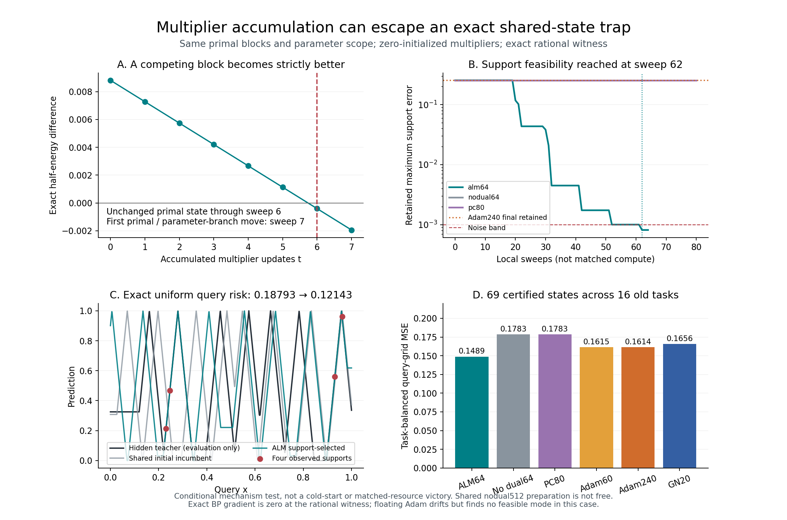

# 246｜乘子确实能打破一个精确局部停滞：数学证明与任务关联

本轮取得了一个正向机制结果：**相同参数、相同原始块、相同初始活动，只开启零初始化乘子的累积，就能离开无乘子方法的严格不动点，跨越真实参数分支，并降低未观察查询的总体风险。** 这不是“参数更多”“信用等于 BP”或只改变活动而不改变预测。

最完整的见证来自旧任务 5900007、第 8 个重启：原始状态前 6 轮严格不变，第 7 轮发生真实参数分支逃逸，第 62 轮进入支持噪声带；均匀查询风险从 0.1879342658 降至 0.1214341867，相对下降 35.38%。完整 64 轮均用有理数核验。

这回答了“乘子是否有独立动力学作用”，尚未回答“是否是费用匹配的最佳冷启动在线方法”。共同 nodual512 准备不能免费；全部强回归、浅头与官方模型对照也不能因此免除。目标继续 active。

## 1．实验怎样排除混杂

遵守执行前的 [245 协议](245_multiplier_fixed_point_escape_protocol.md)：旧 5900000—5900015 共 16 个任务、每任务前 4 个观察、零点加 seed731 的前 16 个先验点，共 272 个重启；固定 nodual512，不做阈值、种子或轮数网格。模型仍为四层标量帐篷网络，4 个共享偏置，盒约束 ±.12，观察噪声带 ε=.001。

所有方法获得相同观察和先验。候选筛选仅看支持数据、原始状态变化和层间残差，不读教师参数或查询答案。69 个精确合格状态先保存清单与哈希，再进行 ALM64、nodual64、PC80、Adam60、Adam240、GN20 的共同暖启动续接。全部方法保留共同准备过程中的支持最优历史点，没有丢弃旧解来制造优势。

局部方法使用相同 b、h，u 从零开始；BP 方法使用同一 b 和支持信息，按自己的参数目标更新。所有参数轨迹均采用同一观察约束分支 LP 验收。LP 只检验发现的分支是否含可行解，不把 LP 解偷偷塞回某个优化器。查询答案在全部续接状态与几何缓存保存之后才进入评估。

## 2．数值候选如何升级为精确证明

272 个重启中，73 个满足原协议的数值筛查：末两轮最大原始变化 ≤1e−12、最大层间残差 >1e−6、历史支持误差 >.001001。数值小变化本身不作证明。

随后按当前分支、边界和驻点方程建立有理线性系统；所有输入浮点值解释为其精确二进制有理数，边界使用原程序计算的浮点边界值。秩亏明确列出自由变量并保留对应已存值，不用伪逆冒充唯一精确解。

所有 73 个系统的秩分别为：17 维 3 个、18 维 21 个、19 维 40 个、20 维 9 个（变量总数 20）。最大重建距离 2.065e−11。恢复后检验每个活动块和共享偏置块全部分支的二次最小值、边界与近端项，同时排除不同位置的并列最小点。

结果：**69 个严格块不动点，4 个拒绝**。另一个独立检查器不用上述驻点公式，而在每段上用三个精确能量值重建二次多项式，再检查顶点与端点。它复核了全部 1,460 个块、3,772 个区间，接受/拒绝结论完全一致。4 个拒绝都是精确存在下降，不因下降量很小而放行。

证据：[所有证书](../../results/multiplier_fixed_point/exact/certificates.json)、[独立核验](../../results/multiplier_fixed_point/audit/summary.json)。

## 3．乘子为何能让原本不动的状态开始移动

设完整原始状态 z₀ 在 u=0 时对所有原始块均严格不动，残差为 r₀。对一个合法的单块竞争点 z′，使用半能量归一化：

\[
\Delta=E_0(z')-E_0(z_0),\qquad
\kappa=-r_0^\top W(r(z')-r_0).
\]

只要原始状态未变，乘子每轮累积 ηr₀，因此

\[
u_t=t\eta r_0,\qquad E_t(z')-E_t(z_0)=\Delta-t\eta\kappa.
\]

活动块 W=I；偏置块因原实现取观察均值，W=I/n。近端项使用相同 trust=.01；它在驻点的一阶导数为零，但在跨分支竞争能量中不能删掉。

若 κ>0，则超过 Δ/(ηκ) 次累积后，竞争点严格优于旧点，故原始状态不能永久停滞。69 个精确状态全部找到了这样的有理竞争见证。这个一般命题只保证原始状态离开；分支改变、可行性和查询风险须另证，下面的具体见证完成了后面三步。

## 4．一个完整的严格正向见证

### 4.1 不是 BP 数值精度导致的假停滞

任务 5900007、重启 8 的 4 个输入约为

\[
x=(.230637114,.246564048,.930997529,.960760807),
\]

观察约为

\[
v=(.212482193,.466753674,.559560755,.962697885).
\]

精确状态的 b 近似为 (−.015355749,−.022547856,.072059479,.009695156)。准确分数及所有 h 见证书文件，而不是以上舍入文本。

该点的真实前向 Jacobian 为

\[
J=\begin{pmatrix}
-16&-8&-4&2\\
-16&-8&-4&2\\
16&-8&-4&-2\\
16&-8&-4&-2
\end{pmatrix}.
\]

四个原始预测误差为 (a,−a,−b,b)，a≈.2545512144、b≈.03653766455，均在噪声带外。扣除噪声带后仍成对相反，因此 **Jᵀr=0 精确成立**。这里不是整个 Jacobian 为零，也不是每个观察没有梯度，而是共享参数上的信用相互抵消。

所有前向预激活均不在折点。独立有理检查给出了半径 δ≈1.2740848e−5 的开邻域，其中激活分支及噪声带外符号不变；对 \(\|d\|_\infty<\delta\)，

\[
\ell(b+d)-\ell(b)=\frac{1}{2n}\|Jd\|^2\ge0.
\]

所以这是冻结平方噪声带目标的一个真正光滑局部极小点（可含平坦方向），并非恰落在不可导点的人为导数约定。精确零动量 Adam、普通梯度下降及正阻尼 GN 从这里更新为零。这不排除扰动、重启、其他目标或全局搜索。

证据：[局部极小邻域与 Gram Hessian](../../results/multiplier_fixed_point/witness/stationary_basin.json)。浮点 Adam 由于舍入发生了小漂移并改变过分支，但保留的支持最优点没有改善；不能把实际浮点轨迹说成逐位不动。

### 4.2 乘子何时突破

第一个活动层、第 2 个观察的一个合法竞争点满足

\[
\Delta\approx .00881534760,\quad \kappa\approx .00307451076,
\quad \frac{\Delta}{(.5)\kappa}\approx5.73447178.
\]

累积 6 次之后，竞争能量差严格为负。完整有理递推进一步确认：前 6 轮所有原始变量保持原值，第 7 轮原始变量与真实参数前向分支同时改变，而不是只改变活动。第 62 轮的支持最大误差进入 ε=.001 噪声带，64 轮内达到约 .000815446745。

这条因果链仅改变乘子开关，没有增加参数、替换更强联合块或用 BP 信用初始化。全部 64 轮浮点与有理原始状态的最大差约 1.33e−15。

证据：[精确 64 轮汇总](../../results/multiplier_fixed_point/witness/summary.json)、[完整有理轨迹](../../results/multiplier_fixed_point/witness/trajectory.json)。

### 4.3 改善不仅在支持集

见证的选择规则只用支持：ALM 达到噪声带且真实分支改变，而五个固定预算控制都未达到噪声带。此规则只有一个案例符合，没有按查询收益挑例。

| 同状态续接 | 历史保留点支持最大误差 | 发现的可行分支数 | 精确均匀查询风险 |
|---|---:|---:|---:|
| ALM64 | .000815447 | 3 | .121434187 |
| 无乘子64 | .254551214 | 0 | .187934266 |
| PC80 | .254551214 | 0 | .187934266 |
| Adam60 | .254551214 | 0 | .187934266 |
| Adam240 | .254551214 | 0 | .187934266 |
| GN20 | .254551214 | 0 | .187934266 |

风险不是只在 257 个网格点上比较。我们将预测器和教师在 [0,1] 上精确分段，在交集区间积分平方仿射误差，得到

\[
R(f)=\int_0^1(f(x)-f_*(x))^2dx,
\qquad R_{\mathrm{old}}-R_{\mathrm{ALM}}>0.
\]

ALM 使用 55 个积分区间，风险下降 35.3848%。有理轨迹的输出按原支持规则选在第 62 步，而非按查询选择某一步。教师只在适应、筛选和保存完成后进入评估器。

证据：[精确风险积分](../../results/multiplier_fixed_point/witness/query_risk.json)。这是一项存在性、条件性的真实查询风险改善，不是对任务分布的普遍保证。

## 5．没有只报告一个漂亮案例

全部 69 个合格状态、6 种方法，共 414 次续接完整保存。它们来自 16 个旧任务，不是 69 个独立新任务。下表风险先对每个任务的合格重启求平均，再对 16 个任务等权平均；不把重启较多的任务赋予更大权重。

| 方法 | 参数分支改变 /69 | 支持误差改善 /69 | 保留点严格支持可行 /69 | 找到至少一个可行分支 /69 | 任务等权查询 MSE |
|---|---:|---:|---:|---:|---:|
| ALM64 | 64 | 53 | 3 | 30 | .148879 |
| 无乘子64 | 0 | 0 | 0 | 2 | .178346 |
| PC80 | 0 | 0 | 0 | 2 | .178346 |
| Adam60 | 39 | 59 | 0 | 12 | .161463 |
| Adam240 | 39 | 59 | 9 | 12 | .161444 |
| GN20 | 24 | 46 | 1 | 6 | .165638 |

ALM 对 Adam240 的任务平均查询误差为 12 个更好、1 个相同、3 个更差；对无乘子/PC 是 14 个更好、2 个相同；对 GN 是 13 个更好、1 个相同、2 个更差。这里保留描述性计数，不事后设显著性门槛，也不称新任务确认。

一个重要区别：Adam240 达到实际支持可行的点更多（9 对 3）；ALM 访问了更多含可行解的分支（30 对 12）。这支持下一步检验“乘子负责跳出坏分支、同等几何/读出负责利用新分支”的假设，但现在不能直接把几何容量当最终在线风险收益。

## 6．资源与工程核验

共同 nodual512 筛查及其逐位原实现重放合计 14.748 秒；有理恢复与直接比较约 1.128 秒，独立数学审计约 4.94 秒，单见证有理64轮约4.03秒。它们都是本机诊断实测，不是优化部署成本或速度上界。

16 个任务累计续接批时间：ALM .828 秒、无乘子 .822 秒、PC .338 秒、Adam60 .246 秒、Adam240 .931 秒、GN .309 秒。BP 时间含额外逐位重放，局部方法没有这次额外重放；这些数值**不可当作公平速度排名**。本轮的固定轮数用于机制诊断，不等于匹配 FLOPs 或时间。

冷启动阶段保存完整 b/h 历史的数值数组共 22,325,760 字节；这是诊断档案，不是必须持久化的在线状态。b、h、u、历史最优点、求解器工作区和后续检测开销都仍须在冷启动在线实验中计入。本轮未声称最优内存或部署峰值。

独立重放通过：336 个数组逐位相同、96 个历史保留批、533 个共享分支 LP、414 个支持结果、414 个查询结果。新暖启动实现对原冻结公式的9组前向初始化测试逐位一致。所有原始成功源保持不变，新逻辑单独成文件。

证据：[全量重放和任务等权统计](../../results/multiplier_fixed_point/analysis/summary.json)、[查询前承诺清单](../../results/multiplier_fixed_point/continuation/before_query_manifest.json)。

## 7．现在能怎样写研究动机

可以写：**共享参数的前向信用可能在错误分支中精确抵消，使参数目标出现光滑局部极小点；独立活动上的一致性残差仍非零。累积乘子保存这些未满足约束的压力，改变跨分支竞争的相对能量，从而在相同模型容量下实现真实分支逃逸。我们给出精确不动点、有限步逃逸和未见查询风险改善的完整见证。**

这里“压力”对应明确的 u_t=tηr₀ 和 Δ−tηκ，不是叙事比喻替代公式。机制贡献针对优化障碍，不是表示能力、增加标签或保证所有少样本信息可辨识。

不能写：所有闭式解或浅层网络无法处理该任务；所有 BP 都不可能逃逸；PC-ALM 已普遍优于 Adam；本例证明新的 LLM/VLM 方法有效。外接头可以直接绕过这个参数局部极小点，是否更有效必须用相同先验、观察与完整成本检验。ALM 跨非凸障碍的一般现象本身也不能未经文献定位就宣称新颖。

## 8．下一步是把机制变成冷启动收益

下一 [247 协议](247_cold_start_stagnation_switch_protocol.md)不再把有利暖启动免费交给候选，也不先筛掉容易状态：从共同先验出发，使用只依赖已观察信息的停滞触发规则切换到零初始化乘子。固定总轮数、保留全部任务与所有旧解，并与纯ALM、无乘子、PC、强Adam/GN和回归/浅头完整比较。

若冷启动开销吞没收益，应改进触发与分支利用，而不是把本轮存在性证明当作已达成任务效果。预留 5910000+、5500000+ 仍未启用；当前没有新增官方同任务 TTT 或 LLM/VLM 结果。
