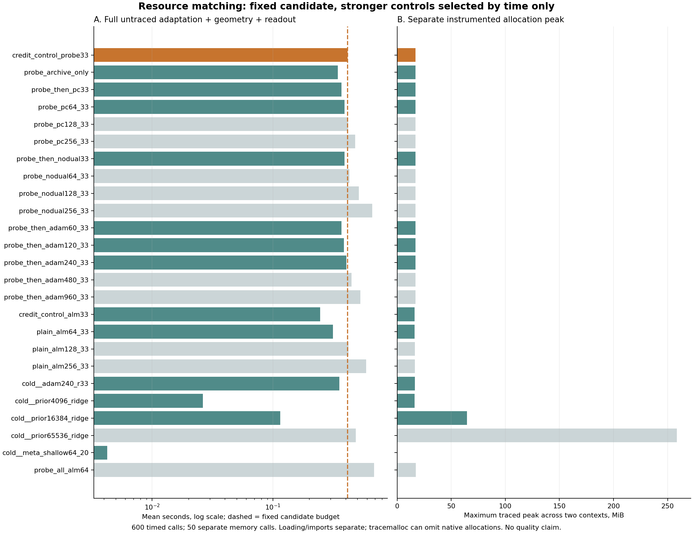
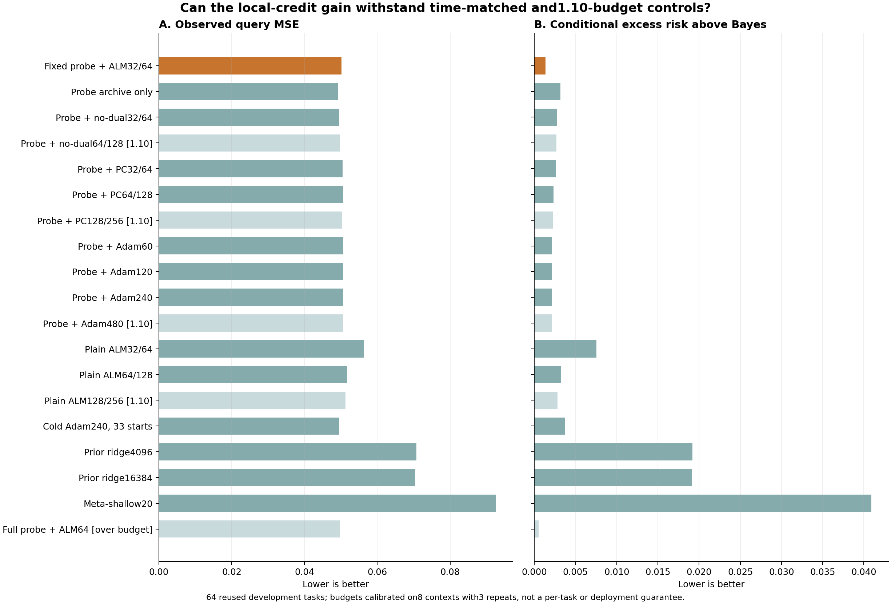

# 286｜实际费用补强之后：条件风险信号仍有竞争力，下一关必须用新任务

2026-09-23。完成[285费用协议](285_probe_credit_resource_protocol.md)和[1.10倍敏感性补充](285_probe_credit_budget_sensitivity.md)：600完整计时、50内存、512新预测、全部77法与608配对区间通过独立核验。本轮仍为旧64任务开发分析，不是确认实验。

## 1．没有用便宜控制未花完的预算制造优势

当前固定候选是全零乘子分支试探＋ALM32/64＋共同多解释读出，完整均值.414440秒。普通PC和普通ALM增加步数后再比较；同起点Adam60/120/240及冷33起点Adam全部在主预算内。对仅略超预算的PC128、无乘子64、Adam480和普通ALM128，也按事前补充单独检验，不以很窄的门槛排除强对照。

费用包括从输入重算准备、全部试探、迭代、模式归档、LP、公共数值修复、采样与257查询读出。8任务×3重复，完整表含中位/p90/最大值；加载、预热和内存仪器开销分列。主两例最大tracemalloc约16.91MiB；它可能漏掉原生内存，不是每方法独占进程峰。岭16384只需.114960秒，浅头20只需.004257秒，不能将候选的质量改善说成比这些头更快。

## 2．补强控制后的结果

| 方法 | 校准完整秒 | 预算类别 | 查询MSE | 理想条件额外风险 |
|---|---:|---|---:|---:|
| 固定试探＋ALM32/64 | .414440 | 主 | .05014009 | .00130672 |
| 初始试探存档-only | .343804 | 主 | .04919857 | .00314146 |
| 同试探＋PC64/128 | .390937 | 主 | .05053625 | .00227716 |
| 同试探＋PC128/256 | .419287 | 1.10敏感性 | .05030894 | .00218004 |
| 同试探＋无乘子64/128 | .427910 | 1.10敏感性 | .04975817 | .00266807 |
| 同试探＋Adam240 | .404739 | 主 | .05060038 | .00206516 |
| 同试探＋Adam480 | .445955 | 1.10敏感性 | .05060038 | .00206516 |
| 普通ALM64/128 | .313301 | 主 | .05176999 | .00320317 |
| 普通ALM128/256 | .421399 | 1.10敏感性 | .05127174 | .00278435 |
| 冷Adam240×33 | .354769 | 主 | .04955956 | .00365411 |
| 同先验16384特征岭 | .114960 | 主 | .07048505 | .01914461 |
| 元训练浅头20步 | .004257 | 主 | .09258508 | .04092607 |
| 更充分试探＋ALM64 | .688413 | 超预算背景 | .04974027 | .00049541 |

PC/ALM的两个轮数分别是普通起点/原点；Adam对全部33起点使用相同步数。完整[77法双网格表](../../results/probe_credit_budget/figures/all_methods.md)保留全部主、敏感性、历史和超预算结果；没有重新计时的旧方法明确标为historical_unremeasured，不把它们说成全部完成本轮资源匹配。

## 3．结论的强度

主减PC64的理想条件额外风险为−.00097044，描述性95%区间[−.00205802,−.00014909]；主减普通ALM64为−.00189644，区间[−.00318380,−.00088597]。允许更便宜控制增加迭代后，开发信号没有完全消失。

但主减PC128为−.00087331，区间[−.00198799,+.00000485]，已略跨零；主减同起点Adam240/480为−.00075843，区间[−.00189214,+.00010056]，同样跨零。所有这些优化器的实际查询差异也未获确认。不能将仅主预算下的区间判定包装成对合理资源范围内所有PC/BP的稳定优势。

同起点Adam120、240、480的最终共同读出均值完全相同，说明这里单纯加步数未继续改善这一读出；这不是所有BP都无法解决任务的证明。更多冷起点、不同优化器或更强先验仍是合法对照。

条件风险积分整个支持后验，实际查询误差只对应该上下文实际生成的教师；在64任务上不必同序。不续接控制的查询均值反而更低，必须保留。已有数据经历多轮开发，所有区间仅描述性、未多重校正，不再据此调方法。

## 4．现在为什么进入独立检验

候选的参数范围、信息、更新和读出已固定；相同试探状态后乘子机制有可隔离的开发增量；实测预算内和略放宽预算下仍有竞争力。下一步应检验它是否真的改善新任务查询，而不是继续在64任务上寻找更漂亮的曲线。

[新任务协议287](287_probe_credit_confirmation_protocol.md)保持候选和对照不改，补齐线性最小二乘/岭/RLS、核和元学习固定特征头。实际查询MSE为主，不能以新条件风险指标替换失败的主判据。查询答案只进入所有预测封存后的评价器。

旧数据的样本量规划把绝对MSE差.001视作假设性效应，不能当成已知收益。对25重比较采用保守规划阈值，最大正态近似需求9801任务；预设计算上限8192，因此在最不利旧方差和假设效应下近似功效约.699，并非保证80%。固定8192，不依据新结果追加；核心19法估计约14.86小时单线程，额外头、磁盘和审计另计。[完整规划记录](../../results/probe_credit_confirmation/planning/summary.json)。

## 5．证据范围

512新预测零数值失败；320个原Local完整批轨迹、6336条原Adam逐起点历史、1400256次BP前向求值、1291个几何、20656个精确角点和1048576个支持粒子全部核验。独立全前向最大差1.39×10⁻¹⁵。77法9856行风险、608区间、154资源分类和旧69逐项继承全部通过，展开公式最大差1.78×10⁻¹⁵。

[联合轨迹审计](../../results/probe_credit_budget/audit/summary.json)、[联合风险审计](../../results/probe_credit_budget/evaluation_audit/summary.json)、[实际资源审计](../../results/probe_credit_resources/audit/summary.json)。本研究仍是四层可控任务的数学/理论实验，没有官方TTT同任务或LLM/VLM收益，不能据本轮标记核心目标完成。
