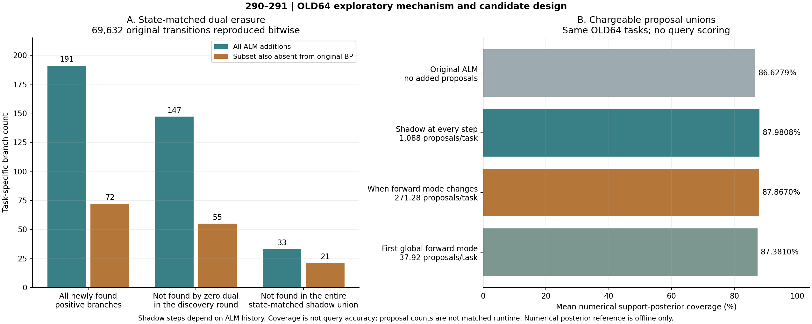

# 290—292｜从乘子的单步作用，推进到可执行的分支提议原型

2026-09-24。此页记录原 8192 补充分析复核期间新增的机制与实现工作。全部机制数字来自既有 64 个开发任务，不是新的独立查询收益。

## 1．现在更具体的研究点

在同一参数 b、同一活动 h、同一观察上下文下，历史乘子 u 改变局部条件能量，因此能改变下一步到达的支持可行分支。这比“开放更多参数”更明确：参数范围没有扩大，输入信息没有增加，干预对象只是信用状态。

对一个活动块，`E_u(z)=E_0(z)+2uᵀr(z)+‖u‖²`。若 `z_u,z_0` 分别是两种条件能量的最小值，则

\[
0\le E_0(z_u)-E_0(z_0)\le -2u^\top(r(z_u)-r(z_0)).
\]

因此乘子可能使一个零乘子能量较高的分支成为被选分支。精确有理算术验证了 256 个标量例、1280 项能量恒等式；其中 131 例出现严格分支变化。这个公式不是查询泛化定理，也不要求实际起点的 BP 梯度为零。

## 2．不是只比较两条已不同的轨迹

逐一取原 ALM 的真实保存状态，分别保留 u 和清零 u 做同一步。每一次都重置到该真实状态，影子不会接管下一步。全 64 任务、69,632 条转移的原 b/h/u 重演逐位通过；初始零乘子的 2,112 条转移两种原变量结果完全一致。清零影子也与同状态原 nodual 的一步 b/h 一致。

|集合|全部原 ALM 新增分支|其中原 BP 未发现的子集|
|---|---:|---:|
|相对共同试探池新增|191|72|
|发现当轮的所有清零影子均未发现|147|55|
|所有保存状态的清零影子并集仍未发现|33|21|

147 个当轮缺失分支覆盖 39 个任务，平均参考后验质量为 .08686624；不是“所有分支都必须依赖乘子”。影子并集依赖整条 ALM 历史，不是一个可免费部署的无乘子控制。更不能由此断言任意 BP 或回归方法都做不到。

## 3．将诊断变成一个可实现的提议规则

一个有用的新观察是：某些真实 ALM 状态的零乘子一步，又会进入主 ALM 轨迹没有覆盖的分支。保留主轨迹，将这些一步输出仅作为额外分支提议，能形成明确的候选算法，而非只继续解释旧结果。

全部三条事先列明的支持可观测规则均保留：

|提议规则|平均新增起点-步/任务|新增正体积分支|出现新增的任务数|平均后验覆盖|
|---|---:|---:|---:|---:|
|原 ALM，无新提议|0|0|0|86.627919%|
|每一步都提议|1088|22|15|87.980783%|
|前向模式变化时提议|271.28125|18|12|87.866962%|
|首次全局模式时提议|37.921875|5|5|87.380950%|

覆盖增加使理想截断后验与完整后验的 TV 距离 `1−c` 不增；严格新增质量时严格缩小。这给出最坏均值误差界的改善，但实际单个查询误差不必单调改善，有限粒子和数值几何也另有误差。不能把上表的覆盖百分点写成准确率提升。

## 4．已经实现，不只是计划

选择“前向模式变化时提议”作为首个原型，这一选择依据旧开发数据，后续必须用新数据确认。它从支持输入重算准备、共同试探、ALM 主步、额外影子、去重、可行性与几何、采样和读出；不使用 BP、不用 BP 信用初始化、也不免费重用保存轨迹。

旧两任务 5910000/5910063 的功能门禁已完成：

- `none` 包装对照与原方法的 54 个输出数组逐位相同。
- 原型的 24 个主轨迹数组逐位不变，支持最优点不变。
- 所有 415 个实际影子提议与已保存反事实逐位相同，触发位置完整匹配。
- 新模式池等于规定并集，没有读取或评分查询答案。

随后全 64 任务功能门禁也已完成：17,362 个额外提议逐位一致、768 个原主轨迹数组不变、1,728 个包装基准数组完全一致；全部预定分支并集核对通过。摘要 SHA256 为 `4d183a0c2dcb7c9ce373cfa0bb805f8dccd1e5f1e4b1d855126715f7f950e3ba`。运行时有 288 审计并发，所有时间只作功能记录，不作公平资源比较。[全 64 功能门禁](../../results/counterfactual_credit_branching/full_support_v2/summary.json)。

## 5．下一关与当前边界

下一步需要完整冷调用计时和状态统计，给强 BP/PC/无乘子及更长 ALM 合理匹配预算，再冻结新任务与查询评价。原 287 对强同起点 Adam 尚未证实优势的结论不变；新提议要靠新结果证明增量，不能借旧开发覆盖率替代。

290 首个实现曾因漏恢复 `.12` 参数盒而使用默认 `.15`，首步检查失败；源和失败记录保留。v2 仅恢复原配置后全部逐位通过，未放宽容差。[修正说明](290_bound_scope_correction.md)。

证据：[单步干预结果](../../results/state_matched_dual_intervention/development_v2/summary.json)、[提议集合结果](../../results/counterfactual_branch_proposals/development_v1/summary.json)、[在线原型旧两任务门禁](../../results/counterfactual_credit_branching/preflight_v1/summary.json)、[功能协议](292_counterfactual_credit_functional_protocol.md)。

当前成果是一个有局部因果证据、已通过小规模功能测试的新候选；不是完整论文结果，也不是一般网络或 LLM/VLM 收益。
