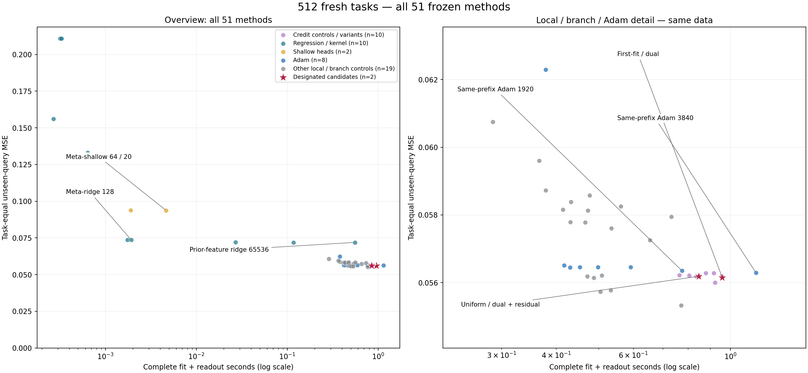
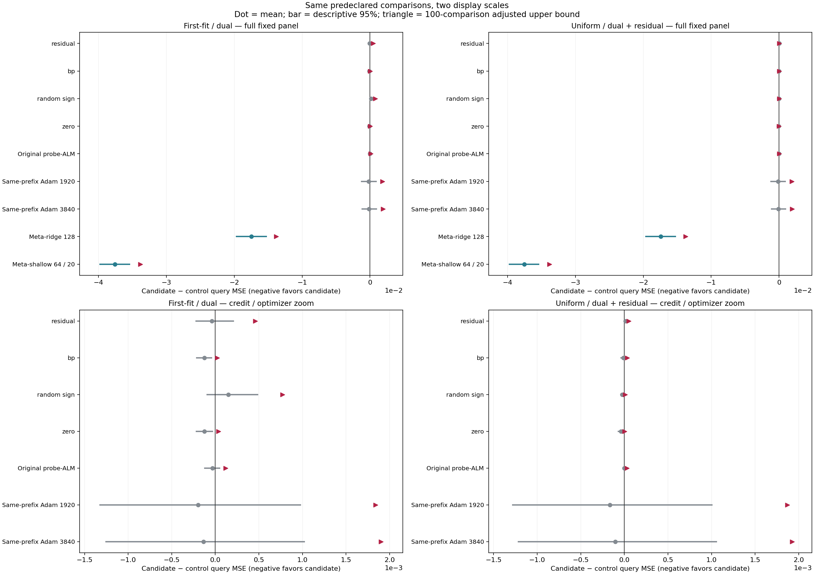

# 512新任务阶段结果：局部乘子保留了瞬时梯度消失后的探索信息

2026-09-25美国东部时间上午。新实验、独立主审计、补充机制核验、报告数值审计及实际图像验收均已完成。原预测进程正常结束，没有被重启或中途调参。研究总目标仍未标记完成。

## 已经得到的结果

本轮有512个全新任务、51个冻结方法、26112份预测，执行失败回退0次。每个方法观察相同的4个支持点、相同先验和查询坐标；查询答案只用于预测全部封存之后的评估。主指标为257个独立查询坐标上的任务等权MSE。

| 方法 | 查询MSE | 完整平均秒/任务 | 解释 |
| --- | --- | --- | --- |
| 主候选：first-fit / dual | 0.0561558958 | 0.957854893 | 预先指定主候选 |
| 次候选：uniform / dual + residual | 0.0561876578 | 0.846204484 | 预先指定次候选 |
| 先验特征岭回归16384 | 0.0719445434 | 0.116996389 | 本轮10个回归类对照中最低均值 |
| 元训练岭回归128 | 0.0736318504 | 0.00192663477 | 更便宜的强固定特征对照 |
| 元训练浅层头64/20 | 0.0937241409 | 0.00466455234 | 更便宜的浅层适应对照 |
| 同前缀Adam1920 | 0.0563525438 | 0.775123798 | 均值差小，未建立校正优势 |
| 同前缀Adam3840 | 0.0562915446 | 1.14413199 | 保留超预算对照，不靠剔除它宣称胜利 |
| 同触发随机符号信用 | 0.0560046570 | 0.921782292 | 样本均值优于主候选 |
| 延长ALM：probe_all_alm64 | 0.0553242436 | 0.771866558 | 样本均值和时间均优于主候选 |

两候选相对全部10个回归/核/固定特征回归、2个浅层头的预定近似配对bootstrap校正上界均小于0。但它们相对同触发4种非乘子信用，以及同前缀7种Adam步数，校正通过数均为0。主候选对BP信用均差为−0.0001248830，校正单侧上界为+0.0000222913；不能把负均差写成已经证实的独立优势。更低误差不等于更省资源，回归和浅层头的时间优势全部披露。

[全部51方法、四指标及时间尾部](../../results/online_credit_fresh_pilot/pilot_report_v2/all_methods.md)；[全部100主比较](../../results/online_credit_fresh_pilot/pilot_report_v2/all_primary_comparisons.md)；[全部校准与实际资源分类](../../results/online_credit_fresh_pilot/pilot_report_v2/all_budgets.md)。上表不是重新定义主比较集。

## 此轮真正抓住的机制点

在支持误差已经进入噪声带时，瞬时BP信用可能归零，而乘子仍保存约束优化历史。它可以改变同一有限候选预算内的分支顺序，找到非乘子信用遗漏的支持一致区域。这里增加的是探索信息的利用方式，不是额外标签、参数量或“没调用backward”的表述。

新任务中有191个first-fit支持拟合状态，其乘子全部非零；对应BP信用在浮点实现中全部严格为0。主候选在13/512任务发现了全部八个预设非乘子探索对照均未发现的正体积区域，共15个任务—区域对。次候选的相应独有发现为0。

对这13个任务作审计记录的描述性交叉核对：其中9个任务同时满足支持拟合、BP信用为0及乘子非零，共11个独有区域；其余4个任务来自未拟合回退状态。此交叉表不新增显著性检验，不替换全512任务结果，也不声称所有13个发现都来自零梯度状态。支持拟合的9个种子为328000000、328000023、328000211、328000236、328000273、328000305、328000357、328000384、328000394。

这些发现已不只是旧64任务中的单个开发实例。其精确几何证书和支持约束经过独立核验。但“这八个固定控制没找到”不等于“任何BP、任何回归或任何神经网络都不可能找到”。完整后验、查询答案和离线对照并集都没有输入在线候选。

[独立机制审计摘要](../../results/online_credit_fresh_pilot/pilot_pool_audit_v1/summary.json)与[方法机制计数](../../results/online_credit_fresh_pilot/pilot_pool_audit_v1/methods.json)。粒子约束核验覆盖12560384个粒子；319396份唯一精确证书通过。数值粒子可行性不证明体积权重精确或采样iid。

## 从发现能力到任务收益的数学连接

在精确截断后验、M个独立读出粒子等已声明假设下，固定支持S和发现区域池T，有

\[
R_M(T\mid S)=R_{\mathrm{Bayes}}(S)+\|\mu_T-\mu_S\|_Q^2+V_T/M.
\]

令新增区域与原池不交，权重为a，d=μ_R−μ_T，e=μ_T−μ_S，则加入区域后的风险差为

\[
\Delta R_M=2a\langle e,d\rangle_Q+a^2\|d\|_Q^2+
\frac{a(V_R-V_T)+a(1-a)\|d\|_Q^2}{M}.
\]

因此，独有区域必须使截断均值偏差的下降超过可能增加的有限粒子方差，才能保证条件期望预测收益。乘子发现并不自动保证这个不等式；也不降低相同观察信息下的Bayes风险。这个理论条件在新实验前已写明并做精确有理数测试，而不是看见本轮曲线后补写。

[完整推导、假设和充分条件](328_finite_readout_risk_addendum_v1.md)。此处是理想模型恒等式，不把有容限的数值LP/体积/采样直接称作逐任务精确后验保证。

## 接下来的明确研究靶点

保留已经验证的“瞬时BP信用消失后仍能独立发现区域”这一点，继续研究怎样让这些发现产生稳定查询收益，并降低相对延长局部ALM求解的总成本。下一轮要区分区域选择、区域覆盖和有限读出误差，而不是仅扩大参数或重新描述更新。任何基于本轮结果的新候选都需要新的冻结任务确认；本轮512任务不能再次当作未见确认集。

目前可以写成“有独立发现机制与回归基线收益的受控阶段结果”，还不能写成“PC-ALM已不可替代地胜过强优化器”。完整官方TTT/GELU-MLP、下游任务、LLM/VLM和论文级确认均未完成。

## 可交付材料和验收

- [完整图文报告v2](../../results/online_credit_fresh_pilot/pilot_report_v2/report.md)
- [主科学审计](../../results/online_credit_fresh_pilot/pilot_audit_v2/summary.json)：104448个标量风险、26112份预测、5120次非BP检查、8000000个bootstrap均值。
- [图文数值验收](../../results/online_credit_fresh_pilot/pilot_report_v2/numeric_qa.json)与[实际图像验收](../../results/online_credit_fresh_pilot/pilot_report_v2/visual_qa.json)。
- [展示修订记录](329_visual_revision_v2.md)：v1保留，v2只改布局，完整表格及原始图数值不变。

该结果页对应真实完成的数据；不是完整论文已经完成，也不自动完成持续研究目标。原始逐调用数据和失败记录在本地保留，GitHub阶段包另明确其紧凑发布范围。
