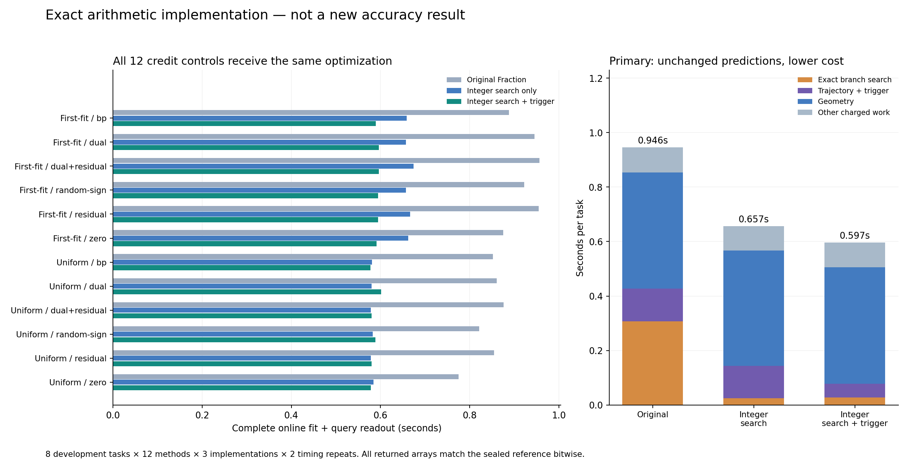

# 336｜保留原预测的精确算术提速：完整在线路径验证

2026-09-25，美国东部时间上午。此轮是已发布512任务之后的计算实现改进，不是第二次独立准确率确认，研究总目标仍进行中。

## 结果

主方法在8个预先固定开发任务上的完整均时由 **0.945662秒**降至 **0.596530秒**，减少 **36.92%**。全部576次真实在线调用的11520个返回数组与原封存结果逐位一致；不是拿缓存预测代替计算。

次候选由0.875952秒降至0.580087秒。全部12种信用控制都获得同一整数实现，不能将通用算术提速归成PC独有准确率收益。

## 为什么选择这项改动

先检查完整512任务、16方法、8192个保存预测器。主方法原均时0.957854893秒，其中精确分支搜索0.305662857秒；支持触发器单独计时0.110015930秒，已经包含在轨迹收集/搜索中，不能再次累加。

有限读出方差的估计约为2.6×10⁻⁵；扣除这一项后，主方法相对强ALM、随机信用和Adam的主要数值差距基本保留。这个估计不是某次固定粒子种子的误差界，也不能证明采样噪声完全没有作用。当前证据支持先降低搜索开销，而不是把差距归咎于粒子数。

| 方法 | 原封存MSE | 估计读出方差项 | 扣除后的开发估计 |
| --- | ---: | ---: | ---: |
| online_first_fit_dual | 0.0561558958 | 0.0000255333 | 0.0561303625 |
| online_first_fit_random_sign | 0.0560046570 | 0.0000255747 | 0.0559790823 |
| probe_all_alm64 | 0.0553242436 | 0.0000261243 | 0.0552981193 |
| probe_then_adam1920_33 | 0.0563525438 | 0.0000255287 | 0.0563270150 |

扣除列仅为理想独立粒子模型下固定teacher风险的无偏估计形式，未执行任何新预测器，不是完整后验偏差或新显著性检验。

## 数学上为什么不会改变答案

binary64输入都是分母为2的幂的有理数。把全部坐标乘共同尺度X、全部信用乘共同尺度A，321中的局部目标就恰好变成原目标的AX倍。盒交、分支断点和min/max全用任意精度整数计算，目标次序、符号、并列破同分及空盒判定均保持。最后只在接口把整数/AX约分回原Fraction字符串。

支持损失同理：整数tent递推为H←max(0,X−|2(H+B)−X|)，Rᵢ=max(0,|Hᵢ−Vᵢ|−E)，原损失恰好等于ΣRᵢ²/(2nX²)。这既不近似梯度，也不改变最早零损失状态的选择。

实现验收包含48个小问题的3504模式穷举、144次精确K-best对照、非正规数及1032个触发状态测试。全部512×12=6144个原搜索状态的有序提议、证书和壳最小值逐项相同。另在4任务48状态作192次随机交错内核计时，搜索内核提速区间为8.86–11.92倍；这不是完整在线提速倍数。

## 全部完整在线计时

| 方法 | 原Fraction / s | 仅整数搜索 / s | 整数搜索＋触发 / s | 总时间减少 | 更快任务 |
| --- | ---: | ---: | ---: | ---: | ---: |
| online_first_fit_bp | 0.887957 | 0.658483 | 0.589527 | 33.61% | 8/8 |
| online_first_fit_dual | 0.945662 | 0.657006 | 0.596530 | 36.92% | 8/8 |
| online_first_fit_dual_plus_residual | 0.956564 | 0.674148 | 0.596677 | 37.62% | 8/8 |
| online_first_fit_random_sign | 0.922045 | 0.657173 | 0.594675 | 35.50% | 8/8 |
| online_first_fit_residual | 0.954282 | 0.666420 | 0.594268 | 37.73% | 8/8 |
| online_first_fit_zero | 0.875551 | 0.662146 | 0.591247 | 32.47% | 8/8 |
| online_uniform_state_bp | 0.852031 | 0.580940 | 0.577378 | 32.24% | 8/8 |
| online_uniform_state_dual | 0.860341 | 0.579908 | 0.601056 | 30.14% | 8/8 |
| online_uniform_state_dual_plus_residual | 0.875952 | 0.577972 | 0.580087 | 33.78% | 8/8 |
| online_uniform_state_random_sign | 0.821455 | 0.582540 | 0.588864 | 28.31% | 8/8 |
| online_uniform_state_residual | 0.854526 | 0.577949 | 0.580179 | 32.11% | 8/8 |
| online_uniform_state_zero | 0.774932 | 0.583876 | 0.578515 | 25.35% | 8/8 |

每任务先平均两次重复，再对8任务等权平均。576次调用不是576个独立任务；没有新增显著性检验，没有把8任务的时间当作512任务完整计时。持久粒子和模型状态未变，但尚未测量新实现的进程峰值内存。

## 对核心研究问题的推进

这项结果把一个可去除的计算瓶颈落到了真实在线路径。它保留了之前的独有区域和预测能力，并为同一总预算下更充分的分支探索提供了可检验的空间。下一步必须另行冻结预算和全部强控制，检验节省的计算是否能换来独立查询收益；不能仅凭内核更快就宣称已经超过强Adam或证明PC不可替代。

原512任务的准确率和机制结论仍以[332报告](332_fresh_pilot_results_v1.md)为准；没有官方TTT、LLM/VLM或完整论文新增验证。

证据：[333诊断协议](333_fresh_cost_readout_diagnostic_v1.md)、[334整数证明与内核协议](334_dyadic_branch_search_protocol_v1.md)、[335完整在线协议](335_dyadic_online_equivalence_protocol_v1.md)、[独立汇总审计](../../results/online_credit_fresh_pilot/dyadic_diagnostics_audit_v1/summary.json)。
