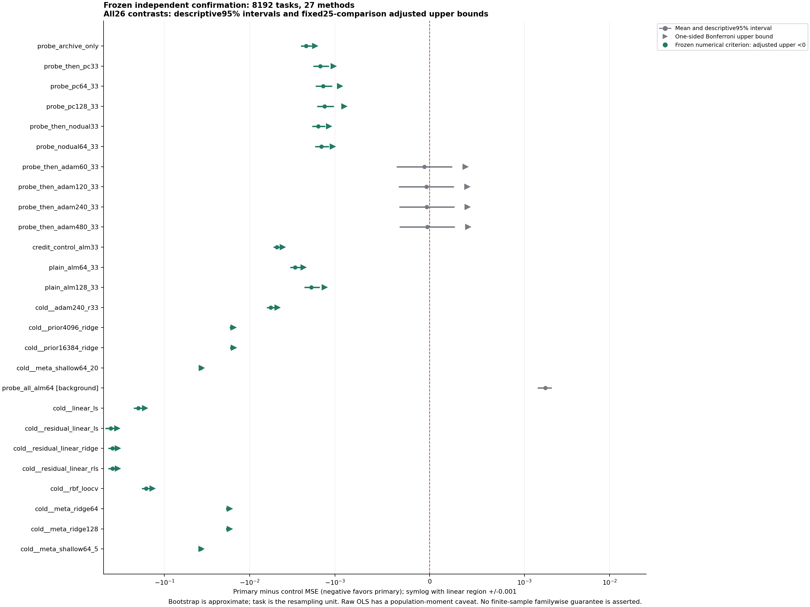
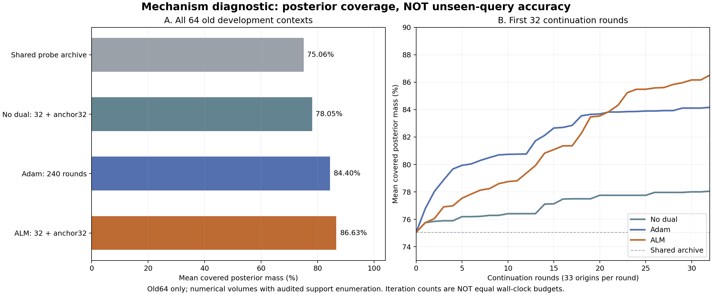

# 2026-09-24：正式确认结果及旧数据机制诊断

本增量保存已完成的287正式评分、独立统计复算、真实图文检查和最终来源封存，以及289支持侧机制诊断、288旧数据前检。不是论文目标完成声明。

## 已完成的正式结果

8192任务、27方法、221184预测、104比较，原25项主比较中21项通过固定数值阈值。四个未通过项均为相同试探起点的Adam60/120/240/480。候选主MSE为0.05612379；同试探Adam240为0.05615374，其配对区间跨零。全部方法、原始调用成本和证据限制见[完整报告](../results/probe_credit_confirmation/figures_v7/report.md)。

最终来源封存于2026-09-24美东14:24:50结束，471源码、681365清单项核对通过。其SHA为`4a0d5757631f62cf812de36681d573aadd4cf23d00ed8f09762a4234085c7af3`。它保存的是证据完整性判断，不会把未成立的强BP优势改成成立。

## 新的旧数据诊断

289检查64旧任务、2112共同起点：没有零梯度起点，因此不以起点BP停滞解释本批。ALM、BP的平均数值后验覆盖分别86.63%、84.40%；ALM独有而BP未找到的分支平均占后验质量5.18%。全部集合、轨迹来源和数学边界保留。这些是旧开发数据和离线完整后验参照，不是新任务查询增益或免费在线信息。

## 288范围投影的状态

完整的旧两任务预测→评分→独立审计前检已经通过，包含54读出、108数组、104比较及全部100000次重抽。原始解析前检的55有理不等式例也保留。

**全8192任务的追加投影流水线仍在执行，未包含其运行中输出。** 投影给所有方法相同已知[0,1]范围，可能加强原未投影的回归对照；不能把原结果当成已覆盖这些更强版本。这是同一固定数据的追加审查，不是新的独立确认。

此次备份与追加投影的离线运行并发。新投影记录的微调用耗时不是独占主机的干净端到端基准。原287完整调用已经结束，原换页和发布干扰记录保持不变。

## 保存与排除

保存原287任务级风险矩阵、全100000次重抽均值、全部比较/方法表、两张正式图、完整报告及实际QA；保存最终封存和已完成原流水线记录。补充原全预测审计的摘要/协议/索引，但不复制其全部任务数据。

289保存诊断结果、协议、图及源码；288保存完成的旧前检和固定全量流水线源码。所有文件由第六份不可变清单显式列出，五份父清单不变。

**不包含完整8192原始输入/预测、查询真值、289全部旧轨迹及完整后验几何依赖，也不包含任何运行中的288全量阶段。** 源哈希/依赖索引不代表对应原数据已经上传，因此不声称从干净克隆可以重跑全部实验。可从已发布风险矩阵复查统计表，但投影/模型路径重演仍需未发布的原始证据。

校验命令：`python scripts/confirmation_results_snapshot_20260924.py verify`。它检查六份发布清单、固定范围的哈希及完成标记，不重新运行模型；凭据模式扫描只是启发式检查。
