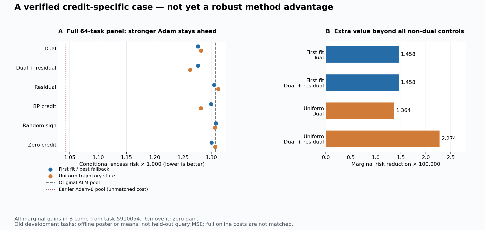

# 支持一致触发与在线信用搜索：324–330阶段快照

这是源码、完整比较表、数学说明与核验记录的紧凑发布入口。构建脚本仅在新512任务的预测、评分、独立审计、补充机制检查及图文数值/视觉QA全部完成后放行；工作区中存在此说明本身不代表已构建或已推送。

## 研究问题与已知机制

研究目标是在相同支持信息、先验与合理完整预算下，判断持久局部乘子是否提供普通回归、浅层头或同参数强优化器不能解释的独立查询收益。贡献不能归结为“不调用backward”或增加参数。

324–325在旧开发任务中找到了可复核实例：支持误差带损失为零时，BP信用为零而历史乘子非零；相同K=8选择器中，乘子将一个占完整支持后验约4.5925%的有效区域排到第3位，四种非乘子对照未进入预算。对强离线控制并集的独有条件风险增益全部来自旧64任务中的一个，不能据此声称新任务稳定优越。原完整候选池当时也没有超过强Adam。



[原始图文与完整边界](../results/support_consistency_trigger/report_v1/report.md)。该旧文保留本地绝对路径，不是所有文内链接都可在GitHub直接访问；上图与本页的新任务入口使用仓库相对路径。

## 实际在线实现、新任务与完整对照

326将归档诊断实现为真实支持输入驱动的在线调用，不向候选提供BP状态、完整后验或查询答案。327测量完整准备、局部更新、搜索、全局LP、粒子采样及读出费用，同前缀Adam1920在两候选预算内，Adam3840仍完整保留。内存同时披露受跟踪分配峰值和包含导入/加载/框架的进程生命周期峰值，不把小缓存当作总成本。

328固定512个新任务、51方法、26112份预测。全部预测封存后才评分：任务等权查询MSE、100个主比较、完整配对bootstrap、单任务贡献与剔除敏感性；所有强回归、核、浅层头、普通PC、无乘子和长步Adam对照保留。330另核验真实粒子支持约束、精确分支证书、相同池读出，以及乘子对固定非乘子控制的独有发现。

本轮已完成的主要结果：主候选查询MSE为0.0561558958；相对固定的全部10个回归/核/特征回归与2个浅层头，预定校正上界均小于0。主候选在13/512任务发现了全部八个非乘子探索对照均未找到的15个任务—正体积区域对。但是，同触发四种非乘子信用、同前缀七种Adam步数均未建立校正后的独立优势；延长ALM基线还有更低的平均误差和时间。因此这是有明确机制进展的阶段结果，不是已经完成的竞争性方法结论。

v1数值核验通过但图中候选被遮挡、小差异难读，已保留为展示修订记录；v2只改布局和放大视图，全部表格及图的原始数值一致，已完成实际看图验收。

- [本轮结论、数学含义和下一研究靶点](../outputs/ttt-pc-alm-research/332_fresh_pilot_results_v1.md)

- [512新任务完整图文](../results/online_credit_fresh_pilot/pilot_report_v2/report.md)
- [全部51方法与四种指标](../results/online_credit_fresh_pilot/pilot_report_v2/all_methods.md)
- [全部100主比较及贡献集中度](../results/online_credit_fresh_pilot/pilot_report_v2/all_primary_comparisons.md)
- [校准与实际完整预算](../results/online_credit_fresh_pilot/pilot_report_v2/all_budgets.md)
- [数值核验](../results/online_credit_fresh_pilot/pilot_report_v2/numeric_qa.json)与[实际图像验收](../results/online_credit_fresh_pilot/pilot_report_v2/visual_qa.json)
- [独立机制检查摘要](../results/online_credit_fresh_pilot/pilot_pool_audit_v1/summary.json)
- [有限粒子读出的数学风险分解及改善条件](../outputs/ttt-pc-alm-research/328_finite_readout_risk_addendum_v1.md)

这是受控四层tent模型的新开发实验，不是官方TTT/GELU-MLP、LLM或VLM验证，也不是已完成的论文确认。研究目标不会因阶段快照发布而自动完成。

## 打包和复现范围

保留冻结算法/审计源码及本地平面模块依赖闭包、协议、旧IO失败记录、新任务小型指标矩阵、全部方法统计和图像。各文件的SHA256记录在不可变清单中，旧发布清单不覆盖。

排除庞大的逐调用原始预测/元数据、完整后验参考、查询真值、大型bootstrap数组及多数中间几何档案；本地原始档案不删除。这不是完整原始数据异地备份，不保证干净克隆可端到端重跑全部历史研究。发布验证仅核对文件、语法、哈希与启发式凭据扫描，不重新运行算法。

父快照刻意封存的历史失败分析器analyze_dual_jump_query.py继续原样保留，不当作可执行依赖；仅接受父清单已声明的文件名、第17行语法错误和完全相同SHA256，其他语法错误仍拒绝。其成功v2及原因见既有[复核说明](REPRODUCIBILITY.md)。

```bash
python scripts/online_credit_snapshot_20260925.py verify
```

发布前还须精确暂存清单并执行`verify-index`，然后按既有授权非强制推送；构建脚本本身不执行Git写入。
