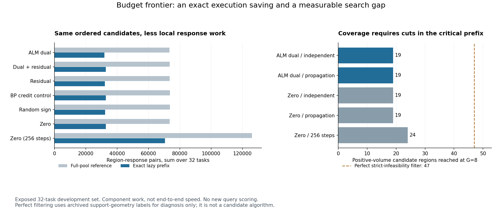

# 361｜把计算用在能改变预算覆盖的位置

2026-09-25，美国东部时间中午截稿前的阶段性补充。基于 357–359 已封存的 32 个开发任务；本轮不读取查询答案，不产生新查询 MSE，也不是新的盲确认。

## 结果先说

已经证明并实现：**对区域间独立的局部信用求解，只处理几何预算所需的连续前缀，就能得到与全池求解完全相同的有序候选。** ALM-dual 128 步的响应工作量从 73,460 降到 31,939（减少 56.52%）；相同增强也使零信用的工作量减少 55.53%。224 次组件调用、896 个前缀数组逐字节一致，独立核验全部通过。

这不是 PC-ALM 专属贡献，更不是已证明的净速度提升。当前小批次实现存在额外循环成本。本轮惰性 dual 总计 1.497207 秒，旧全池组件的历史测量为 1.101280 秒；后者不是本轮交错重测，因此只说明当前数据不能支持墙钟加速，不能当严格计时比较。

另一个明确结果是：**关键在证书出现的位置，不在全池证书总数。** dual 传播版虽然有 133 个严格证书，仍只让 47 个新正体积区域中的 19 个进入 G=8 预算，与零信用 128 步相同。理想的严格不可行过滤在这些任务的同一有序池上可以覆盖全部 47 个；因此有一个可定位的 28 区域搜索缺口，但它还不是查询风险改善保证。

## 1. 从观察信息到有限预算：应当证明什么

固定由支持输入/输出决定的有序区域 R₁,…,R_M。令 C 为已严格证明不可行的区域集合，G 为允许进入后续几何求解的候选数量。一个未被排除的区域 R_j 被选中，当且仅当

    j − |C ∩ {1,…,j}| ≤ G。

证明只需计数：左边恰好是 R_j 在未排除序列中的排名。对可行区域，严格证书不能排除它，故条件等价于前缀内至少获得 j−G 个证书。无论尾部新增多少证书，如果这个不等式仍不满足，目标区域仍不会进入本次几何预算。

这给出一个可检验的机制目标：**在观察信息相同、总响应预算相同时，某种信用是否更早排除了挡在可用区域前面的不可行区域？** 只有接着改变了后验近似/预测且强控制解释不了，才构成任务收益。可用区域更多并不保证有限样本实际 MSE 单调下降。

## 2. 等价惰性执行的保证

先执行前 G 个区域；若仅有 k<G 个未被排除，就继续处理紧邻的 G−k 个。每个区域仍完整执行同样 T 步，直到收集 G 个未排除区域或候选耗尽。因为不传播版各区域轨迹独立，这只是延迟启动部分相同计算，没有改变任何单区域初始化或更新。

设 J 为最终第 G 个未排除区域的位置；不足 G 个时取 M。首个证书出现步数为 τ_i，未出现记作∞。无提前禁用时：

    W_full = Σ_{i=1}^M min(T,τ_i)
    W_lazy = Σ_{i=1}^J min(T,τ_i) ≤ W_full。

每批只启动尚缺的候选数，故不会越过 J；这同时证明选择等价和上述响应计数。当前所有源配置均核验没有禁用状态。若区域间存在传播、共享参数更新或跨区域归一化，该独立性证明不成立，不能直接套用。

| 信用 / 步数 | 全池响应对 | 惰性响应对 | 减少比例 | 处理区域 / 601 | 批次 | 惰性组件总秒 |
| --- | ---: | ---: | ---: | ---: | ---: | ---: |
| dual_independent | 73460 | 31939 | 56.52% | 262 | 50 | 1.497207 |
| dual_plus_residual_independent | 73559 | 32836 | 55.36% | 269 | 55 | 1.630948 |
| residual_independent | 73623 | 32173 | 56.30% | 263 | 48 | 1.443028 |
| bp_independent | 73723 | 32852 | 55.44% | 269 | 53 | 1.565964 |
| random_sign_independent | 73683 | 32379 | 56.06% | 264 | 48 | 1.445300 |
| zero_independent | 73578 | 32723 | 55.53% | 268 | 53 | 1.591192 |
| zero_independent256 | 125984 | 70505 | 44.04% | 358 | 83 | 4.296151 |

所有响应数、区域数、批次和秒数均为 32 任务总计；最大批次为 8。支持数据、候选池和信用取自已封存组件输入，生成这些输入的成本不包含在组件秒数中。最大批次数组和输出字节分别记录在各次 JSON；未测量 Python 对象/分配器峰值或端到端峰值。BP 信用只是显式控制，不能归入无 BP 候选。

## 3. 哪些证书还没有推动预算边界

| 固定 G=8 方法 | 全池证书 | 各自终止前缀内 | 前缀外 | 到达的正体积区域 / 47 |
| --- | ---: | ---: | ---: | ---: |
| dual_independent | 114 | 57 | 57 | 19 |
| dual_reuse | 133 | 68 | 65 | 19 |
| dual_plus_residual_independent | 118 | 61 | 57 | 19 |
| dual_plus_residual_reuse | 135 | 71 | 64 | 19 |
| residual_independent | 116 | 58 | 58 | 19 |
| residual_reuse | 131 | 73 | 58 | 19 |
| bp_independent | 128 | 67 | 61 | 19 |
| bp_reuse | 138 | 72 | 66 | 19 |
| random_sign_independent | 117 | 59 | 58 | 19 |
| random_sign_reuse | 127 | 71 | 56 | 19 |
| zero_independent | 127 | 65 | 62 | 19 |
| zero_reuse | 135 | 69 | 66 | 19 |
| zero_independent256 | 231 | 180 | 51 | 24 |

“各自终止前缀内”按每个方法自己的截止位置计算；不同截止位置下的数量差不能直接解释为新增关键证书数。尾部区域虽不直接进入检查，传播版仍可能从它们得到帮助前缀的方向，因此本轮没有删除传播版尾部计算。

六种 128 步信用及其传播/不传播组合都只到达 19 个正体积区域；zero256 到达 24 个。这与已封存在线结果一致，但不能把 zero256 的额外步骤当作 PC 信用收益。

下面列出 dual 传播版缺口最小的六个区域，按“还缺的证书数、seed、排名”确定排序，不依据查询误差挑例。它们只是支持几何上的定位信息，不可把封存几何标签喂给候选算法。

| 开发任务 seed | 有效区域排名 j | 所需前缀证书 j−8 | 现有前缀证书 | 还缺 |
| --- | ---: | ---: | ---: | ---: |
| 328000024 | 9 | 1 | 0 | 1 |
| 328000007 | 10 | 2 | 0 | 2 |
| 328000024 | 10 | 2 | 0 | 2 |
| 328000024 | 11 | 3 | 0 | 3 |
| 328000009 | 17 | 9 | 4 | 5 |
| 328000009 | 18 | 10 | 4 | 6 |

## 4. 可执行的下一项研究判断

现在有一个具体切入点：用已证明无关的尾部工作预算，增加关键前缀的局部迭代或信用探索，并保留最差情况下原来能达到的候选。下一机制必须预先固定总响应预算、启动/继续规则和停止条件，并让 zero、普通 PC/BP 信用获得相同增强。它必须同时与直接增加几何预算 G=16/全池比较；在当前四偏置问题上，不能把便宜的全局几何费用忽略掉。

**此处只给出数学目标，尚未实现这种再分配方法。** 本轮已经实现的是精确等价惰性执行。它提供了可量化的可转移工作量，而没有建立 ALM 独占性；未来只有新的在线、资源匹配结果才允许提升结论。

## 5. 与中午交付的关系

359 中 448 次真实在线 fit 和全部强基线比较仍是最新查询证据；本轮没有重写其结论。最新主方法 MSE 下降由无信用候选流程完全复现，仍未证明 PC-ALM 独立优于强优化器、闭式/固定特征回归。完整 LLM/VLM、官方 TTT-MLP 下游验证也未完成。

本次交付增加了一个清晰的充要条件、一项可复核的计算量保证、224 次实现验证以及下一步的明确瓶颈位置。核心研究目标保持 ACTIVE，不用“执行结束”替代“独立优势已成立”。

## 6. 核验证据

预检：32,776 个标量排序恒等式、18 个包括空池/不足预算的小型例子、72 个数组一致性比较。正式独立审计：38,961 个标量排名判据、2,041 条预算前沿记录、611 条正体积区域条件、224 个完整选择、896 个前缀数组、390 个批次和 547 个 Fraction 信用证明。

- 冻结协议：[360](../../../outputs/ttt-pc-alm-research/360_budget_frontier_protocol_v1.md)
- 组件结果：[summary](../development_v1/summary.json)、[完整前沿](../development_v1/frontiers.json)、[正体积区域缺口](../development_v1/positive_frontiers.json)
- 独立核验：[audit](../audit_v1/summary.json)
- 原在线报告：[359](../../cross_region_online/report_v1/report.md)
