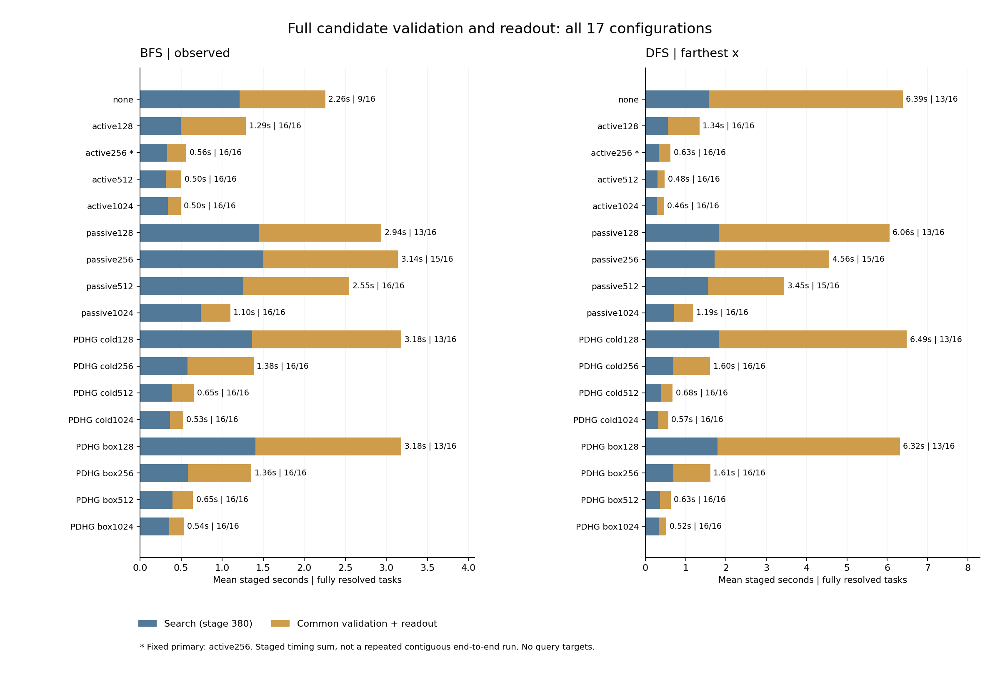

# 383｜共同候选验证与读出后的费用

本轮把380全部544份实际搜索输出接入同一几何验证和2048粒子读出。不同方法之间没有免费共享几何缓存、没有从母树补候选；原搜索费用逐行全额加回。研究问题是主动局部求证节约的下游费用能否超过其额外成本。

## 结果与全部控制

BFS/observed：固定主active256完整解析16/16、均拼接费用0.5648秒；全解析PDHG配置中最低均时为pdhg_cold1024、0.5266秒。
DFS/farthest_x：固定主active256完整解析16/16、均拼接费用0.6262秒；全解析PDHG配置中最低均时为pdhg_box1024、0.5199秒。

以下预列active配置在两个设置均完整解析16/16，且本次拼接平均费用低于各设置全部PDHG配置中的最低值：regional_active512, regional_active1024。这支持进入连续整链重复计时，不等于已经确认稳定加速或未见查询收益。

| 调度 | 排序 | 方法 | 搜索完成/16 | 完整解析/16 | 可用读出/16 | 均搜索秒 | 均读出组件秒 | 均拼接秒 | 候选总数 |
| --- | --- | --- | --- | --- | --- | --- | --- | --- | --- |
| bfs | observed | none | 9 | 9 | 9 | 1.2116 | 1.0456 | 2.2572 | 1861 |
| bfs | observed | regional_active128 | 16 | 16 | 16 | 0.4965 | 0.7947 | 1.2912 | 1370 |
| bfs | observed | regional_active256 | 16 | 16 | 16 | 0.3315 | 0.2333 | 0.5648 | 364 |
| bfs | observed | regional_active512 | 16 | 16 | 16 | 0.3124 | 0.1910 | 0.5034 | 290 |
| bfs | observed | regional_active1024 | 16 | 16 | 16 | 0.3409 | 0.1547 | 0.4957 | 223 |
| bfs | observed | regional_passive128 | 13 | 13 | 13 | 1.4491 | 1.4915 | 2.9406 | 2649 |
| bfs | observed | regional_passive256 | 15 | 15 | 15 | 1.5046 | 1.6377 | 3.1423 | 2891 |
| bfs | observed | regional_passive512 | 16 | 16 | 16 | 1.2570 | 1.2926 | 2.5496 | 2222 |
| bfs | observed | regional_passive1024 | 16 | 16 | 16 | 0.7416 | 0.3592 | 1.1008 | 583 |
| bfs | observed | pdhg_cold128 | 13 | 13 | 13 | 1.3657 | 1.8186 | 3.1843 | 3161 |
| bfs | observed | pdhg_cold256 | 16 | 16 | 16 | 0.5775 | 0.8055 | 1.3830 | 1392 |
| bfs | observed | pdhg_cold512 | 16 | 16 | 16 | 0.3876 | 0.2673 | 0.6548 | 431 |
| bfs | observed | pdhg_cold1024 | 16 | 16 | 16 | 0.3646 | 0.1621 | 0.5266 | 241 |
| bfs | observed | pdhg_box128 | 13 | 13 | 13 | 1.4053 | 1.7787 | 3.1840 | 3131 |
| bfs | observed | pdhg_box256 | 16 | 16 | 16 | 0.5836 | 0.7734 | 1.3570 | 1330 |
| bfs | observed | pdhg_box512 | 16 | 16 | 16 | 0.3969 | 0.2482 | 0.6452 | 389 |
| bfs | observed | pdhg_box1024 | 16 | 16 | 16 | 0.3530 | 0.1831 | 0.5362 | 279 |
| dfs | farthest_x | none | 13 | 13 | 13 | 1.5728 | 4.8170 | 6.3897 | 8477 |
| dfs | farthest_x | regional_active128 | 16 | 16 | 16 | 0.5621 | 0.7793 | 1.3413 | 1352 |
| dfs | farthest_x | regional_active256 | 16 | 16 | 16 | 0.3331 | 0.2931 | 0.6262 | 474 |
| dfs | farthest_x | regional_active512 | 16 | 16 | 16 | 0.2988 | 0.1809 | 0.4797 | 269 |
| dfs | farthest_x | regional_active1024 | 16 | 16 | 16 | 0.2955 | 0.1676 | 0.4631 | 244 |
| dfs | farthest_x | regional_passive128 | 13 | 13 | 14 | 1.8237 | 4.2321 | 6.0558 | 7533 |
| dfs | farthest_x | regional_passive256 | 15 | 15 | 16 | 1.7128 | 2.8483 | 4.5612 | 5048 |
| dfs | farthest_x | regional_passive512 | 15 | 15 | 15 | 1.5678 | 1.8789 | 3.4468 | 3332 |
| dfs | farthest_x | regional_passive1024 | 16 | 16 | 16 | 0.7152 | 0.4751 | 1.1903 | 798 |
| dfs | farthest_x | pdhg_cold128 | 13 | 13 | 14 | 1.8204 | 4.6660 | 6.4864 | 8283 |
| dfs | farthest_x | pdhg_cold256 | 16 | 16 | 16 | 0.6992 | 0.9048 | 1.6040 | 1565 |
| dfs | farthest_x | pdhg_cold512 | 16 | 16 | 16 | 0.3914 | 0.2862 | 0.6775 | 463 |
| dfs | farthest_x | pdhg_cold1024 | 16 | 16 | 16 | 0.3237 | 0.2432 | 0.5668 | 384 |
| dfs | farthest_x | pdhg_box128 | 13 | 13 | 14 | 1.7943 | 4.5215 | 6.3157 | 7978 |
| dfs | farthest_x | pdhg_box256 | 16 | 16 | 16 | 0.6913 | 0.9184 | 1.6097 | 1593 |
| dfs | farthest_x | pdhg_box512 | 16 | 16 | 16 | 0.3632 | 0.2649 | 0.6281 | 418 |
| dfs | farthest_x | pdhg_box1024 | 16 | 16 | 16 | 0.3283 | 0.1916 | 0.5199 | 293 |

固定主仍为active256。描述性最佳次要配置不能改称原主。拼接费用=380已测搜索费用+本轮独立实测验证/读出包装总费用；不是一次连续计时，未做重复置信区间，也不是严格等时预算竞赛。不完整搜索可能已有条件读出，完整解析要求搜索完成且全部候选分类无未决。可用读出不等于完整或准确。

## 可检验的数学机制

令S_m为方法m输出的完整候选集合，F为真正正体积可行区域。完整且安全的搜索满足F包含于S_m；共同几何完整分类后只接受F。先验、排序、采样数量和随机数都相同时，应得到相同读出；浮点几何也一致时，同种子预测应逐位相同。本轮独立审计检验这一预测，而不是假定更多局部优化会改善同一完整后验的准确率。

总费用分解为C_search(m)+sum_{R in S_m}g(R)+C_read(F)。m相对b占优，当且仅当其搜索额外费用小于省去的逐候选验证费用。S_m不必包含于S_b，每个g(R)也不假定相同；本轮逐一实际求解几何，不以候选数乘统一常数代替测量。更贵的局部求证可能因为少留下难假候选而获益，也可能因收效不足而得不偿失。

同完整后验的预测一致性只验证执行/推断等价性，不构成查询风险降低。真正目标是把完整链费用优势用于相同预算下更可靠的适应，并与强回归、浅层头和同参数优化器比较；本轮尚未检验该结论。

## 独立审计与状态

全部候选分类计数：{'infeasible': 70760, 'positive_volume': 551}。544次读出中，完整解析513，无可用读出27；全部原始行均保留。

审计通过：284142条精确几何证明、1058816个粒子支持误差检查、517次预测重放、513次完整候选读出核对，以及1988个跨方法/排序共同读出数组逐位比较。

严格内点、不可行和零体积结论必须有对应精确证书支持；几何体积和粒子采样仍是数值计算，不称精确贝叶斯后验。全局LP属于共同几何组件，明确计费，不伪称整个算法只有局部PC更新。查询输入固定为257点，查询答案从未进入本轮。空输出没有免费fallback，也没有删除失败任务计算MSE。

| 调度 | 排序 | 方法 | 均几何秒 | 均采样秒 | 均读取秒 | 均保留几何MiB | 均读出归档MiB | 均搜索命名MiB |
| --- | --- | --- | --- | --- | --- | --- | --- | --- |
| bfs | observed | none | 1.0329 | 0.00109 | 0.00805 | 0.0164 | 0.0492 | 1.9049 |
| bfs | observed | regional_active128 | 0.7741 | 0.00191 | 0.01569 | 0.0274 | 0.0746 | 1.8577 |
| bfs | observed | regional_active256 | 0.2142 | 0.00199 | 0.01631 | 0.0274 | 0.0689 | 1.1935 |
| bfs | observed | regional_active512 | 0.1742 | 0.00185 | 0.01427 | 0.0274 | 0.0685 | 0.9599 |
| bfs | observed | regional_active1024 | 0.1371 | 0.00191 | 0.01520 | 0.0274 | 0.0681 | 0.9849 |
| bfs | observed | regional_passive128 | 1.4722 | 0.00159 | 0.01267 | 0.0232 | 0.0699 | 4.0025 |
| bfs | observed | regional_passive256 | 1.6156 | 0.00185 | 0.01492 | 0.0261 | 0.0793 | 3.3125 |
| bfs | observed | regional_passive512 | 1.2708 | 0.00207 | 0.01561 | 0.0274 | 0.0795 | 2.3902 |
| bfs | observed | regional_passive1024 | 0.3406 | 0.00191 | 0.01539 | 0.0274 | 0.0701 | 1.6281 |
| bfs | observed | pdhg_cold128 | 1.7990 | 0.00152 | 0.01213 | 0.0232 | 0.0728 | 3.7593 |
| bfs | observed | pdhg_cold256 | 0.7855 | 0.00201 | 0.01526 | 0.0274 | 0.0748 | 1.9996 |
| bfs | observed | pdhg_cold512 | 0.2494 | 0.00189 | 0.01508 | 0.0274 | 0.0693 | 1.2601 |
| bfs | observed | pdhg_cold1024 | 0.1445 | 0.00193 | 0.01512 | 0.0274 | 0.0682 | 1.0646 |
| bfs | observed | pdhg_box128 | 1.7592 | 0.00154 | 0.01220 | 0.0232 | 0.0726 | 3.8490 |
| bfs | observed | pdhg_box256 | 0.7535 | 0.00194 | 0.01532 | 0.0274 | 0.0744 | 1.9873 |
| bfs | observed | pdhg_box512 | 0.2297 | 0.00189 | 0.01577 | 0.0274 | 0.0690 | 1.3457 |
| bfs | observed | pdhg_box1024 | 0.1651 | 0.00193 | 0.01545 | 0.0274 | 0.0684 | 0.9920 |
| dfs | farthest_x | none | 4.7860 | 0.00163 | 0.01212 | 0.0233 | 0.1032 | 2.0157 |
| dfs | farthest_x | regional_active128 | 0.7598 | 0.00194 | 0.01483 | 0.0274 | 0.0745 | 1.5080 |
| dfs | farthest_x | regional_active256 | 0.2743 | 0.00199 | 0.01572 | 0.0274 | 0.0695 | 0.9337 |
| dfs | farthest_x | regional_active512 | 0.1627 | 0.00189 | 0.01572 | 0.0274 | 0.0683 | 0.7749 |
| dfs | farthest_x | regional_active1024 | 0.1497 | 0.00202 | 0.01538 | 0.0274 | 0.0682 | 0.6805 |
| dfs | farthest_x | regional_passive128 | 4.2007 | 0.00175 | 0.01350 | 0.0242 | 0.1018 | 3.0252 |
| dfs | farthest_x | regional_passive256 | 2.8203 | 0.00198 | 0.01569 | 0.0274 | 0.0957 | 2.7522 |
| dfs | farthest_x | regional_passive512 | 1.8563 | 0.00194 | 0.01455 | 0.0261 | 0.0818 | 2.2603 |
| dfs | farthest_x | regional_passive1024 | 0.4553 | 0.00204 | 0.01614 | 0.0274 | 0.0714 | 1.4639 |
| dfs | farthest_x | pdhg_cold128 | 4.6349 | 0.00170 | 0.01306 | 0.0242 | 0.1061 | 3.1061 |
| dfs | farthest_x | pdhg_cold256 | 0.8840 | 0.00199 | 0.01565 | 0.0274 | 0.0758 | 1.8134 |
| dfs | farthest_x | pdhg_cold512 | 0.2681 | 0.00188 | 0.01514 | 0.0274 | 0.0695 | 1.0814 |
| dfs | farthest_x | pdhg_cold1024 | 0.2248 | 0.00197 | 0.01558 | 0.0274 | 0.0690 | 0.7501 |
| dfs | farthest_x | pdhg_box128 | 4.4914 | 0.00167 | 0.01386 | 0.0242 | 0.1044 | 3.0426 |
| dfs | farthest_x | pdhg_box256 | 0.8974 | 0.00204 | 0.01585 | 0.0274 | 0.0759 | 1.8970 |
| dfs | farthest_x | pdhg_box512 | 0.2458 | 0.00205 | 0.01610 | 0.0274 | 0.0692 | 1.0068 |
| dfs | farthest_x | pdhg_box1024 | 0.1740 | 0.00188 | 0.01508 | 0.0274 | 0.0685 | 0.7717 |

命名数组是可见状态计数，不是RSS峰值，也不包含所有几何临时状态。搜索与读出分别计状态，不把它们简单相加冒充精确峰值。加载封存档案、写盘压缩和独立审计不在在线费用中；应在后续连续完整链执行和进程级内存测量中验证。

## 下一关

若本轮预列候选形成完整链成本区间，冻结候选和强控制，进行交错重复的连续搜索→几何→读出计时；再进入新冻结任务、同总预算anytime预测和计费fallback。强闭式/固定非线性回归、浅头、同参数BP/普通PC/PC-ALM、官方TTT及实际下游验证仍不能省略。本轮不完成核心研究目标。

[执行前协议](../../../outputs/ttt-pc-alm-research/382_common_readout_protocol_v1.md) · [全部544调用](../development_v1/rows.json) · [独立审计](../audit_v1/summary.json)
