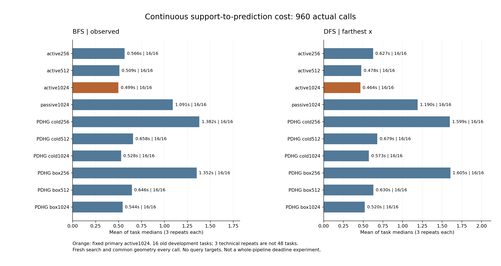

# 385｜连续支持到预测：交错重复费用结果

BFS/observed：主active1024的任务中位数均值为0.498811秒，本轮最低PDHG为pdhg_cold1024、0.528265秒；主相对该配置均时变化-5.58%。
DFS/farthest_x：主active1024的任务中位数均值为0.464455秒，本轮最低PDHG为pdhg_box1024、0.520498秒；主相对该配置均时变化-10.77%。

相对两个预列主要PDHG控制，未同时获得任务配对95%区间低于零的结果；不能宣称两设置均确认稳定成本优势。

这是旧16任务上的算法执行成本复验，不是新任务泛化确认，也没有查询答案或查询MSE。主配置active1024由382开发结果选择后，在384执行前冻结。原380/382主active256没有被改写。

## 全部十配置与实际费用

| 调度 | 排序 | 方法 | 三次均解析/16 | 解析调用/48 | 任务中位数均值秒 | 48调用均值秒 | 均搜索秒 | 均读出秒 | 最大调用秒 | 均返回数组MiB |
| --- | --- | --- | --- | --- | --- | --- | --- | --- | --- | --- |
| bfs | observed | regional_active256 | 16 | 48 | 0.566278 | 0.570714 | 0.332367 | 0.238203 | 1.145911 | 0.4320 |
| bfs | observed | regional_active512 | 16 | 48 | 0.509359 | 0.509941 | 0.314622 | 0.195193 | 0.956397 | 0.3701 |
| bfs | observed | regional_active1024 | 16 | 48 | 0.498811 | 0.500451 | 0.340856 | 0.159470 | 0.918226 | 0.3602 |
| bfs | observed | regional_passive1024 | 16 | 48 | 1.091225 | 1.096966 | 0.734684 | 0.362105 | 4.396660 | 0.5840 |
| bfs | observed | pdhg_cold256 | 16 | 48 | 1.381582 | 1.383168 | 0.575657 | 0.807165 | 5.385333 | 0.7019 |
| bfs | observed | pdhg_cold512 | 16 | 48 | 0.657978 | 0.659049 | 0.387733 | 0.271172 | 1.353743 | 0.4660 |
| bfs | observed | pdhg_cold1024 | 16 | 48 | 0.528265 | 0.529828 | 0.362906 | 0.166800 | 0.903749 | 0.3925 |
| bfs | observed | pdhg_box256 | 16 | 48 | 1.351962 | 1.353231 | 0.578309 | 0.774597 | 5.408902 | 0.7012 |
| bfs | observed | pdhg_box512 | 16 | 48 | 0.645666 | 0.645859 | 0.396566 | 0.249152 | 1.199542 | 0.4765 |
| bfs | observed | pdhg_box1024 | 16 | 48 | 0.544440 | 0.545257 | 0.355055 | 0.190078 | 0.914056 | 0.3787 |
| dfs | farthest_x | regional_active256 | 16 | 48 | 0.626541 | 0.629396 | 0.333840 | 0.295398 | 1.415280 | 0.3907 |
| dfs | farthest_x | regional_active512 | 16 | 48 | 0.477799 | 0.480184 | 0.299007 | 0.181059 | 0.911057 | 0.3196 |
| dfs | farthest_x | regional_active1024 | 16 | 48 | 0.464455 | 0.467272 | 0.297097 | 0.170060 | 0.940105 | 0.2811 |
| dfs | farthest_x | regional_passive1024 | 16 | 48 | 1.190286 | 1.192171 | 0.712933 | 0.479045 | 4.094690 | 0.5319 |
| dfs | farthest_x | pdhg_cold256 | 16 | 48 | 1.599192 | 1.599984 | 0.698672 | 0.900948 | 4.671767 | 0.7584 |
| dfs | farthest_x | pdhg_cold512 | 16 | 48 | 0.679415 | 0.680807 | 0.391821 | 0.288842 | 2.104802 | 0.4352 |
| dfs | farthest_x | pdhg_cold1024 | 16 | 48 | 0.573256 | 0.574352 | 0.325527 | 0.248689 | 1.232750 | 0.3187 |
| dfs | farthest_x | pdhg_box256 | 16 | 48 | 1.605435 | 1.608222 | 0.692464 | 0.915368 | 4.537465 | 0.7402 |
| dfs | farthest_x | pdhg_box512 | 16 | 48 | 0.629760 | 0.632074 | 0.366808 | 0.265127 | 2.243937 | 0.4027 |
| dfs | farthest_x | pdhg_box1024 | 16 | 48 | 0.520498 | 0.525452 | 0.329879 | 0.195455 | 1.126811 | 0.3192 |

主要统计量是16个任务各自三次总时的中位数，再跨任务取均值。组件时间列是48次调用的均值，因此应与48调用总均值比较，不能强行与中位数均值相加。完整三次原值保存在task_groups.json；没有删去慢调用或选最快一次。

单独共同热身：10调用、3.479184秒。在线时间包含搜索、逐候选全局几何、2048粒子读出及包装开销；不含事后摘要、磁盘归档、独立审计和冷启动导入。返回数组字节不是峰值RSS，未涵盖全部原生几何临时状态。

## 配对比较与不确定性

| 调度 | 排序 | 控制 | 预列主要控制 | 主减控制秒 | 任务bootstrap95% | 主更快/16 | 双方全部解析 |
| --- | --- | --- | --- | --- | --- | --- | --- |
| bfs | observed | regional_active256 |  | -0.067467 | [-0.161177, 0.005598] | 10 | True |
| bfs | observed | regional_active512 |  | -0.010548 | [-0.045016, 0.017419] | 5 | True |
| bfs | observed | regional_passive1024 |  | -0.592414 | [-1.129409, -0.198405] | 13 | True |
| bfs | observed | pdhg_cold256 |  | -0.882771 | [-1.588613, -0.312563] | 12 | True |
| bfs | observed | pdhg_cold512 |  | -0.159167 | [-0.266688, -0.059908] | 11 | True |
| bfs | observed | pdhg_cold1024 | * | -0.029454 | [-0.058140, -0.004850] | 10 | True |
| bfs | observed | pdhg_box256 |  | -0.853151 | [-1.542917, -0.304665] | 13 | True |
| bfs | observed | pdhg_box512 |  | -0.146855 | [-0.269197, -0.027262] | 11 | True |
| bfs | observed | pdhg_box1024 |  | -0.045629 | [-0.100126, -0.006078] | 10 | True |
| dfs | farthest_x | regional_active256 |  | -0.162085 | [-0.317354, -0.032942] | 9 | True |
| dfs | farthest_x | regional_active512 |  | -0.013343 | [-0.073201, 0.045150] | 5 | True |
| dfs | farthest_x | regional_passive1024 |  | -0.725831 | [-1.324392, -0.226228] | 14 | True |
| dfs | farthest_x | pdhg_cold256 |  | -1.134736 | [-1.797838, -0.526228] | 12 | True |
| dfs | farthest_x | pdhg_cold512 |  | -0.214960 | [-0.419920, -0.047812] | 10 | True |
| dfs | farthest_x | pdhg_cold1024 |  | -0.108801 | [-0.193347, -0.036462] | 13 | True |
| dfs | farthest_x | pdhg_box256 |  | -1.140979 | [-1.825493, -0.517554] | 13 | True |
| dfs | farthest_x | pdhg_box512 |  | -0.165304 | [-0.372187, -0.025453] | 12 | True |
| dfs | farthest_x | pdhg_box1024 | * | -0.056043 | [-0.132035, 0.008807] | 10 | True |

星号为执行前固定的BFS cold1024与DFS box1024。其他八项比较全部显示，避免事后选择弱控制。区间为16任务、20000次配对bootstrap；没有多重比较校正，次要比较是描述性分析。旧开发任务和少量任务使区间不能替代新任务确认。

## 数学预测与审计

安全的完整搜索保留所有正体积可行区域；共同几何完整分类后，相同先验和随机采样规则应给出相同读出。因此本阶段可能改善的是计算费用，而非同一完整后验的查询误差。费用优势的条件是额外局部求证成本小于省去的候选几何验证成本；不能把候选数量直接当时间。

本报告另核对304个跨方法/调度的完整预测字节摘要，相同任务的预测一致。独立审计计数：{'exact_geometry_certificates': 47412, 'posterior_support_checks': 655360, 'prediction_replays': 320, 'independent_live_checkpoints': 16177, 'independent_solver_work_checks': 905, 'fraction_single_languages': 7680, 'enumerated_combinations': 1646279, 'contractor_mask_replays': 16220, 'batch_accounting': 8110, 'exact_wide_domain_cuts': 47218, 'positive_output_or_pending_coverage': 340, 'search_accounting': 320, 'actual_search_resource_checks': 320, 'continuous_pipeline_checks': 320, 'deduplicated_repeat_array_digests': 105930, 'identical_non_time_repeat_metadata': 640}。

全部960次重新计算。320份规范数组经独立精确证书、枚举覆盖和预测重放；其余640次实际计算后，保存逐数组字节摘要及完整非时间元数据并与规范档案比较。归档去重不是跳过运行。全局LP明确属于共同几何读出，不能宣称整体只有局部PC操作。

## 下一关仍须完成

搜索只有8秒协作边界和65536展开约束，几何读出不受整链时限约束；当前不是等总时间anytime竞赛。后续必须在新冻结任务上设置明确且计费的共同fallback和全链预算，评估所有任务的独立查询误差。强回归/核、浅头、同参数BP/PC/PC-ALM及匹配任务训练的官方TTT仍是必要控制。没有查询风险与实际任务验证前，不能宣布论文核心结果或完成持续目标。

[执行前协议](../../../outputs/ttt-pc-alm-research/384_contiguous_repeat_protocol_v1.md) · [960调用](../development_v1/rows.json) · [三次原值](../audit_v1/task_groups.json) · [独立审计](../audit_v1/summary.json)
