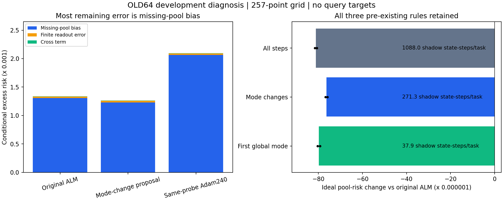

# 295｜定位到了主要瓶颈：遗漏分支，而不是粒子均值读出

这是旧 64 个开发任务的事后机制诊断，不是新确认实验。使用已审计的完整数值后验参照；没有读取真实教师或实际查询答案。

候选方法当前条件超额风险的约 97.42% 来自已发现池的截断偏差，有限读出误差约占 2.19%。这两个比例是带交叉项的诊断比值，不是独立方差分量。下一步优先改进支持可观测的分支搜索。

## 1．主要数值

| 已保存的实际方法 | 条件超额风险 | 池截断偏差 | 有限读出误差 | 交叉项 |
|---|---:|---:|---:|---:|
| Original ALM | 0.001339335416 | 0.001306723629 | 2.758668709e-05 | 5.02510005e-06 |
| Mode-change proposal | 0.001262959826 | 0.001230369757 | 2.769006256e-05 | 4.900006e-06 |
| Same-probe Adam240 | 0.002094820351 | 0.002065158433 | 2.529645219e-05 | 4.365465547e-06 |

新候选相对原 ALM 的条件超额风险差为 -7.637559021e-05，约减少 5.70%。池截断项差为 -7.635387163e-05，解释了几乎全部变化。这里的百分比仅针对旧64条件超额风险，不是总 MSE，也不是294新128任务的提升。

294 的新128任务总 MSE 改善仍只有约 0.038%，原先跨零的区间没有因本诊断而改变。Adam240 仅是本诊断的同探测起点对照，不能替代更长强 Adam 或原8192任务结论。

## 2．三个已存在的提议规则：不能只数新分支

| 理想池规则 | 平均后验质量覆盖 | 理想条件超额风险 | 相对原池差 | 额外影子状态步/任务 |
|---|---:|---:|---:|---:|
| All steps | 0.87980783 | 0.001225551599 | -8.117203003e-05 | 1088.00000 |
| Mode changes | 0.87866962 | 0.001230369757 | -7.635387163e-05 | 271.28125 |
| First global mode | 0.87380950 | 0.001226909707 | -7.981392183e-05 | 37.92188 |

First-global 的影子步数约为 mode-change 的14%，但在这个旧开发集上理想池风险下降并不更小。这是减少重复搜索、将预算投入新分支的动机，不是上线速度优势；该规则尚无实际完整调用和新任务结果。所有规则都必须支付检测、几何和读出成本。

## 3．数学解释

令当前已发现池的均值为 μ，新增池均值为 ν，新增池在两者并集中的后验质量比例为 α，完整后验均值为 m。并集均值为 μ′=μ+α(ν−μ)。平方损失下，理想条件超额风险变化严格满足：

\[\|\mu\prime-m\|_Q^2-\|\mu-m\|_Q^2=2\alpha\langle\mu-m,\nu-\mu\rangle_Q+\alpha^2\|\nu-\mu\|_Q^2.\]

因此，增大覆盖质量本身不保证每个任务的风险下降；新增区域的函数均值方向同样重要。完整 m 只能作昂贵离线诊断，不能成为在线选择器的免费输入。下一步的触发规则只能使用支持样本、局部状态、模式历史和已计费计算。

固定实际预测 g 的分解使用两批独立区域矩：(g−mᵃ)(g−mᵇ) 的网格平均，严格拆成池偏差、读出误差及交叉项。两对批次固定为(0,1)、(2,3)，小负估计保留。有限 Monte Carlo 与数值体积仍是近似，不是精确实数积分。

## 4．全量网格与批次敏感性

下列数值完整保留所有方法、两种网格、两对批次。批次差反映参照的 Monte Carlo 敏感性，不是任务采样置信区间；图中黑线同理。

### actual

| 方法/池 | 网格 | 指标 | 两对均值 | 对(0,1) | 对(2,3) | 对间差 |
|---|---:|---|---:|---:|---:|---:|
| original_alm | 257 | actual_excess | 0.0013393354158 | 0.00134117043491 | 0.00133750039669 | 3.67003822078e-06 |
| original_alm | 257 | policy_excess | 0.00130672362865 | 0.00130765393117 | 0.00130579332613 | 1.86060503594e-06 |
| original_alm | 257 | read_error | 2.75866870947e-05 | 2.80821414521e-05 | 2.70912327373e-05 | 9.90908714788e-07 |
| original_alm | 257 | cross_term | 5.02510005049e-06 | 5.43436228552e-06 | 4.61583781546e-06 | 8.18524470055e-07 |
| counterfactual | 257 | actual_excess | 0.00126295982558 | 0.00126459296029 | 0.00126132669087 | 3.26626941455e-06 |
| counterfactual | 257 | policy_excess | 0.00123036975702 | 0.00123083675453 | 0.00122990275952 | 9.33995007086e-07 |
| counterfactual | 257 | read_error | 2.76900625594e-05 | 2.81602765728e-05 | 2.7219848546e-05 | 9.40428026768e-07 |
| counterfactual | 257 | cross_term | 4.90000599988e-06 | 5.59592919023e-06 | 4.20408280953e-06 | 1.3918463807e-06 |
| bp240 | 257 | actual_excess | 0.00209482035068 | 0.00209689904487 | 0.00209274165649 | 4.15738837325e-06 |
| bp240 | 257 | policy_excess | 0.00206515843294 | 0.00206580687956 | 0.00206450998633 | 1.29689323415e-06 |
| bp240 | 257 | read_error | 2.52964521875e-05 | 2.53228663139e-05 | 2.52700380612e-05 | 5.28282526406e-08 |
| bp240 | 257 | cross_term | 4.36546554728e-06 | 5.76929899051e-06 | 2.96163210405e-06 | 2.80766688646e-06 |
| original_alm | 129 | actual_excess | 0.00133652174259 | 0.00133832926978 | 0.00133471421539 | 3.61505439427e-06 |
| original_alm | 129 | policy_excess | 0.00130386407846 | 0.00130480180943 | 0.00130292634748 | 1.87546195089e-06 |
| original_alm | 129 | read_error | 2.76219966342e-05 | 2.81088214606e-05 | 2.71351718077e-05 | 9.73649652938e-07 |
| original_alm | 129 | cross_term | 5.03566749609e-06 | 5.41863889131e-06 | 4.65269610088e-06 | 7.65942790434e-07 |
| counterfactual | 129 | actual_excess | 0.00126067176938 | 0.00126227632616 | 0.00125906721259 | 3.20911356909e-06 |
| counterfactual | 129 | policy_excess | 0.00122801201369 | 0.00122848486055 | 0.00122753916682 | 9.45693732908e-07 |
| counterfactual | 129 | read_error | 2.77263501235e-05 | 2.81881938573e-05 | 2.72645063898e-05 | 9.23687467533e-07 |
| counterfactual | 129 | cross_term | 4.93340556754e-06 | 5.60327175186e-06 | 4.26353938322e-06 | 1.33973236865e-06 |
| bp240 | 129 | actual_excess | 0.00209822027798 | 0.0021002571159 | 0.00209618344006 | 4.0736758458e-06 |
| bp240 | 129 | policy_excess | 0.00206808299793 | 0.00206872975195 | 0.0020674362439 | 1.29350804973e-06 |
| bp240 | 129 | read_error | 2.53326386531e-05 | 2.53513277599e-05 | 2.53139495463e-05 | 3.73782135894e-08 |
| bp240 | 129 | cross_term | 4.8046413955e-06 | 6.17603618674e-06 | 3.43324660426e-06 | 2.74278958248e-06 |

### ideal

| 方法/池 | 网格 | 指标 | 两对均值 | 对(0,1) | 对(2,3) | 对间差 |
|---|---:|---|---:|---:|---:|---:|
| original_alm | 257 | policy_excess | 0.00130672362865 | 0.00130765393117 | 0.00130579332613 | 1.86060503594e-06 |
| original_alm | 257 | delta_vs_original | 0 | 0 | 0 | 0 |
| original_alm | 257 | mass | 0.86627919396 | 0.86627919396 | 0.86627919396 | 0 |
| bp240 | 257 | policy_excess | 0.00206515843294 | 0.00206580687956 | 0.00206450998633 | 1.29689323415e-06 |
| bp240 | 257 | delta_vs_original | 0.000758434804293 | 0.000758152948392 | 0.000758716660194 | -5.63711801791e-07 |
| bp240 | 257 | mass | 0.843950032981 | 0.843950032981 | 0.843950032981 | 0 |
| all_steps | 257 | policy_excess | 0.00122555159862 | 0.0012260180505 | 0.00122508514674 | 9.32903759643e-07 |
| all_steps | 257 | delta_vs_original | -8.11720300341e-05 | -8.16358806722e-05 | -8.07081793959e-05 | -9.27701276294e-07 |
| all_steps | 257 | mass | 0.879807826572 | 0.879807826572 | 0.879807826572 | 0 |
| changed_forward_mode | 257 | policy_excess | 0.00123036975702 | 0.00123083675453 | 0.00122990275952 | 9.33995007086e-07 |
| changed_forward_mode | 257 | delta_vs_original | -7.63538716286e-05 | -7.6817176643e-05 | -7.58905666142e-05 | -9.26610028851e-07 |
| changed_forward_mode | 257 | mass | 0.878669621174 | 0.878669621174 | 0.878669621174 | 0 |
| first_global_forward_mode | 257 | policy_excess | 0.00122690970682 | 0.00122727807046 | 0.00122654134318 | 7.36727279256e-07 |
| first_global_forward_mode | 257 | delta_vs_original | -7.98139218298e-05 | -8.03758607082e-05 | -7.92519829515e-05 | -1.12387775668e-06 |
| first_global_forward_mode | 257 | mass | 0.873809504846 | 0.873809504846 | 0.873809504846 | 0 |
| original_alm | 129 | policy_excess | 0.00130386407846 | 0.00130480180943 | 0.00130292634748 | 1.87546195089e-06 |
| original_alm | 129 | delta_vs_original | 0 | 0 | 0 | 0 |
| original_alm | 129 | mass | 0.86627919396 | 0.86627919396 | 0.86627919396 | 0 |
| bp240 | 129 | policy_excess | 0.00206808299793 | 0.00206872975195 | 0.0020674362439 | 1.29350804973e-06 |
| bp240 | 129 | delta_vs_original | 0.000764218919474 | 0.000763927942524 | 0.000764509896425 | -5.8195390116e-07 |
| bp240 | 129 | mass | 0.843950032981 | 0.843950032981 | 0.843950032981 | 0 |
| all_steps | 129 | policy_excess | 0.00122321839243 | 0.00122369065779 | 0.00122274612706 | 9.445307263e-07 |
| all_steps | 129 | delta_vs_original | -8.06456860292e-05 | -8.11111516415e-05 | -8.01802204169e-05 | -9.30931224595e-07 |
| all_steps | 129 | mass | 0.879807826572 | 0.879807826572 | 0.879807826572 | 0 |
| changed_forward_mode | 129 | policy_excess | 0.00122801201369 | 0.00122848486055 | 0.00122753916682 | 9.45693732908e-07 |
| changed_forward_mode | 129 | delta_vs_original | -7.58520647683e-05 | -7.63169488773e-05 | -7.53871806593e-05 | -9.29768217987e-07 |
| changed_forward_mode | 129 | mass | 0.878669621174 | 0.878669621174 | 0.878669621174 | 0 |
| first_global_forward_mode | 129 | policy_excess | 0.0012243115744 | 0.00122468561202 | 0.00122393753679 | 7.48075225641e-07 |
| first_global_forward_mode | 129 | delta_vs_original | -7.95525040531e-05 | -8.01161974157e-05 | -7.89888106904e-05 | -1.12738672525e-06 |
| first_global_forward_mode | 129 | mass | 0.873809504846 | 0.873809504846 | 0.873809504846 | 0 |

### contrasts

| 方法/池 | 网格 | 指标 | 两对均值 | 对(0,1) | 对(2,3) | 对间差 |
|---|---:|---|---:|---:|---:|---:|
| counterfactual | 257 | actual_excess | -7.63755902146e-05 | -7.65774746177e-05 | -7.61737058115e-05 | -4.03768806225e-07 |
| counterfactual | 257 | policy_excess | -7.63538716286e-05 | -7.6817176643e-05 | -7.58905666142e-05 | -9.26610028851e-07 |
| counterfactual | 257 | read_error | 1.0337546467e-07 | 7.81351206601e-08 | 1.2861580868e-07 | -5.04806880197e-08 |
| counterfactual | 257 | cross_term | -1.25094050611e-07 | 1.61566904712e-07 | -4.11755005934e-07 | 5.73321910646e-07 |
| bp240 | 257 | actual_excess | 0.000755484934883 | 0.000755728609959 | 0.000755241259807 | 4.87350152466e-07 |
| bp240 | 257 | policy_excess | 0.000758434804293 | 0.000758152948392 | 0.000758716660194 | -5.63711801791e-07 |
| bp240 | 257 | read_error | -2.29023490717e-06 | -2.75927513825e-06 | -1.8211946761e-06 | -9.38080462147e-07 |
| bp240 | 257 | cross_term | -6.59634503214e-07 | 3.34936704988e-07 | -1.65420571142e-06 | 1.9891424164e-06 |
| counterfactual | 129 | actual_excess | -7.58499732075e-05 | -7.60529436201e-05 | -7.56470027949e-05 | -4.0594082518e-07 |
| counterfactual | 129 | policy_excess | -7.58520647683e-05 | -7.63169488773e-05 | -7.53871806593e-05 | -9.29768217987e-07 |
| counterfactual | 129 | read_error | 1.04353489359e-07 | 7.9372396657e-08 | 1.29334582062e-07 | -4.9962185405e-08 |
| counterfactual | 129 | cross_term | -1.02261928555e-07 | 1.84632860551e-07 | -3.89156717661e-07 | 5.73789578212e-07 |
| bp240 | 129 | actual_excess | 0.000761698535393 | 0.000761927846118 | 0.000761469224667 | 4.58621451537e-07 |
| bp240 | 129 | policy_excess | 0.000764218919474 | 0.000763927942524 | 0.000764509896425 | -5.8195390116e-07 |
| bp240 | 129 | read_error | -2.28935798107e-06 | -2.75749370074e-06 | -1.82122226139e-06 | -9.36271439349e-07 |
| bp240 | 129 | cross_term | -2.31026100599e-07 | 7.57397295424e-07 | -1.21944949662e-06 | 1.97684679205e-06 |

## 5．执行与复核

64任务、768分解、1280理想池估计、512直接风险对比均完成。恒等式最大残差 6.939e-18，独立标量求和差 3.469e-18，直接风险差核对误差 1.041e-17。

初次 development_v1 在结果计算前遇到旧协议 source_sha256 的格式兼容错误并停止；失败记录保留。修复只兼容标量哈希和相对路径哈希，完整结果在 development_v2；未改任务、规则、指标或容差。

这些结果支持搜索改进的优先级，但尚不能证明 PC-ALM 相对强 BP 的独立优势，也不是通用 MLP、官方 TTT 或 LLM/VLM 验证。总目标未完成。

结果摘要 SHA256：`95852bf236596935f7ac0dd3c6fe389118b6976b5b2f368e09cc8ac37325a3ec`。逐任务风险、批次矩、全部输入哈希和源代码哈希见同级 development_v2。
