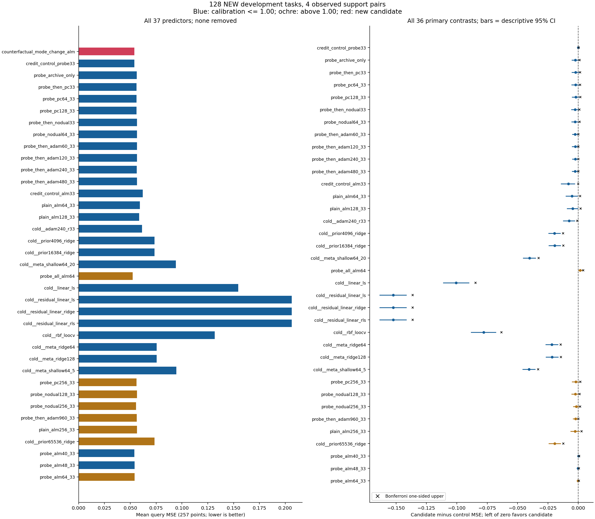
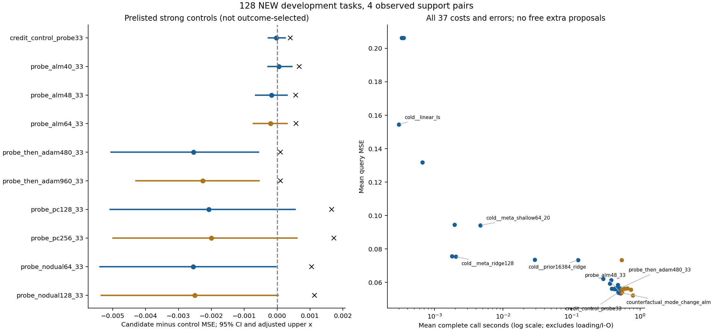

# 294｜新分支提议的查询结果

本表包含 128 个任务、37 个方法、144 个比较；全部预测先封存、后统一评分。
主比较校正上界为负的数量：14/36。这个数量本身不代表完成研究目标。

## 完整方法表

|方法|主 MSE257|MSE129|点估计 MSE257|点估计 MSE129|均值秒|本轮相对费用|校准相对费用|数值失败|
|---|---:|---:|---:|---:|---:|---:|---:|---:|
|counterfactual_mode_change_alm|0.0539135249|0.0539784863|0.110989452|0.111103968|0.517922|1.0000|1.0000|0|
|credit_control_probe33|0.0539340334|0.0539988277|0.110989452|0.111103968|0.481168|0.9290|0.9262|0|
|probe_archive_only|0.0563012813|0.0563605088|0.113752223|0.113864806|0.385532|0.7444|0.7661|0|
|probe_then_pc33|0.0560853836|0.0561422269|0.1157901|0.115947629|0.420234|0.8114|0.8214|0|
|probe_pc64_33|0.0561240693|0.0561763309|0.116428901|0.116614809|0.438443|0.8465|0.8541|0|
|probe_pc128_33|0.0559880434|0.0560456068|0.118262429|0.118403247|0.472642|0.9126|0.9264|0|
|probe_then_nodual33|0.0565623644|0.0566244709|0.117998501|0.118157646|0.442721|0.8548|0.8743|0|
|probe_nodual64_33|0.0564631187|0.056525814|0.115336052|0.115509316|0.485377|0.9372|0.9389|0|
|probe_then_adam60_33|0.0564334201|0.0564907937|0.109657526|0.109820696|0.429283|0.8289|0.8260|0|
|probe_then_adam120_33|0.056422983|0.0564775648|0.114265625|0.114370258|0.442040|0.8535|0.8467|0|
|probe_then_adam240_33|0.0563412131|0.0563991762|0.114326125|0.114424115|0.464843|0.8975|0.8855|0|
|probe_then_adam480_33|0.0564557336|0.0565143138|0.114440645|0.114539253|0.511254|0.9871|0.9928|0|
|credit_control_alm33|0.0620638297|0.062141775|0.112038983|0.112085057|0.289884|0.5597|0.5409|0|
|plain_alm64_33|0.0591953882|0.0592628896|0.113715746|0.113780679|0.363881|0.7026|0.7042|0|
|plain_alm128_33|0.0584767828|0.058547808|0.111424681|0.111640007|0.475392|0.9179|0.9396|0|
|cold__adam240_r33|0.0614385437|0.0615052774|0.106638559|0.106759131|0.378782|0.7314|0.7940|0|
|cold__prior4096_ridge|0.0735150488|0.0735897012|0.0735150488|0.0735897012|0.028880|0.0558|0.0621|0|
|cold__prior16384_ridge|0.0733608263|0.0734362712|0.0733608263|0.0734362712|0.124028|0.2395|0.2532|0|
|cold__meta_shallow64_20|0.0941499113|0.0942081918|0.0941499113|0.0942081918|0.004658|0.0090|0.0092|0|
|probe_all_alm64|0.0523194916|0.0523939291|0.10756383|0.107685985|0.786888|1.5193|1.5138|0|
|cold__linear_ls|0.154425807|0.15465918|0.154425807|0.15465918|0.000301|0.0006|0.0006|0|
|cold__residual_linear_ls|0.2063114|0.20686293|0.2063114|0.20686293|0.000351|0.0007|0.0007|0|
|cold__residual_linear_ridge|0.206290446|0.206842578|0.206290446|0.206842578|0.000332|0.0006|0.0007|0|
|cold__residual_linear_rls|0.206290446|0.206842578|0.206290446|0.206842578|0.000340|0.0007|0.0007|0|
|cold__rbf_loocv|0.131820163|0.131876298|0.131820163|0.131876298|0.000662|0.0013|0.0014|0|
|cold__meta_ridge64|0.0756345061|0.0757044421|0.0756345061|0.0757044421|0.001799|0.0035|0.0038|0|
|cold__meta_ridge128|0.0754613443|0.0755341529|0.0754613443|0.0755341529|0.002031|0.0039|0.0042|0|
|cold__meta_shallow64_5|0.0945100555|0.094565549|0.0945100555|0.094565549|0.001946|0.0038|0.0040|0|
|probe_pc256_33|0.0559167943|0.0559748934|0.115450575|0.115611276|0.539230|1.0411|1.0595|0|
|probe_nodual128_33|0.0564155676|0.0564787598|0.113744009|0.113880504|0.571496|1.1034|1.1092|0|
|probe_nodual256_33|0.055605133|0.0556696505|0.114343966|0.114478163|0.735570|1.4202|1.4500|0|
|probe_then_adam960_33|0.0561743157|0.0562346967|0.114159227|0.114259635|0.598702|1.1560|1.1674|0|
|plain_alm256_33|0.0564822669|0.0565505663|0.112764261|0.112967472|0.655425|1.2655|1.2968|0|
|cold__prior65536_ridge|0.0733261115|0.0734014645|0.0733261115|0.0734014645|0.542644|1.0477|1.2284|0|
|probe_alm40_33|0.0538591862|0.0539226977|0.115104197|0.115215366|0.498223|0.9620|0.9657|0|
|probe_alm48_33|0.054079669|0.0541433654|0.111895111|0.111973759|0.513209|0.9909|0.9899|0|
|probe_alm64_33|0.0541144207|0.0541779129|0.112649102|0.11276732|0.543038|1.0485|1.0483|0|

## 全部比较（候选减控制）

负差值有利于新候选。95% 区间是描述性的；校正单侧上界仅用于事先固定的 36 个主指标比较。任务是重抽单位，不把查询点当作独立样本。

|控制|指标|均值差|描述性 95% 下界|上界|校正单侧上界|改善/相同/更差任务|
|---|---|---:|---:|---:|---:|---|
|credit_control_probe33|mse257|-2.05084533e-05|-0.00026415294|0.000245294753|0.000402088945|12/104/12|
|credit_control_probe33|mse129|-2.03414421e-05|-0.000263944886|0.000245884511|—|12/104/12|
|credit_control_probe33|point_mse257|0|0|0|—|0/128/0|
|credit_control_probe33|point_mse129|0|0|0|—|0/128/0|
|probe_archive_only|mse257|-0.0023877564|-0.00521366214|0.000111602101|0.00118266397|51/38/39|
|probe_archive_only|mse129|-0.00238202247|-0.00520926633|0.000118543866|—|51/38/39|
|probe_archive_only|point_mse257|-0.00276277093|-0.012412965|0.00705169556|—|70/1/57|
|probe_archive_only|point_mse129|-0.00276083824|-0.0124097958|0.00705997716|—|70/1/57|
|probe_then_pc33|mse257|-0.00217185873|-0.00518925414|0.000463972904|0.00159781983|47/42/39|
|probe_then_pc33|mse129|-0.00216374058|-0.00517837997|0.000475702464|—|47/42/39|
|probe_then_pc33|point_mse257|-0.00480064812|-0.0145958869|0.00496172774|—|67/1/60|
|probe_then_pc33|point_mse129|-0.00484366188|-0.0146289753|0.00489156015|—|66/1/61|
|probe_pc64_33|mse257|-0.00221054443|-0.00534104459|0.000476156991|0.00162088108|48/42/38|
|probe_pc64_33|mse129|-0.0021978446|-0.00532091821|0.000486209342|—|48/42/38|
|probe_pc64_33|point_mse257|-0.00543944898|-0.0147953013|0.00407078334|—|70/1/57|
|probe_pc64_33|point_mse129|-0.00551084113|-0.0148709057|0.00399169798|—|68/1/59|
|probe_pc128_33|mse257|-0.0020745185|-0.00508054763|0.000541846683|0.00165957195|49/42/37|
|probe_pc128_33|mse129|-0.00206712054|-0.0050710112|0.000551997547|—|49/42/37|
|probe_pc128_33|point_mse257|-0.00727297698|-0.0165950511|0.00251688204|—|75/1/52|
|probe_pc128_33|point_mse129|-0.00729927922|-0.0166298265|0.00247618639|—|74/1/53|
|probe_then_nodual33|mse257|-0.00264883948|-0.0054815237|-0.000109474418|0.000984667259|47/48/33|
|probe_then_nodual33|mse129|-0.0026459846|-0.00547515651|-0.000103855651|—|46/48/34|
|probe_then_nodual33|point_mse257|-0.00700904946|-0.0143943275|-7.30521802e-05|—|68/1/59|
|probe_then_nodual33|point_mse129|-0.00705367862|-0.0144162631|-9.86150684e-05|—|68/1/59|
|probe_nodual64_33|mse257|-0.00254959381|-0.00538596619|-3.47668745e-05|0.00105388467|48/49/31|
|probe_nodual64_33|mse129|-0.0025473277|-0.00538951948|-3.12212878e-05|—|48/49/31|
|probe_nodual64_33|point_mse257|-0.00434660039|-0.0120926043|0.00333175461|—|69/1/58|
|probe_nodual64_33|point_mse129|-0.00440534834|-0.0121503159|0.00327310886|—|71/1/56|
|probe_then_adam60_33|mse257|-0.00251989519|-0.00485183533|-0.000623699222|7.2865312e-05|49/44/35|
|probe_then_adam60_33|mse129|-0.00251230741|-0.00483820142|-0.000616403569|—|49/44/35|
|probe_then_adam60_33|point_mse257|0.001331926|-0.00821763696|0.0110429489|—|66/0/62|
|probe_then_adam60_33|point_mse129|0.00128327149|-0.00829385692|0.0110213273|—|66/0/62|
|probe_then_adam120_33|mse257|-0.00250945813|-0.00495969744|-0.000565477974|0.000105975234|49/44/35|
|probe_then_adam120_33|mse129|-0.00249907852|-0.00493825484|-0.000560662778|—|49/44/35|
|probe_then_adam120_33|point_mse257|-0.00327617312|-0.0146720972|0.00788449792|—|68/0/60|
|probe_then_adam120_33|point_mse129|-0.0032662901|-0.0146401834|0.00791663015|—|68/0/60|
|probe_then_adam240_33|mse257|-0.00242768823|-0.00473446266|-0.000561120197|0.000105975234|49/44/35|
|probe_then_adam240_33|mse129|-0.00242068985|-0.00472327994|-0.000555353578|—|49/44/35|
|probe_then_adam240_33|point_mse257|-0.00333667303|-0.0146898387|0.00777972616|—|68/0/60|
|probe_then_adam240_33|point_mse129|-0.00332014733|-0.0146626223|0.00779776312|—|68/0/60|
|probe_then_adam480_33|mse257|-0.00254220868|-0.00504374752|-0.000567459517|0.000105975234|49/44/35|
|probe_then_adam480_33|mse129|-0.00253582747|-0.00503561228|-0.000562300306|—|49/44/35|
|probe_then_adam480_33|point_mse257|-0.00345119351|-0.0148037368|0.00767959348|—|69/0/59|
|probe_then_adam480_33|point_mse129|-0.00343528498|-0.0147798589|0.00770348052|—|69/0/59|
|credit_control_alm33|mse257|-0.00815030476|-0.0140019419|-0.00291849024|-0.000123288663|65/18/45|
|credit_control_alm33|mse129|-0.00816328875|-0.0140175838|-0.0029294589|—|65/18/45|
|credit_control_alm33|point_mse257|-0.00104953137|-0.00660237916|0.00461694129|—|62/1/65|
|credit_control_alm33|point_mse129|-0.000981088988|-0.00652642051|0.00466530587|—|61/1/66|
|plain_alm64_33|mse257|-0.00528186328|-0.0100313977|-0.000867585907|0.00156114869|59/18/51|
|plain_alm64_33|mse129|-0.00528440333|-0.0100329643|-0.000874868628|—|59/18/51|
|plain_alm64_33|point_mse257|-0.00272629436|-0.0105017405|0.00510197374|—|69/0/59|
|plain_alm64_33|point_mse129|-0.00267671124|-0.0104538414|0.0051538015|—|68/0/60|
|plain_alm128_33|mse257|-0.00456325791|-0.00907679875|-0.000346291617|0.00189344232|56/18/54|
|plain_alm128_33|mse129|-0.00456932171|-0.00908620016|-0.000353138813|—|56/18/54|
|plain_alm128_33|point_mse257|-0.000435229209|-0.0104327829|0.00978231902|—|69/0/59|
|plain_alm128_33|point_mse129|-0.000536039658|-0.0105159169|0.0096972661|—|69/0/59|
|cold__adam240_r33|mse257|-0.00752501874|-0.0122122912|-0.00308866665|-0.000766493405|64/11/53|
|cold__adam240_r33|mse129|-0.00752679107|-0.0122143594|-0.00309691194|—|62/11/55|
|cold__adam240_r33|point_mse257|0.00435089292|-0.00774214813|0.0166885368|—|64/0/64|
|cold__adam240_r33|point_mse129|0.0043448365|-0.00776387279|0.0166898235|—|63/0/65|
|cold__prior4096_ridge|mse257|-0.0196015238|-0.0244006776|-0.0148889386|-0.0125234625|100/0/28|
|cold__prior4096_ridge|mse129|-0.0196112149|-0.0244147975|-0.014899546|—|100/0/28|
|cold__prior4096_ridge|point_mse257|0.0374744031|0.0272334558|0.0476717419|—|32/0/96|
|cold__prior4096_ridge|point_mse129|0.0375142663|0.027301251|0.0476838067|—|32/0/96|
|cold__prior16384_ridge|mse257|-0.0194473014|-0.0242421518|-0.0147136106|-0.012360839|100/0/28|
|cold__prior16384_ridge|mse129|-0.0194577849|-0.0242607372|-0.0147215891|—|100/0/28|
|cold__prior16384_ridge|point_mse257|0.0376286255|0.0274112067|0.0478239376|—|32/0/96|
|cold__prior16384_ridge|point_mse129|0.0376676963|0.0274584845|0.0478642758|—|32/0/96|
|cold__meta_shallow64_20|mse257|-0.0402363864|-0.0453625118|-0.0351685642|-0.0326524076|118/0/10|
|cold__meta_shallow64_20|mse129|-0.0402297055|-0.0453625515|-0.0351524344|—|118/0/10|
|cold__meta_shallow64_20|point_mse257|0.0168395406|0.00608892772|0.0277755734|—|44/0/84|
|cold__meta_shallow64_20|point_mse129|0.0168957757|0.00614796075|0.0278216922|—|44/0/84|
|probe_all_alm64|mse257|0.00159403327|0.000181997898|0.00315665025|0.00408748203|42/34/52|
|probe_all_alm64|mse129|0.00158455719|0.000179023044|0.00313931521|—|42/34/52|
|probe_all_alm64|point_mse257|0.00342562168|-0.0074212375|0.0143359919|—|61/2/65|
|probe_all_alm64|point_mse129|0.00341798215|-0.00741993489|0.0143223627|—|64/2/62|
|cold__linear_ls|mse257|-0.100512282|-0.111051751|-0.0901972989|-0.0845489379|125/0/3|
|cold__linear_ls|mse129|-0.100680694|-0.111248412|-0.0903392892|—|125/0/3|
|cold__linear_ls|point_mse257|-0.0434363555|-0.0585255474|-0.0284325862|—|82/0/46|
|cold__linear_ls|point_mse129|-0.0435552128|-0.0586138606|-0.0285493719|—|82/0/46|
|cold__residual_linear_ls|mse257|-0.152397875|-0.163364683|-0.141612804|-0.136303663|128/0/0|
|cold__residual_linear_ls|mse129|-0.152884444|-0.163845199|-0.142069882|—|128/0/0|
|cold__residual_linear_ls|point_mse257|-0.0953219481|-0.109088116|-0.0815543413|—|110/0/18|
|cold__residual_linear_ls|point_mse129|-0.0957589626|-0.109474778|-0.0820122704|—|111/0/17|
|cold__residual_linear_ridge|mse257|-0.152376921|-0.163339124|-0.141593127|-0.136277532|128/0/0|
|cold__residual_linear_ridge|mse129|-0.152864092|-0.163820911|-0.142053418|—|128/0/0|
|cold__residual_linear_ridge|point_mse257|-0.0953009939|-0.109061672|-0.0815337112|—|110/0/18|
|cold__residual_linear_ridge|point_mse129|-0.0957386106|-0.109452791|-0.0819947887|—|111/0/17|
|cold__residual_linear_rls|mse257|-0.152376921|-0.163339124|-0.141593127|-0.136277532|128/0/0|
|cold__residual_linear_rls|mse129|-0.152864092|-0.163820911|-0.142053418|—|128/0/0|
|cold__residual_linear_rls|point_mse257|-0.0953009939|-0.109061672|-0.0815337112|—|110/0/18|
|cold__residual_linear_rls|point_mse129|-0.0957386106|-0.109452791|-0.0819947887|—|111/0/17|
|cold__rbf_loocv|mse257|-0.077906638|-0.0881806136|-0.0679111129|-0.0631681435|124/0/4|
|cold__rbf_loocv|mse129|-0.0778978115|-0.0881597324|-0.0679011303|—|124/0/4|
|cold__rbf_loocv|point_mse257|-0.0208307111|-0.0355435757|-0.00617398824|—|67/0/61|
|cold__rbf_loocv|point_mse129|-0.0207723303|-0.0355011735|-0.00611430407|—|67/0/61|
|cold__meta_ridge64|mse257|-0.0217209812|-0.0266412206|-0.0168280837|-0.0145090345|105/0/23|
|cold__meta_ridge64|mse129|-0.0217259558|-0.0266511802|-0.016830563|—|105/0/23|
|cold__meta_ridge64|point_mse257|0.0353549457|0.0249890846|0.0456938104|—|33/0/95|
|cold__meta_ridge64|point_mse129|0.0353995255|0.0250449723|0.0457062044|—|33/0/95|
|cold__meta_ridge128|mse257|-0.0215478194|-0.026457026|-0.0166823649|-0.0143543903|104/0/24|
|cold__meta_ridge128|mse129|-0.0215556666|-0.0264645307|-0.0166887364|—|104/0/24|
|cold__meta_ridge128|point_mse257|0.0355281075|0.0251334504|0.045863098|—|33/0/95|
|cold__meta_ridge128|point_mse129|0.0355698146|0.0251863714|0.0459186448|—|33/0/95|
|cold__meta_shallow64_5|mse257|-0.0405965306|-0.0456747677|-0.0355730977|-0.0331223001|121/0/7|
|cold__meta_shallow64_5|mse129|-0.0405870627|-0.0456784009|-0.0355565896|—|120/0/8|
|cold__meta_shallow64_5|point_mse257|0.0164793964|0.00577072714|0.0273069751|—|46/0/82|
|cold__meta_shallow64_5|point_mse129|0.0165384186|0.00584117744|0.0273436927|—|45/0/83|
|probe_pc256_33|mse257|-0.00200326941|-0.00499354251|0.000601112605|0.00172441574|48/42/38|
|probe_pc256_33|mse129|-0.00199640707|-0.00498869419|0.000605927601|—|48/42/38|
|probe_pc256_33|point_mse257|-0.00446112282|-0.0152728961|0.00670912918|—|72/0/56|
|probe_pc256_33|point_mse129|-0.0045073086|-0.0153462882|0.00665452613|—|73/0/55|
|probe_nodual128_33|mse257|-0.00250204264|-0.00534337076|2.96227575e-05|0.00113428822|48/50/30|
|probe_nodual128_33|mse129|-0.00250027352|-0.00534419823|3.30783067e-05|—|48/50/30|
|probe_nodual128_33|point_mse257|-0.00275455723|-0.0111591734|0.00567302206|—|68/1/59|
|probe_nodual128_33|point_mse129|-0.00277653613|-0.0111852993|0.00564039163|—|67/1/60|
|probe_nodual256_33|mse257|-0.00169160813|-0.00401697332|0.000471972967|0.00155930989|45/54/29|
|probe_nodual256_33|mse129|-0.00169116424|-0.00401944946|0.000475093477|—|45/54/29|
|probe_nodual256_33|point_mse257|-0.00335451447|-0.0118377405|0.0052004154|—|68/0/60|
|probe_nodual256_33|point_mse129|-0.003374195|-0.0118621981|0.00518920085|—|68/0/60|
|probe_then_adam960_33|mse257|-0.00226079082|-0.0042910764|-0.000548286544|0.000105975234|49/44/35|
|probe_then_adam960_33|mse129|-0.00225621037|-0.00428738553|-0.000544666966|—|49/44/35|
|probe_then_adam960_33|point_mse257|-0.00316977565|-0.0145649105|0.00793794295|—|68/0/60|
|probe_then_adam960_33|point_mse129|-0.00315566788|-0.0145553358|0.00796121437|—|68/0/60|
|plain_alm256_33|mse257|-0.00256874197|-0.00608587198|0.000853424648|0.00269265172|54/20/54|
|plain_alm256_33|mse129|-0.00257208001|-0.00609055645|0.000858395996|—|54/20/54|
|plain_alm256_33|point_mse257|-0.00177480908|-0.0127417901|0.00920719641|—|70/0/58|
|plain_alm256_33|point_mse129|-0.00186350485|-0.0127980843|0.0091215006|—|70/0/58|
|cold__prior65536_ridge|mse257|-0.0194125866|-0.0242035935|-0.0146863767|-0.0123775043|99/0/29|
|cold__prior65536_ridge|mse129|-0.0194229782|-0.0242111408|-0.0146942833|—|99/0/29|
|cold__prior65536_ridge|point_mse257|0.0376633403|0.0274463752|0.0478663976|—|31/0/97|
|cold__prior65536_ridge|point_mse129|0.0377025031|0.0274866909|0.0479186584|—|31/0/97|
|probe_alm40_33|mse257|5.43387613e-05|-0.000278310319|0.000445190556|0.000671423461|18/100/10|
|probe_alm40_33|mse129|5.57885749e-05|-0.000278003236|0.000448630651|—|18/100/10|
|probe_alm40_33|point_mse257|-0.00411474545|-0.00896054327|0.000380016979|—|33/61/34|
|probe_alm40_33|point_mse129|-0.00411139861|-0.00895210542|0.000390911094|—|35/61/32|
|probe_alm48_33|mse257|-0.000166144066|-0.000651840525|0.000307961352|0.000565885221|25/88/15|
|probe_alm48_33|mse129|-0.000164879086|-0.000651603899|0.000310028071|—|25/88/15|
|probe_alm48_33|point_mse257|-0.000905659511|-0.00621364129|0.00458971995|—|41/41/46|
|probe_alm48_33|point_mse129|-0.000869791556|-0.00618834288|0.0046405063|—|44/41/43|
|probe_alm64_33|mse257|-0.00020089581|-0.000724078992|0.000304131078|0.000574796734|26/85/17|
|probe_alm64_33|mse129|-0.000199426606|-0.000723782879|0.000305652909|—|26/85/17|
|probe_alm64_33|point_mse257|-0.00165965031|-0.00742144035|0.00411112675|—|51/26/51|
|probe_alm64_33|point_mse129|-0.00166335266|-0.00743897573|0.00412698055|—|52/26/50|

## 范围与证据

这是四层标量机制任务上的新开发预实验，不是独立论文确认、一般 MLP 或官方 TTT、LLM/VLM 验证。不能把所有优势归因于局部信用，必须具体比较共同初始化、共同读出与相近预算下的强控制。
资源校准和本轮费用都列出；快控制仍可能有可利用的预算余量。两任务 tracemalloc 观测不是每方法精确原生内存上界。统计区间采用近似百分位 bootstrap，不是有限样本保证。
独立标量风险最大差 1.11022302e-16；全部 2,880,000 个重抽均值的直接索引复核最大差 3.05311332e-16。
评分摘要 SHA256：`90f6555991bfcab0902ab6192705b533c9e8c4e29dbe2f9f3d732378e67167eb`；预测摘要 SHA256：`9e12594e76d0ad4bb6d3aeb450ef006e198ff426c13f0024f259271c0eecc842`。
报告图文仍需实际视觉检查；脚本成功不自动代表图表无重叠。
