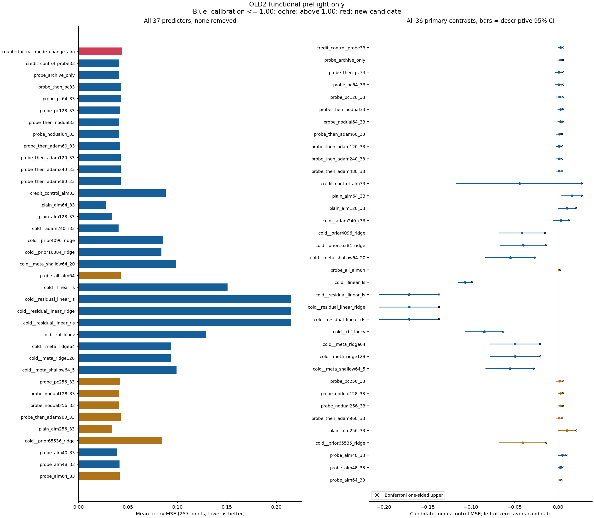
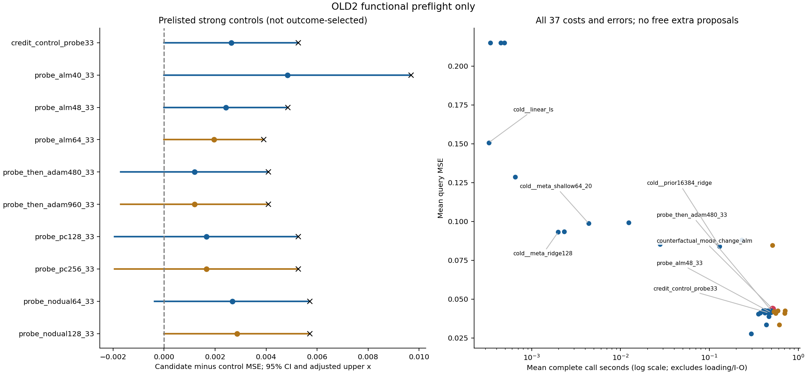

# 294｜旧两任务报告前检（非科学结果）

本表包含 2 个任务、37 个方法、144 个比较；全部预测先封存、后统一评分。
主比较校正上界为负的数量：12/36。这个数量本身不代表完成研究目标。

## 完整方法表

|方法|主 MSE257|MSE129|点估计 MSE257|点估计 MSE129|均值秒|本轮相对费用|校准相对费用|数值失败|
|---|---:|---:|---:|---:|---:|---:|---:|---:|
|counterfactual_mode_change_alm|0.0437507303|0.0436594971|0.150301793|0.149462898|0.514336|1.0000|1.0000|0|
|credit_control_probe33|0.0411182128|0.0410232001|0.150301793|0.149462898|0.464325|0.9028|0.9262|0|
|probe_archive_only|0.0410750962|0.0409806439|0.122661557|0.122446528|0.373398|0.7260|0.7661|0|
|probe_then_pc33|0.0428387271|0.042736108|0.122262822|0.121872908|0.407439|0.7922|0.8214|0|
|probe_pc64_33|0.0428387271|0.042736108|0.12226312|0.121873223|0.419285|0.8152|0.8541|0|
|probe_pc128_33|0.0420855814|0.0419845676|0.0708802133|0.0703101441|0.463006|0.9002|0.9264|0|
|probe_then_nodual33|0.0410750962|0.0409806439|0.14731958|0.146749821|0.419703|0.8160|0.8743|0|
|probe_nodual64_33|0.0410750962|0.0409806439|0.140577285|0.140141508|0.460454|0.8952|0.9389|0|
|probe_then_adam60_33|0.042213794|0.0421167667|0.137500496|0.136950541|0.405061|0.7875|0.8260|0|
|probe_then_adam120_33|0.0425546343|0.0424548623|0.139384025|0.139036561|0.447028|0.8691|0.8467|0|
|probe_then_adam240_33|0.0425546343|0.0424548623|0.139384025|0.139036561|0.458039|0.8905|0.8855|0|
|probe_then_adam480_33|0.0425546343|0.0424548623|0.139384025|0.139036561|0.499388|0.9709|0.9928|0|
|credit_control_alm33|0.0882034251|0.0877917608|0.0727437669|0.0725666776|0.232369|0.4518|0.5409|0|
|plain_alm64_33|0.0277901589|0.0277220535|0.103643167|0.103479578|0.294167|0.5719|0.7042|0|
|plain_alm128_33|0.0334556155|0.03338555|0.103651512|0.103362431|0.437243|0.8501|0.9396|0|
|cold__adam240_r33|0.040387603|0.0403104626|0.0678530076|0.0678870676|0.356978|0.6941|0.7940|0|
|cold__prior4096_ridge|0.0852542992|0.085073712|0.0852542992|0.085073712|0.027937|0.0543|0.0621|0|
|cold__prior16384_ridge|0.0839251971|0.0837426332|0.0839251971|0.0837426332|0.130268|0.2533|0.2532|0|
|cold__meta_shallow64_20|0.0987254365|0.098591256|0.0987254365|0.098591256|0.004378|0.0085|0.0092|0|
|probe_all_alm64|0.0425963717|0.0425127985|0.141948559|0.141179618|0.713568|1.3874|1.5138|0|
|cold__linear_ls|0.150734038|0.150943667|0.150734038|0.150943667|0.000329|0.0006|0.0006|0|
|cold__residual_linear_ls|0.215048422|0.214929926|0.215048422|0.214929926|0.000493|0.0010|0.0007|0|
|cold__residual_linear_ridge|0.215050183|0.214931643|0.215050183|0.214931643|0.000343|0.0007|0.0007|0|
|cold__residual_linear_rls|0.215050183|0.214931643|0.215050183|0.214931643|0.000450|0.0009|0.0007|0|
|cold__rbf_loocv|0.128738547|0.128732331|0.128738547|0.128732331|0.000651|0.0013|0.0014|0|
|cold__meta_ridge64|0.0934672246|0.0932255936|0.0934672246|0.0932255936|0.002330|0.0045|0.0038|0|
|cold__meta_ridge128|0.0931354969|0.0929394545|0.0931354969|0.0929394545|0.001988|0.0039|0.0042|0|
|cold__meta_shallow64_5|0.0991681874|0.0990686091|0.0991681874|0.0990686091|0.012367|0.0240|0.0040|0|
|probe_pc256_33|0.0420855814|0.0419845676|0.0708273371|0.0702036448|0.531527|1.0334|1.0595|0|
|probe_nodual128_33|0.0408916719|0.0407975501|0.151999679|0.151424339|0.557336|1.0836|1.1092|0|
|probe_nodual256_33|0.0408916719|0.0407975501|0.151998965|0.151438398|0.705280|1.3712|1.4500|0|
|probe_then_adam960_33|0.0425546343|0.0424548623|0.139384025|0.139036561|0.591538|1.1501|1.1674|0|
|plain_alm256_33|0.0334556155|0.03338555|0.136195756|0.135751017|0.611035|1.1880|1.2968|0|
|cold__prior65536_ridge|0.0845805742|0.0843929148|0.0845805742|0.0843929148|0.512275|0.9960|1.2284|0|
|probe_alm40_33|0.038908732|0.0388227738|0.149851432|0.14891108|0.469074|0.9120|0.9657|0|
|probe_alm48_33|0.0413260312|0.0412410778|0.101572952|0.101025812|0.492812|0.9582|0.9899|0|
|probe_alm64_33|0.0417965004|0.0417100404|0.101572952|0.101025812|0.530446|1.0313|1.0483|0|

## 全部比较（候选减控制）

负差值有利于新候选。95% 区间是描述性的；校正单侧上界仅用于事先固定的 36 个主指标比较。任务是重抽单位，不把查询点当作独立样本。

|控制|指标|均值差|描述性 95% 下界|上界|校正单侧上界|改善/相同/更差任务|
|---|---|---:|---:|---:|---:|---|
|credit_control_probe33|mse257|0.0026325175|0|0.00526503499|0.00526503499|0/1/1|
|credit_control_probe33|mse129|0.00263629703|0|0.00527259406|—|0/1/1|
|credit_control_probe33|point_mse257|0|0|0|—|0/2/0|
|credit_control_probe33|point_mse129|0|0|0|—|0/2/0|
|probe_archive_only|mse257|0.00267563411|-0.000366848744|0.00571811696|0.00571811696|1/0/1|
|probe_archive_only|mse129|0.00267885323|-0.000366187603|0.00572389407|—|1/0/1|
|probe_archive_only|point_mse257|0.0276402366|-0.00559484099|0.0608753142|—|1/0/1|
|probe_archive_only|point_mse129|0.0270163701|-0.00618044097|0.0602131812|—|1/0/1|
|probe_then_pc33|mse257|0.000912003272|-0.00344102845|0.00526503499|0.00526503499|1/0/1|
|probe_then_pc33|mse129|0.000923389159|-0.00342581574|0.00527259406|—|1/0/1|
|probe_then_pc33|point_mse257|0.028038971|-0.00482255922|0.0609005013|—|1/0/1|
|probe_then_pc33|point_mse129|0.0275899898|-0.00504939219|0.0602293719|—|1/0/1|
|probe_pc64_33|mse257|0.000912003272|-0.00344102845|0.00526503499|0.00526503499|1/0/1|
|probe_pc64_33|mse129|0.000923389159|-0.00342581574|0.00527259406|—|1/0/1|
|probe_pc64_33|point_mse257|0.0280386739|-0.00482255922|0.0608999069|—|1/0/1|
|probe_pc64_33|point_mse129|0.027589675|-0.00504939219|0.0602287421|—|1/0/1|
|probe_pc128_33|mse257|0.00166514891|-0.00193473717|0.00526503499|0.00526503499|1/0/1|
|probe_pc128_33|mse129|0.00167492956|-0.00192273493|0.00527259406|—|1/0/1|
|probe_pc128_33|point_mse257|0.0794215802|0.00144247061|0.15740069|—|0/0/2|
|probe_pc128_33|point_mse129|0.0791527541|0.00178640954|0.156519099|—|0/0/2|
|probe_then_nodual33|mse257|0.00267563411|-0.000366848744|0.00571811696|0.00571811696|1/0/1|
|probe_then_nodual33|mse129|0.00267885323|-0.000366187603|0.00572389407|—|1/0/1|
|probe_then_nodual33|point_mse257|0.0029822131|-0.00422473923|0.0101891654|—|1/0/1|
|probe_then_nodual33|point_mse129|0.00271307762|-0.00454010723|0.00996626247|—|1/0/1|
|probe_nodual64_33|mse257|0.00267563411|-0.000366848744|0.00571811696|0.00571811696|1/0/1|
|probe_nodual64_33|mse129|0.00267885323|-0.000366187603|0.00572389407|—|1/0/1|
|probe_nodual64_33|point_mse257|0.0097245088|-0.00352936211|0.0229783797|—|1/0/1|
|probe_nodual64_33|point_mse129|0.00932139008|-0.00394430104|0.0225870812|—|1/0/1|
|probe_then_adam60_33|mse257|0.00153693637|-0.00169436726|0.00476824|0.00476824|1/0/1|
|probe_then_adam60_33|mse129|0.00154273041|-0.00169026043|0.00477572124|—|1/0/1|
|probe_then_adam60_33|point_mse257|0.012801298|-0.00683108277|0.0324336787|—|1/0/1|
|probe_then_adam60_33|point_mse129|0.0125123573|-0.00693132284|0.0319560373|—|1/0/1|
|probe_then_adam120_33|mse257|0.00119609599|-0.00169436726|0.00408655925|0.00408655925|1/0/1|
|probe_then_adam120_33|mse129|0.00120463484|-0.00169026043|0.0040995301|—|1/0/1|
|probe_then_adam120_33|point_mse257|0.0109177686|-0.00298165466|0.0248171918|—|1/0/1|
|probe_then_adam120_33|point_mse129|0.010426337|-0.0032553849|0.0241080588|—|1/0/1|
|probe_then_adam240_33|mse257|0.00119609599|-0.00169436726|0.00408655925|0.00408655925|1/0/1|
|probe_then_adam240_33|mse129|0.00120463484|-0.00169026043|0.0040995301|—|1/0/1|
|probe_then_adam240_33|point_mse257|0.0109177686|-0.00298165466|0.0248171918|—|1/0/1|
|probe_then_adam240_33|point_mse129|0.010426337|-0.0032553849|0.0241080588|—|1/0/1|
|probe_then_adam480_33|mse257|0.00119609599|-0.00169436726|0.00408655925|0.00408655925|1/0/1|
|probe_then_adam480_33|mse129|0.00120463484|-0.00169026043|0.0040995301|—|1/0/1|
|probe_then_adam480_33|point_mse257|0.0109177686|-0.00298165466|0.0248171918|—|1/0/1|
|probe_then_adam480_33|point_mse129|0.010426337|-0.0032553849|0.0241080588|—|1/0/1|
|credit_control_alm33|mse257|-0.0444526948|-0.116685617|0.0277802278|0.0277802278|1/0/1|
|credit_control_alm33|mse129|-0.0441322636|-0.115992303|0.0277277758|—|1/0/1|
|credit_control_alm33|point_mse257|0.0775580266|-0.00324005434|0.158356107|—|1/0/1|
|credit_control_alm33|point_mse129|0.0768962206|-0.00380422476|0.157596666|—|1/0/1|
|plain_alm64_33|mse257|0.0159605714|0.00414091501|0.0277802278|0.0277802278|0/0/2|
|plain_alm64_33|mse129|0.0159374436|0.00414711136|0.0277277758|—|0/0/2|
|plain_alm64_33|point_mse257|0.0466586261|-0.00324005434|0.0965573066|—|1/0/1|
|plain_alm64_33|point_mse129|0.0459833197|-0.00380422476|0.0957708642|—|1/0/1|
|plain_alm128_33|mse257|0.0102951149|0.000125151224|0.0204650785|0.0204650785|0/0/2|
|plain_alm128_33|mse129|0.0102739471|0.000116311303|0.0204315829|—|0/0/2|
|plain_alm128_33|point_mse257|0.0466502813|-0.00306630449|0.0963668671|—|1/0/1|
|plain_alm128_33|point_mse129|0.0461004667|-0.00337676409|0.0955776974|—|1/0/1|
|cold__adam240_r33|mse257|0.00336312735|-0.00587382117|0.0126000759|0.0126000759|1/0/1|
|cold__adam240_r33|mse129|0.00334903454|-0.00586960209|0.0125676712|—|1/0/1|
|cold__adam240_r33|point_mse257|0.0824487859|0.0469432596|0.117954312|—|0/0/2|
|cold__adam240_r33|point_mse129|0.0815758306|0.0461591838|0.116992477|—|0/0/2|
|cold__prior4096_ridge|mse257|-0.0415035689|-0.0680568753|-0.0149502625|-0.0149502625|2/0/0|
|cold__prior4096_ridge|mse129|-0.0414142149|-0.0679935292|-0.0148349005|—|2/0/0|
|cold__prior4096_ridge|point_mse257|0.0650474943|0.0481376725|0.081957316|—|0/0/2|
|cold__prior4096_ridge|point_mse129|0.0643891861|0.0473637873|0.081414585|—|0/0/2|
|cold__prior16384_ridge|mse257|-0.0401744667|-0.0669390191|-0.0134099144|-0.0134099144|2/0/0|
|cold__prior16384_ridge|mse129|-0.040083136|-0.0668650107|-0.0133012614|—|2/0/0|
|cold__prior16384_ridge|point_mse257|0.0663765964|0.0492555287|0.0834976641|—|0/0/2|
|cold__prior16384_ridge|point_mse129|0.065720265|0.0484923058|0.0829482242|—|0/0/2|
|cold__meta_shallow64_20|mse257|-0.0549747061|-0.0835000632|-0.026449349|-0.026449349|2/0/0|
|cold__meta_shallow64_20|mse129|-0.0549317589|-0.083528845|-0.0263346728|—|2/0/0|
|cold__meta_shallow64_20|point_mse257|0.051576357|0.0326944845|0.0704582295|—|0/0/2|
|cold__meta_shallow64_20|point_mse129|0.0508716421|0.0318284715|0.0699148127|—|0/0/2|
|probe_all_alm64|mse257|0.00115435867|0.000482363415|0.00182635392|0.00182635392|0/0/2|
|probe_all_alm64|mse129|0.00114669869|0.000476280143|0.00181711723|—|0/0/2|
|probe_all_alm64|point_mse257|0.00835323449|0.000793265127|0.0159132039|—|0/0/2|
|probe_all_alm64|point_mse129|0.00828327978|0.000997902338|0.0155686572|—|0/0/2|
|cold__linear_ls|mse257|-0.106983308|-0.115154766|-0.0988118505|-0.0988118505|2/0/0|
|cold__linear_ls|mse129|-0.107284169|-0.1154972|-0.0990711387|—|2/0/0|
|cold__linear_ls|point_mse257|-0.000432244954|-0.00190427192|0.00103978201|—|1/0/1|
|cold__linear_ls|point_mse129|-0.00148076845|-0.00282165318|-0.000139883726|—|2/0/0|
|cold__residual_linear_ls|mse257|-0.171297692|-0.205763857|-0.136831527|-0.136831527|2/0/0|
|cold__residual_linear_ls|mse129|-0.171270429|-0.206131981|-0.136408877|—|2/0/0|
|cold__residual_linear_ls|point_mse257|-0.0647466287|-0.0895693087|-0.0399239486|—|2/0/0|
|cold__residual_linear_ls|point_mse129|-0.065467028|-0.0907746643|-0.0401593917|—|2/0/0|
|cold__residual_linear_ridge|mse257|-0.171299453|-0.205768536|-0.13683037|-0.13683037|2/0/0|
|cold__residual_linear_ridge|mse129|-0.171272146|-0.206136661|-0.13640763|—|2/0/0|
|cold__residual_linear_ridge|point_mse257|-0.0647483899|-0.0895739886|-0.0399227912|—|2/0/0|
|cold__residual_linear_ridge|point_mse129|-0.0654687448|-0.0907793446|-0.0401581449|—|2/0/0|
|cold__residual_linear_rls|mse257|-0.171299453|-0.205768536|-0.13683037|-0.13683037|2/0/0|
|cold__residual_linear_rls|mse129|-0.171272146|-0.206136661|-0.13640763|—|2/0/0|
|cold__residual_linear_rls|point_mse257|-0.0647483899|-0.0895739886|-0.0399227912|—|2/0/0|
|cold__residual_linear_rls|point_mse129|-0.0654687448|-0.0907793446|-0.0401581449|—|2/0/0|
|cold__rbf_loocv|mse257|-0.0849878167|-0.106488476|-0.0634871576|-0.0634871576|2/0/0|
|cold__rbf_loocv|mse129|-0.0850728341|-0.106882183|-0.0632634857|—|2/0/0|
|cold__rbf_loocv|point_mse257|0.0215632465|0.00970607204|0.033420421|—|0/0/2|
|cold__rbf_loocv|point_mse129|0.0207305669|0.00847513395|0.0329859999|—|0/0/2|
|cold__meta_ridge64|mse257|-0.0497164943|-0.0784911828|-0.0209418058|-0.0209418058|2/0/0|
|cold__meta_ridge64|mse129|-0.0495660964|-0.0783342867|-0.0207979062|—|2/0/0|
|cold__meta_ridge64|point_mse257|0.0568345688|0.0377033649|0.0759657728|—|0/0/2|
|cold__meta_ridge64|point_mse129|0.0562373046|0.0370230298|0.0754515793|—|0/0/2|
|cold__meta_ridge128|mse257|-0.0493847665|-0.0778607873|-0.0209087458|-0.0209087458|2/0/0|
|cold__meta_ridge128|mse129|-0.0492799574|-0.0778067588|-0.0207531559|—|2/0/0|
|cold__meta_ridge128|point_mse257|0.0571662966|0.0383337605|0.0759988327|—|0/0/2|
|cold__meta_ridge128|point_mse129|0.0565234437|0.0375505577|0.0754963296|—|0/0/2|
|cold__meta_shallow64_5|mse257|-0.0554174571|-0.0831983561|-0.027636558|-0.027636558|2/0/0|
|cold__meta_shallow64_5|mse129|-0.055409112|-0.0833050505|-0.0275131735|—|2/0/0|
|cold__meta_shallow64_5|point_mse257|0.0511336061|0.0329961916|0.0692710205|—|0/0/2|
|cold__meta_shallow64_5|point_mse129|0.050394289|0.032052266|0.0687363121|—|0/0/2|
|probe_pc256_33|mse257|0.00166514891|-0.00193473717|0.00526503499|0.00526503499|1/0/1|
|probe_pc256_33|mse129|0.00167492956|-0.00192273493|0.00527259406|—|1/0/1|
|probe_pc256_33|point_mse257|0.0794744564|0.00154822305|0.15740069|—|0/0/2|
|probe_pc256_33|point_mse129|0.0792592534|0.00199940817|0.156519099|—|0/0/2|
|probe_nodual128_33|mse257|0.00285905848|0|0.00571811696|0.00571811696|0/1/1|
|probe_nodual128_33|mse129|0.00286194704|0|0.00572389407|—|0/1/1|
|probe_nodual128_33|point_mse257|-0.00169788547|-0.00323658775|-0.000159183187|—|2/0/0|
|probe_nodual128_33|point_mse129|-0.00196144097|-0.00375688372|-0.000165998224|—|2/0/0|
|probe_nodual256_33|mse257|0.00285905848|0|0.00571811696|0.00571811696|0/1/1|
|probe_nodual256_33|mse129|0.00286194704|0|0.00572389407|—|0/1/1|
|probe_nodual256_33|point_mse257|-0.00169717201|-0.00323516084|-0.000159183187|—|2/0/0|
|probe_nodual256_33|point_mse129|-0.00197549993|-0.00378500163|-0.000165998224|—|2/0/0|
|probe_then_adam960_33|mse257|0.00119609599|-0.00169436726|0.00408655925|0.00408655925|1/0/1|
|probe_then_adam960_33|mse129|0.00120463484|-0.00169026043|0.0040995301|—|1/0/1|
|probe_then_adam960_33|point_mse257|0.0109177686|-0.00298165466|0.0248171918|—|1/0/1|
|probe_then_adam960_33|point_mse129|0.010426337|-0.0032553849|0.0241080588|—|1/0/1|
|plain_alm256_33|mse257|0.0102951149|0.000125151224|0.0204650785|0.0204650785|0/0/2|
|plain_alm256_33|mse129|0.0102739471|0.000116311303|0.0204315829|—|0/0/2|
|plain_alm256_33|point_mse257|0.0141060375|-0.00306630449|0.0312783796|—|1/0/1|
|plain_alm256_33|point_mse129|0.013711881|-0.00337676409|0.0308005262|—|1/0/1|
|cold__prior65536_ridge|mse257|-0.0408298438|-0.0676313137|-0.014028374|-0.014028374|2/0/0|
|cold__prior65536_ridge|mse129|-0.0407334177|-0.0675513364|-0.0139154989|—|2/0/0|
|cold__prior65536_ridge|point_mse257|0.0657212193|0.048563234|0.0828792046|—|0/0/2|
|cold__prior65536_ridge|point_mse129|0.0650699834|0.0478059801|0.0823339866|—|0/0/2|
|probe_alm40_33|mse257|0.0048419983|0|0.00968399661|0.00968399661|0/1/1|
|probe_alm40_33|mse129|0.00483672331|0|0.00967344662|—|0/1/1|
|probe_alm40_33|point_mse257|0.00045036175|0|0.000900723499|—|0/1/1|
|probe_alm40_33|point_mse129|0.000551817967|0|0.00110363593|—|0/1/1|
|probe_alm48_33|mse257|0.00242469911|0|0.00484939822|0.00484939822|0/1/1|
|probe_alm48_33|mse129|0.00241841936|0|0.00483683872|—|0/1/1|
|probe_alm48_33|point_mse257|0.0487288416|0.000900723499|0.0965569596|—|0/0/2|
|probe_alm48_33|point_mse129|0.0484370866|0.00110363593|0.0957705373|—|0/0/2|
|probe_alm64_33|mse257|0.00195422997|0|0.00390845994|0.00390845994|0/1/1|
|probe_alm64_33|mse129|0.00194945679|0|0.00389891358|—|0/1/1|
|probe_alm64_33|point_mse257|0.0487288416|0.000900723499|0.0965569596|—|0/0/2|
|probe_alm64_33|point_mse129|0.0484370866|0.00110363593|0.0957705373|—|0/0/2|

## 范围与证据

这是旧两任务的报告功能前检，不产生新任务科学结论。
资源校准和本轮费用都列出；快控制仍可能有可利用的预算余量。两任务 tracemalloc 观测不是每方法精确原生内存上界。统计区间采用近似百分位 bootstrap，不是有限样本保证。
独立标量风险最大差 5.55111512e-17；全部 2,880,000 个重抽均值的直接索引复核最大差 0。
评分摘要 SHA256：`403780064629474b54cea474e6db559c9931a8389ed5fde7aa060e45a3881bdc`；预测摘要 SHA256：`25d48dc78f6872edabc64c2baa8cf6337b9c1bc725ce796494b31788e3c1633f`。
报告图文仍需实际视觉检查；脚本成功不自动代表图表无重叠。
