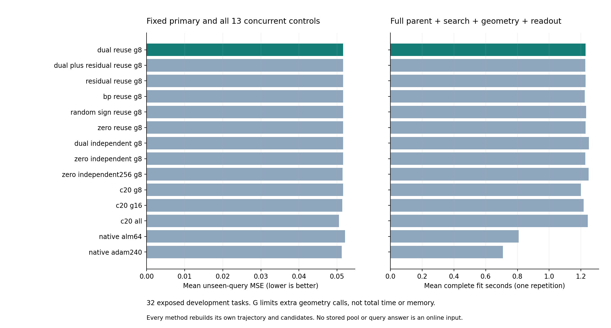

# 359｜从跨区域证书到有限求解预算：真实在线结果

主候选MSE257 **0.0515808997**；相对不传播同初始化 **+0.0000000000**，相对同增强zero **+0.0000000000**，相对同期Adam240 **+0.0003309861**。负值表示主方法更低。

本轮448次新的完整fit，151种方法、4832个预测器；执行失败0。主配置在评分前固定，不根据其它信用或预算更优而换主。这是32任务开发结果，不是新任务确认或完整论文结论。

## 数学机制：安全信用传播与有限预算搜索

对固定观测和区域R，D_R(a)=min_(y∈Y_R)aᵀr(y)>0是严格不可行证书。357允许局部自由信用在区域内更新，把新获证书的方向用于其它区域重新计算D。源区域的数值不直接搬给目标区域；所有排除都精确复核。每8次检查传播新方向、每任务最多16个，局部上限128。

传播不改变尚未排除区域的本地更新，因此不传播算法在任意时刻能够排除的区域，传播算法也已排除或会在原时刻排除。这是覆盖包含保证，不是ALM独有定理。相同有序池取前G个未排除区域时，可以把几何预算让给更后面的候选，但更多有效区域并不保证有限粒子查询风险下降。

```text
本次观察 x/v → 本次629起点母轨迹 → 当前已访问F（原有效池保留）
                     ↓
必要单观察语言乘积 → 排除F → C5/C20 → 区域内自由信用
                                         ↕ 新方向传播到其它区域
                                  取前G=8个未排除模式
                                         ↓
                     实际全局几何（公开计费）→ 2048粒子 → 未见查询
```

## 组件结果：传播确实产生新证书

必要语言共277,604个模式，经排除本次已访问模式和区间收缩后剩601个。共同几何核验为548不可行、47正体积、6零体积或未判空；没有把这些分类输入局部候选。

| 初始化 | 不传播排除 | 传播排除 | 净新增 | 传播命中 | 不传播响应对 | 传播总响应对 | 不传播组件秒 | 传播组件秒 |
| --- | --- | --- | --- | --- | --- | --- | --- | --- |
| dual | 114 | 133 | 19 | 41 | 73460 | 74882 | 1.101280 | 1.104734 |
| dual_plus_residual | 118 | 135 | 17 | 41 | 73559 | 75111 | 1.087617 | 1.147245 |
| residual | 116 | 131 | 15 | 36 | 73623 | 75168 | 1.110969 | 1.115755 |
| bp | 128 | 138 | 10 | 33 | 73723 | 75371 | 1.095509 | 1.157728 |
| random_sign | 117 | 127 | 10 | 35 | 73683 | 75126 | 1.096471 | 1.129562 |
| zero | 127 | 135 | 8 | 31 | 73578 | 75280 | 1.105794 | 1.132870 |


主dual新增19个严格排除，其中41个区域由跨区域证书命中；41与19不同，因为部分命中只提前替代了本地原本也会获得的证书。总响应量仍增加，不能只按减少的局部响应量宣称加速。zero256不传播排除231个、组件2.127790秒；额外普通迭代也是必须保留的竞争路线。

## 14种方法的同期真实在线结果

| 方法 | MSE257 | 完整均秒 | 失败 | 额外几何调用总数 | 主−该方法 | 主改善/同/变差 |
| --- | --- | --- | --- | --- | --- | --- |
| cross_dual_reuse_g8 | 0.0515808997 | 1.228595 | 0 | 198 | — | — |
| cross_dual_plus_residual_reuse_g8 | 0.0515808997 | 1.226779 | 0 | 202 | +0.0000000000 | 0/32/0 |
| cross_residual_reuse_g8 | 0.0515808997 | 1.228708 | 0 | 201 | +0.0000000000 | 0/32/0 |
| cross_bp_reuse_g8 | 0.0515808997 | 1.223436 | 0 | 200 | +0.0000000000 | 0/32/0 |
| cross_random_sign_reuse_g8 | 0.0515808997 | 1.232821 | 0 | 202 | +0.0000000000 | 0/32/0 |
| cross_zero_reuse_g8 | 0.0515808997 | 1.228623 | 0 | 202 | +0.0000000000 | 0/32/0 |
| cross_dual_independent_g8 | 0.0515808997 | 1.250001 | 0 | 205 | +0.0000000000 | 0/32/0 |
| cross_zero_independent_g8 | 0.0515808997 | 1.227073 | 0 | 203 | +0.0000000000 | 0/32/0 |
| cross_zero_independent256_g8 | 0.0514510398 | 1.248785 | 0 | 178 | +0.0001298599 | 1/30/1 |
| cross_c20_g8 | 0.0515808997 | 1.199275 | 0 | 227 | +0.0000000000 | 0/32/0 |
| cross_c20_g16 | 0.0513881860 | 1.217807 | 0 | 370 | +0.0001927137 | 0/29/3 |
| cross_c20_all | 0.0504878776 | 1.243853 | 0 | 601 | +0.0010930221 | 3/21/8 |
| cross_native_alm64 | 0.0521223412 | 0.807023 | 0 | — | -0.0005414415 | 7/20/5 |
| cross_native_adam240 | 0.0512499136 | 0.708012 | 0 | — | +0.0003309861 | 7/14/11 |




所有新方法实际重新计算母轨迹、触发、必要语言、筛选、几何、采样和读出，不免费加载357的候选池或信用。G=8是区域几何调用预算，不是总墙钟或总状态预算；C20的G=16/完整池、zero256和同期Adam是明确增强的强对照。每任务一次随机交错计时，无重复置信或进程峰值匹配结论。

### 本轮改善的明确归因

六种128步传播、dual/zero不传播，与无信用C20-G8对照，均在全部32任务得到完全相同的正区域池、粒子、分配和预测；额外逐位核验768个数组、256个池通过。因此，相对旧版的预测改善已由新的无信用候选流程复现，不能归因于PC-ALM或传播。

主信用方法比C20-G8少做29次额外几何调用，但本次完整均时1.228595秒，C20-G8为1.199275秒；没有建立净提速。传播相对主不传播又省7次几何调用，但单次计时波动不能当作稳定速度优势。

C20完整剩余池得到更低的0.0504878776 MSE，但这是预列强控制，不将其事后替换为主方法或归入PC贡献。下一步必须针对决定查询质量的候选覆盖和总成本提出新机制，不能继续把远离有限预算前缀的新增证书数量当作核心收益。

## 原有强优化器和回归对照仍保留

| 旧冻结对照 | MSE257 | 主−对照 | 主改善/同/变差 | 最差留一均差 |
| --- | --- | --- | --- | --- |
| unvisited_dual | 0.0521723419 | -0.0005914422 | 7/20/5 | -0.0002040582 |
| unvisited_zero | 0.0521210081 | -0.0005401084 | 7/20/5 | -0.0001510684 |
| strong_native_alm128 | 0.0518687182 | -0.0002878185 | 7/19/6 | +0.0001093599 |
| strong_native_alm256 | 0.0519447058 | -0.0003638061 | 7/19/6 | +0.0000309211 |
| strong_native_pc64 | 0.0525001970 | -0.0009192973 | 11/12/9 | +0.0003833278 |
| strong_native_pc256 | 0.0526769038 | -0.0010960041 | 11/12/9 | +0.0002009208 |
| strong_native_nodual256 | 0.0535287715 | -0.0019478718 | 12/7/13 | -0.0012270976 |
| strong_native_adam3840 | 0.0511755030 | +0.0004053967 | 7/14/11 | +0.0008249369 |
| cold__prior16384_ridge | 0.0665166556 | -0.0149357559 | 25/0/7 | -0.0129659582 |
| cold__meta_ridge128 | 0.0681715217 | -0.0165906220 | 25/0/7 | -0.0147377500 |
| cold__meta_shallow64_20 | 0.0901028063 | -0.0385219066 | 31/0/1 | -0.0370032078 |


相对旧unvisited_dual，本轮主均差-0.0005914422，改善/相同/变差7/20/5。收益可能来自更完整的必要语言池、区间收缩、固定几何预算下的安全删空或信用传播；必须用同增强控制分开归因，不能统称PC-ALM作用。

全部151方法、四指标和8,400条配对描述性比较均保留在评分文件。旧方法没有本轮计时，不能拼接历史时间给出同期速度排名。当前暴露任务的留一检查不是显著性证明；核/回归类比较不是排除任意闭式解。

## 审计、失败和边界

独立重算19,328个风险字段和8,400条比较；最大标量差1.11e-16。另核验1,271个局部/传播信用证书、11,424个几何证书，以及原轨迹、原有效池保留、支持粒子和有序前缀包含。

357首批随机小预检没有覆盖传播路径，因覆盖断言失败保留原测试；补充早已使用的5900001合成原语后通过，算法和正式任务预算没有修改。358首任务14种预检全部通过后才进入32任务；全部预测封存后才读取查询答案。

本项目仍未完成官方TTT-MLP、LLM/VLM或其它真实下游验证。阶段性查询结果、覆盖定理与最终独立优势是不同要求；核心目标仅在同增强非乘子/强BP、强回归、资源与新任务证据同时支持时才能完成。

[357数学协议](../../../outputs/ttt-pc-alm-research/357_cross_region_credit_protocol_v1.md) · [358冻结在线协议](../../../outputs/ttt-pc-alm-research/358_cross_region_online_protocol_v1.md) · [全部151方法](../development_evaluation_v1/methods.json) · [全部配对比较](../development_evaluation_v1/comparisons.json) · [独立审计](../development_audit_v1/summary.json)
