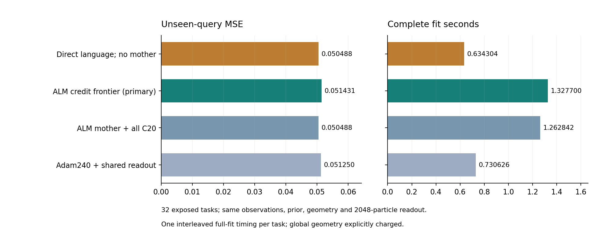

# 366｜把母轨迹也移除：完整候选推断的强对照

去掉全部母轨迹的直接必要语言基线：MSE **0.0504878776**，完整平均 **0.634304 秒/任务**。母轨迹加全池：MSE 0.0504878776、1.262842 秒；研究主配置：MSE 0.0514310967、1.327700 秒。

本轮共128次正式完整fit，另4次预检，执行失败0。32任务此前已经暴露；预测全部封存后才评分。本页不是一次新的512任务确认，也不把这个直接推断基线改名为PC-ALM。

## 1. 为什么这项控制必须补

之前的残差/零信用对照共享ALM生成的629路母轨迹，只能说明新增信用不必要。现在直接从支持观察出发：单观测可行路径的笛卡尔积→C5/C20区间收缩→逐区域联合几何→同一体积加权粒子读出。Local、branch_probe、母fit及BP入口在直接法中全部禁止；联合几何LP明确使用并计入时间。

```text
相同4个支持观测 + 相同先验/噪声范围
  ├─ ALM母轨迹 → 有限信用筛选 ─┐
  ├─ ALM母轨迹 → 剩余全池 ────┤
  ├─ Adam母轨迹 ──────────────┤→ 联合几何 → 同一2048粒子读出 → 未见查询
  └─ 必要语言全池（无母轨迹）──┘
```

## 2. 数学上检验的是哪个瓶颈

记第i个观察允许的单观测路径集合为$L_i$。每个联合支持可行参数的模式都在$\prod_iL_i$内，因为联合可行必然逐观察可行。这个必要包含不需要乘子或反向梯度。直接法的候选枚举量为$\prod_i|L_i|$，而不是把模式缓存或教师参数当免费输入。

这是关于候选覆盖的包含关系，不是精确Bayes计算的实现保证。保守收缩、浮点几何、体积、零体积边界与粒子读出仍各有条件；报告保留几何分类与精确证书。模式一致也不自动保证粒子逐位一致。

## 3. 全部同期完整成本和查询结果

| 方法 | MSE257 | 完整均秒 | 失败 | 主−该方法 | 主改善/同/差 |
| --- | --- | --- | --- | --- | --- |
| direct_language_all | 0.0504878776 | 0.634304 | 0 | +0.0009432190 | 2/24/6 |
| frontier_dual_frontier_g8 | 0.0514310967 | 1.327700 | 0 | — | — |
| frontier_c20_all | 0.0504878776 | 1.262842 | 0 | +0.0009432190 | 2/24/6 |
| frontier_native_adam240 | 0.0512499136 | 0.730626 | 0 | +0.0001811831 | 7/16/9 |




直接法相对母轨迹全池：均差+0.0000000000，改善/同/差0/32/0。所有48项有向配对比较和四指标均保留，不按查询结果改预算或挑任务。

直接法共枚举277,604个单观测语言积候选，收缩后2,409个进入几何分类。直接法独有正体积模式0个任务—模式对；母全池独有0个。与母全池预测逐位相同32/32，最大逐查询绝对差0。

这里比较的是相同观察信息和明确测量的完整成本，不是严格相同FLOPs或峰值内存。直接法返回数组/几何数组字节和建池/几何时间见逐任务机制表；这些只是命名数组subtotal，未测进程峰值，不能作全面省内存结论。

## 4. 这怎样影响论文主张

如果移除母轨迹仍得到相同或更低误差，就不能再以这批四参数、四观察任务证明ALM母轨迹必要；也不能把更好的直接法作为PC-ALM新方法。已有严格乘子逃逸见证仍成立，但它回答的是特定优化状态如何逃逸，不是任意推断算法必须使用乘子。

若要继续证明乘子有独立任务价值，靶点应是实际受预算限制的发现过程：在必要语言完整展开不可承受时，历史约束信用能否比残差、随机、零信用和同参数强优化器更可靠地找到影响预测的区域。必须先限定任务族、候选/状态预算和查询风险条件，再做新冻结测试；不能从指数枚举量直接推出ALM会胜。

这项研究目标尚未完成。本实验不宣称任意闭式解/任意浅层网络都不如PC-ALM，也没有新增官方TTT-MLP、LLM/VLM或真实下游结果。

## 5. 核验与复核入口

独立标量前向核验512项风险，最大差5.55e-17；核验11,434个几何证书、262,144个支持粒子，32次直接读出独立重算最大差1.44e-15。原控制1728个数组逐位重放，首任务65个数组预检复现。

[执行前协议](../../../outputs/ttt-pc-alm-research/365_direct_language_protocol_v1.md) · [全部方法](../development_evaluation_v1/methods.json) · [配对结果](../development_evaluation_v1/comparisons.json) · [逐任务机制](../development_evaluation_v1/mechanisms.json) · [审计](../development_evaluation_v1/summary.json)
