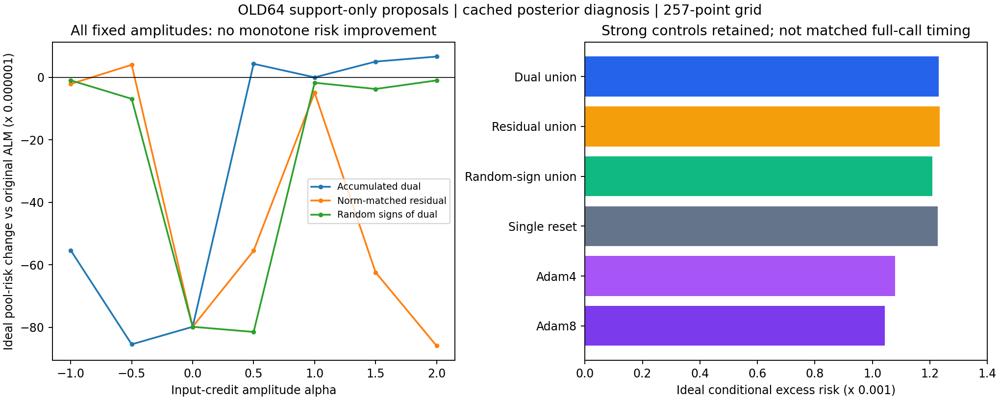

# 298｜乘子幅度路径：数学核验与全量开发结果

64个旧开发任务，24个新幅度/并集配置，加上20个短续接对照、原ALM和mode-change池，共46配置。所有支持侧提议封存后才读取离线后验参照；没有读取真实教师或查询答案。

## 结论及下一步

单分支区间内的仿射局部更新结构得到核验，但本轮原乘子方向没有显示独立的搜索优势。三个七幅度并集的理想条件超额风险：dual .00123007003、等范数残差 .00123380532、随机符号 .00120842002；Adam4/8为 .00107828275/.00104292517。它们不是等完整时间比较，不能据此宣称速度胜负，也不能只挑dual的某个幅度宣称成功。

幅度缩放与最终查询性能之间没有单调性：覆盖质量提高仍可能增大函数均值偏差。接下来检查触发是否遗漏原参数/模式停滞而约束仍不满足的阶段，而不是增加粒子数或继续盲目加长续接。

## 数学核验的真实覆盖

每任务固定取首个触发状态，共64状态，其中13个具有非零乘子。α中心0/.5/1的192个±1e-7窗口内部选择签名均未改变；公式斜率的最大仿射残差为2.462e-16。零乘子窗口是平凡恒定情形，不能将全部192项都称作非平凡信用传播验证。

标量独立枚举未复用生产bias_solve累积系数，b/h最大差1.11e-16。宽区间[-1,0,1]有13个跨内部选择的非仿射示例，最大中点差0.3874844；这是局部公式不能跨分支外推的具体检查。

2427触发状态中109个u=0，r=0状态0个。归一化误差2.22e-16。所有256组α=0/1端点逐位恒等式通过；旧297的20方法风险重放最大差为0。

数学适用范围：当前固定分段线性激活的偏置模型、相同局部获胜分支和截断状态；有限分段仿射允许切换和跳跃。不代表全局光滑、收敛、查询改善或一般GELU MLP。

## 完整结果：46方法×2网格

a0…a6依次表示α=-1,-.5,0,.5,1,1.5,2；union为七个幅度的全部提议并集。两对批次差不是任务采样置信区间。状态步不等于完整墙钟资源。

| 方法 | 网格 | 理想超额风险 | 相对原池差 | 对(0,1)差 | 对(2,3)差 | 覆盖 | 状态步/任务 | 新正区域/任务数 |
|---|---:|---:|---:|---:|---:|---:|---:|---|
| dual_a0 | 257 | 0.00125138196955 | -5.53416590996e-05 | -5.5478891439e-05 | -5.52044267601e-05 | 0.8707910789 | 37.92188 | 5 / 5 |
| dual_a0 | 129 | 0.00124876104982 | -5.510302864e-05 | -5.52406072197e-05 | -5.49654500602e-05 | 0.8707910789 | 37.92188 | 5 / 5 |
| dual_a1 | 257 | 0.00122128508713 | -8.54385415228e-05 | -8.59970005472e-05 | -8.48800824984e-05 | 0.8747871527 | 37.92188 | 7 / 7 |
| dual_a1 | 129 | 0.00121874260642 | -8.51214720345e-05 | -8.56818188832e-05 | -8.45611251858e-05 | 0.8747871527 | 37.92188 | 7 / 7 |
| dual_a2 | 257 | 0.00122690970682 | -7.98139218298e-05 | -8.03758607082e-05 | -7.92519829515e-05 | 0.8738095048 | 37.92188 | 5 / 5 |
| dual_a2 | 129 | 0.0012243115744 | -7.95525040531e-05 | -8.01161974157e-05 | -7.89888106904e-05 | 0.8738095048 | 37.92188 | 5 / 5 |
| dual_a3 | 257 | 0.00131104751007 | 4.32388141906e-06 | 4.43130420173e-06 | 4.2164586364e-06 | 0.8693705596 | 37.92188 | 7 / 4 |
| dual_a3 | 129 | 0.0013084102152 | 4.54613674455e-06 | 4.65372201794e-06 | 4.43855147116e-06 | 0.8693705596 | 37.92188 | 7 / 4 |
| dual_a4 | 257 | 0.00130672362865 | 0 | 0 | 0 | 0.866279194 | 37.92188 | 0 / 0 |
| dual_a4 | 129 | 0.00130386407846 | 0 | 0 | 0 | 0.866279194 | 37.92188 | 0 / 0 |
| dual_a5 | 257 | 0.00131176407518 | 5.04044653006e-06 | 5.03368894046e-06 | 5.04720411966e-06 | 0.8691528425 | 37.92188 | 6 / 6 |
| dual_a5 | 129 | 0.00130884524659 | 4.98116813406e-06 | 4.97388422697e-06 | 4.98845204115e-06 | 0.8691528425 | 37.92188 | 6 / 6 |
| dual_a6 | 257 | 0.00131336659281 | 6.64296415491e-06 | 6.7419330642e-06 | 6.54399524561e-06 | 0.8722224551 | 37.92188 | 9 / 9 |
| dual_a6 | 129 | 0.00131071994876 | 6.85587030097e-06 | 6.954525115e-06 | 6.75721548694e-06 | 0.8722224551 | 37.92188 | 9 / 9 |
| dual_union | 257 | 0.00123007003395 | -7.66535946965e-05 | -7.71133891637e-05 | -7.61938002293e-05 | 0.8810202856 | 265.45312 | 24 / 20 |
| dual_union | 129 | 0.00122768813102 | -7.61759474375e-05 | -7.66379908871e-05 | -7.5713903988e-05 | 0.8810202856 | 265.45312 | 24 / 20 |
| residual_a0 | 257 | 0.0013046068336 | -2.11679504796e-06 | -2.10751160224e-06 | -2.12607849369e-06 | 0.8663703675 | 37.92188 | 4 / 3 |
| residual_a0 | 129 | 0.00130171802504 | -2.1460534125e-06 | -2.13657362689e-06 | -2.15553319812e-06 | 0.8663703675 | 37.92188 | 4 / 3 |
| residual_a1 | 257 | 0.0013107399114 | 4.01628274937e-06 | 4.00970075706e-06 | 4.02286474168e-06 | 0.8667099732 | 37.92188 | 4 / 4 |
| residual_a1 | 129 | 0.00130796169076 | 4.09761230535e-06 | 4.09150696811e-06 | 4.10371764259e-06 | 0.8667099732 | 37.92188 | 4 / 4 |
| residual_a2 | 257 | 0.00122690970682 | -7.98139218298e-05 | -8.03758607082e-05 | -7.92519829515e-05 | 0.8738095048 | 37.92188 | 5 / 5 |
| residual_a2 | 129 | 0.0012243115744 | -7.95525040531e-05 | -8.01161974157e-05 | -7.89888106904e-05 | 0.8738095048 | 37.92188 | 5 / 5 |
| residual_a3 | 257 | 0.00125124270214 | -5.54809265071e-05 | -5.56311755633e-05 | -5.53306774509e-05 | 0.8711688569 | 37.92188 | 6 / 6 |
| residual_a3 | 129 | 0.00124860170679 | -5.52623716645e-05 | -5.54129633352e-05 | -5.51117799938e-05 | 0.8711688569 | 37.92188 | 6 / 6 |
| residual_a4 | 257 | 0.00130181343355 | -4.91019510042e-06 | -4.81139435483e-06 | -5.00899584602e-06 | 0.8715057467 | 37.92188 | 13 / 11 |
| residual_a4 | 129 | 0.00129924105869 | -4.62301976537e-06 | -4.52433360611e-06 | -4.72170592462e-06 | 0.8715057467 | 37.92188 | 13 / 11 |
| residual_a5 | 257 | 0.00124433255967 | -6.23910689799e-05 | -6.33529362684e-05 | -6.14292016914e-05 | 0.8805850898 | 37.92188 | 20 / 15 |
| residual_a5 | 129 | 0.00124183767119 | -6.2026407261e-05 | -6.29890920672e-05 | -6.10637224548e-05 | 0.8805850898 | 37.92188 | 20 / 15 |
| residual_a6 | 257 | 0.00122082095721 | -8.59026714392e-05 | -8.6365960243e-05 | -8.54393826353e-05 | 0.8786311137 | 37.92188 | 16 / 12 |
| residual_a6 | 129 | 0.00121850198911 | -8.53620893501e-05 | -8.58277723221e-05 | -8.48964063782e-05 | 0.8786311137 | 37.92188 | 16 / 12 |
| residual_union | 257 | 0.0012338053157 | -7.29183129513e-05 | -7.34906312375e-05 | -7.23459946651e-05 | 0.8864110291 | 265.45312 | 39 / 21 |
| residual_union | 129 | 0.00123147054986 | -7.23935285964e-05 | -7.29678217463e-05 | -7.18192354465e-05 | 0.8864110291 | 265.45312 | 39 / 21 |
| random_sign_a0 | 257 | 0.00130575643419 | -9.67194459245e-07 | -9.62924902412e-07 | -9.71464016078e-07 | 0.8678758621 | 37.92188 | 12 / 8 |
| random_sign_a0 | 129 | 0.00130298006447 | -8.84013983781e-07 | -8.80319401137e-07 | -8.87708566425e-07 | 0.8678758621 | 37.92188 | 12 / 8 |
| random_sign_a1 | 257 | 0.00129984812677 | -6.87550188493e-06 | -6.89630486076e-06 | -6.8546989091e-06 | 0.8686378885 | 37.92188 | 7 / 6 |
| random_sign_a1 | 129 | 0.00129697372231 | -6.8903561457e-06 | -6.91132118127e-06 | -6.86939111013e-06 | 0.8686378885 | 37.92188 | 7 / 6 |
| random_sign_a2 | 257 | 0.00122690970682 | -7.98139218298e-05 | -8.03758607082e-05 | -7.92519829515e-05 | 0.8738095048 | 37.92188 | 5 / 5 |
| random_sign_a2 | 129 | 0.0012243115744 | -7.95525040531e-05 | -8.01161974157e-05 | -7.89888106904e-05 | 0.8738095048 | 37.92188 | 5 / 5 |
| random_sign_a3 | 257 | 0.0012252586221 | -8.14650065504e-05 | -8.2020159673e-05 | -8.09098534278e-05 | 0.8739495131 | 37.92188 | 9 / 9 |
| random_sign_a3 | 129 | 0.00122268037487 | -8.11837035883e-05 | -8.1740603058e-05 | -8.06268041186e-05 | 0.8739495131 | 37.92188 | 9 / 9 |
| random_sign_a4 | 257 | 0.00130500075298 | -1.72287567341e-06 | -1.70512317953e-06 | -1.74062816728e-06 | 0.8685790275 | 37.92188 | 6 / 6 |
| random_sign_a4 | 129 | 0.00130222161733 | -1.64246112881e-06 | -1.62562397201e-06 | -1.65929828561e-06 | 0.8685790275 | 37.92188 | 6 / 6 |
| random_sign_a5 | 257 | 0.00130300126783 | -3.7223608245e-06 | -3.60546069153e-06 | -3.83926095747e-06 | 0.8736103544 | 37.92188 | 10 / 8 |
| random_sign_a5 | 129 | 0.00130042142626 | -3.44265219995e-06 | -3.32703260399e-06 | -3.5582717959e-06 | 0.8736103544 | 37.92188 | 10 / 8 |
| random_sign_a6 | 257 | 0.00130574311948 | -9.8050916916e-07 | -8.5284460263e-07 | -1.10817373569e-06 | 0.8716250992 | 37.92188 | 15 / 11 |
| random_sign_a6 | 129 | 0.00130298337836 | -8.80700100423e-07 | -7.54840862306e-07 | -1.00655933854e-06 | 0.8716250992 | 37.92188 | 15 / 11 |
| random_sign_union | 257 | 0.00120842001651 | -9.83036121418e-05 | -9.87677590526e-05 | -9.7839465231e-05 | 0.8848693328 | 265.45312 | 44 / 20 |
| random_sign_union | 129 | 0.00120586844508 | -9.79956333756e-05 | -9.84642017797e-05 | -9.75270649715e-05 | 0.8848693328 | 265.45312 | 44 / 20 |
| alm_reset_1 | 257 | 0.00122690970682 | -7.98139218298e-05 | -8.03758607082e-05 | -7.92519829515e-05 | 0.8738095048 | 37.92188 | 5 / 5 |
| alm_reset_1 | 129 | 0.0012243115744 | -7.95525040531e-05 | -8.01161974157e-05 | -7.89888106904e-05 | 0.8738095048 | 37.92188 | 5 / 5 |
| alm_reset_2 | 257 | 0.00122211234946 | -8.46112791872e-05 | -8.5170516554e-05 | -8.40520418205e-05 | 0.8749982804 | 75.84375 | 9 / 9 |
| alm_reset_2 | 129 | 0.00121953676638 | -8.43273120798e-05 | -8.48883101487e-05 | -8.37663140108e-05 | 0.8749982804 | 75.84375 | 9 / 9 |
| alm_reset_4 | 257 | 0.00122558240897 | -8.11412196826e-05 | -8.17465856686e-05 | -8.05358536966e-05 | 0.8798461783 | 151.68750 | 18 / 13 |
| alm_reset_4 | 129 | 0.00122300246161 | -8.08616168443e-05 | -8.14686689526e-05 | -8.02545647359e-05 | 0.8798461783 | 151.68750 | 18 / 13 |
| alm_reset_8 | 257 | 0.00124321510835 | -6.35085203047e-05 | -6.40364488444e-05 | -6.2980591765e-05 | 0.8846098707 | 303.37500 | 28 / 16 |
| alm_reset_8 | 129 | 0.00124093531583 | -6.29287626274e-05 | -6.34578521569e-05 | -6.2399673098e-05 | 0.8846098707 | 303.37500 | 28 / 16 |
| alm_keep_1 | 257 | 0.00130672362865 | 0 | 0 | 0 | 0.866279194 | 37.92188 | 0 / 0 |
| alm_keep_1 | 129 | 0.00130386407846 | 0 | 0 | 0 | 0.866279194 | 37.92188 | 0 / 0 |
| alm_keep_2 | 257 | 0.00130375532901 | -2.968299644e-06 | -2.96204970837e-06 | -2.97454957964e-06 | 0.8674358114 | 75.84375 | 2 / 2 |
| alm_keep_2 | 129 | 0.00130090104876 | -2.96302969765e-06 | -2.95721729319e-06 | -2.96884210211e-06 | 0.8674358114 | 75.84375 | 2 / 2 |
| alm_keep_4 | 257 | 0.001303681256 | -3.04237265126e-06 | -3.03579554558e-06 | -3.04894975694e-06 | 0.8674649707 | 151.68750 | 3 / 2 |
| alm_keep_4 | 129 | 0.00130082628818 | -3.03779027116e-06 | -3.03165182649e-06 | -3.04392871583e-06 | 0.8674649707 | 151.68750 | 3 / 2 |
| alm_keep_8 | 257 | 0.00131758543276 | 1.08618041122e-05 | 1.0701442074e-05 | 1.10221661503e-05 | 0.8729231903 | 303.37500 | 7 / 6 |
| alm_keep_8 | 129 | 0.00131471777751 | 1.08536990559e-05 | 1.06909531822e-05 | 1.10164449296e-05 | 0.8729231903 | 303.37500 | 7 / 6 |
| nodual_1 | 257 | 0.00122690970682 | -7.98139218298e-05 | -8.03758607082e-05 | -7.92519829515e-05 | 0.8738095048 | 37.92188 | 5 / 5 |
| nodual_1 | 129 | 0.0012243115744 | -7.95525040531e-05 | -8.01161974157e-05 | -7.89888106904e-05 | 0.8738095048 | 37.92188 | 5 / 5 |
| nodual_2 | 257 | 0.00122553766876 | -8.11859598916e-05 | -8.17469956898e-05 | -8.06249240934e-05 | 0.8741107926 | 75.84375 | 7 / 6 |
| nodual_2 | 129 | 0.00122294368327 | -8.09203951831e-05 | -8.14830951987e-05 | -8.03576951675e-05 | 0.8741107926 | 75.84375 | 7 / 6 |
| nodual_4 | 257 | 0.00122355761577 | -8.31660128808e-05 | -8.3727044501e-05 | -8.26049812606e-05 | 0.8748199057 | 151.68750 | 9 / 7 |
| nodual_4 | 129 | 0.00122096082626 | -8.29032521989e-05 | -8.34659455841e-05 | -8.23405588138e-05 | 0.8748199057 | 151.68750 | 9 / 7 |
| nodual_8 | 257 | 0.00121903565627 | -8.76879723818e-05 | -8.82480055445e-05 | -8.71279392191e-05 | 0.8757132363 | 303.37500 | 12 / 10 |
| nodual_8 | 129 | 0.00121646392078 | -8.740015768e-05 | -8.79618871325e-05 | -8.68384282275e-05 | 0.8757132363 | 303.37500 | 12 / 10 |
| pc_1 | 257 | 0.00125567454746 | -5.10490811854e-05 | -5.11872807369e-05 | -5.0910881634e-05 | 0.8700724937 | 37.92188 | 3 / 3 |
| pc_1 | 129 | 0.0012530087367 | -5.08553417561e-05 | -5.09936590038e-05 | -5.07170245085e-05 | 0.8700724937 | 37.92188 | 3 / 3 |
| pc_2 | 257 | 0.00125360563091 | -5.31179977397e-05 | -5.32544568857e-05 | -5.29815385938e-05 | 0.8708096886 | 75.84375 | 7 / 6 |
| pc_2 | 129 | 0.00125093047226 | -5.29336061986e-05 | -5.30701555817e-05 | -5.27970568155e-05 | 0.8708096886 | 75.84375 | 7 / 6 |
| pc_4 | 257 | 0.00125345666167 | -5.32669669809e-05 | -5.33993785058e-05 | -5.31345554559e-05 | 0.870869562 | 151.68750 | 9 / 6 |
| pc_4 | 129 | 0.00125076665042 | -5.30974280403e-05 | -5.32298618773e-05 | -5.29649942034e-05 | 0.870869562 | 151.68750 | 9 / 6 |
| pc_8 | 257 | 0.00124596281446 | -6.0760814186e-05 | -6.08901703232e-05 | -6.06314580487e-05 | 0.8724970356 | 303.37500 | 17 / 10 |
| pc_8 | 129 | 0.00124328701497 | -6.05770634813e-05 | -6.07064777084e-05 | -6.04476492543e-05 | 0.8724970356 | 303.37500 | 17 / 10 |
| adam_1 | 257 | 0.00125107208129 | -5.5651547363e-05 | -5.58239250177e-05 | -5.54791697084e-05 | 0.8742843805 | 37.92188 | 13 / 13 |
| adam_1 | 129 | 0.00124842320026 | -5.54408781976e-05 | -5.56137415051e-05 | -5.52680148901e-05 | 0.8742843805 | 37.92188 | 13 / 13 |
| adam_2 | 257 | 0.00124919048989 | -5.75331387651e-05 | -5.77045508496e-05 | -5.73617266805e-05 | 0.8745833735 | 75.84375 | 19 / 14 |
| adam_2 | 129 | 0.00124656286791 | -5.73012105443e-05 | -5.74732093794e-05 | -5.71292117093e-05 | 0.8745833735 | 75.84375 | 19 / 14 |
| adam_4 | 257 | 0.00107828274552 | -0.000228440883133 | -0.000229024480417 | -0.000227857285849 | 0.8836319494 | 151.68750 | 33 / 18 |
| adam_4 | 129 | 0.0010756582007 | -0.000228205877753 | -0.000228792486334 | -0.000227619269172 | 0.8836319494 | 151.68750 | 33 / 18 |
| adam_8 | 257 | 0.00104292516951 | -0.000263798459143 | -0.000264356072299 | -0.000263240845986 | 0.8917774148 | 303.37500 | 57 / 24 |
| adam_8 | 129 | 0.00104051268115 | -0.000263351397303 | -0.000263910735883 | -0.000262792058723 | 0.8917774148 | 303.37500 | 57 / 24 |
| original_alm | 257 | 0.00130672362865 | 0 | 0 | 0 | 0.866279194 | 0.00000 | 0 / 0 |
| original_alm | 129 | 0.00130386407846 | 0 | 0 | 0 | 0.866279194 | 0.00000 | 0 / 0 |
| modechange | 257 | 0.00123036975702 | -7.63538716286e-05 | -7.6817176643e-05 | -7.58905666142e-05 | 0.8786696212 | 271.28125 | 18 / 12 |
| modechange | 129 | 0.00122801201369 | -7.58520647683e-05 | -7.63169488773e-05 | -7.53871806593e-05 | 0.8786696212 | 271.28125 | 18 / 12 |

摘要SHA256：`1a90bc14baebe225c2501f8886e1e5e59077031fa894a0080a5f3a27d95a972c`。逐任务数据、支持侧提议、全部内部状态自检、先封存后评分证据均在development_v1。总目标仍未完成；没有修改294新任务结果或旧8192强BP结论。
