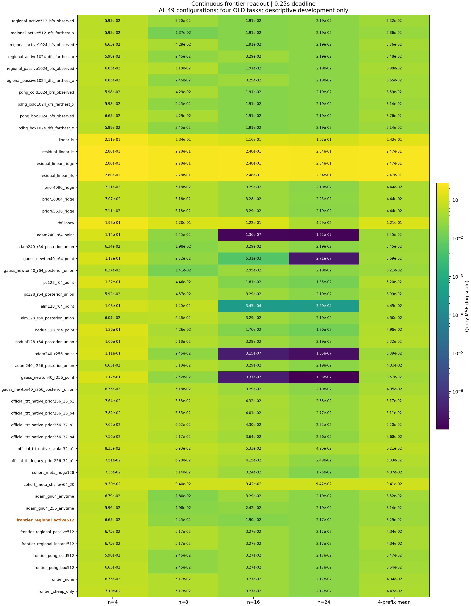
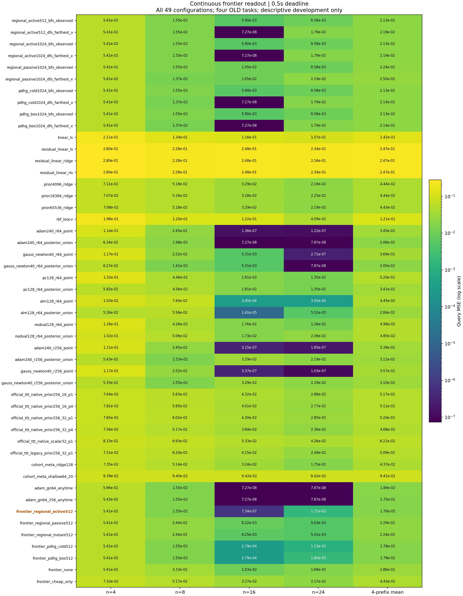
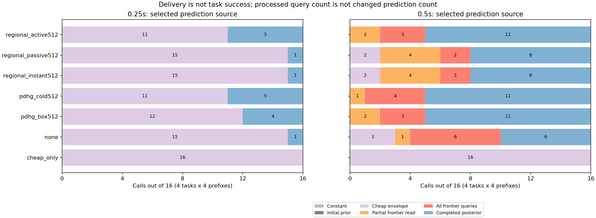

# 423｜连续前沿读出的全控制结果与实际交付

419完成1568次新预测、独立审计和封存后查询评估。四个任务均为旧开发任务，不是独立确认；主方法和0.5秒主预算没有更换。全部49配置保留。

## 预列主方法与关键对照

| 方法 | .25秒平均MSE | .5秒平均MSE |
| --- | ---: | ---: |
| frontier_regional_active512 | 0.0329189582392 | 0.0178309888721 |
| regional_active512_dfs_farthest_x | 0.0286313456048 | 0.0218702373174 |
| adam_gn64_256_anytime | 0.031399493411 | 0.0174640803952 |
| adam_gn64_anytime | 0.0351649218137 | 0.0187897123485 |
| cohort_meta_ridge128 | 0.0437207977686 | 0.0437207977686 |
| official_ttt_native_prior256_32_p4 | 0.0468265841464 | 0.0468265841464 |
| cohort_meta_shallow64_20 | 0.0940773514801 | 0.0940773514801 |
| frontier_regional_passive512 | 0.0434209551546 | 0.0229351652513 |
| frontier_regional_instant512 | 0.0434209551546 | 0.0224381942738 |
| frontier_pdhg_cold512 | 0.034686064521 | 0.0177561256737 |
| frontier_pdhg_box512 | 0.0363554681716 | 0.017923968689 |
| frontier_none | 0.0434209551546 | 0.0286283757203 |
| frontier_cheap_only | 0.0442980486006 | 0.0442980486006 |

差值为新主减对照，负值代表本轮平均误差更低；不自动代表显著性或独立贡献。

| 预列关键对照 | .25秒配对均差 | .5秒配对均差 |
| --- | ---: | ---: |
| regional_active512_dfs_farthest_x | 0.00428761263438 | -0.00403924844531 |
| adam_gn64_256_anytime | 0.0015194648282 | 0.000366908476863 |
| adam_gn64_anytime | -0.0022459635745 | -0.000958723476427 |
| cohort_meta_ridge128 | -0.0108018395294 | -0.0258898088965 |
| official_ttt_native_prior256_32_p4 | -0.0139076259072 | -0.0289955952743 |
| cohort_meta_shallow64_20 | -0.0611583932409 | -0.076246362608 |
| frontier_regional_passive512 | -0.0105019969154 | -0.00510417637921 |
| frontier_regional_instant512 | -0.0105019969154 | -0.00460720540174 |
| frontier_pdhg_cold512 | -0.00176710628178 | 7.48631983824e-05 |
| frontier_pdhg_box512 | -0.00343650993239 | -9.29798168857e-05 |
| frontier_none | -0.0105019969154 | -0.0107973868482 |
| frontier_cheap_only | -0.0113790903615 | -0.0264670597286 |

## 0.25秒：全部49方法

## 0.5秒：全部49方法

## 实际收到的预测及非零修正

frontier_all_queries表示读完257查询，不表示搜索已穷尽；completed_posterior也不宣称精确Bayes。所有数量来自截止前实际选中的包，未使用事后补完预测。

| 新方法 | 预算 | 范围已处理查询数 | 相对廉价预测严格非零变化 | 变化大于1e-12 |
| --- | ---: | ---: | ---: | ---: |
| frontier_regional_active512 | 0.25 | 0 | 0 | 0 |
| frontier_regional_passive512 | 0.25 | 0 | 0 | 0 |
| frontier_regional_instant512 | 0.25 | 0 | 0 | 0 |
| frontier_pdhg_cold512 | 0.25 | 0 | 0 | 0 |
| frontier_pdhg_box512 | 0.25 | 0 | 0 | 0 |
| frontier_none | 0.25 | 0 | 0 | 0 |
| frontier_cheap_only | 0.25 | 0 | 0 | 0 |
| frontier_regional_active512 | 0.5 | 1059 | 869 | 869 |
| frontier_regional_passive512 | 0.5 | 802 | 583 | 583 |
| frontier_regional_instant512 | 0.5 | 930 | 671 | 671 |
| frontier_pdhg_cold512 | 0.5 | 1092 | 869 | 869 |
| frontier_pdhg_box512 | 0.5 | 1091 | 865 | 865 |
| frontier_none | 0.5 | 1734 | 584 | 584 |
| frontier_cheap_only | 0.5 | 0 | 0 | 0 |

处理数量不是实际改变数量，实际改变也不是任务风险下降证明；效果必须看上方独立查询MSE。417／418中的128/257仅指处理数，不应宣传为128个值都改变。

## 费用和研究边界

冷启动、归档传输、清理／重建单列；表中预算为暖在线截止。RSS采样不是严格等峰值RAM。新收据哈希和通信收费，完整几何分支仍使用全局LP。有限步同目标控制及独立新任务确认尚未完成。

422分段编译未进入419；不能把之后的组件速度归给本表。没有NLP／CV／Graph真实模型训练结果，389三域六数据集要求继续保留。

[全部原始风险表](../evaluation_v1/risk_rows.json) · [完整均值及资源](../evaluation_v1/groups.json) · [独立审计](../audit_v1/summary.json) · [冻结方案](../../../outputs/ttt-pc-alm-research/419_frontier_deadline_protocol_v1.md)
