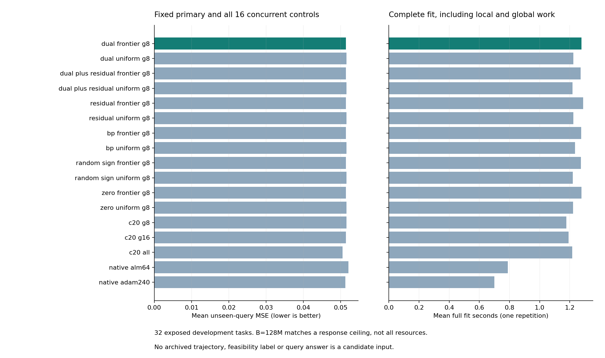

# 364｜把节省的计算投入关键前缀：真实在线结果

主配置 MSE257 **0.0514310967**；主−均匀分配 **-0.0001498030**，主−同增强zero **+0.0000032261**，主−残差信用 **+0.0000000000**，主−同期Adam240 **+0.0001811831**。负值表示主方法误差更低。

本轮 544 次新完整fit，168 方法、5376 个预测器，失败 0。全部查询预测封存后评分，再做独立核验。固定主不因其它方法结果更好而替换；这是32任务开发结果，不是新任务确认。

## 1. 数学机制及可检验判断

给定由支持信息产生的有序候选，区域j进入G个名额的充要条件是j−c(j)≤G，c(j)是其前缀中严格不可行证书数。360已经证明不传播的独立求解可以只执行必要前缀、保持原T128的选择不变。362在此基础上把省下的工作预算重新用于当前前G个未排除区域，延续信用状态而不重启。

每任务总响应上限B=128M（M为现场候选数）；所有信用同增强。uniform强控制则先执行全池T128，余量继续所有未排除区域。两者每轮都不超过剩余响应预算。严格证明只能剔除不可行区域，因此原T128选中的可行区域不会丢失检查名额；增加区域不保证预测误差单调下降。

```text
本次支持观察 → 本次母轨迹与必要候选池
                     ↓
           初段：原T128关键前缀（候选等价）
                     ↓
          剩余B预算：继续当前前G个未排除区域
                     ↓
        精确不可行证明 → 释放名额 → 引入后续区域
                     ↓
           实际几何 + 2048粒子 → 未见查询预测
```

候选从未读取已知可行性标签或后验参考；BP只在明确控制中生成初始信用。后续全局几何公开计费，不称整个系统没有全局优化。调度方法通用于任何信用，不是PC-ALM独有理论。

预测机制的数学边界：若有界预测f∈[0,1]，截断后验遗漏质量为ε，则它与完整工作后验条件均值的平方偏差上界为ε²。只有工作后验确实给出评估目标条件均值时，这才是相应的Bayes超额风险界。更多区域不必意味着更大的概率质量，更小上界也不保证每个实际查询误差下降。运行期间另写的[后验覆盖附录](../../../outputs/ttt-pc-alm-research/363_posterior_coverage_bound_appendix.md)给出推导与反例，不改变冻结算法或评分规则。

## 2. 相同响应上限下，覆盖确实发生变化

| 信用 | 均匀响应对 | 前缀响应对 | 均匀到达正区域 | 前缀到达正区域 | 均匀证书 | 前缀证书 | 均匀组件总秒 | 前缀组件总秒 |
| --- | --- | --- | --- | --- | --- | --- | --- | --- |
| dual | 76725 | 76725 | 19 | 25 | 131 | 164 | 1.250756 | 3.016245 |
| dual_plus_residual | 76735 | 76735 | 19 | 25 | 135 | 166 | 1.243417 | 3.156590 |
| residual | 76813 | 76813 | 19 | 25 | 130 | 161 | 1.244213 | 3.022892 |
| bp | 76832 | 76832 | 19 | 24 | 143 | 166 | 1.247668 | 3.110785 |
| random_sign | 76779 | 76779 | 19 | 24 | 135 | 165 | 1.258304 | 2.975860 |
| zero | 76834 | 76834 | 19 | 24 | 142 | 165 | 1.259551 | 3.103117 |


数据均为32任务组件总计。在同一种信用内，本批两调度实际响应总数相同；上限均为76,928，少用部分来自已无可执行区域而提前结束。ALM前缀到达25个正体积区域，比均匀的19个多6个；zero前缀到达24个，但残差也到达25个。更多全池证书未必等于更多有效前缀覆盖，且当前小批次前缀循环使组件时间增加。

组件使用保存的支持/信用/池，生成费用不计入该表。下一节真实在线重新生成全部输入。B仅匹配局部响应上限，并不匹配精确验证次数、状态、FLOPs或墙钟；元数据保留命名数组subtotal和输出字节，Python对象/trace与分配器峰值没有测量。

## 3. 17个同期真实在线配置

| 方法 | MSE257 | 完整均秒 | 失败 | 局部响应总数 | 主−该方法 | 主改善/同/变差 |
| --- | --- | --- | --- | --- | --- | --- |
| frontier_dual_frontier_g8 | 0.0514310967 | 1.277717 | 0 | 76725 | — | — |
| frontier_dual_uniform_g8 | 0.0515808997 | 1.223587 | 0 | 76725 | -0.0001498030 | 2/29/1 |
| frontier_dual_plus_residual_frontier_g8 | 0.0514310967 | 1.271641 | 0 | 76735 | +0.0000000000 | 0/32/0 |
| frontier_dual_plus_residual_uniform_g8 | 0.0515808997 | 1.217725 | 0 | 76735 | -0.0001498030 | 2/29/1 |
| frontier_residual_frontier_g8 | 0.0514310967 | 1.289017 | 0 | 76813 | +0.0000000000 | 0/32/0 |
| frontier_residual_uniform_g8 | 0.0515808997 | 1.223568 | 0 | 76813 | -0.0001498030 | 2/29/1 |
| frontier_bp_frontier_g8 | 0.0514278705 | 1.275058 | 0 | 76832 | +0.0000032261 | 0/31/1 |
| frontier_bp_uniform_g8 | 0.0515808997 | 1.234675 | 0 | 76832 | -0.0001498030 | 2/29/1 |
| frontier_random_sign_frontier_g8 | 0.0514278705 | 1.273164 | 0 | 76779 | +0.0000032261 | 0/31/1 |
| frontier_random_sign_uniform_g8 | 0.0515808997 | 1.219920 | 0 | 76779 | -0.0001498030 | 2/29/1 |
| frontier_zero_frontier_g8 | 0.0514278705 | 1.276866 | 0 | 76834 | +0.0000032261 | 0/31/1 |
| frontier_zero_uniform_g8 | 0.0515808997 | 1.222713 | 0 | 76834 | -0.0001498030 | 2/29/1 |
| frontier_c20_g8 | 0.0515808997 | 1.177501 | 0 | — | -0.0001498030 | 2/29/1 |
| frontier_c20_g16 | 0.0513881860 | 1.192818 | 0 | — | +0.0000429107 | 0/30/2 |
| frontier_c20_all | 0.0504878776 | 1.216888 | 0 | — | +0.0009432190 | 2/24/6 |
| frontier_native_alm64 | 0.0521223412 | 0.789195 | 0 | — | -0.0006912445 | 8/18/6 |
| frontier_native_adam240 | 0.0512499136 | 0.699744 | 0 | — | +0.0001811831 | 7/16/9 |




每个新fit都重算629起点母流程、触发、必要语言池、筛选、实际几何、采样与读出。C20-G16/完整池和同期Adam240是明确的强控制，不把几何调用数量相等冒充全部资源相等。计时每任务一次，未做重复置信或峰值内存比较。

## 4. 归因：分清调度、信用初始化和任务竞争力

主对同初始化uniform：均差-0.0001498030，改善/同/差2/29/1，最差留一-0.0000201212。这项差异对应预算分配，不能直接归因于ALM本身。

主对同增强zero：均差+0.0000032261，改善/同/差0/31/1，最差留一+0.0000033302。主对残差信用：+0.0000000000。

对所有32任务，与主配置拥有完全相同粒子、分配与预测数组的整组方法为：`frontier_dual_frontier_g8`, `frontier_dual_plus_residual_frontier_g8`, `frontier_residual_frontier_g8`。该分组根据封存数组dtype/shape/原始字节计算，不是仅比较平均误差。若非乘子控制在此组中，就不能把主预测收益称作ALM乘子独占。

本轮实际主预测已被以下非乘子信用控制逐位复现：`frontier_residual_frontier_g8`。因此，即使主优于zero或uniform，也没有建立ALM乘子的独立预测收益。

主对同期Adam240：均差+0.0001811831，改善/同/差7/16/9。直接C20完整池MSE为0.0504878776、完整均秒1.216888，不可省略这个竞争对照。

当前结果只建立本表能直接支持的调度/初始化差异。单个已暴露任务的差异、组件覆盖保证或优于部分回归头，都不足以完成PC-ALM独立任务优势这一核心目标。

## 5. 原有强回归、浅层头及同参数优化器

| 历史冻结对照 | MSE257 | 主−对照 | 主改善/同/变差 | 最差留一均差 |
| --- | --- | --- | --- | --- |
| cross_dual_reuse_g8 | 0.0515808997 | -0.0001498030 | 2/29/1 | -0.0000201212 |
| cross_zero_independent256_g8 | 0.0514510398 | -0.0000199431 | 1/31/0 | +0.0000000000 |
| unvisited_dual | 0.0521723419 | -0.0007412453 | 8/18/6 | -0.0003586936 |
| strong_native_alm128 | 0.0518687182 | -0.0004376215 | 8/17/7 | -0.0000452755 |
| strong_native_alm256 | 0.0519447058 | -0.0005136091 | 8/17/7 | -0.0001237143 |
| strong_native_pc64 | 0.0525001970 | -0.0010691004 | 11/13/8 | +0.0002286924 |
| strong_native_pc256 | 0.0526769038 | -0.0012458071 | 11/13/8 | +0.0000462854 |
| strong_native_nodual256 | 0.0535287715 | -0.0020976748 | 12/7/13 | -0.0012472188 |
| strong_native_adam3840 | 0.0511755030 | +0.0002555937 | 7/16/9 | +0.0006703015 |
| cold__prior16384_ridge | 0.0665166556 | -0.0150855589 | 25/0/7 | -0.0131205936 |
| cold__meta_ridge128 | 0.0681715217 | -0.0167404250 | 25/0/7 | -0.0148923854 |
| cold__meta_shallow64_20 | 0.0901028063 | -0.0386717097 | 31/0/1 | -0.0371578432 |


全部168方法、四指标、11,356条配对比较保留。旧方法秒数为None，不拼接历史时间得出同期加速结论；数学条件也没有排除任意闭式估计器。

## 6. 核验与下一步边界

独立重算21,504风险字段、11,356配对结果，最大标量差1.11e-16；核验1,803严格信用证明、37,150调度轮次、13,674真实几何证书。母轨迹、输入不变量、原有效池保留、支持粒子及完整候选池包含均验证。

362组件原语包括空池/不足名额/一般池：12例、288逐行原求解器数组和132重复数组通过。384组件调用后才进入363；首任务17方法通过后再跑32任务，全部预测先封存再评分。没有重试换种子、查询指导选择或把组件几何标签输入候选。

截至本报告，官方TTT-MLP、LLM/VLM及真实下游验证未完成，核心研究目标保持ACTIVE。后续必须在新机制和新冻结任务上继续检查非乘子同增强对照与实际资源，不能以组件成功代替论文贡献。

[362数学协议](../../../outputs/ttt-pc-alm-research/362_frontier_reallocation_protocol_v1.md) · [363在线协议](../../../outputs/ttt-pc-alm-research/363_frontier_online_protocol_v1.md) · [全部方法](../development_evaluation_v1/methods.json) · [全部比较](../development_evaluation_v1/comparisons.json) · [独立核验](../development_audit_v1/summary.json) · [逐位归因](../attribution_v1/summary.json)
