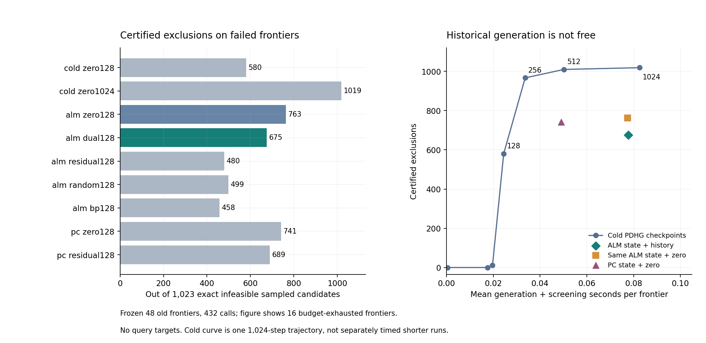

# 375｜历史乘子热启动：同状态对照与完整生成费用

固定主历史乘子初始化在失败前沿的1023个已证不可行样本中排除 **675** 个，完整生成＋筛选均时 **0.077788秒/前沿**。同一ALM原始状态但零乘子排除763个；冷启动128步排除580个。因此，相对冷128的改善不能证明历史乘子的独立价值。

## 1. 本轮真正改变的变量

固定372已经封存的48前沿、2117样本；每个方法只看其前缀支持，不看剩余观察或查询答案。候选从原17起点运行64步ALM，按当前支持最大误差、移动距离和索引选出一个原始状态。所有ALM方法逐位共享同一b,h的数值，但各自实际重新生成并收费；只改变归一化初始信用。PC两个控制同理。

活动约束信用a来自历史乘子、零、当前残差、独立随机符号或明确全局BP负伴随。局部映射p=s*a消去初始z系数，不需要完整链式BP。随后均运行同一个既有PDHG；新意假设只在历史方向是否节省证书发现费用，不把PDHG本身称新方法。

## 2. 全九方法与两个来源终态

失败前沿16个，1024样本中1023不可行；完成前沿32个，1093样本中1067不可行。后两列是失败前沿上固定主独有/该控制独有的证书数量，不是独立任务数。

| 方法 | 失败前沿排除 | 均全组件秒 | 完成前沿排除 | 均全组件秒 | 主独有 | 控制独有 |
| --- | --- | --- | --- | --- | --- | --- |
| cold_zero128 | 580 | 0.023835 | 239 | 0.022509 | 209 | 114 |
| cold_zero1024 | 1019 | 0.082596 | 1034 | 0.074139 | 0 | 344 |
| alm_zero128 | 763 | 0.077419 | 220 | 0.080893 | 34 | 122 |
| alm_dual128 | 675 | 0.077788 | 263 | 0.080396 | 0 | 0 |
| alm_residual128 | 480 | 0.077749 | 226 | 0.080781 | 248 | 53 |
| alm_random128 | 499 | 0.078822 | 131 | 0.081365 | 245 | 69 |
| alm_bp128 | 458 | 0.077655 | 230 | 0.080913 | 267 | 50 |
| pc_zero128 | 741 | 0.049035 | 266 | 0.047097 | 64 | 130 |
| pc_residual128 | 689 | 0.048462 | 264 | 0.047209 | 94 | 108 |

全部配置在0步都没有直接得到正证书。主在失败前沿675，高于同状态残差480、随机499、BP信用458，但低于同状态零信用763；普通PC原始状态零信用741也更便宜。成功前沿主263高于同ALM零220，但普通PC零266仍可达到，不能单挑该子集宣布独立优势。

## 3. 强冷启动的固定工作曲线

| 冷PDHG步数 | 失败前沿排除 | 生成＋该检查点均秒 |
| --- | --- | --- |
| 0 | 0 | 0.000422 |
| 32 | 0 | 0.017468 |
| 64 | 12 | 0.019661 |
| 128 | 580 | 0.024434 |
| 256 | 967 | 0.033620 |
| 512 | 1010 | 0.050200 |
| 1024 | 1019 | 0.082509 |

冷1024保留预列128/256/512/1024工作前缀；256步已排除967个、512步1010个、1024步1019个。检查点时间是同一长轨迹的累计费用，包含初始分配、守卫进入和信用生成；不冒充独立短运行的完整最终退出/归档时间。128前缀在48个前沿逐位复现独立冷128的证明mask。母状态生成时间不可免费删去或假设任意摊薄。

这些结果未通过374预设机制门槛，因此不直接进入新任务确认或声称完整预测改善。更多局部成功不能替代相对零信用和强冷启动的独立比较。

## 4. 数学解释与下一可检验问题

固定区域的局部分离函数D(p,a)=inf_y[pᵀ(z-h_prev-b)+aᵀ(h-sz-c)]是凹、正齐次且超可加的。D>0证明不可能有一致原始状态，但这些性质不保证用原非线性求解轨迹生成的历史乘子适合另一个待检区域。相同原始状态第一步的增量相同，只有D(history+increment)>0而D(increment)≤0时才能证明该步提前；本轮没有出现0步正证书。

特别地，不能把不可行问题当成有可行鞍点的优化问题，套用到最优鞍点距离的热启动收敛界。历史乘子来自原非线性轨迹，待检证书却针对不同的固定分支约束；二者方向一致尚未证明。以上是结果支持的归因边界，不是证明所有历史信用无用。

下一候选若继续，应直接针对当前固定区域的层间约束累积原始/乘子状态，检验增广惩罚与局部精确块更新是否比既有PDHG更经济地产生分离方向；普通无乘子、PC、同参数强优化和冷PDHG仍需保留。不能仅继续调当前历史信用尺度或重挑初始重启。该后续算法本轮尚未实现，最终仍须接完整在线预测与新任务确认。

## 5. 审计与范围

432正式调用全部完成、0执行异常；预检12个旧证明数组逐位复现、213落盘数组回读、27次已知可行保留通过。独立审计28364标量信用（最大差0）、8777实际宽域Fraction正证明、2688同原始状态数组、3504检查点及243次正体积样本保留通过。

初始信用来自本前缀支持而非LP标签；全部432输出封存后才读取旧几何分类作审计。已暴露任务和跨排序重复样本，不宣称新分布显著性。组件时间包括生成与筛选，不含原建树、最终几何和查询读出；命名数组统计不等于进程峰值。没有新增query MSE，也没有完成研究目标。

[执行前协议](../../../outputs/ttt-pc-alm-research/374_history_certificate_protocol_v1.md) · [全部调用](../development_v1/rows.json) · [独立审计](../audit_v1/summary.json) · [配对覆盖](../audit_v1/paired.json) · [全部检查点](../audit_v1/checkpoints.json)
