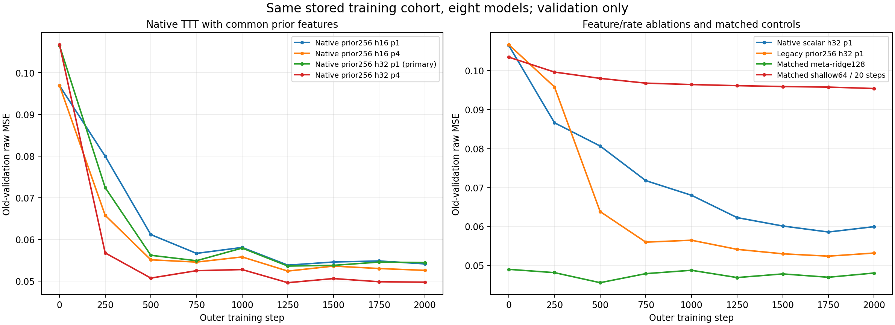
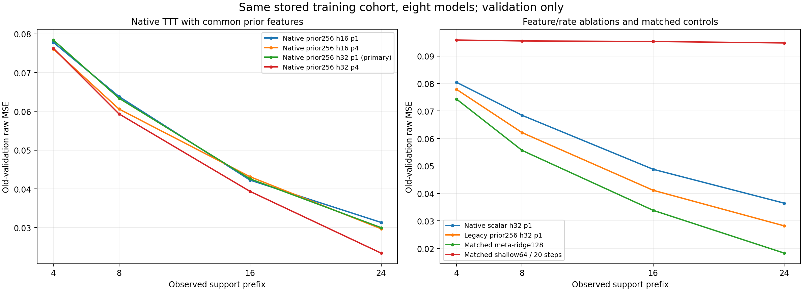

# 396｜同 cohort 官方 TTT 强对照训练完成

八个模型训练完成，2000 个共同 batch 从 seed 重新生成，8000 个张量逐数组一致；八模型各自消费 2000 batch 的记录全一致。已保存八个 checkpoint，并按旧验证集选择规则独立审计。

总训练流程约 728.124 秒；与阶段发布／轻量诊断有并行，因此此处时间是实际执行账目，不是隔离吞吐结论。每模型 32000 外层任务、2048000 唯一查询值、8192000 四前缀查询损失暴露。八配置总暴露应相加，但它们共享同一组唯一任务，不能称 256000 个独立训练任务。

**以下全部是旧验证集原始 MSE，不是独立新任务结果。** 训练集／验证集的外层标签合法且明示计费；研究测试查询答案未使用。外层BP与官方TTT基线的内部梯度更新均明确保留。

| Method | Selected step | Mean raw MSE | n4 | n8 | n16 | n24 | Training seconds | CUDA peak allocated MiB |
| --- | ---: | ---: | ---: | ---: | ---: | ---: | ---: | ---: |
| Native prior256 h16 p1 | 1250 | 0.05381277771 | 0.07779747532 | 0.06383594182 | 0.04227059091 | 0.03134710277 | 54.780609 | 114.562500 |
| Native prior256 h16 p4 | 1250 | 0.05238855793 | 0.07609041555 | 0.0606117413 | 0.04313412727 | 0.02971794761 | 124.321546 | 123.461914 |
| Native prior256 h32 p1 (primary) | 1250 | 0.05359763055 | 0.07840301267 | 0.0634001089 | 0.04259149223 | 0.02999590839 | 54.116802 | 118.831055 |
| Native prior256 h32 p4 | 1250 | 0.04960529599 | 0.07626845907 | 0.05936142583 | 0.03935872211 | 0.02343257693 | 120.266059 | 172.306641 |
| Native scalar h32 p1 | 1750 | 0.05853148522 | 0.08046074668 | 0.06843601148 | 0.04878226916 | 0.03644691358 | 49.286213 | 106.546875 |
| Legacy prior256 h32 p1 | 1750 | 0.05233506316 | 0.07788025651 | 0.06213234183 | 0.04114173342 | 0.02818592088 | 50.596263 | 118.827148 |
| Matched meta-ridge128 | 500 | 0.04552791812 | 0.07434005348 | 0.05566205167 | 0.03384584799 | 0.01826371933 | 18.857549 | 114.188477 |
| Matched shallow64 / 20 steps | 2000 | 0.09536354973 | 0.09584487915 | 0.0955137095 | 0.09531256551 | 0.09478304477 | 255.077005 | 79.210449 |

CPU重放与训练设备验证均值的最大差 4.06022437893e-13。CUDA列仅是分配器峰值，不包括全部驱动、主机或求解器状态。

本表没有候选ALM方法，所以不能据此宣称它优于官方TTT。接下来使用相同前缀、观察信息、截止时间和共同读出进行实际查询比较。

## 393：为什么下一比较需要优化器组合

低支持诊断找到了有预测影响的后验遗漏：部分n8情境下Adam64/256漏约一半质量，均值偏差代理约6.73e-4；另一些情境GN遗漏更多。但它们有互补性，四库联合在八个旧情境几乎完整。因此下一正式控制应含实际计费的组合，而不能只比较单独求解器。

[全部低支持覆盖数表与独立审计](../../low_support_coverage/audit_v1/report.md) · [训练审计](../training_audit_v1/summary.json)

真实 NLP / CV / Graph 阶段依389计划执行，当前仍没有其训练或任务结果。完整目标未完成。
