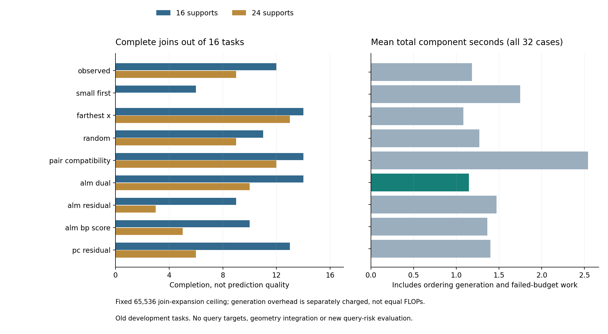

# 371｜历史乘子引导约束求交顺序：机制与完整资源测试

固定主排序alm_dual完成 **24/32** 个任务—支持块，完整组件均时 **1.145807秒**；原顺序完成21/32，成对兼容完成26/32，空间分散完成27/32。全部预列非主控制中最高完成数为27/32（描述性汇总，不替换固定主）。

本轮288次正式调用，另9方法预检和重复；全部预检/正式调用的未完成终态均保留。这里的“完成”仅指预算内遍历完必要候选求交，不是论文完成、查询风险改善或精确后验积分。

## 1. 先确认真正的计算瓶颈

368以单观察必要路径构造增量联合候选。每次只扩展上一阶段保留的前缀，再执行原C5/C20。完整支持可行参数是所有前缀的共同见证，因而保守剪枝不会丢失它；实际展开量是各阶段保留前缀数乘以下一观察路径数之和，不是完整笛卡尔积。

| 支持数 | 顺序 | 完成 | 组件均秒 | 展开总数 | 最大完整语言积 |
| --- | --- | --- | --- | --- | --- |
| 4 | observed | 16/16 | 0.029886 | 10253 | 12600 |
| 4 | small_first | 16/16 | 0.030152 | 10818 | 12600 |
| 8 | observed | 16/16 | 0.159608 | 79464 | 217728000 |
| 8 | small_first | 16/16 | 0.206095 | 113961 | 217728000 |
| 16 | observed | 12/16 | 0.969068 | 431024 | 41402982297600000 |
| 16 | small_first | 6/16 | 1.596221 | 753160 | 41402982297600000 |
| 24 | observed | 9/16 | 1.294512 | 514139 | 1012263170313314304000000 |
| 24 | small_first | 0/16 | 1.782504 | 835229 | 1012263170313314304000000 |

四观察的另外32个365任务中，两排序均保留与原完整笛卡尔积逐位相同的模式集合；原全积每顺序均计277604展开，增量原顺序29548、小语言优先27391。到了24观察，原顺序9/16完成，小语言优先0/16，全部37个预算终止均为展开上限。不能把一个局部路径更少的顺序当成全局求交更便宜的保证。

## 2. 新假设：用历史压力决定先绑定哪些支持

对观察i，乘子线性项对残差的敏感度上包络满足$\max_{\|\delta r_i\|_\infty\le1}|u_i^T\delta r_i|=\|u_i\|_1$。候选将17起点、64步原ALM的该值平均，按降序加入约束。它利用历史约束信息，但上包络方向未必是实际参数可达方向，所以这不是候选删除数或收益保证。

所有方法只改变支持求交顺序，最终仍由相同保守收缩决定能否删除。控制包括原顺序、单语言最小、输入空间分散、固定随机、成对兼容、同ALM末步残差、同ALM参数的BP梯度分数、普通PC残差。三个ALM评分各自现场重算母状态，没有免费复用。成对兼容的额外枚举也计费。

## 3. 所有配置与费用

### 16个支持

| 排序 | 完成 | 总组件均秒 | 生成均秒 | join展开总数 | 额外成对候选 | 相对原顺序解锁/失去 |
| --- | --- | --- | --- | --- | --- | --- |
| observed | 12/16 | 1.013509 | 0.000018 | 431024 | 0 | 0/0 |
| small_first | 6/16 | 1.643451 | 0.001540 | 753160 | 0 | 0/6 |
| farthest_x | 14/16 | 0.719460 | 0.000189 | 267099 | 0 | 3/1 |
| random | 11/16 | 0.982137 | 0.000131 | 435239 | 0 | 1/2 |
| pair_compatibility | 14/16 | 1.512097 | 0.760444 | 293269 | 156963 | 3/1 |
| alm_dual | 14/16 | 0.811092 | 0.046362 | 269710 | 0 | 3/1 |
| alm_residual | 9/16 | 1.207549 | 0.046271 | 518538 | 0 | 1/4 |
| alm_bp_score | 10/16 | 1.113855 | 0.047763 | 471070 | 0 | 3/5 |
| pc_residual | 13/16 | 1.140799 | 0.011311 | 483345 | 0 | 3/2 |

### 24个支持

| 排序 | 完成 | 总组件均秒 | 生成均秒 | join展开总数 | 额外成对候选 | 相对原顺序解锁/失去 |
| --- | --- | --- | --- | --- | --- | --- |
| observed | 9/16 | 1.350441 | 0.000019 | 514139 | 0 | 0/0 |
| small_first | 0/16 | 1.855633 | 0.002167 | 835229 | 0 | 0/9 |
| farthest_x | 13/16 | 1.443255 | 0.000440 | 419503 | 0 | 5/1 |
| random | 9/16 | 1.555284 | 0.000142 | 592000 | 0 | 2/2 |
| pair_compatibility | 12/16 | 3.572506 | 1.787650 | 561065 | 403429 | 5/2 |
| alm_dual | 10/16 | 1.480521 | 0.051402 | 479592 | 0 | 3/2 |
| alm_residual | 3/16 | 1.734900 | 0.051096 | 681771 | 0 | 1/7 |
| alm_bp_score | 5/16 | 1.614351 | 0.050771 | 627297 | 0 | 1/5 |
| pc_residual | 6/16 | 1.657113 | 0.011772 | 665522 | 0 | 1/4 |

时间包括未完成调用与生成排序费用，不报成功子集速度。共同65536上限只约束join展开，不等于相同总FLOPs；成对预处理、局部迭代、状态数组都另列。总组件8秒门槛在批边界合作检查，可越过一个批，不称硬实时保证。数值库单线程，本轮未另起研究重计算，但没有连续记录全系统负载，不宣称完全独占环境。未测进程峰值；未执行最终LP/体积/粒子，不能与完整在线预测时间混比。

## 4. 独立性与数学边界

主完成24/32，同ALM残差12/32，BP分数15/32；原顺序21/32。具体是否存在独立竞争力必须看全部表格及成本，不能只对小语言优先这一较弱顺序报告提升。

至少一种方法完成的29个任务—块中，29/29的各完整方法候选池相同；预算未完成的空regions数组只是终态标记，不解释为真实可行域为空。

369附录还证明：固定d个偏置时，正体积支持模式数≤Σ_{j=0}^d binom(H,j)，H=3n(2^(d+1)−d−2)，因此固定d下是关于n的多项式上界。其系数可以很大，且未证可行的区间放松前缀不受这个界约束。20个有限符号案例与排列递推核验通过，只是通用书面证明的辅助检查，不是运行时间或PC优势定理。

本轮定位和检验的是中间前缀拥塞。它未新增查询MSE、未使用未见任务、未替代强回归/浅层头/同参数优化器的完整终端比较；不完成持续研究目标。只有新机制在强排序控制和生成成本下有优势，才应进入完整预测确认，不能用组件完成数直接发布成任务收益。

## 5. 审计、失败与复核

368正式192调用，155完成、37预算终止；独立1920单观察语言、495339前缀行、7704有效模式前缀保留核验。370独立重算2560个观察分数，最大差5.33e-15；256个同ALM母状态数组逐位一致，288排序与资源条目核验。

368 v1正式第一调用之后，旧回归元数据positive_mode_keys:null造成后置检查器异常。原源与失败快照保留；v2仅把此旧元数据字段解释为空列表，算法/任务/预算未改，重新冻结前检与正式。原失败调用19个数组在v2逐位复现。370无此异常，不隐藏预算终止。

[368运行前协议](../../../outputs/ttt-pc-alm-research/368_prefix_language_scaling_protocol_v1.md) · [兼容修复](../../../outputs/ttt-pc-alm-research/368_null_metadata_repair_v2.md) · [369数学与主张台账](../../../outputs/ttt-pc-alm-research/369_parameter_arrangement_bound_appendix_v1.md) · [370冻结协议](../../../outputs/ttt-pc-alm-research/370_multiplier_constraint_order_protocol_v1.md) · [全部288调用](../development_v1/rows.json) · [独立核验](../audit_v1/summary.json)

369台账里的UNRESOLVED是该附录写作当时的实验状态；本页是完成后的结果，不回改执行前假设。附录与报告由AI协作推导、编码、核验；未作会场提交或新颖性宣称。
