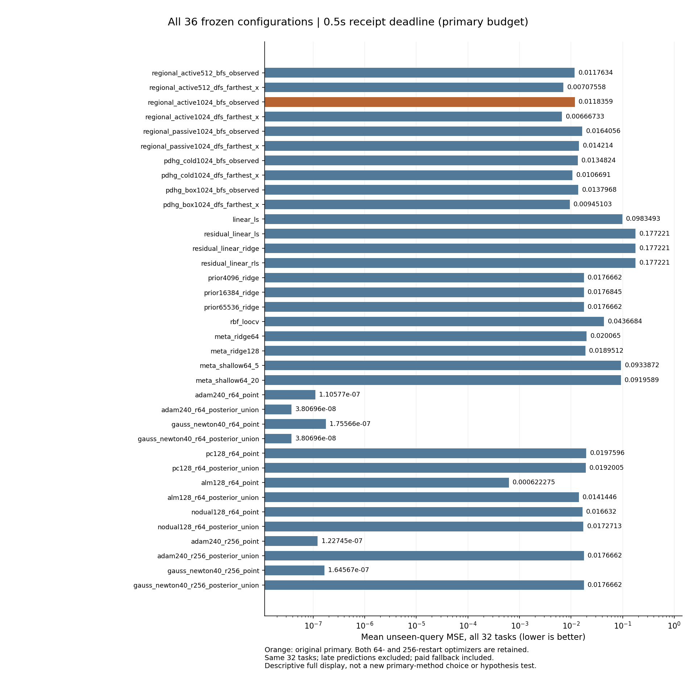
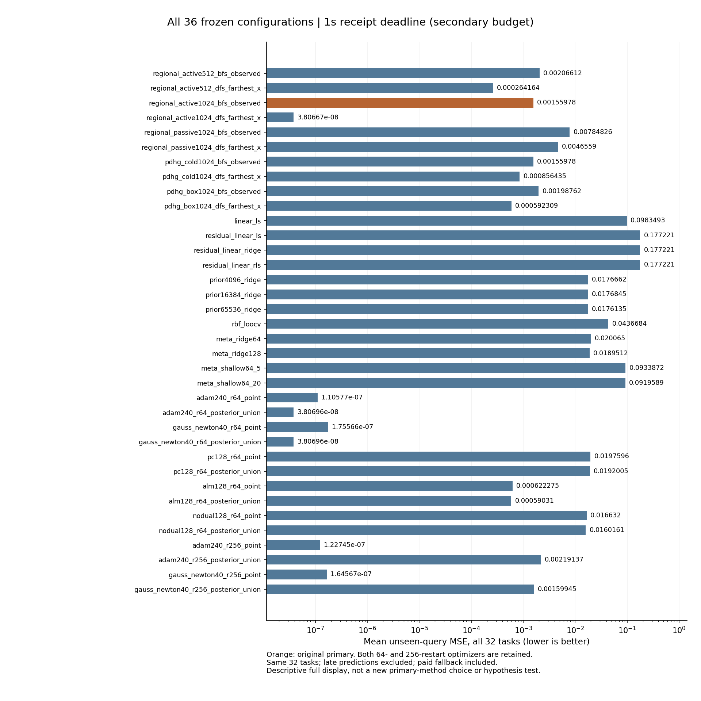

# 392｜新任务截止时间：全部36配置可视化

0.5秒原主MSE=0.0118358784672，meta-ridge128=0.018951243979，被动BFS=0.0164055562994；64初始化Adam联合读出=3.80695525823e-08。因此本轮有相对这些回归／被动控制的正向收益，但没有优于同参数强BP的独立优势。

这两张图补充388预列八主对照图；每个原配置均显示，没有更换主方法、删除结果或追加显著性检验。

## 原主预算：0.5秒

## 原次要预算：1秒

64初始化与256初始化都必须保留：更多重启在本轮固定截止时间下会增加模式几何处理成本，不自动成为更强的实际交付基线。不能只凭256初始化控制超时的结果宣布战胜BP。

391机制分解的404个及时完整区域预测逐位相同，576个逐任务差异恒等式重构误差为零。区域方法之间的风险差完全由完整交付时间决定；这证明本轮成本到风险的通道确实存在，不等于完整搜索优于只寻找足够解释的强优化器。

[全部数表、配对区间与费用](../report_v1/report.md) · [预查询冻结的机制分解](../mechanism_decomposition_v1/report.md)
