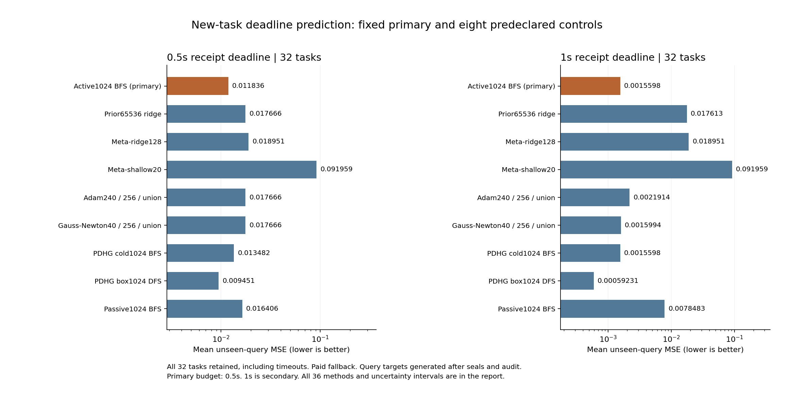

# 388｜新冻结任务：完整链截止时间与查询误差

固定主0.5秒预算平均查询MSE为0.011835878；外部控制中最低均值为adam240_r64_posterior_union，MSE=0.000000038。

八个预列主要对照的均值差全部为负：False；35比较分配后的单侧上界对八个主要对照均低于零：False。这仍只是32新开发任务的结果，不是独立确认或完整论文结论。

## 全部任务与全部36配置

32个新任务×36配置×两个独立执行预算=2304次调用。0.5秒是预列主预算，1秒为次要；没有事后删除超时任务或改选主方法。查询目标在所有预测封存并通过原始输出审计后才产生。

| 预算秒 | 方法 | 均查询MSE | 及时最终交付/32 | 完整后验/32 | 条件模式/32 | 实际备用/32 | 常数/32 |
| --- | --- | --- | --- | --- | --- | --- | --- |
| 0.5 | regional_active512_bfs_observed | 0.011763380 | 13 | 13 | 0 | 19 | 0 |
| 0.5 | regional_active512_dfs_farthest_x | 0.007075582 | 20 | 20 | 0 | 12 | 0 |
| 0.5 | regional_active1024_bfs_observed | 0.011835878 | 12 | 12 | 0 | 20 | 0 |
| 0.5 | regional_active1024_dfs_farthest_x | 0.006667329 | 22 | 22 | 0 | 10 | 0 |
| 0.5 | regional_passive1024_bfs_observed | 0.016405556 | 3 | 3 | 0 | 29 | 0 |
| 0.5 | regional_passive1024_dfs_farthest_x | 0.014214012 | 7 | 7 | 0 | 25 | 0 |
| 0.5 | pdhg_cold1024_bfs_observed | 0.013482439 | 9 | 9 | 0 | 23 | 0 |
| 0.5 | pdhg_cold1024_dfs_farthest_x | 0.010669077 | 14 | 14 | 0 | 18 | 0 |
| 0.5 | pdhg_box1024_bfs_observed | 0.013796799 | 8 | 8 | 0 | 24 | 0 |
| 0.5 | pdhg_box1024_dfs_farthest_x | 0.009451030 | 15 | 15 | 0 | 17 | 0 |
| 0.5 | linear_ls | 0.098349311 | 32 | 0 | 0 | 0 | 0 |
| 0.5 | residual_linear_ls | 0.177220915 | 32 | 0 | 0 | 0 | 0 |
| 0.5 | residual_linear_ridge | 0.177220705 | 32 | 0 | 0 | 0 | 0 |
| 0.5 | residual_linear_rls | 0.177220705 | 32 | 0 | 0 | 0 | 0 |
| 0.5 | prior4096_ridge | 0.017666203 | 32 | 0 | 0 | 0 | 0 |
| 0.5 | prior16384_ridge | 0.017684461 | 32 | 0 | 0 | 0 | 0 |
| 0.5 | prior65536_ridge | 0.017666203 | 0 | 0 | 0 | 32 | 0 |
| 0.5 | rbf_loocv | 0.043668398 | 32 | 0 | 0 | 0 | 0 |
| 0.5 | meta_ridge64 | 0.020065016 | 32 | 0 | 0 | 0 | 0 |
| 0.5 | meta_ridge128 | 0.018951244 | 32 | 0 | 0 | 0 | 0 |
| 0.5 | meta_shallow64_5 | 0.093387204 | 32 | 0 | 0 | 0 | 0 |
| 0.5 | meta_shallow64_20 | 0.091958862 | 32 | 0 | 0 | 0 | 0 |
| 0.5 | adam240_r64_point | 0.000000111 | 32 | 0 | 0 | 0 | 0 |
| 0.5 | adam240_r64_posterior_union | 0.000000038 | 32 | 0 | 32 | 0 | 0 |
| 0.5 | gauss_newton40_r64_point | 0.000000176 | 32 | 0 | 0 | 0 | 0 |
| 0.5 | gauss_newton40_r64_posterior_union | 0.000000038 | 32 | 0 | 32 | 0 | 0 |
| 0.5 | pc128_r64_point | 0.019759559 | 32 | 0 | 0 | 0 | 0 |
| 0.5 | pc128_r64_posterior_union | 0.019200525 | 32 | 0 | 4 | 0 | 0 |
| 0.5 | alm128_r64_point | 0.000622275 | 32 | 0 | 0 | 0 | 0 |
| 0.5 | alm128_r64_posterior_union | 0.014144555 | 7 | 0 | 5 | 25 | 0 |
| 0.5 | nodual128_r64_point | 0.016632038 | 32 | 0 | 0 | 0 | 0 |
| 0.5 | nodual128_r64_posterior_union | 0.017271251 | 1 | 0 | 0 | 31 | 0 |
| 0.5 | adam240_r256_point | 0.000000123 | 32 | 0 | 0 | 0 | 0 |
| 0.5 | adam240_r256_posterior_union | 0.017666203 | 0 | 0 | 0 | 32 | 0 |
| 0.5 | gauss_newton40_r256_point | 0.000000165 | 32 | 0 | 0 | 0 | 0 |
| 0.5 | gauss_newton40_r256_posterior_union | 0.017666203 | 0 | 0 | 0 | 32 | 0 |
| 1.0 | regional_active512_bfs_observed | 0.002066115 | 29 | 29 | 0 | 3 | 0 |
| 1.0 | regional_active512_dfs_farthest_x | 0.000264164 | 31 | 31 | 0 | 1 | 0 |
| 1.0 | regional_active1024_bfs_observed | 0.001559776 | 30 | 30 | 0 | 2 | 0 |
| 1.0 | regional_active1024_dfs_farthest_x | 0.000000038 | 32 | 32 | 0 | 0 | 0 |
| 1.0 | regional_passive1024_bfs_observed | 0.007848256 | 17 | 17 | 0 | 15 | 0 |
| 1.0 | regional_passive1024_dfs_farthest_x | 0.004655903 | 23 | 23 | 0 | 9 | 0 |
| 1.0 | pdhg_cold1024_bfs_observed | 0.001559776 | 30 | 30 | 0 | 2 | 0 |
| 1.0 | pdhg_cold1024_dfs_farthest_x | 0.000856435 | 30 | 30 | 0 | 2 | 0 |
| 1.0 | pdhg_box1024_bfs_observed | 0.001987620 | 28 | 28 | 0 | 4 | 0 |
| 1.0 | pdhg_box1024_dfs_farthest_x | 0.000592309 | 31 | 31 | 0 | 1 | 0 |
| 1.0 | linear_ls | 0.098349311 | 32 | 0 | 0 | 0 | 0 |
| 1.0 | residual_linear_ls | 0.177220915 | 32 | 0 | 0 | 0 | 0 |
| 1.0 | residual_linear_ridge | 0.177220705 | 32 | 0 | 0 | 0 | 0 |
| 1.0 | residual_linear_rls | 0.177220705 | 32 | 0 | 0 | 0 | 0 |
| 1.0 | prior4096_ridge | 0.017666203 | 32 | 0 | 0 | 0 | 0 |
| 1.0 | prior16384_ridge | 0.017684461 | 32 | 0 | 0 | 0 | 0 |
| 1.0 | prior65536_ridge | 0.017613478 | 32 | 0 | 0 | 0 | 0 |
| 1.0 | rbf_loocv | 0.043668398 | 32 | 0 | 0 | 0 | 0 |
| 1.0 | meta_ridge64 | 0.020065016 | 32 | 0 | 0 | 0 | 0 |
| 1.0 | meta_ridge128 | 0.018951244 | 32 | 0 | 0 | 0 | 0 |
| 1.0 | meta_shallow64_5 | 0.093387204 | 32 | 0 | 0 | 0 | 0 |
| 1.0 | meta_shallow64_20 | 0.091958862 | 32 | 0 | 0 | 0 | 0 |
| 1.0 | adam240_r64_point | 0.000000111 | 32 | 0 | 0 | 0 | 0 |
| 1.0 | adam240_r64_posterior_union | 0.000000038 | 32 | 0 | 32 | 0 | 0 |
| 1.0 | gauss_newton40_r64_point | 0.000000176 | 32 | 0 | 0 | 0 | 0 |
| 1.0 | gauss_newton40_r64_posterior_union | 0.000000038 | 32 | 0 | 32 | 0 | 0 |
| 1.0 | pc128_r64_point | 0.019759559 | 32 | 0 | 0 | 0 | 0 |
| 1.0 | pc128_r64_posterior_union | 0.019200525 | 32 | 0 | 4 | 0 | 0 |
| 1.0 | alm128_r64_point | 0.000622275 | 32 | 0 | 0 | 0 | 0 |
| 1.0 | alm128_r64_posterior_union | 0.000590310 | 32 | 0 | 26 | 0 | 0 |
| 1.0 | nodual128_r64_point | 0.016632038 | 32 | 0 | 0 | 0 | 0 |
| 1.0 | nodual128_r64_posterior_union | 0.016016136 | 32 | 0 | 6 | 0 | 0 |
| 1.0 | adam240_r256_point | 0.000000123 | 32 | 0 | 0 | 0 | 0 |
| 1.0 | adam240_r256_posterior_union | 0.002191368 | 29 | 0 | 29 | 3 | 0 |
| 1.0 | gauss_newton40_r256_point | 0.000000165 | 32 | 0 | 0 | 0 | 0 |
| 1.0 | gauss_newton40_r256_posterior_union | 0.001599447 | 30 | 0 | 30 | 2 | 0 |

及时最终交付不等于完整后验：分支方法即使搜索函数结束，也可能因为未完整解析继续采用备用预测。本表从已封存状态另行区分实际来源；这种报告分类不参与模型选择。优化器的条件模式读出不宣称覆盖所有可行模式。

## 配对不确定性与预列控制

| 预算秒 | 控制 | 预列主要 | 主减控制MSE | 任务bootstrap95% | Bonferroni单侧上界 | 主更好/32 | 逐任务相等/32 |
| --- | --- | --- | --- | --- | --- | --- | --- |
| 0.5 | regional_active512_bfs_observed |  | 0.000072499 | [-0.002008953, 0.002056372] | 0.003066176 | 2 | 27 |
| 0.5 | regional_active512_dfs_farthest_x |  | 0.004760297 | [0.001699059, 0.008453231] | 0.010685529 | 0 | 24 |
| 0.5 | regional_active1024_dfs_farthest_x |  | 0.005168550 | [0.002223465, 0.008650136] | 0.010741630 | 0 | 22 |
| 0.5 | regional_passive1024_bfs_observed | * | -0.004569678 | [-0.007368392, -0.002079583] | -0.000990288 | 9 | 23 |
| 0.5 | regional_passive1024_dfs_farthest_x |  | -0.002378134 | [-0.004851757, -0.000184148] | 0.000832749 | 6 | 25 |
| 0.5 | pdhg_cold1024_bfs_observed | * | -0.001646561 | [-0.003689808, 0.000034465] | 0.000796463 | 4 | 27 |
| 0.5 | pdhg_cold1024_dfs_farthest_x |  | 0.001166801 | [-0.001350787, 0.003900892] | 0.005503476 | 2 | 26 |
| 0.5 | pdhg_box1024_bfs_observed |  | -0.001960921 | [-0.004089839, -0.000097745] | 0.000530975 | 5 | 26 |
| 0.5 | pdhg_box1024_dfs_farthest_x | * | 0.002384849 | [-0.000812437, 0.006114990] | 0.008482508 | 2 | 25 |
| 0.5 | linear_ls |  | -0.086513432 | [-0.091152289, -0.081789627] | -0.079236130 | 32 | 0 |
| 0.5 | residual_linear_ls |  | -0.165385037 | [-0.180760802, -0.149864180] | -0.142061297 | 32 | 0 |
| 0.5 | residual_linear_ridge |  | -0.165384827 | [-0.180981306, -0.149870931] | -0.142178841 | 32 | 0 |
| 0.5 | residual_linear_rls |  | -0.165384827 | [-0.180827434, -0.149810571] | -0.141799206 | 32 | 0 |
| 0.5 | prior4096_ridge |  | -0.005830325 | [-0.008707244, -0.003137192] | -0.001929341 | 12 | 20 |
| 0.5 | prior16384_ridge |  | -0.005848582 | [-0.008809651, -0.003087261] | -0.001850361 | 23 | 0 |
| 0.5 | prior65536_ridge | * | -0.005830325 | [-0.008729839, -0.003155467] | -0.001984454 | 12 | 20 |
| 0.5 | rbf_loocv |  | -0.031832520 | [-0.038571029, -0.025628505] | -0.022675459 | 32 | 0 |
| 0.5 | meta_ridge64 |  | -0.008229138 | [-0.011569055, -0.005077400] | -0.003609339 | 25 | 0 |
| 0.5 | meta_ridge128 | * | -0.007115366 | [-0.010537745, -0.003870760] | -0.002408865 | 23 | 0 |
| 0.5 | meta_shallow64_5 |  | -0.081551325 | [-0.085494361, -0.077586984] | -0.075504646 | 32 | 0 |
| 0.5 | meta_shallow64_20 | * | -0.080122984 | [-0.083942402, -0.076188331] | -0.074119008 | 32 | 0 |
| 0.5 | adam240_r64_point |  | 0.011835768 | [0.007871287, 0.015984253] | 0.018136861 | 12 | 0 |
| 0.5 | adam240_r64_posterior_union |  | 0.011835840 | [0.007880081, 0.015996332] | 0.018236061 | 1 | 11 |
| 0.5 | gauss_newton40_r64_point |  | 0.011835703 | [0.007896573, 0.015984189] | 0.018185070 | 11 | 0 |
| 0.5 | gauss_newton40_r64_posterior_union |  | 0.011835840 | [0.007882846, 0.015986143] | 0.018247845 | 1 | 11 |
| 0.5 | pc128_r64_point |  | -0.007923681 | [-0.017079480, 0.000327544] | 0.004157491 | 22 | 0 |
| 0.5 | pc128_r64_posterior_union |  | -0.007364647 | [-0.016587343, 0.000958654] | 0.004593674 | 20 | 1 |
| 0.5 | alm128_r64_point |  | 0.011213604 | [0.007461609, 0.015215849] | 0.017358471 | 12 | 0 |
| 0.5 | alm128_r64_posterior_union |  | -0.002308676 | [-0.004925982, 0.000147035] | 0.001384893 | 8 | 22 |
| 0.5 | nodual128_r64_point |  | -0.004796160 | [-0.013164430, 0.002700866] | 0.006216222 | 20 | 0 |
| 0.5 | nodual128_r64_posterior_union |  | -0.005435372 | [-0.008513354, -0.002524918] | -0.001097684 | 12 | 19 |
| 0.5 | adam240_r256_point |  | 0.011835756 | [0.007895280, 0.016032830] | 0.018197031 | 11 | 0 |
| 0.5 | adam240_r256_posterior_union | * | -0.005830325 | [-0.008704162, -0.003158803] | -0.001944894 | 12 | 20 |
| 0.5 | gauss_newton40_r256_point |  | 0.011835714 | [0.007881543, 0.016039137] | 0.018209691 | 12 | 0 |
| 0.5 | gauss_newton40_r256_posterior_union | * | -0.005830325 | [-0.008737080, -0.003152070] | -0.001931242 | 12 | 20 |
| 1.0 | regional_active512_bfs_observed |  | -0.000506339 | [-0.001519018, 0.000000000] | 0.000000000 | 1 | 31 |
| 1.0 | regional_active512_dfs_farthest_x |  | 0.001295612 | [-0.000528251, 0.003822817] | 0.005540676 | 1 | 29 |
| 1.0 | regional_active1024_dfs_farthest_x |  | 0.001559738 | [0.000000000, 0.004086943] | 0.005646681 | 0 | 30 |
| 1.0 | regional_passive1024_bfs_observed | * | -0.006288480 | [-0.009514790, -0.003366534] | -0.002119105 | 13 | 19 |
| 1.0 | regional_passive1024_dfs_farthest_x |  | -0.003096126 | [-0.005780256, -0.000972467] | -0.000296959 | 7 | 25 |
| 1.0 | pdhg_cold1024_bfs_observed | * | 0.000000000 | [0.000000000, 0.000000000] | 0.000000000 | 0 | 32 |
| 1.0 | pdhg_cold1024_dfs_farthest_x |  | 0.000703341 | [-0.000792377, 0.002902401] | 0.004837334 | 1 | 30 |
| 1.0 | pdhg_box1024_bfs_observed |  | -0.000427844 | [-0.001119814, 0.000000000] | 0.000000000 | 2 | 30 |
| 1.0 | pdhg_box1024_dfs_farthest_x | * | 0.000967467 | [0.000000000, 0.002902401] | 0.004837334 | 0 | 31 |
| 1.0 | linear_ls |  | -0.096789535 | [-0.100407162, -0.093390841] | -0.091656907 | 32 | 0 |
| 1.0 | residual_linear_ls |  | -0.175661139 | [-0.191127307, -0.160420187] | -0.152727737 | 32 | 0 |
| 1.0 | residual_linear_ridge |  | -0.175660929 | [-0.191176906, -0.160451469] | -0.152775441 | 32 | 0 |
| 1.0 | residual_linear_rls |  | -0.175660929 | [-0.191132291, -0.160476803] | -0.152251760 | 32 | 0 |
| 1.0 | prior4096_ridge |  | -0.016106427 | [-0.019169741, -0.013140064] | -0.011748640 | 30 | 2 |
| 1.0 | prior16384_ridge |  | -0.016124684 | [-0.019307497, -0.013077544] | -0.011572071 | 31 | 0 |
| 1.0 | prior65536_ridge | * | -0.016053702 | [-0.019164376, -0.013057723] | -0.011604814 | 31 | 0 |
| 1.0 | rbf_loocv |  | -0.042108622 | [-0.050029471, -0.035542130] | -0.032734423 | 32 | 0 |
| 1.0 | meta_ridge64 |  | -0.018505240 | [-0.021637218, -0.015604073] | -0.014228787 | 32 | 0 |
| 1.0 | meta_ridge128 | * | -0.017391468 | [-0.020369832, -0.014538289] | -0.013183961 | 32 | 0 |
| 1.0 | meta_shallow64_5 |  | -0.091827428 | [-0.094491487, -0.088874759] | -0.087212338 | 32 | 0 |
| 1.0 | meta_shallow64_20 | * | -0.090399086 | [-0.093117283, -0.087539474] | -0.085953769 | 32 | 0 |
| 1.0 | adam240_r64_point |  | 0.001559666 | [-0.000000086, 0.004086854] | 0.005646604 | 28 | 0 |
| 1.0 | adam240_r64_posterior_union |  | 0.001559738 | [-0.000000000, 0.004086943] | 0.005646681 | 1 | 29 |
| 1.0 | gauss_newton40_r64_point |  | 0.001559601 | [-0.000000154, 0.004086795] | 0.005646546 | 27 | 0 |
| 1.0 | gauss_newton40_r64_posterior_union |  | 0.001559738 | [-0.000000000, 0.004086943] | 0.005646681 | 1 | 29 |
| 1.0 | pc128_r64_point |  | -0.018199783 | [-0.028633101, -0.009553522] | -0.006249334 | 31 | 0 |
| 1.0 | pc128_r64_posterior_union |  | -0.017640749 | [-0.028079222, -0.008884776] | -0.005643307 | 27 | 4 |
| 1.0 | alm128_r64_point |  | 0.000937501 | [-0.000945266, 0.003508086] | 0.005269556 | 30 | 0 |
| 1.0 | alm128_r64_posterior_union |  | 0.000969466 | [-0.000905958, 0.003526726] | 0.005302038 | 5 | 25 |
| 1.0 | nodual128_r64_point |  | -0.015072262 | [-0.024107888, -0.007828150] | -0.004987010 | 31 | 0 |
| 1.0 | nodual128_r64_posterior_union |  | -0.014456360 | [-0.023515058, -0.007128265] | -0.004419983 | 25 | 6 |
| 1.0 | adam240_r256_point |  | 0.001559653 | [-0.000000096, 0.004086844] | 0.005646607 | 26 | 0 |
| 1.0 | adam240_r256_posterior_union | * | -0.000631591 | [-0.002527766, 0.001184893] | 0.002369085 | 3 | 28 |
| 1.0 | gauss_newton40_r256_point |  | 0.001559612 | [-0.000000144, 0.004086815] | 0.005646562 | 28 | 0 |
| 1.0 | gauss_newton40_r256_posterior_union | * | -0.000039670 | [-0.001895825, 0.001776814] | 0.002921686 | 2 | 29 |

100000次任务级配对bootstrap，独立样本数32；两个预算不是64独立任务。单侧上界使用1-.05/35分位数，是小样本近似百分位bootstrap，不是有限样本精确保证。星号为执行前指定的八个主要控制，其他全部控制也保留。

## 费用与部署边界

| 预算秒 | 方法 | 均决策秒 | 均启动/重建秒 | 均清理秒 | 均归档传输秒 | 最大决策超时秒 | 最大观测工作进程MiB |
| --- | --- | --- | --- | --- | --- | --- | --- |
| 0.5 | regional_active512_bfs_observed | 0.463809 | 1.097773 | 0.048461 | 0.000405 | 0.014156 | 556.77 |
| 0.5 | regional_active512_dfs_farthest_x | 0.440821 | 0.663565 | 0.049237 | 0.000563 | 0.014966 | 554.19 |
| 0.5 | regional_active1024_bfs_observed | 0.475442 | 0.799578 | 0.046952 | 0.000385 | 0.014565 | 558.81 |
| 0.5 | regional_active1024_dfs_farthest_x | 0.429887 | 0.656037 | 0.049670 | 0.000607 | 0.013550 | 555.00 |
| 0.5 | regional_passive1024_bfs_observed | 0.498170 | 1.673108 | 0.046081 | 0.000088 | 0.014775 | 552.95 |
| 0.5 | regional_passive1024_dfs_farthest_x | 0.479384 | 1.316503 | 0.046968 | 0.000217 | 0.014457 | 556.21 |
| 0.5 | pdhg_cold1024_bfs_observed | 0.481576 | 1.239249 | 0.047518 | 0.000298 | 0.015192 | 553.65 |
| 0.5 | pdhg_cold1024_dfs_farthest_x | 0.451652 | 0.649974 | 0.047013 | 0.000396 | 0.012995 | 553.02 |
| 0.5 | pdhg_box1024_bfs_observed | 0.487291 | 0.805779 | 0.047409 | 0.000298 | 0.015117 | 554.37 |
| 0.5 | pdhg_box1024_dfs_farthest_x | 0.453374 | 0.881458 | 0.048420 | 0.000478 | 0.014878 | 556.14 |
| 0.5 | linear_ls | 0.000549 | 0.088561 | 0.010707 | 0.000118 | 0.000000 | 75.95 |
| 0.5 | residual_linear_ls | 0.000613 | 0.107788 | 0.011579 | 0.000137 | 0.000000 | 75.95 |
| 0.5 | residual_linear_ridge | 0.000570 | 0.084787 | 0.010925 | 0.000125 | 0.000000 | 75.96 |
| 0.5 | residual_linear_rls | 0.000697 | 0.041909 | 0.010660 | 0.000126 | 0.000000 | 75.95 |
| 0.5 | prior4096_ridge | 0.027337 | 0.064004 | 0.010446 | 0.000165 | 0.000000 | 92.73 |
| 0.5 | prior16384_ridge | 0.154002 | 0.065044 | 0.011437 | 0.000168 | 0.000000 | 140.66 |
| 0.5 | prior65536_ridge | 0.507380 | 0.385608 | 0.013796 | 0.000000 | 0.015179 | 335.31 |
| 0.5 | rbf_loocv | 0.001171 | 0.150661 | 0.011455 | 0.000122 | 0.000000 | 76.13 |
| 0.5 | meta_ridge64 | 0.030000 | 0.223661 | 0.058753 | 0.000170 | 0.000000 | 547.07 |
| 0.5 | meta_ridge128 | 0.030059 | 0.216034 | 0.058440 | 0.000163 | 0.000000 | 549.10 |
| 0.5 | meta_shallow64_5 | 0.036132 | 0.358340 | 0.057661 | 0.000203 | 0.000000 | 576.18 |
| 0.5 | meta_shallow64_20 | 0.048265 | 0.506944 | 0.056887 | 0.000180 | 0.000000 | 576.76 |
| 0.5 | adam240_r64_point | 0.059670 | 0.299070 | 0.060303 | 0.000193 | 0.000000 | 541.46 |
| 0.5 | adam240_r64_posterior_union | 0.302844 | 0.218671 | 0.049800 | 0.000508 | 0.000000 | 552.09 |
| 0.5 | gauss_newton40_r64_point | 0.046434 | 0.217985 | 0.060803 | 0.000194 | 0.000000 | 542.43 |
| 0.5 | gauss_newton40_r64_posterior_union | 0.299206 | 0.142290 | 0.051339 | 0.000546 | 0.000000 | 552.07 |
| 0.5 | pc128_r64_point | 0.054260 | 0.222251 | 0.057993 | 0.000189 | 0.000000 | 542.04 |
| 0.5 | pc128_r64_posterior_union | 0.351560 | 0.221319 | 0.049824 | 0.000588 | 0.000000 | 552.04 |
| 0.5 | alm128_r64_point | 0.203819 | 0.218171 | 0.057721 | 0.000194 | 0.000000 | 542.07 |
| 0.5 | alm128_r64_posterior_union | 0.498928 | 1.090048 | 0.046638 | 0.000141 | 0.014523 | 551.04 |
| 0.5 | nodual128_r64_point | 0.202619 | 0.362351 | 0.057776 | 0.000177 | 0.000000 | 541.86 |
| 0.5 | nodual128_r64_posterior_union | 0.506599 | 1.246427 | 0.046810 | 0.000035 | 0.014896 | 549.91 |
| 0.5 | adam240_r256_point | 0.100468 | 0.439993 | 0.055941 | 0.000188 | 0.000000 | 541.75 |
| 0.5 | adam240_r256_posterior_union | 0.508598 | 0.943072 | 0.046059 | 0.000000 | 0.015338 | 550.94 |
| 0.5 | gauss_newton40_r256_point | 0.069576 | 0.293295 | 0.057449 | 0.000185 | 0.000000 | 541.65 |
| 0.5 | gauss_newton40_r256_posterior_union | 0.507348 | 1.307930 | 0.046596 | 0.000000 | 0.014548 | 551.75 |
| 1.0 | regional_active512_bfs_observed | 0.577652 | 0.947510 | 0.048908 | 0.001118 | 0.012842 | 555.19 |
| 1.0 | regional_active512_dfs_farthest_x | 0.511734 | 0.875468 | 0.049300 | 0.001010 | 0.003905 | 553.29 |
| 1.0 | regional_active1024_bfs_observed | 0.565232 | 1.159499 | 0.047358 | 0.001033 | 0.008986 | 555.55 |
| 1.0 | regional_active1024_dfs_farthest_x | 0.461178 | 0.507220 | 0.049210 | 0.000941 | 0.000000 | 555.37 |
| 1.0 | regional_passive1024_bfs_observed | 0.846455 | 1.751221 | 0.047424 | 0.000725 | 0.011945 | 556.58 |
| 1.0 | regional_passive1024_dfs_farthest_x | 0.743918 | 1.394364 | 0.048785 | 0.000835 | 0.012432 | 555.79 |
| 1.0 | pdhg_cold1024_bfs_observed | 0.611788 | 1.017315 | 0.048915 | 0.001174 | 0.006561 | 556.20 |
| 1.0 | pdhg_cold1024_dfs_farthest_x | 0.535867 | 1.017564 | 0.049772 | 0.000950 | 0.004129 | 554.95 |
| 1.0 | pdhg_box1024_bfs_observed | 0.633045 | 1.457888 | 0.049291 | 0.001159 | 0.012976 | 554.20 |
| 1.0 | pdhg_box1024_dfs_farthest_x | 0.542665 | 0.801413 | 0.047984 | 0.001159 | 0.001136 | 554.52 |
| 1.0 | linear_ls | 0.000553 | 0.086310 | 0.010796 | 0.000131 | 0.000000 | 75.95 |
| 1.0 | residual_linear_ls | 0.000607 | 0.063678 | 0.011504 | 0.000133 | 0.000000 | 75.95 |
| 1.0 | residual_linear_ridge | 0.000582 | 0.087396 | 0.011365 | 0.000126 | 0.000000 | 75.96 |
| 1.0 | residual_linear_rls | 0.000692 | 0.129868 | 0.010627 | 0.000133 | 0.000000 | 75.95 |
| 1.0 | prior4096_ridge | 0.027091 | 0.108825 | 0.010348 | 0.000142 | 0.000000 | 92.04 |
| 1.0 | prior16384_ridge | 0.150631 | 0.108562 | 0.011066 | 0.000160 | 0.000000 | 140.86 |
| 1.0 | prior65536_ridge | 0.545345 | 0.410372 | 0.011087 | 0.000166 | 0.000000 | 335.18 |
| 1.0 | rbf_loocv | 0.001159 | 0.021070 | 0.011310 | 0.000136 | 0.000000 | 76.13 |
| 1.0 | meta_ridge64 | 0.029930 | 0.368397 | 0.057378 | 0.000158 | 0.000000 | 547.87 |
| 1.0 | meta_ridge128 | 0.029718 | 0.358133 | 0.057598 | 0.000177 | 0.000000 | 548.91 |
| 1.0 | meta_shallow64_5 | 0.033785 | 0.216515 | 0.057302 | 0.000178 | 0.000000 | 575.98 |
| 1.0 | meta_shallow64_20 | 0.045066 | 0.073836 | 0.058367 | 0.000176 | 0.000000 | 576.66 |
| 1.0 | adam240_r64_point | 0.061551 | 0.291904 | 0.060141 | 0.000197 | 0.000000 | 541.37 |
| 1.0 | adam240_r64_posterior_union | 0.301929 | 0.366376 | 0.048942 | 0.000527 | 0.000000 | 552.48 |
| 1.0 | gauss_newton40_r64_point | 0.046492 | 0.365436 | 0.058858 | 0.000192 | 0.000000 | 541.85 |
| 1.0 | gauss_newton40_r64_posterior_union | 0.298778 | 0.440511 | 0.048523 | 0.000530 | 0.000000 | 551.93 |
| 1.0 | pc128_r64_point | 0.054708 | 0.369505 | 0.058474 | 0.000190 | 0.000000 | 541.70 |
| 1.0 | pc128_r64_posterior_union | 0.354113 | 0.368727 | 0.049512 | 0.000555 | 0.000000 | 551.52 |
| 1.0 | alm128_r64_point | 0.205404 | 0.364700 | 0.058143 | 0.000181 | 0.000000 | 542.15 |
| 1.0 | alm128_r64_posterior_union | 0.569760 | 0.948359 | 0.049722 | 0.000648 | 0.000000 | 551.12 |
| 1.0 | nodual128_r64_point | 0.202244 | 0.217420 | 0.059569 | 0.000194 | 0.000000 | 541.91 |
| 1.0 | nodual128_r64_posterior_union | 0.551746 | 1.320074 | 0.048872 | 0.000599 | 0.000000 | 550.21 |
| 1.0 | adam240_r256_point | 0.100053 | 0.143792 | 0.058260 | 0.000200 | 0.000000 | 541.68 |
| 1.0 | adam240_r256_posterior_union | 0.796291 | 1.668176 | 0.048816 | 0.000852 | 0.008199 | 550.58 |
| 1.0 | gauss_newton40_r256_point | 0.069244 | 0.288134 | 0.057845 | 0.000242 | 0.000000 | 541.29 |
| 1.0 | gauss_newton40_r256_posterior_union | 0.827723 | 1.381474 | 0.048419 | 0.000946 | 0.009472 | 551.48 |

在线期限从发送支持数据计起，仅采用期限前完整收到的预测；初始化不见支持数据。成功作业复用不变运行时/共享模型，任务状态清除；超时仅终止本实验创建的工作进程并在下一作业重建。这里同时列出启动与清理成本，不能把温运行延迟宣传为冷启动吞吐。块尾正常关闭费用另见sessions.json，不要把groups.json重复引用的method_total_nonforced_session_close_seconds跨两个预算重复相加。

5ms资源采样计入在线费用。观测RSS最大值是实际在线峰值下界，Windows lifetime peak_wset包含初始化及先前作业，共享页未去重；没有强制等峰值RAM。完整命名模型/快权重/活动/乘子/搜索状态见逐作业state.json和state.npz。读出几何LP付费，不把整体称为只有局部PC计算。

## 机制解释的适用范围

共同完整后验近似p和备用r下，预列风险差为E[(I_A-I_C)((r-m)^2-(p-m)^2)]。因此真正证据是相同预算下所有任务的查询损失，而非更多证书或更多可更新参数。数值几何与有限粒子不等于精确Bayes均值；固定先验已知这一任务条件必须保留。

本轮保留大固定特征回归、浅层头训练轨迹、64/256初始化强优化器，以及双方可用的相同几何模式读取。各优化器支持带可行性和选点规则相同，但有限步代理目标不逐项一致；不把多模式读出本身归因于信用分配。外层学习的四控制各使用32000训练任务、2048000查询标签，已知生成先验对所有方法可用；没有本轮再训练。

匹配当前分布的官方TTT尚未重训，本轮不含该充分对照，也没有真实LLM/VLM任务验证。无论这张表的方向如何，都不能用它单独完成完整论文目标；正向结果需要独立新任务确认，未达预列比较则保留本轮并据实际机制改进，不改写主任务或隐藏强控制。

无查询答案的输出审计计数：{'paid_fallback_replays': 1920, 'optimizer_bank_replays': 773, 'independent_deadline_choices': 2304, 'process_resource_records': 2304, 'exact_geometry_certificates': 66746, 'posterior_support_checks': 1316864, 'posterior_prediction_replays': 233, 'complete_regional_deliveries': 404, 'prediction_replays': 410, 'fraction_single_languages': 9840, 'enumerated_combinations': 1702568, 'contractor_mask_replays': 19910, 'batch_accounting': 9955, 'positive_output_or_pending_coverage': 428, 'search_accounting': 410, 'actual_search_resource_checks': 410, 'continuous_pipeline_checks': 410, 'independent_live_checkpoints': 22345, 'independent_solver_work_checks': 761, 'exact_wide_domain_cuts': 58331, 'regression_or_meta_replays': 736, 'reusable_session_lifecycles': 288}。本报告重新读取全部2304预测计算MSE，并重算70个配对bootstrap结果。

[冻结协议](../../../outputs/ttt-pc-alm-research/387_new_task_deadline_risk_protocol_v1.md) · [全部预测记录](../development_v1/rows.json) · [进程生命周期与额外关闭费](../development_v1/sessions.json) · [独立输出审计](../audit_v1/summary.json) · [查询评估](../evaluation_v1/summary.json)
