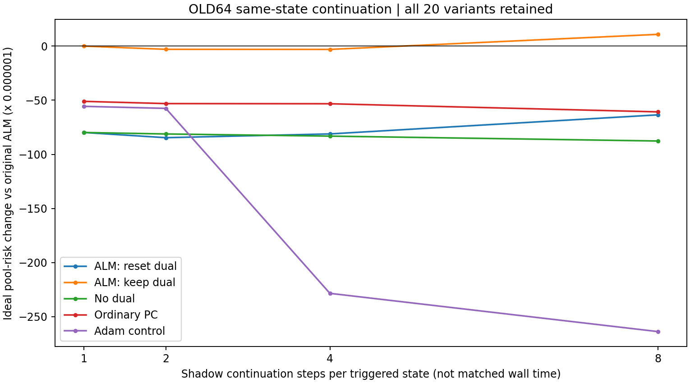

# 297｜短续接分支搜索：完整20配置开发结果

64个旧开发任务，先封存所有支持侧提议轨迹，再打开完整后验参照；不读取真实查询答案。256个逐位自检通过，2427个相同触发状态、20配置、两种网格全部保留。

两步重置ALM的理想池条件超额风险为 .00122211235，略好于单步 .00122690971；延长到八步为 .00124321511，并非越长越好。四步/八步Adam为 .00107828275/.00104292517，优于这些局部短续接。这里步数不是等时间，全部结果只是旧数据上的离线池诊断，不是部署任务收益。

特别地，重置ALM与无乘子算法的第1步参数和活动严格相同。因此，单步额外分支不能归因于新乘子累积；原ALM轨迹提供了状态，但这与影子更新本身的因果作用必须分开。保留乘子的第1步严格重现原轨迹下一步，新增池为零，这是预定的实现检查。

结论：不能靠延长当前局部续接来建立相对强BP的优势。下一步直接检验局部乘子方向的信息价值，同时把事件触发Adam短搜索纳入更强对照。PC-ALM主目标仍未完成；没有删掉优势更强的简单方法。

| 方法 | 网格 | 理想条件超额风险 | 相对原池差 | 两批对差值 | 质量覆盖 | 状态步/任务 | 新正区域/任务数 |
|---|---:|---:|---:|---|---:|---:|---|
| alm_reset_1 | 257 | 0.00122690970682 | -7.98139218298e-05 | -8.037586071e-05, -7.925198295e-05 | 0.8738095048 | 37.92188 | 5 / 5 |
| alm_reset_1 | 129 | 0.0012243115744 | -7.95525040531e-05 | -8.011619742e-05, -7.898881069e-05 | 0.8738095048 | 37.92188 | 5 / 5 |
| alm_reset_2 | 257 | 0.00122211234946 | -8.46112791872e-05 | -8.517051655e-05, -8.405204182e-05 | 0.8749982804 | 75.84375 | 9 / 9 |
| alm_reset_2 | 129 | 0.00121953676638 | -8.43273120798e-05 | -8.488831015e-05, -8.376631401e-05 | 0.8749982804 | 75.84375 | 9 / 9 |
| alm_reset_4 | 257 | 0.00122558240897 | -8.11412196826e-05 | -8.174658567e-05, -8.05358537e-05 | 0.8798461783 | 151.68750 | 18 / 13 |
| alm_reset_4 | 129 | 0.00122300246161 | -8.08616168443e-05 | -8.146866895e-05, -8.025456474e-05 | 0.8798461783 | 151.68750 | 18 / 13 |
| alm_reset_8 | 257 | 0.00124321510835 | -6.35085203047e-05 | -6.403644884e-05, -6.298059176e-05 | 0.8846098707 | 303.37500 | 28 / 16 |
| alm_reset_8 | 129 | 0.00124093531583 | -6.29287626274e-05 | -6.345785216e-05, -6.23996731e-05 | 0.8846098707 | 303.37500 | 28 / 16 |
| alm_keep_1 | 257 | 0.00130672362865 | 0 | 0, 0 | 0.866279194 | 37.92188 | 0 / 0 |
| alm_keep_1 | 129 | 0.00130386407846 | 0 | 0, 0 | 0.866279194 | 37.92188 | 0 / 0 |
| alm_keep_2 | 257 | 0.00130375532901 | -2.968299644e-06 | -2.962049708e-06, -2.97454958e-06 | 0.8674358114 | 75.84375 | 2 / 2 |
| alm_keep_2 | 129 | 0.00130090104876 | -2.96302969765e-06 | -2.957217293e-06, -2.968842102e-06 | 0.8674358114 | 75.84375 | 2 / 2 |
| alm_keep_4 | 257 | 0.001303681256 | -3.04237265126e-06 | -3.035795546e-06, -3.048949757e-06 | 0.8674649707 | 151.68750 | 3 / 2 |
| alm_keep_4 | 129 | 0.00130082628818 | -3.03779027116e-06 | -3.031651826e-06, -3.043928716e-06 | 0.8674649707 | 151.68750 | 3 / 2 |
| alm_keep_8 | 257 | 0.00131758543276 | 1.08618041122e-05 | 1.070144207e-05, 1.102216615e-05 | 0.8729231903 | 303.37500 | 7 / 6 |
| alm_keep_8 | 129 | 0.00131471777751 | 1.08536990559e-05 | 1.069095318e-05, 1.101644493e-05 | 0.8729231903 | 303.37500 | 7 / 6 |
| nodual_1 | 257 | 0.00122690970682 | -7.98139218298e-05 | -8.037586071e-05, -7.925198295e-05 | 0.8738095048 | 37.92188 | 5 / 5 |
| nodual_1 | 129 | 0.0012243115744 | -7.95525040531e-05 | -8.011619742e-05, -7.898881069e-05 | 0.8738095048 | 37.92188 | 5 / 5 |
| nodual_2 | 257 | 0.00122553766876 | -8.11859598916e-05 | -8.174699569e-05, -8.062492409e-05 | 0.8741107926 | 75.84375 | 7 / 6 |
| nodual_2 | 129 | 0.00122294368327 | -8.09203951831e-05 | -8.14830952e-05, -8.035769517e-05 | 0.8741107926 | 75.84375 | 7 / 6 |
| nodual_4 | 257 | 0.00122355761577 | -8.31660128808e-05 | -8.37270445e-05, -8.260498126e-05 | 0.8748199057 | 151.68750 | 9 / 7 |
| nodual_4 | 129 | 0.00122096082626 | -8.29032521989e-05 | -8.346594558e-05, -8.234055881e-05 | 0.8748199057 | 151.68750 | 9 / 7 |
| nodual_8 | 257 | 0.00121903565627 | -8.76879723818e-05 | -8.824800554e-05, -8.712793922e-05 | 0.8757132363 | 303.37500 | 12 / 10 |
| nodual_8 | 129 | 0.00121646392078 | -8.740015768e-05 | -8.796188713e-05, -8.683842823e-05 | 0.8757132363 | 303.37500 | 12 / 10 |
| pc_1 | 257 | 0.00125567454746 | -5.10490811854e-05 | -5.118728074e-05, -5.091088163e-05 | 0.8700724937 | 37.92188 | 3 / 3 |
| pc_1 | 129 | 0.0012530087367 | -5.08553417561e-05 | -5.0993659e-05, -5.071702451e-05 | 0.8700724937 | 37.92188 | 3 / 3 |
| pc_2 | 257 | 0.00125360563091 | -5.31179977397e-05 | -5.325445689e-05, -5.298153859e-05 | 0.8708096886 | 75.84375 | 7 / 6 |
| pc_2 | 129 | 0.00125093047226 | -5.29336061986e-05 | -5.307015558e-05, -5.279705682e-05 | 0.8708096886 | 75.84375 | 7 / 6 |
| pc_4 | 257 | 0.00125345666167 | -5.32669669809e-05 | -5.339937851e-05, -5.313455546e-05 | 0.870869562 | 151.68750 | 9 / 6 |
| pc_4 | 129 | 0.00125076665042 | -5.30974280403e-05 | -5.322986188e-05, -5.29649942e-05 | 0.870869562 | 151.68750 | 9 / 6 |
| pc_8 | 257 | 0.00124596281446 | -6.0760814186e-05 | -6.089017032e-05, -6.063145805e-05 | 0.8724970356 | 303.37500 | 17 / 10 |
| pc_8 | 129 | 0.00124328701497 | -6.05770634813e-05 | -6.070647771e-05, -6.044764925e-05 | 0.8724970356 | 303.37500 | 17 / 10 |
| adam_1 | 257 | 0.00125107208129 | -5.5651547363e-05 | -5.582392502e-05, -5.547916971e-05 | 0.8742843805 | 37.92188 | 13 / 13 |
| adam_1 | 129 | 0.00124842320026 | -5.54408781976e-05 | -5.561374151e-05, -5.526801489e-05 | 0.8742843805 | 37.92188 | 13 / 13 |
| adam_2 | 257 | 0.00124919048989 | -5.75331387651e-05 | -5.770455085e-05, -5.736172668e-05 | 0.8745833735 | 75.84375 | 19 / 14 |
| adam_2 | 129 | 0.00124656286791 | -5.73012105443e-05 | -5.747320938e-05, -5.712921171e-05 | 0.8745833735 | 75.84375 | 19 / 14 |
| adam_4 | 257 | 0.00107828274552 | -0.000228440883133 | -0.0002290244804, -0.0002278572858 | 0.8836319494 | 151.68750 | 33 / 18 |
| adam_4 | 129 | 0.0010756582007 | -0.000228205877753 | -0.0002287924863, -0.0002276192692 | 0.8836319494 | 151.68750 | 33 / 18 |
| adam_8 | 257 | 0.00104292516951 | -0.000263798459143 | -0.0002643560723, -0.000263240846 | 0.8917774148 | 303.37500 | 57 / 24 |
| adam_8 | 129 | 0.00104051268115 | -0.000263351397303 | -0.0002639107359, -0.0002627920587 | 0.8917774148 | 303.37500 | 57 / 24 |

结果摘要SHA256：`e56044455259e98b68ed5d2e7b0c7ad4c2860036e4f967d3755ce9325f21ee81`。脚本、全量提议、封存清单、逐任务风险位于development_v1。计时仅为该诊断分块计算，缺少实际新方法几何与读出，不能与294完整调用直接比速度。
