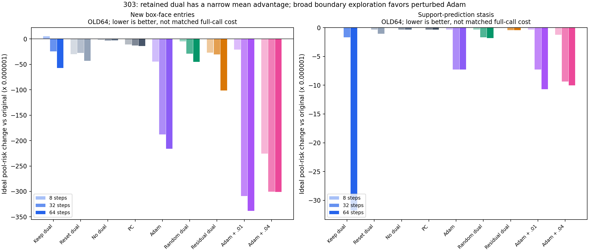
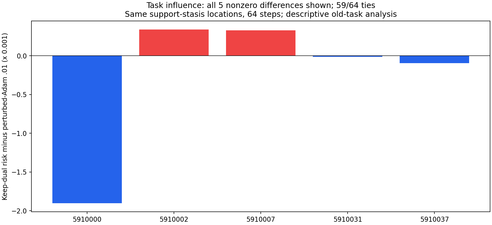

# 303｜可观察障碍位置上的108配置：局部线索与强反例

全部108配置完成：64旧任务×108方法×2网格=13824行。四个选择组与9更新族、8/32/64步完全按执行前协议保留；候选不读取精确驻点证书或查询答案。先封存全部支持轨迹，再读离线区域矩。

## 结果应怎样解释

在预测停滞131位置（19任务）上，保留原乘子64步的理想条件超额风险为 .00127495388576，原池 .00130672362865；清零 .00130567133246、随机符号 .00130490821235、残差方向 .00130627039496、普通Adam .00129947045597、扰动.01 Adam .00129602216564、扰动.04 Adam .00129668768713。边界且预测停滞117位置产生相同的所有理想池风险，状态成本更少；这不是新任务确认。

在广泛的新边界面2984位置上，保留乘子64步为 .00124951766212，扰动.01 Adam64为 .00096838778282，明显更低。完整原始状态停滞31位置的全部27配置均没有增加正体积分支或改变理想池风险。不能只展示有利选择组而声称整体优势。

## 对正向均值做影响诊断

预测停滞/64步下，保留乘子相对扰动.01 Adam的64任务均值差为-2.106827988e-05，3个任务更低、2个更高、59个相同（1e−12仅用于描述性平局计数）。两MC批次对差均值分别为-2.14727761257e-05和-2.06637836343e-05。

其中5910000单任务差为−.0019022778584，贡献主导了总体均值。逐一删除任一任务后的均值范围[-2.67588588609e-05, 8.79218962033e-06]跨过零。因此现有正向均值不足以声称稳定的任务分布优势；原64任务和所有结果均保留，不删除不利或有利任务重新包装结论。

task_influence.json保存全部4选择组×3步数×2网格×8对照=192配对的所有逐任务差与逐一删除诊断。这些是开发后的描述性分析，不是预注册显著性检验或新任务置信区间。优势主导任务5910000不是301发现的四个精确盒局部极小点任务，所以当前均值差也不能直接归因于那些精确证书。

## 数学机制与下一步

同一(b,h)状态、同一局部更新目标和块求解器，仅改变初始乘子，确实可能改变跨分支访问；本轮保留信用的风险均值低于清零/随机方向是待检验线索。但是一般ALM压力逃逸定理不能证明这里每个状态满足其前提，更不能推出风险改善。需要在完整在线实现中保留对照，查看保留乘子带来的新分支是否抵得过检测、续接及几何成本。

下一步只作真实接口与资源可行性预检：实现支持预测停滞的在线检测及批量续接，验证与303封存轨迹一致、原模型路径不变，再实测完整调用。不会因为这次旧任务均值较好就直接扩大样本追逐微差。必要的强回归/浅头/强BP新冻结比较仍未完成。

## 复核与资源边界

3115个唯一位置，四组数量2984/131/117/31；45/45/62任务在后三组为空，按协议使用原池。576组初始点/盒检查、64组原ALM下一步、64组reset/nodual b、64组reset/nodual h、6912组前缀包含初始点、1728组嵌套选择池检查均通过。残差归一化最大误差2.22e−16，风险math.fsum检查最大误差3.47e−18。

扰动Adam初始点包含在池内；两幅度用同一预定符号向量，未重抽挑选。所有原始b轨迹、支持误差、局部首末活动/乘子与原始起点保存。状态步、求导行、初始化和计时均记录；统一去重批次的诊断计时不是子集独立调用速度，命名状态小计不含工作区，非完整资源匹配。

## 全量表：108方法×2网格

两对MC批次内积估计全部保留，数值体积并非精确实数体积；风险允许非单调，不对负估计作截断。

| 方法 | 网格 | 理想超额风险 | 相对原池差 | 对01差 | 对23差 | 覆盖 | 状态步/任务 | 新正区域/任务数 |
|---|---:|---:|---:|---:|---:|---:|---:|---|
| boundary_entry__alm_keep_8 | 257 | 0.00131175319734 | 5.02956869381e-06 | 5.0228109917e-06 | 5.03632639592e-06 | 0.8691492575 | 373.000000 | 5 / 5 |
| boundary_entry__alm_keep_8 | 129 | 0.00130883404088 | 4.96996242108e-06 | 4.96267881764e-06 | 4.97724602451e-06 | 0.8691492575 | 373.000000 | 5 / 5 |
| boundary_entry__alm_keep_32 | 257 | 0.00128206596092 | -2.46576677326e-05 | -2.5177262358e-05 | -2.41380731071e-05 | 0.8791320365 | 1492.000000 | 23 / 14 |
| boundary_entry__alm_keep_32 | 129 | 0.00127918324852 | -2.46808299365e-05 | -2.52031815522e-05 | -2.41584783207e-05 | 0.8791320365 | 1492.000000 | 23 / 14 |
| boundary_entry__alm_keep_64 | 257 | 0.00124951766212 | -5.72059665333e-05 | -5.76725231111e-05 | -5.67394099556e-05 | 0.8886232755 | 2984.000000 | 45 / 23 |
| boundary_entry__alm_keep_64 | 129 | 0.00124665935599 | -5.72047224617e-05 | -5.76738700331e-05 | -5.67355748902e-05 | 0.8886232755 | 2984.000000 | 45 / 23 |
| boundary_entry__alm_reset_8 | 257 | 0.00127677241525 | -2.99512134047e-05 | -3.03916981444e-05 | -2.9510728665e-05 | 0.8754868218 | 373.000000 | 18 / 12 |
| boundary_entry__alm_reset_8 | 129 | 0.00127390891282 | -2.99551656315e-05 | -3.03979856673e-05 | -2.95123455956e-05 | 0.8754868218 | 373.000000 | 18 / 12 |
| boundary_entry__alm_reset_32 | 257 | 0.001279411279 | -2.73123496454e-05 | -2.78425181706e-05 | -2.67821811202e-05 | 0.8810768909 | 1492.000000 | 37 / 21 |
| boundary_entry__alm_reset_32 | 129 | 0.0012765126189 | -2.73514595595e-05 | -2.78842740322e-05 | -2.68186450867e-05 | 0.8810768909 | 1492.000000 | 37 / 21 |
| boundary_entry__alm_reset_64 | 257 | 0.00126372599914 | -4.2997629513e-05 | -4.3503543499e-05 | -4.2491715527e-05 | 0.8832632234 | 2984.000000 | 53 / 24 |
| boundary_entry__alm_reset_64 | 129 | 0.0012607752149 | -4.30888635553e-05 | -4.35978383892e-05 | -4.25798887214e-05 | 0.8832632234 | 2984.000000 | 53 / 24 |
| boundary_entry__nodual_8 | 257 | 0.00130506930164 | -1.65432700604e-06 | -1.66389237087e-06 | -1.64476164121e-06 | 0.8682484172 | 373.000000 | 10 / 8 |
| boundary_entry__nodual_8 | 129 | 0.00130218574715 | -1.67833130121e-06 | -1.68812595431e-06 | -1.66853664811e-06 | 0.8682484172 | 373.000000 | 10 / 8 |
| boundary_entry__nodual_32 | 257 | 0.00130354670133 | -3.17692731893e-06 | -3.18344640882e-06 | -3.17040822905e-06 | 0.8684709571 | 1492.000000 | 13 / 10 |
| boundary_entry__nodual_32 | 129 | 0.00130067329342 | -3.19078503241e-06 | -3.19742748102e-06 | -3.1841425838e-06 | 0.8684709571 | 1492.000000 | 13 / 10 |
| boundary_entry__nodual_64 | 257 | 0.00130381821694 | -2.90541170744e-06 | -2.9119596945e-06 | -2.89886372038e-06 | 0.8684997247 | 2984.000000 | 14 / 10 |
| boundary_entry__nodual_64 | 129 | 0.00130094461015 | -2.91946830146e-06 | -2.92614346773e-06 | -2.91279313519e-06 | 0.8684997247 | 2984.000000 | 14 / 10 |
| boundary_entry__pc_8 | 257 | 0.00129582903873 | -1.08945899224e-05 | -1.08971491555e-05 | -1.08920306894e-05 | 0.8685820012 | 373.000000 | 9 / 6 |
| boundary_entry__pc_8 | 129 | 0.00129297353853 | -1.08905399289e-05 | -1.08935595862e-05 | -1.08875202716e-05 | 0.8685820012 | 373.000000 | 9 / 6 |
| boundary_entry__pc_32 | 257 | 0.00129370497117 | -1.30186574833e-05 | -1.30178233068e-05 | -1.30194916598e-05 | 0.8692121268 | 1492.000000 | 17 / 9 |
| boundary_entry__pc_32 | 129 | 0.00129085177037 | -1.30123080807e-05 | -1.30118473603e-05 | -1.30127688012e-05 | 0.8692121268 | 1492.000000 | 17 / 9 |
| boundary_entry__pc_64 | 257 | 0.00129304322841 | -1.3680400243e-05 | -1.36808502305e-05 | -1.36799502555e-05 | 0.8695567493 | 2984.000000 | 21 / 12 |
| boundary_entry__pc_64 | 129 | 0.00129019179381 | -1.36722846451e-05 | -1.36728848488e-05 | -1.36716844414e-05 | 0.8695567493 | 2984.000000 | 21 / 12 |
| boundary_entry__adam_8 | 257 | 0.00126213306336 | -4.45905652888e-05 | -4.45955634619e-05 | -4.45855671158e-05 | 0.8756598415 | 373.000000 | 33 / 15 |
| boundary_entry__adam_8 | 129 | 0.0012595392809 | -4.4324797552e-05 | -4.43292056746e-05 | -4.43203894294e-05 | 0.8756598415 | 373.000000 | 33 / 15 |
| boundary_entry__adam_32 | 257 | 0.00111886970672 | -0.000187853921935 | -0.000187816923197 | -0.000187890920673 | 0.8845000638 | 1492.000000 | 72 / 22 |
| boundary_entry__adam_32 | 129 | 0.00111622392103 | -0.000187640157423 | -0.000187599274357 | -0.000187681040489 | 0.8845000638 | 1492.000000 | 72 / 22 |
| boundary_entry__adam_64 | 257 | 0.00109063939645 | -0.000216084232196 | -0.000215931138756 | -0.000216237325637 | 0.8887136501 | 2984.000000 | 83 / 23 |
| boundary_entry__adam_64 | 129 | 0.00108798715673 | -0.000215876921728 | -0.000215720899209 | -0.000216032944246 | 0.8887136501 | 2984.000000 | 83 / 23 |
| boundary_entry__alm_random_sign_8 | 257 | 0.00130184634356 | -4.87728508774e-06 | -4.85559184489e-06 | -4.89897833059e-06 | 0.868138528 | 373.000000 | 20 / 13 |
| boundary_entry__alm_random_sign_8 | 129 | 0.00129897069826 | -4.89338019261e-06 | -4.87206724059e-06 | -4.91469314463e-06 | 0.868138528 | 373.000000 | 20 / 13 |
| boundary_entry__alm_random_sign_32 | 257 | 0.0012775975646 | -2.91260640539e-05 | -2.95411281629e-05 | -2.8710999945e-05 | 0.8788221627 | 1492.000000 | 49 / 20 |
| boundary_entry__alm_random_sign_32 | 129 | 0.00127471733184 | -2.91467466139e-05 | -2.95644583957e-05 | -2.87290348322e-05 | 0.8788221627 | 1492.000000 | 49 / 20 |
| boundary_entry__alm_random_sign_64 | 257 | 0.00126150773502 | -4.52158936338e-05 | -4.54612981282e-05 | -4.49704891393e-05 | 0.8938762259 | 2984.000000 | 70 / 24 |
| boundary_entry__alm_random_sign_64 | 129 | 0.00125883865594 | -4.50254225151e-05 | -4.52734962638e-05 | -4.47773487664e-05 | 0.8938762259 | 2984.000000 | 70 / 24 |
| boundary_entry__alm_residual_8 | 257 | 0.00127986348688 | -2.68601417703e-05 | -2.69523220637e-05 | -2.67679614769e-05 | 0.8741603112 | 373.000000 | 22 / 14 |
| boundary_entry__alm_residual_8 | 129 | 0.00127696335202 | -2.6900726437e-05 | -2.6992255362e-05 | -2.68091975119e-05 | 0.8741603112 | 373.000000 | 22 / 14 |
| boundary_entry__alm_residual_32 | 257 | 0.00127598775998 | -3.07358686718e-05 | -3.08751188645e-05 | -3.05966184791e-05 | 0.8776778347 | 1492.000000 | 43 / 20 |
| boundary_entry__alm_residual_32 | 129 | 0.00127298838742 | -3.08756910319e-05 | -3.10159927767e-05 | -3.0735389287e-05 | 0.8776778347 | 1492.000000 | 43 / 20 |
| boundary_entry__alm_residual_64 | 257 | 0.00120528802107 | -0.000101435607579 | -0.000101947170196 | -0.000100924044962 | 0.8928341051 | 2984.000000 | 66 / 25 |
| boundary_entry__alm_residual_64 | 129 | 0.00120240268315 | -0.000101461395309 | -0.00010197511251 | -0.000100947678108 | 0.8928341051 | 2984.000000 | 66 / 25 |
| boundary_entry__adam_perturb_001_8 | 257 | 0.00128593319009 | -2.07904385592e-05 | -2.06706040295e-05 | -2.09102730889e-05 | 0.8754592531 | 373.000000 | 44 / 19 |
| boundary_entry__adam_perturb_001_8 | 129 | 0.00128320551298 | -2.06585654793e-05 | -2.05399732571e-05 | -2.07771577015e-05 | 0.8754592531 | 373.000000 | 44 / 19 |
| boundary_entry__adam_perturb_001_32 | 257 | 0.000997741088663 | -0.000308982539987 | -0.000308928501166 | -0.000309036578807 | 0.8882504545 | 1492.000000 | 94 / 25 |
| boundary_entry__adam_perturb_001_32 | 129 | 0.000995316158764 | -0.000308547919692 | -0.00030849124292 | -0.000308604596463 | 0.8882504545 | 1492.000000 | 94 / 25 |
| boundary_entry__adam_perturb_001_64 | 257 | 0.00096838778282 | -0.00033833584583 | -0.000338189264952 | -0.000338482426709 | 0.8927651156 | 2984.000000 | 105 / 27 |
| boundary_entry__adam_perturb_001_64 | 129 | 0.000965975596704 | -0.000337888481752 | -0.000337740123497 | -0.000338036840006 | 0.8927651156 | 2984.000000 | 105 / 27 |
| boundary_entry__adam_perturb_004_8 | 257 | 0.00108129177399 | -0.000225431854656 | -0.000225247993851 | -0.000225615715462 | 0.8837907975 | 373.000000 | 52 / 22 |
| boundary_entry__adam_perturb_004_8 | 129 | 0.00107888481834 | -0.000224979260113 | -0.000224794279025 | -0.000225164241202 | 0.8837907975 | 373.000000 | 52 / 22 |
| boundary_entry__adam_perturb_004_32 | 257 | 0.00100636494433 | -0.000300358684322 | -0.000300660693989 | -0.000300056674656 | 0.9108083068 | 1492.000000 | 127 / 34 |
| boundary_entry__adam_perturb_004_32 | 129 | 0.00100402036719 | -0.000299843711266 | -0.000300147307282 | -0.00029954011525 | 0.9108083068 | 1492.000000 | 127 / 34 |
| boundary_entry__adam_perturb_004_64 | 257 | 0.00100591908081 | -0.000300804547835 | -0.000301088830665 | -0.000300520265005 | 0.9126903618 | 2984.000000 | 147 / 34 |
| boundary_entry__adam_perturb_004_64 | 129 | 0.00100354747569 | -0.000300316602767 | -0.000300602591326 | -0.000300030614208 | 0.9126903618 | 2984.000000 | 147 / 34 |
| forward_stasis__alm_keep_8 | 257 | 0.00130672362865 | 0 | 0 | 0 | 0.866279194 | 16.375000 | 0 / 0 |
| forward_stasis__alm_keep_8 | 129 | 0.00130386407846 | 0 | 0 | 0 | 0.866279194 | 16.375000 | 0 / 0 |
| forward_stasis__alm_keep_32 | 257 | 0.00130505034057 | -1.67328807756e-06 | -1.67349615578e-06 | -1.67307999934e-06 | 0.8668258589 | 65.500000 | 3 / 2 |
| forward_stasis__alm_keep_32 | 129 | 0.00130218754825 | -1.67653020809e-06 | -1.67665038077e-06 | -1.67641003541e-06 | 0.8668258589 | 65.500000 | 3 / 2 |
| forward_stasis__alm_keep_64 | 257 | 0.00127495388576 | -3.17697428893e-05 | -3.21911602833e-05 | -3.13483254953e-05 | 0.8708240097 | 131.000000 | 6 / 4 |
| forward_stasis__alm_keep_64 | 129 | 0.00127217334233 | -3.169073613e-05 | -3.21136091358e-05 | -3.12678631242e-05 | 0.8708240097 | 131.000000 | 6 / 4 |
| forward_stasis__alm_reset_8 | 257 | 0.00130672362865 | 0 | 0 | 0 | 0.866279194 | 16.375000 | 0 / 0 |
| forward_stasis__alm_reset_8 | 129 | 0.00130386407846 | 0 | 0 | 0 | 0.866279194 | 16.375000 | 0 / 0 |
| forward_stasis__alm_reset_32 | 257 | 0.00130639350504 | -3.30123610013e-07 | -3.3131327508e-07 | -3.28933944945e-07 | 0.8665300562 | 65.500000 | 2 / 2 |
| forward_stasis__alm_reset_32 | 129 | 0.0013035265404 | -3.37538055415e-07 | -3.3873131294e-07 | -3.3634479789e-07 | 0.8665300562 | 65.500000 | 2 / 2 |
| forward_stasis__alm_reset_64 | 257 | 0.00130567133246 | -1.05229619278e-06 | -1.05262889121e-06 | -1.05196349435e-06 | 0.8668287512 | 131.000000 | 6 / 4 |
| forward_stasis__alm_reset_64 | 129 | 0.00130280452075 | -1.05955770976e-06 | -1.0598862017e-06 | -1.05922921783e-06 | 0.8668287512 | 131.000000 | 6 / 4 |
| forward_stasis__nodual_8 | 257 | 0.00130672362865 | 0 | 0 | 0 | 0.866279194 | 16.375000 | 0 / 0 |
| forward_stasis__nodual_8 | 129 | 0.00130386407846 | 0 | 0 | 0 | 0.866279194 | 16.375000 | 0 / 0 |
| forward_stasis__nodual_32 | 257 | 0.00130639361275 | -3.30015898356e-07 | -3.31205399196e-07 | -3.28826397515e-07 | 0.8665300378 | 65.500000 | 1 / 1 |
| forward_stasis__nodual_32 | 129 | 0.00130352664732 | -3.37431133725e-07 | -3.38624227539e-07 | -3.36238039911e-07 | 0.8665300378 | 65.500000 | 1 / 1 |
| forward_stasis__nodual_64 | 257 | 0.00130639361275 | -3.30015898356e-07 | -3.31205399196e-07 | -3.28826397515e-07 | 0.8665300378 | 131.000000 | 1 / 1 |
| forward_stasis__nodual_64 | 129 | 0.00130352664732 | -3.37431133725e-07 | -3.38624227539e-07 | -3.36238039911e-07 | 0.8665300378 | 131.000000 | 1 / 1 |
| forward_stasis__pc_8 | 257 | 0.00130672362865 | 0 | 0 | 0 | 0.866279194 | 16.375000 | 0 / 0 |
| forward_stasis__pc_8 | 129 | 0.00130386407846 | 0 | 0 | 0 | 0.866279194 | 16.375000 | 0 / 0 |
| forward_stasis__pc_32 | 257 | 0.00130639362198 | -3.30006670588e-07 | -3.31196142798e-07 | -3.28817198379e-07 | 0.8665300396 | 65.500000 | 2 / 2 |
| forward_stasis__pc_32 | 129 | 0.00130352665655 | -3.37421901594e-07 | -3.3861496703e-07 | -3.36228836159e-07 | 0.8665300396 | 65.500000 | 2 / 2 |
| forward_stasis__pc_64 | 257 | 0.00130639362198 | -3.30006670588e-07 | -3.31196142798e-07 | -3.28817198379e-07 | 0.8665300396 | 131.000000 | 2 / 2 |
| forward_stasis__pc_64 | 129 | 0.00130352665655 | -3.37421901594e-07 | -3.3861496703e-07 | -3.36228836159e-07 | 0.8665300396 | 131.000000 | 2 / 2 |
| forward_stasis__adam_8 | 257 | 0.00130639361275 | -3.30015898356e-07 | -3.31205399196e-07 | -3.28826397515e-07 | 0.8665300378 | 16.375000 | 1 / 1 |
| forward_stasis__adam_8 | 129 | 0.00130352664732 | -3.37431133725e-07 | -3.38624227539e-07 | -3.36238039911e-07 | 0.8665300378 | 16.375000 | 1 / 1 |
| forward_stasis__adam_32 | 257 | 0.00129947045597 | -7.25317267843e-06 | -7.26692924534e-06 | -7.23941611153e-06 | 0.8679834117 | 65.500000 | 9 / 3 |
| forward_stasis__adam_32 | 129 | 0.00129663458371 | -7.22949474794e-06 | -7.24343723959e-06 | -7.21555225629e-06 | 0.8679834117 | 65.500000 | 9 / 3 |
| forward_stasis__adam_64 | 257 | 0.00129947045597 | -7.25317267843e-06 | -7.26692924534e-06 | -7.23941611153e-06 | 0.8679834117 | 131.000000 | 9 / 3 |
| forward_stasis__adam_64 | 129 | 0.00129663458371 | -7.22949474794e-06 | -7.24343723959e-06 | -7.21555225629e-06 | 0.8679834117 | 131.000000 | 9 / 3 |
| forward_stasis__alm_random_sign_8 | 257 | 0.00130639361275 | -3.30015898356e-07 | -3.31205399196e-07 | -3.28826397515e-07 | 0.8665300378 | 16.375000 | 1 / 1 |
| forward_stasis__alm_random_sign_8 | 129 | 0.00130352664732 | -3.37431133725e-07 | -3.38624227539e-07 | -3.36238039911e-07 | 0.8665300378 | 16.375000 | 1 / 1 |
| forward_stasis__alm_random_sign_32 | 257 | 0.00130505040367 | -1.67322498514e-06 | -1.67343290129e-06 | -1.673017069e-06 | 0.8668258405 | 65.500000 | 2 / 2 |
| forward_stasis__alm_random_sign_32 | 129 | 0.00130218761083 | -1.67646762693e-06 | -1.6765876373e-06 | -1.67634761657e-06 | 0.8668258405 | 65.500000 | 2 / 2 |
| forward_stasis__alm_random_sign_64 | 257 | 0.00130490821235 | -1.81541629975e-06 | -1.81585851724e-06 | -1.81497408226e-06 | 0.8668518623 | 131.000000 | 5 / 3 |
| forward_stasis__alm_random_sign_64 | 129 | 0.00130204608821 | -1.81799024536e-06 | -1.8183520399e-06 | -1.81762845081e-06 | 0.8668518623 | 131.000000 | 5 / 3 |
| forward_stasis__alm_residual_8 | 257 | 0.00130672362865 | 0 | 0 | 0 | 0.866279194 | 16.375000 | 0 / 0 |
| forward_stasis__alm_residual_8 | 129 | 0.00130386407846 | 0 | 0 | 0 | 0.866279194 | 16.375000 | 0 / 0 |
| forward_stasis__alm_residual_32 | 257 | 0.00130627039496 | -4.53233692082e-07 | -4.54487330567e-07 | -4.51980053598e-07 | 0.8665540962 | 65.500000 | 4 / 3 |
| forward_stasis__alm_residual_32 | 129 | 0.00130340464818 | -4.59430279229e-07 | -4.60683519596e-07 | -4.58177038862e-07 | 0.8665540962 | 65.500000 | 4 / 3 |
| forward_stasis__alm_residual_64 | 257 | 0.00130627039496 | -4.53233692082e-07 | -4.54487330567e-07 | -4.51980053598e-07 | 0.8665540962 | 131.000000 | 4 / 3 |
| forward_stasis__alm_residual_64 | 129 | 0.00130340464818 | -4.59430279229e-07 | -4.60683519596e-07 | -4.58177038862e-07 | 0.8665540962 | 131.000000 | 4 / 3 |
| forward_stasis__adam_perturb_001_8 | 257 | 0.00130639425413 | -3.29374519163e-07 | -3.30565365903e-07 | -3.28183672423e-07 | 0.8665301381 | 16.375000 | 2 / 2 |
| forward_stasis__adam_perturb_001_8 | 129 | 0.00130352728447 | -3.36793983412e-07 | -3.37988385569e-07 | -3.35599581256e-07 | 0.8665301381 | 16.375000 | 2 / 2 |
| forward_stasis__adam_perturb_001_32 | 257 | 0.00129944276303 | -7.28086562459e-06 | -7.29474419184e-06 | -7.26698705734e-06 | 0.8679981542 | 65.500000 | 15 / 3 |
| forward_stasis__adam_perturb_001_32 | 129 | 0.00129660687324 | -7.25720521276e-06 | -7.271268726e-06 | -7.24314169952e-06 | 0.8679981542 | 65.500000 | 15 / 3 |
| forward_stasis__adam_perturb_001_64 | 257 | 0.00129602216564 | -1.07014630093e-05 | -1.07183841576e-05 | -1.0684541861e-05 | 0.8687522897 | 131.000000 | 20 / 3 |
| forward_stasis__adam_perturb_001_64 | 129 | 0.00129318447278 | -1.06796056766e-05 | -1.06967543947e-05 | -1.06624569586e-05 | 0.8687522897 | 131.000000 | 20 / 3 |
| forward_stasis__adam_perturb_004_8 | 257 | 0.0013054920252 | -1.23160345271e-06 | -1.23075252794e-06 | -1.23245437748e-06 | 0.8667234663 | 16.375000 | 6 / 3 |
| forward_stasis__adam_perturb_004_8 | 129 | 0.00130262513204 | -1.23894641128e-06 | -1.23808344507e-06 | -1.23980937749e-06 | 0.8667234663 | 16.375000 | 6 / 3 |
| forward_stasis__adam_perturb_004_32 | 257 | 0.0012973425609 | -9.38106774553e-06 | -9.3959278266e-06 | -9.36620766447e-06 | 0.8684166411 | 65.500000 | 17 / 4 |
| forward_stasis__adam_perturb_004_32 | 129 | 0.00129450965982 | -9.35441863895e-06 | -9.36935545205e-06 | -9.33948182584e-06 | 0.8684166411 | 65.500000 | 17 / 4 |
| forward_stasis__adam_perturb_004_64 | 257 | 0.00129668768713 | -1.00359415175e-05 | -1.00523414532e-05 | -1.00195415818e-05 | 0.8685356803 | 131.000000 | 22 / 4 |
| forward_stasis__adam_perturb_004_64 | 129 | 0.00129385420642 | -1.00098720361e-05 | -1.0026348585e-05 | -9.99339548724e-06 | 0.8685356803 | 131.000000 | 22 / 4 |
| boundary_and_forward_stasis__alm_keep_8 | 257 | 0.00130672362865 | 0 | 0 | 0 | 0.866279194 | 14.625000 | 0 / 0 |
| boundary_and_forward_stasis__alm_keep_8 | 129 | 0.00130386407846 | 0 | 0 | 0 | 0.866279194 | 14.625000 | 0 / 0 |
| boundary_and_forward_stasis__alm_keep_32 | 257 | 0.00130505034057 | -1.67328807756e-06 | -1.67349615578e-06 | -1.67307999934e-06 | 0.8668258589 | 58.500000 | 3 / 2 |
| boundary_and_forward_stasis__alm_keep_32 | 129 | 0.00130218754825 | -1.67653020809e-06 | -1.67665038077e-06 | -1.67641003541e-06 | 0.8668258589 | 58.500000 | 3 / 2 |
| boundary_and_forward_stasis__alm_keep_64 | 257 | 0.00127495388576 | -3.17697428893e-05 | -3.21911602833e-05 | -3.13483254953e-05 | 0.8708240097 | 117.000000 | 6 / 4 |
| boundary_and_forward_stasis__alm_keep_64 | 129 | 0.00127217334233 | -3.169073613e-05 | -3.21136091358e-05 | -3.12678631242e-05 | 0.8708240097 | 117.000000 | 6 / 4 |
| boundary_and_forward_stasis__alm_reset_8 | 257 | 0.00130672362865 | 0 | 0 | 0 | 0.866279194 | 14.625000 | 0 / 0 |
| boundary_and_forward_stasis__alm_reset_8 | 129 | 0.00130386407846 | 0 | 0 | 0 | 0.866279194 | 14.625000 | 0 / 0 |
| boundary_and_forward_stasis__alm_reset_32 | 257 | 0.00130639350504 | -3.30123610013e-07 | -3.3131327508e-07 | -3.28933944945e-07 | 0.8665300562 | 58.500000 | 2 / 2 |
| boundary_and_forward_stasis__alm_reset_32 | 129 | 0.0013035265404 | -3.37538055415e-07 | -3.3873131294e-07 | -3.3634479789e-07 | 0.8665300562 | 58.500000 | 2 / 2 |
| boundary_and_forward_stasis__alm_reset_64 | 257 | 0.00130567133246 | -1.05229619278e-06 | -1.05262889121e-06 | -1.05196349435e-06 | 0.8668287512 | 117.000000 | 6 / 4 |
| boundary_and_forward_stasis__alm_reset_64 | 129 | 0.00130280452075 | -1.05955770976e-06 | -1.0598862017e-06 | -1.05922921783e-06 | 0.8668287512 | 117.000000 | 6 / 4 |
| boundary_and_forward_stasis__nodual_8 | 257 | 0.00130672362865 | 0 | 0 | 0 | 0.866279194 | 14.625000 | 0 / 0 |
| boundary_and_forward_stasis__nodual_8 | 129 | 0.00130386407846 | 0 | 0 | 0 | 0.866279194 | 14.625000 | 0 / 0 |
| boundary_and_forward_stasis__nodual_32 | 257 | 0.00130639361275 | -3.30015898356e-07 | -3.31205399196e-07 | -3.28826397515e-07 | 0.8665300378 | 58.500000 | 1 / 1 |
| boundary_and_forward_stasis__nodual_32 | 129 | 0.00130352664732 | -3.37431133725e-07 | -3.38624227539e-07 | -3.36238039911e-07 | 0.8665300378 | 58.500000 | 1 / 1 |
| boundary_and_forward_stasis__nodual_64 | 257 | 0.00130639361275 | -3.30015898356e-07 | -3.31205399196e-07 | -3.28826397515e-07 | 0.8665300378 | 117.000000 | 1 / 1 |
| boundary_and_forward_stasis__nodual_64 | 129 | 0.00130352664732 | -3.37431133725e-07 | -3.38624227539e-07 | -3.36238039911e-07 | 0.8665300378 | 117.000000 | 1 / 1 |
| boundary_and_forward_stasis__pc_8 | 257 | 0.00130672362865 | 0 | 0 | 0 | 0.866279194 | 14.625000 | 0 / 0 |
| boundary_and_forward_stasis__pc_8 | 129 | 0.00130386407846 | 0 | 0 | 0 | 0.866279194 | 14.625000 | 0 / 0 |
| boundary_and_forward_stasis__pc_32 | 257 | 0.00130639362198 | -3.30006670588e-07 | -3.31196142798e-07 | -3.28817198379e-07 | 0.8665300396 | 58.500000 | 2 / 2 |
| boundary_and_forward_stasis__pc_32 | 129 | 0.00130352665655 | -3.37421901594e-07 | -3.3861496703e-07 | -3.36228836159e-07 | 0.8665300396 | 58.500000 | 2 / 2 |
| boundary_and_forward_stasis__pc_64 | 257 | 0.00130639362198 | -3.30006670588e-07 | -3.31196142798e-07 | -3.28817198379e-07 | 0.8665300396 | 117.000000 | 2 / 2 |
| boundary_and_forward_stasis__pc_64 | 129 | 0.00130352665655 | -3.37421901594e-07 | -3.3861496703e-07 | -3.36228836159e-07 | 0.8665300396 | 117.000000 | 2 / 2 |
| boundary_and_forward_stasis__adam_8 | 257 | 0.00130639361275 | -3.30015898356e-07 | -3.31205399196e-07 | -3.28826397515e-07 | 0.8665300378 | 14.625000 | 1 / 1 |
| boundary_and_forward_stasis__adam_8 | 129 | 0.00130352664732 | -3.37431133725e-07 | -3.38624227539e-07 | -3.36238039911e-07 | 0.8665300378 | 14.625000 | 1 / 1 |
| boundary_and_forward_stasis__adam_32 | 257 | 0.00129947045597 | -7.25317267843e-06 | -7.26692924534e-06 | -7.23941611153e-06 | 0.8679834117 | 58.500000 | 9 / 3 |
| boundary_and_forward_stasis__adam_32 | 129 | 0.00129663458371 | -7.22949474794e-06 | -7.24343723959e-06 | -7.21555225629e-06 | 0.8679834117 | 58.500000 | 9 / 3 |
| boundary_and_forward_stasis__adam_64 | 257 | 0.00129947045597 | -7.25317267843e-06 | -7.26692924534e-06 | -7.23941611153e-06 | 0.8679834117 | 117.000000 | 9 / 3 |
| boundary_and_forward_stasis__adam_64 | 129 | 0.00129663458371 | -7.22949474794e-06 | -7.24343723959e-06 | -7.21555225629e-06 | 0.8679834117 | 117.000000 | 9 / 3 |
| boundary_and_forward_stasis__alm_random_sign_8 | 257 | 0.00130639361275 | -3.30015898356e-07 | -3.31205399196e-07 | -3.28826397515e-07 | 0.8665300378 | 14.625000 | 1 / 1 |
| boundary_and_forward_stasis__alm_random_sign_8 | 129 | 0.00130352664732 | -3.37431133725e-07 | -3.38624227539e-07 | -3.36238039911e-07 | 0.8665300378 | 14.625000 | 1 / 1 |
| boundary_and_forward_stasis__alm_random_sign_32 | 257 | 0.00130505040367 | -1.67322498514e-06 | -1.67343290129e-06 | -1.673017069e-06 | 0.8668258405 | 58.500000 | 2 / 2 |
| boundary_and_forward_stasis__alm_random_sign_32 | 129 | 0.00130218761083 | -1.67646762693e-06 | -1.6765876373e-06 | -1.67634761657e-06 | 0.8668258405 | 58.500000 | 2 / 2 |
| boundary_and_forward_stasis__alm_random_sign_64 | 257 | 0.00130490821235 | -1.81541629975e-06 | -1.81585851724e-06 | -1.81497408226e-06 | 0.8668518623 | 117.000000 | 5 / 3 |
| boundary_and_forward_stasis__alm_random_sign_64 | 129 | 0.00130204608821 | -1.81799024536e-06 | -1.8183520399e-06 | -1.81762845081e-06 | 0.8668518623 | 117.000000 | 5 / 3 |
| boundary_and_forward_stasis__alm_residual_8 | 257 | 0.00130672362865 | 0 | 0 | 0 | 0.866279194 | 14.625000 | 0 / 0 |
| boundary_and_forward_stasis__alm_residual_8 | 129 | 0.00130386407846 | 0 | 0 | 0 | 0.866279194 | 14.625000 | 0 / 0 |
| boundary_and_forward_stasis__alm_residual_32 | 257 | 0.00130627039496 | -4.53233692082e-07 | -4.54487330567e-07 | -4.51980053598e-07 | 0.8665540962 | 58.500000 | 4 / 3 |
| boundary_and_forward_stasis__alm_residual_32 | 129 | 0.00130340464818 | -4.59430279229e-07 | -4.60683519596e-07 | -4.58177038862e-07 | 0.8665540962 | 58.500000 | 4 / 3 |
| boundary_and_forward_stasis__alm_residual_64 | 257 | 0.00130627039496 | -4.53233692082e-07 | -4.54487330567e-07 | -4.51980053598e-07 | 0.8665540962 | 117.000000 | 4 / 3 |
| boundary_and_forward_stasis__alm_residual_64 | 129 | 0.00130340464818 | -4.59430279229e-07 | -4.60683519596e-07 | -4.58177038862e-07 | 0.8665540962 | 117.000000 | 4 / 3 |
| boundary_and_forward_stasis__adam_perturb_001_8 | 257 | 0.00130639425413 | -3.29374519163e-07 | -3.30565365903e-07 | -3.28183672423e-07 | 0.8665301381 | 14.625000 | 2 / 2 |
| boundary_and_forward_stasis__adam_perturb_001_8 | 129 | 0.00130352728447 | -3.36793983412e-07 | -3.37988385569e-07 | -3.35599581256e-07 | 0.8665301381 | 14.625000 | 2 / 2 |
| boundary_and_forward_stasis__adam_perturb_001_32 | 257 | 0.00129944276303 | -7.28086562459e-06 | -7.29474419184e-06 | -7.26698705734e-06 | 0.8679981542 | 58.500000 | 15 / 3 |
| boundary_and_forward_stasis__adam_perturb_001_32 | 129 | 0.00129660687324 | -7.25720521276e-06 | -7.271268726e-06 | -7.24314169952e-06 | 0.8679981542 | 58.500000 | 15 / 3 |
| boundary_and_forward_stasis__adam_perturb_001_64 | 257 | 0.00129602216564 | -1.07014630093e-05 | -1.07183841576e-05 | -1.0684541861e-05 | 0.8687522897 | 117.000000 | 20 / 3 |
| boundary_and_forward_stasis__adam_perturb_001_64 | 129 | 0.00129318447278 | -1.06796056766e-05 | -1.06967543947e-05 | -1.06624569586e-05 | 0.8687522897 | 117.000000 | 20 / 3 |
| boundary_and_forward_stasis__adam_perturb_004_8 | 257 | 0.0013054920252 | -1.23160345271e-06 | -1.23075252794e-06 | -1.23245437748e-06 | 0.8667234663 | 14.625000 | 6 / 3 |
| boundary_and_forward_stasis__adam_perturb_004_8 | 129 | 0.00130262513204 | -1.23894641128e-06 | -1.23808344507e-06 | -1.23980937749e-06 | 0.8667234663 | 14.625000 | 6 / 3 |
| boundary_and_forward_stasis__adam_perturb_004_32 | 257 | 0.0012973425609 | -9.38106774553e-06 | -9.3959278266e-06 | -9.36620766447e-06 | 0.8684166411 | 58.500000 | 17 / 4 |
| boundary_and_forward_stasis__adam_perturb_004_32 | 129 | 0.00129450965982 | -9.35441863895e-06 | -9.36935545205e-06 | -9.33948182584e-06 | 0.8684166411 | 58.500000 | 17 / 4 |
| boundary_and_forward_stasis__adam_perturb_004_64 | 257 | 0.00129668768713 | -1.00359415175e-05 | -1.00523414532e-05 | -1.00195415818e-05 | 0.8685356803 | 117.000000 | 22 / 4 |
| boundary_and_forward_stasis__adam_perturb_004_64 | 129 | 0.00129385420642 | -1.00098720361e-05 | -1.0026348585e-05 | -9.99339548724e-06 | 0.8685356803 | 117.000000 | 22 / 4 |
| primal_stasis__alm_keep_8 | 257 | 0.00130672362865 | 0 | 0 | 0 | 0.866279194 | 3.875000 | 0 / 0 |
| primal_stasis__alm_keep_8 | 129 | 0.00130386407846 | 0 | 0 | 0 | 0.866279194 | 3.875000 | 0 / 0 |
| primal_stasis__alm_keep_32 | 257 | 0.00130672362865 | 0 | 0 | 0 | 0.866279194 | 15.500000 | 0 / 0 |
| primal_stasis__alm_keep_32 | 129 | 0.00130386407846 | 0 | 0 | 0 | 0.866279194 | 15.500000 | 0 / 0 |
| primal_stasis__alm_keep_64 | 257 | 0.00130672362865 | 0 | 0 | 0 | 0.866279194 | 31.000000 | 0 / 0 |
| primal_stasis__alm_keep_64 | 129 | 0.00130386407846 | 0 | 0 | 0 | 0.866279194 | 31.000000 | 0 / 0 |
| primal_stasis__alm_reset_8 | 257 | 0.00130672362865 | 0 | 0 | 0 | 0.866279194 | 3.875000 | 0 / 0 |
| primal_stasis__alm_reset_8 | 129 | 0.00130386407846 | 0 | 0 | 0 | 0.866279194 | 3.875000 | 0 / 0 |
| primal_stasis__alm_reset_32 | 257 | 0.00130672362865 | 0 | 0 | 0 | 0.866279194 | 15.500000 | 0 / 0 |
| primal_stasis__alm_reset_32 | 129 | 0.00130386407846 | 0 | 0 | 0 | 0.866279194 | 15.500000 | 0 / 0 |
| primal_stasis__alm_reset_64 | 257 | 0.00130672362865 | 0 | 0 | 0 | 0.866279194 | 31.000000 | 0 / 0 |
| primal_stasis__alm_reset_64 | 129 | 0.00130386407846 | 0 | 0 | 0 | 0.866279194 | 31.000000 | 0 / 0 |
| primal_stasis__nodual_8 | 257 | 0.00130672362865 | 0 | 0 | 0 | 0.866279194 | 3.875000 | 0 / 0 |
| primal_stasis__nodual_8 | 129 | 0.00130386407846 | 0 | 0 | 0 | 0.866279194 | 3.875000 | 0 / 0 |
| primal_stasis__nodual_32 | 257 | 0.00130672362865 | 0 | 0 | 0 | 0.866279194 | 15.500000 | 0 / 0 |
| primal_stasis__nodual_32 | 129 | 0.00130386407846 | 0 | 0 | 0 | 0.866279194 | 15.500000 | 0 / 0 |
| primal_stasis__nodual_64 | 257 | 0.00130672362865 | 0 | 0 | 0 | 0.866279194 | 31.000000 | 0 / 0 |
| primal_stasis__nodual_64 | 129 | 0.00130386407846 | 0 | 0 | 0 | 0.866279194 | 31.000000 | 0 / 0 |
| primal_stasis__pc_8 | 257 | 0.00130672362865 | 0 | 0 | 0 | 0.866279194 | 3.875000 | 0 / 0 |
| primal_stasis__pc_8 | 129 | 0.00130386407846 | 0 | 0 | 0 | 0.866279194 | 3.875000 | 0 / 0 |
| primal_stasis__pc_32 | 257 | 0.00130672362865 | 0 | 0 | 0 | 0.866279194 | 15.500000 | 0 / 0 |
| primal_stasis__pc_32 | 129 | 0.00130386407846 | 0 | 0 | 0 | 0.866279194 | 15.500000 | 0 / 0 |
| primal_stasis__pc_64 | 257 | 0.00130672362865 | 0 | 0 | 0 | 0.866279194 | 31.000000 | 0 / 0 |
| primal_stasis__pc_64 | 129 | 0.00130386407846 | 0 | 0 | 0 | 0.866279194 | 31.000000 | 0 / 0 |
| primal_stasis__adam_8 | 257 | 0.00130672362865 | 0 | 0 | 0 | 0.866279194 | 3.875000 | 0 / 0 |
| primal_stasis__adam_8 | 129 | 0.00130386407846 | 0 | 0 | 0 | 0.866279194 | 3.875000 | 0 / 0 |
| primal_stasis__adam_32 | 257 | 0.00130672362865 | 0 | 0 | 0 | 0.866279194 | 15.500000 | 0 / 0 |
| primal_stasis__adam_32 | 129 | 0.00130386407846 | 0 | 0 | 0 | 0.866279194 | 15.500000 | 0 / 0 |
| primal_stasis__adam_64 | 257 | 0.00130672362865 | 0 | 0 | 0 | 0.866279194 | 31.000000 | 0 / 0 |
| primal_stasis__adam_64 | 129 | 0.00130386407846 | 0 | 0 | 0 | 0.866279194 | 31.000000 | 0 / 0 |
| primal_stasis__alm_random_sign_8 | 257 | 0.00130672362865 | 0 | 0 | 0 | 0.866279194 | 3.875000 | 0 / 0 |
| primal_stasis__alm_random_sign_8 | 129 | 0.00130386407846 | 0 | 0 | 0 | 0.866279194 | 3.875000 | 0 / 0 |
| primal_stasis__alm_random_sign_32 | 257 | 0.00130672362865 | 0 | 0 | 0 | 0.866279194 | 15.500000 | 0 / 0 |
| primal_stasis__alm_random_sign_32 | 129 | 0.00130386407846 | 0 | 0 | 0 | 0.866279194 | 15.500000 | 0 / 0 |
| primal_stasis__alm_random_sign_64 | 257 | 0.00130672362865 | 0 | 0 | 0 | 0.866279194 | 31.000000 | 0 / 0 |
| primal_stasis__alm_random_sign_64 | 129 | 0.00130386407846 | 0 | 0 | 0 | 0.866279194 | 31.000000 | 0 / 0 |
| primal_stasis__alm_residual_8 | 257 | 0.00130672362865 | 0 | 0 | 0 | 0.866279194 | 3.875000 | 0 / 0 |
| primal_stasis__alm_residual_8 | 129 | 0.00130386407846 | 0 | 0 | 0 | 0.866279194 | 3.875000 | 0 / 0 |
| primal_stasis__alm_residual_32 | 257 | 0.00130672362865 | 0 | 0 | 0 | 0.866279194 | 15.500000 | 0 / 0 |
| primal_stasis__alm_residual_32 | 129 | 0.00130386407846 | 0 | 0 | 0 | 0.866279194 | 15.500000 | 0 / 0 |
| primal_stasis__alm_residual_64 | 257 | 0.00130672362865 | 0 | 0 | 0 | 0.866279194 | 31.000000 | 0 / 0 |
| primal_stasis__alm_residual_64 | 129 | 0.00130386407846 | 0 | 0 | 0 | 0.866279194 | 31.000000 | 0 / 0 |
| primal_stasis__adam_perturb_001_8 | 257 | 0.00130672362865 | 0 | 0 | 0 | 0.866279194 | 3.875000 | 0 / 0 |
| primal_stasis__adam_perturb_001_8 | 129 | 0.00130386407846 | 0 | 0 | 0 | 0.866279194 | 3.875000 | 0 / 0 |
| primal_stasis__adam_perturb_001_32 | 257 | 0.00130672362865 | 0 | 0 | 0 | 0.866279194 | 15.500000 | 0 / 0 |
| primal_stasis__adam_perturb_001_32 | 129 | 0.00130386407846 | 0 | 0 | 0 | 0.866279194 | 15.500000 | 0 / 0 |
| primal_stasis__adam_perturb_001_64 | 257 | 0.00130672362865 | 0 | 0 | 0 | 0.866279194 | 31.000000 | 0 / 0 |
| primal_stasis__adam_perturb_001_64 | 129 | 0.00130386407846 | 0 | 0 | 0 | 0.866279194 | 31.000000 | 0 / 0 |
| primal_stasis__adam_perturb_004_8 | 257 | 0.00130672362865 | 0 | 0 | 0 | 0.866279194 | 3.875000 | 0 / 0 |
| primal_stasis__adam_perturb_004_8 | 129 | 0.00130386407846 | 0 | 0 | 0 | 0.866279194 | 3.875000 | 0 / 0 |
| primal_stasis__adam_perturb_004_32 | 257 | 0.00130672362865 | 0 | 0 | 0 | 0.866279194 | 15.500000 | 0 / 0 |
| primal_stasis__adam_perturb_004_32 | 129 | 0.00130386407846 | 0 | 0 | 0 | 0.866279194 | 15.500000 | 0 / 0 |
| primal_stasis__adam_perturb_004_64 | 257 | 0.00130672362865 | 0 | 0 | 0 | 0.866279194 | 31.000000 | 0 / 0 |
| primal_stasis__adam_perturb_004_64 | 129 | 0.00130386407846 | 0 | 0 | 0 | 0.866279194 | 31.000000 | 0 / 0 |

303摘要SHA256：`4febdf01b4b979f163088e87ddc947fd259fa53b005cfb9ea44b99596bc01b1d`。
所有新资料仍是开发/机制/工程预检证据；未完成目标，不声称官方TTT或LLM/VLM结果。
