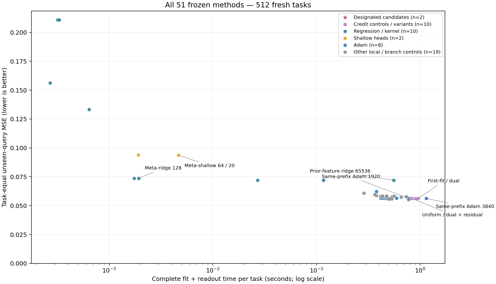
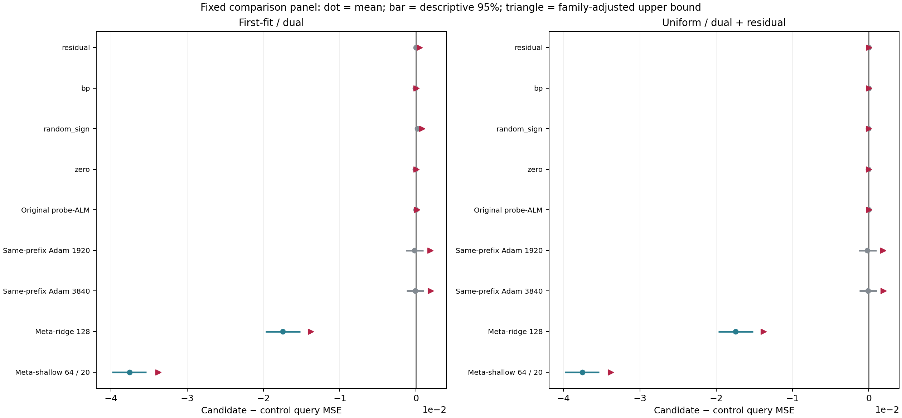

# 512新任务：在线乘子分支搜索的阶段结果

完整预测、封存后评分及独立审计均已结束。512个任务、51方法、26112份预测，数值执行回退0次。方法与评价协议在新任务运行前冻结；查询答案只进入封存后的评分。

## 两个候选的直接结果

| 候选 | 查询MSE | 完整平均秒数 | 失败次数 |
| --- | --- | --- | --- |
| online_first_fit_dual | 0.0561558958 | 0.957854893 | 0 |
| online_uniform_state_dual_plus_residual | 0.0561876578 | 0.846204484 | 0 |

下表分别回答信用信号是否有独立贡献、以及是否优于各类基线。“校正通过”仅指预定近似配对bootstrap单侧上界小于0，不是普遍支配定理。分组数量依据完整冻结名单，不按结果增删。

| 候选 | 对照类别 | 负均差/总数 | 校正通过/总数 | 该组最差校正上界 |
| --- | --- | --- | --- | --- |
| online_first_fit_dual | 同触发的四种非乘子信用 | 3/4 | 0/4 | 0.000771895273 |
| online_first_fit_dual | 线性、核、固定特征及元训练岭回归 | 10/10 | 10/10 | -0.0123749505 |
| online_first_fit_dual | 元训练浅层头 | 2/2 | 2/2 | -0.0338314627 |
| online_first_fit_dual | 同前缀全部Adam步数 | 7/7 | 0/7 | 0.00190099124 |
| online_first_fit_dual | 同前缀普通PC | 4/4 | 1/4 | 0.000230224758 |
| online_first_fit_dual | 同前缀无乘子局部更新 | 4/4 | 4/4 | -0.000185109179 |
| online_uniform_state_dual_plus_residual | 同触发的四种非乘子信用 | 3/4 | 0/4 | 4.90576014e-05 |
| online_uniform_state_dual_plus_residual | 线性、核、固定特征及元训练岭回归 | 10/10 | 10/10 | -0.0123308326 |
| online_uniform_state_dual_plus_residual | 元训练浅层头 | 2/2 | 2/2 | -0.0338246169 |
| online_uniform_state_dual_plus_residual | 同前缀全部Adam步数 | 7/7 | 0/7 | 0.00192519899 |
| online_uniform_state_dual_plus_residual | 同前缀普通PC | 4/4 | 1/4 | 0.000288069641 |
| online_uniform_state_dual_plus_residual | 同前缀无乘子局部更新 | 4/4 | 4/4 | -0.000138624565 |

“对回归好”与“乘子本身有独立收益”是不同命题；不能用前者替代后者。是否形成竞争性机制还需综合强优化器、全部信用对照、贡献集中度及资源，本文不自动把研究目标标记完成。

## 事先固定的代表面板

| 方法 | 257查询MSE | 完整平均秒数 | 相对主候选时间 |
| --- | --- | --- | --- |
| online_first_fit_dual | 0.0561558958 | 0.957854893 | 1 |
| online_uniform_state_dual_plus_residual | 0.0561876578 | 0.846204484 | 0.883437031 |
| credit_control_probe33 | 0.0561892358 | 0.470910539 | 0.491630352 |
| probe_then_pc33 | 0.0581599382 | 0.414735162 | 0.432983289 |
| probe_pc256_33 | 0.0576060599 | 0.534570023 | 0.55809082 |
| probe_nodual256_33 | 0.0579485251 | 0.733313368 | 0.765578766 |
| probe_then_adam960_33 | 0.0564546839 | 0.591460463 | 0.61748441 |
| probe_then_adam1920_33 | 0.0563525438 | 0.775123798 | 0.809228834 |
| probe_then_adam3840_33 | 0.0562915446 | 1.14413199 | 1.19447319 |
| cold__linear_ls | 0.156196519 | 0.000269317383 | 0.000281167204 |
| cold__residual_linear_ls | 0.210859887 | 0.000331558008 | 0.000346146384 |
| cold__residual_linear_ridge | 0.210831307 | 0.000316905665 | 0.000330849346 |
| cold__residual_linear_rls | 0.210831307 | 0.000326900585 | 0.000341284037 |
| cold__rbf_loocv | 0.133164364 | 0.000640863281 | 0.000669060925 |
| cold__prior4096_ridge | 0.0719706855 | 0.02703755 | 0.0282271878 |
| cold__prior16384_ridge | 0.0719445434 | 0.116996389 | 0.122144168 |
| cold__prior65536_ridge | 0.0719560166 | 0.556423748 | 0.580906097 |
| cold__meta_ridge64 | 0.0736531477 | 0.00174373027 | 0.00182045348 |
| cold__meta_ridge128 | 0.0736318504 | 0.00192663477 | 0.00201140567 |
| cold__meta_shallow64_5 | 0.0939126718 | 0.00190652148 | 0.00199040742 |
| cold__meta_shallow64_20 | 0.0937241409 | 0.00466455234 | 0.00486979017 |

[全部51方法、四种指标与时间尾部](all_methods.md)；[全部100个主比较及单任务剔除](all_primary_comparisons.md)；[全部校准/实际预算分类](all_budgets.md)。超预算方法也全部保留，尤其不能依靠Adam3840接近1.10的边界制造胜利。

横轴为完整fit及读出的实测时间（对数轴），纵轴为任务等权查询MSE；所有51方法都在图中，图内只标注固定代表项。

圆点是均值差，横线是描述性95%区间，三角形是100主比较校正后的单侧上界。负值有利于候选；图只是固定面板，完整对照见表。

## 机制与数学含义

目标瓶颈不是“回归不会反传”，而是有限预算下只找到部分支持一致的非线性参数区域：支持损失已经落入噪声带时，普通BP信用可归零，但动态乘子仍可保存不同的约束信用并改变有限候选的探索次序。旧开发任务已有可复核的正向排序实例；此轮直接检验它能否改善真实有限粒子预测。

理想独立后验粒子读出满足 $R_M(T\mid S)=R_{Bayes}(S)+\|\mu_T-\mu_S\|_Q^2+V_T/M$。新区域带来的均值偏差下降，必须超过增加的读出方差除以粒子数，才保证条件期望风险下降。它不创造额外支持信息，也不是对任意闭式解或任意浅层网络的无条件优势。

严格假设、混合区域风险变化公式及精确有理数单元检验见[有限读出推导](../../../outputs/ttt-pc-alm-research/328_finite_readout_risk_addendum_v1.md)。数值LP、体积与采样是有容限的实现，不能把理想独立采样恒等式直接称为浮点程序的逐任务保证。

支持分组任务数：support_fit=191；fallback=321；execution_failed=0。分组只用支持信息。[完整描述性分组表](mechanism_groups.md)，不以其中某组替代全体结果。

## 资源、复核与适用范围

全部调用计入共同准备、局部活动/乘子更新、搜索、全局LP、粒子与查询读出；读取模型及输入索引、文件保存等框架成本另列，不混入fit时间。非BP候选未借用BP初始化或BP对照状态。LP仍是全局几何计算，不宣称整个方法只有局部操作。

内存沿用已审计327独立进程校准；生命周期峰值含共享库、预加载先验和框架，tracemalloc不覆盖全部native。新任务日志的named bytes不是总峰值。元训练岭回归/浅层头的checkpoint及外层训练先验单独披露，不当作免费标签。

这是四层tent非线性、四偏置、有界噪声、4个支持点的固定分布新开发实验；不是官方TTT/GELU-MLP、LLM或VLM验证，也不是已经完成的论文确认。原官方TTT和更大任务验证仍属后续工作。

独立复核：104448个标量风险、6144个新候选粒子读出、8000000个bootstrap均值。

- [完整预测摘要](../pilot_predictions_v2/summary.json)
- [评分摘要](../pilot_evaluation_v2/summary.json)
- [独立审计摘要](../pilot_audit_v2/summary.json)

评分摘要SHA256：a6f38cccb0981a4abdb38aca94d02b244ee8f3deff39e543b9a16eecabefdded。

报告为封存数据的展示层；[来源记录](provenance.json)。数值表须再通过独立报告审计，图须实际打开核验后交付。
