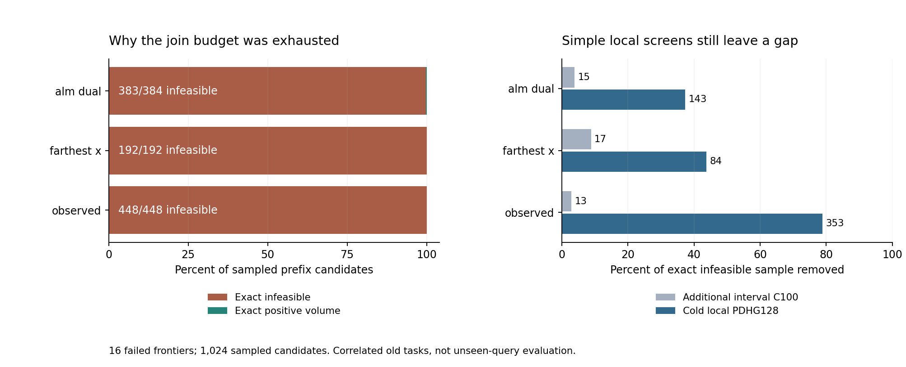

# 373｜预算拥塞来自哪里：固定抽样与精确证书诊断

16个预算耗尽前沿的1024个均匀抽样分支中，**1023个精确不可行、1个正体积可行**。冷启动局部PDHG128排除580个，额外C100仅排除45个。这定位了一个具体计算瓶颈：区间放松留下大量并不存在共同参数的前缀。它不构成PC-ALM独立收益。

## 1. 数学问题已经具体化

每个固定前缀对应共享参数约束A b≤r、b∈[-B,B]^4。区间传播只保留坐标范围，可能丢掉层间与观察间相关性，因而每个局部区间都不空，仍可能不存在共同b。对任意非负权重w，若L=-wᵀr-B||Aᵀw||₁>0，则所有盒内b都不可能满足这些约束。这是既有线性分离证书，不宣称新定理。

主要诊断采用原筛选器的EPS+TOL外舍入宽域。不可行不是由偷偷收窄到.001支持带产生。LP仅提议点/权重，Fraction精确计算决定结论。可行前缀也不保证可以扩展到剩余观察；本轮没有体积或后验读出。

## 2. 全部抽样结果

| 排序 | 原调用终态 | 前沿数 | 抽样数 | 不可行 | 正体积 | 零体积或空 | 未判定 | C100排除 | PDHG128排除 | C100秒/前沿 | PDHG秒/前沿 |
| --- | --- | --- | --- | --- | --- | --- | --- | --- | --- | --- | --- |
| alm_dual | budget_exhausted | 6 | 384 | 383 | 1 | 0 | 0 | 15 | 143 | 0.053361 | 0.010986 |
| farthest_x | budget_exhausted | 3 | 192 | 192 | 0 | 0 | 0 | 17 | 84 | 0.051508 | 0.010764 |
| observed | budget_exhausted | 7 | 448 | 448 | 0 | 0 | 0 | 13 | 353 | 0.042053 | 0.009190 |
| alm_dual | complete | 10 | 285 | 276 | 9 | 0 | 0 | 17 | 70 | 0.039068 | 0.007363 |
| farthest_x | complete | 13 | 477 | 467 | 10 | 0 | 0 | 12 | 98 | 0.048177 | 0.008822 |
| observed | complete | 9 | 331 | 324 | 7 | 0 | 0 | 8 | 71 | 0.048149 | 0.009939 |

全部48前沿共2117样本：2090不可行、27正体积，0未判定。预算失败子集的逐前沿等权不可行比例为99.90234375%，通过执行前≥75%的诊断分流阈值。每个失败前沿本轮均抽64个，因此这里与汇总样本比例相同。完成子集有些池不足64，不能混用按前沿与按样本平均。

失败子集PDHG拒绝580/1023（56.70%），仍有443个精确不可行抽样未被其128步证明。C100拒绝45/1023（4.40%）。两种控制工作不同，表中仅为本机一次附加组件计时，不是公平端到端速度结论。

## 3. 这改变下一步，而不是完成目标

长支持的主要障碍已经从“可能存在太多真实解释”收窄到“便宜收缩未处理跨观察/层间矛盾”。因此下一候选应直接检验历史乘子能否降低这些不可行证书的发现成本，而不是再换一种支持排序。冷PDHG是必需的强简单控制，不能把它的580次删除改名PC-ALM贡献。

候选需要在同一原始状态下比较历史乘子、零乘子、残差、随机信用及明确标记的BP信用，并将生成历史状态的成本完整计入。仅证书覆盖更高还不够：只有完整求交/发现能在预算内留下有预测价值的区域，再在新冻结任务中降低查询误差，才达到原研究目标。本轮没有实现该后续候选，也没有查询效果新结论。

## 4. 公平性与审计

48输入来自旧16任务、24支持的原顺序/空间分散/乘子排序；选最后完整前缀，所有抽样先于任何筛选/LP封存。两局部控制全部封存后才执行LP。没有查询答案、没有用LP权重热启动任何候选。跨排序和同任务样本相关，不做独立任务显著性检验。正式输出无算法异常。

独立审计：426680条约束的另一种组装核验，8387个有理证书重算，819个PDHG宽域正下界核验，27个独立可行点，以及全部48抽样重放。

预检v1错误要求区间收缩必须检出矛盾支持，v2改为记录并保留原失败；v2首次正式筛选保存时旧JSON编码器不支持NumPy证明数组，v3仅修落盘并增加回读测试。算法文件一直未改，v1选择240数组、v2已保存2个mask逐位复现。两次失败和原源码全保留；不能把预检/落盘修复掩盖成一次完美运行。

[执行前协议](../../../outputs/ttt-pc-alm-research/372_prefix_obstruction_protocol_v1.md) · [断言修复](../../../outputs/ttt-pc-alm-research/372_preflight_assertion_repair_v2.md) · [序列化修复](../../../outputs/ttt-pc-alm-research/372_serialization_repair_v3.md) · [正式结果](../development_v3/rows.json) · [独立审计](../audit_v3/summary.json)
