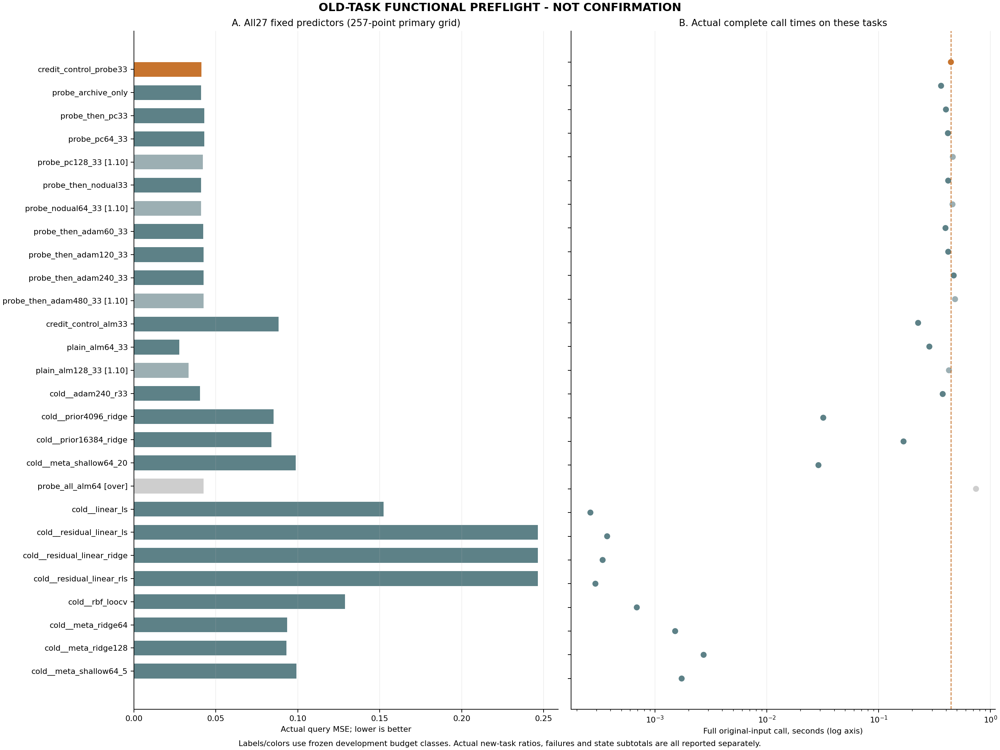
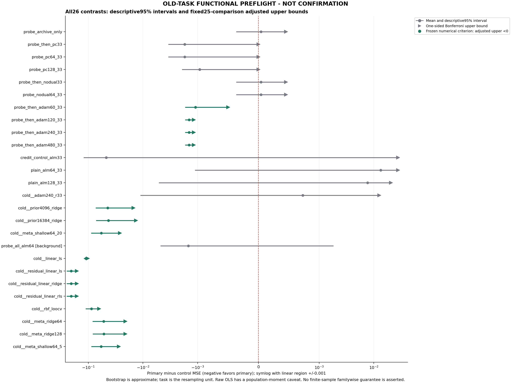

# 287｜旧两任务的功能前检，不是新任务确认结果

任务数2；27方法；54预测；先封存后开答案；独立风险和全部100000次bootstrap重算通过。

## 1．原判据的结果

固定候选`credit_control_probe33`的主查询MSE为0.04111821284。25项预定比较中，15项校正上界低于零。
这只是冻结的近似bootstrap数值判据；无论通过几项，都不自动证明有限样本家族错误率、所有回归方法的不可替代性或整个研究目标完成。

**本页只有两个旧任务，用于检验报告代码。不得将任何数值作为确认实验、统计功效或科学结论。**

未满足主数值阈值的预定控制：`probe_archive_only`、`probe_then_pc33`、`probe_pc64_33`、`probe_pc128_33`、`probe_then_nodual33`、`probe_nodual64_33`、`credit_control_alm33`、`plain_alm64_33`、`plain_alm128_33`、`cold__adam240_r33`

图中横线为描述性95%区间，三角为单侧Bonferroni上界；二者不是同一种区间。差值轴使用固定±.001线性区的对称对数比例，不能按视觉长度作线性比例解释。

## 2．全部方法，按冻结顺序而非表现排名

|方法|主MSE257|MSE129（次要）|点MSE257（次要）|完整均秒|p90秒|相对主时间|旧预算类|实际预算类|失败数|
|---|---:|---:|---:|---:|---:|---:|---|---|---:|
|credit_control_probe33|0.04111821284|0.04102320012|0.1503017935|0.4426752|0.4638898|1|main_1.00|main_1.00|0|
|probe_archive_only|0.04107509622|0.04098064391|0.1226615569|0.3615985|0.4049533|0.81685|main_1.00|main_1.00|0|
|probe_then_pc33|0.04283872706|0.04273610799|0.1222628224|0.3997823|0.4370032|0.90311|main_1.00|main_1.00|0|
|probe_pc64_33|0.04283872706|0.04273610799|0.1222631196|0.416093|0.4485876|0.93995|main_1.00|main_1.00|0|
|probe_pc128_33|0.04208558142|0.04198456758|0.0708802133|0.4600515|0.4859137|1.0393|sensitivity_1.10|sensitivity_1.10|0|
|probe_then_nodual33|0.04107509622|0.04098064391|0.1473195804|0.4184381|0.4375528|0.94525|main_1.00|main_1.00|0|
|probe_nodual64_33|0.04107509622|0.04098064391|0.1405772847|0.4573871|0.4903014|1.0332|sensitivity_1.10|sensitivity_1.10|0|
|probe_then_adam60_33|0.04221379396|0.04211676674|0.1375004955|0.3959748|0.4231915|0.8945|main_1.00|main_1.00|0|
|probe_then_adam120_33|0.04255463434|0.04245486231|0.1393840249|0.4189533|0.4415499|0.94641|main_1.00|main_1.00|0|
|probe_then_adam240_33|0.04255463434|0.04245486231|0.1393840249|0.4691169|0.4775846|1.0597|main_1.00|sensitivity_1.10|0|
|probe_then_adam480_33|0.04255463434|0.04245486231|0.1393840249|0.4820796|0.5000282|1.089|sensitivity_1.10|sensitivity_1.10|0|
|credit_control_alm33|0.0882034251|0.08779176076|0.07274376693|0.2253408|0.2273231|0.50904|main_1.00|main_1.00|0|
|plain_alm64_33|0.02779015893|0.02772205354|0.1036431674|0.2840757|0.2971579|0.64172|main_1.00|main_1.00|0|
|plain_alm128_33|0.03345561548|0.03338555002|0.1036515122|0.425176|0.4532622|0.96047|sensitivity_1.10|main_1.00|0|
|cold__adam240_r33|0.04038760298|0.04031046261|0.06785300758|0.373914|0.4056|0.84467|main_1.00|main_1.00|0|
|cold__prior4096_ridge|0.08525429925|0.08507371202|0.08525429925|0.0319693|0.03622898|0.072218|main_1.00|main_1.00|0|
|cold__prior16384_ridge|0.08392519706|0.08374263316|0.08392519706|0.1669475|0.1758373|0.37713|main_1.00|main_1.00|0|
|cold__meta_shallow64_20|0.09872543645|0.09859125603|0.09872543645|0.0289521|0.03109818|0.065403|main_1.00|main_1.00|0|
|probe_all_alm64|0.04259637166|0.04251279846|0.141948559|0.7421963|0.7538963|1.6766|measured_over_budget|measured_over_1.10|0|
|cold__linear_ls|0.1522511981|0.1525676781|0.1522511981|0.0002646|0.00026916|0.00059773|main_1.00|main_1.00|0|
|cold__residual_linear_ls|0.2465053399|0.2477620093|0.2465053399|0.0003735|0.00037838|0.00084373|main_1.00|main_1.00|0|
|cold__residual_linear_ridge|0.2465051476|0.247761889|0.2465051476|0.00034045|0.00035481|0.00076907|main_1.00|main_1.00|0|
|cold__residual_linear_rls|0.2465051476|0.247761889|0.2465051476|0.00029335|0.00030011|0.00066268|main_1.00|main_1.00|0|
|cold__rbf_loocv|0.128738547|0.1287323312|0.128738547|0.0006879|0.00078206|0.001554|main_1.00|main_1.00|0|
|cold__meta_ridge64|0.09346722464|0.09322559358|0.09346722464|0.0015153|0.00159194|0.0034231|main_1.00|main_1.00|0|
|cold__meta_ridge128|0.09313549688|0.0929394545|0.09313549688|0.00272255|0.00280435|0.0061502|main_1.00|main_1.00|0|
|cold__meta_shallow64_5|0.09916818739|0.09906860914|0.09916818739|0.0017323|0.00184446|0.0039133|main_1.00|main_1.00|0|

## 3．主比较与三组次要比较全部保留

主判据只有mse257。mse129、point_mse257和point_mse129不能替代它。全试探ALM64为预定超预算背景，仍报告但不列入主25阈值。

### mse257

|控制|主减控制|配对标准差|描述95%下限|描述95%上限|校正单侧上界|主阈值|好/同/差任务|
|---|---:|---:|---:|---:|---:|---|---|
|probe_archive_only|4.31166116e-05|0.0005797785665|-0.0003668487443|0.0004530819675|0.0004530819675283501|未通过数值阈值|1/0/1|
|probe_then_pc33|-0.001720514225|0.002433174552|-0.003441028451|0|0.0|未通过数值阈值|1/1/0|
|probe_pc64_33|-0.001720514225|0.002433174552|-0.003441028451|0|0.0|未通过数值阈值|1/1/0|
|probe_pc128_33|-0.0009673685852|0.001368065773|-0.00193473717|0|0.0|未通过数值阈值|1/1/0|
|probe_then_nodual33|4.31166116e-05|0.0005797785665|-0.0003668487443|0.0004530819675|0.0004530819675283501|未通过数值阈值|1/0/1|
|probe_nodual64_33|4.31166116e-05|0.0005797785665|-0.0003668487443|0.0004530819675|0.0004530819675283501|未通过数值阈值|1/0/1|
|probe_then_adam60_33|-0.001095581126|0.0008468114734|-0.001694367261|-0.0004967949908|-0.0004967949908406544|通过数值阈值|2/0/0|
|probe_then_adam120_33|-0.001436421503|0.0003647903893|-0.001694367261|-0.001178475745|-0.0011784757453355069|通过数值阈值|2/0/0|
|probe_then_adam240_33|-0.001436421503|0.0003647903893|-0.001694367261|-0.001178475745|-0.0011784757453355069|通过数值阈值|2/0/0|
|probe_then_adam480_33|-0.001436421503|0.0003647903893|-0.001694367261|-0.001178475745|-0.0011784757453355069|通过数值阈值|2/0/0|
|credit_control_alm33|-0.04708521227|0.1058757207|-0.1219506523|0.0277802278|0.027780227799333604|未通过数值阈值|1/0/1|
|plain_alm64_33|0.01332805391|0.02043846033|-0.001124119987|0.0277802278|0.027780227799333604|未通过数值阈值|1/0/1|
|plain_alm128_33|0.007662597356|0.01810544244|-0.00513988377|0.02046507848|0.02046507848281827|未通过数值阈值|1/0/1|
|cold__adam240_r33|0.0007306098562|0.01678595982|-0.01113885616|0.01260007587|0.012600075874318759|未通过数值阈值|1/0/1|
|cold__prior4096_ridge|-0.04413608642|0.04127498797|-0.07332191031|-0.01495026253|-0.014950262528321406|通过数值阈值|2/0/0|
|cold__prior16384_ridge|-0.04280698423|0.04157373484|-0.07220405405|-0.0134099144|-0.013409914400786455|通过数值阈值|2/0/0|
|cold__meta_shallow64_20|-0.05760722362|0.04406388885|-0.08876509823|-0.026449349|-0.026449349003787412|通过数值阈值|2/0/0|
|probe_all_alm64|-0.00147815883|0.004673286747|-0.004782671579|0.001826353919|—|不适用|1/0/1|
|cold__linear_ls|-0.1111329853|0.0131335404|-0.1204198007|-0.1018461698|-0.10184616979015565|通过数值阈值|2/0/0|
|cold__residual_linear_ls|-0.205387127|0.06207487192|-0.2492806899|-0.1614935642|-0.16149356416382726|通过数值阈值|2/0/0|
|cold__residual_linear_ridge|-0.2053869348|0.0620781575|-0.2492828209|-0.1614910487|-0.16149104865699074|通过数值阈值|2/0/0|
|cold__residual_linear_rls|-0.2053869348|0.0620781575|-0.2492828209|-0.1614910487|-0.16149104865699238|通过数值阈值|2/0/0|
|cold__rbf_loocv|-0.08762033415|0.03412946561|-0.1117535107|-0.06348715758|-0.06348715758217163|通过数值阈值|2/0/0|
|cold__meta_ridge64|-0.05234901181|0.04441649673|-0.08375621784|-0.02094180577|-0.020941805768024416|通过数值阈值|2/0/0|
|cold__meta_ridge128|-0.05201728405|0.0439941167|-0.0831258223|-0.02090874579|-0.02090874579495497|通过数值阈值|2/0/0|
|cold__meta_shallow64_5|-0.05804997456|0.04301106619|-0.08846339112|-0.02763655799|-0.027636557990450977|通过数值阈值|2/0/0|

### mse129

|控制|主减控制|配对标准差|描述95%下限|描述95%上限|校正单侧上界|主阈值|好/同/差任务|
|---|---:|---:|---:|---:|---:|---|---|
|probe_archive_only|4.255620523e-05|0.0005780510375|-0.0003661876032|0.0004513000137|—|不适用|1/0/1|
|probe_then_pc33|-0.001712907871|0.002422417542|-0.003425815741|0|—|不适用|1/1/0|
|probe_pc64_33|-0.001712907871|0.002422417542|-0.003425815741|0|—|不适用|1/1/0|
|probe_pc128_33|-0.0009613674665|0.00135957891|-0.001922734933|0|—|不适用|1/1/0|
|probe_then_nodual33|4.255620523e-05|0.0005780510375|-0.0003661876032|0.0004513000137|—|不适用|1/0/1|
|probe_nodual64_33|4.255620523e-05|0.0005780510375|-0.0003661876032|0.0004513000137|—|不适用|1/0/1|
|probe_then_adam60_33|-0.001093566622|0.0008438524713|-0.001690260427|-0.000496872817|—|不适用|2/0/0|
|probe_then_adam120_33|-0.001431662193|0.0003657131296|-0.001690260427|-0.001173063959|—|不适用|2/0/0|
|probe_then_adam240_33|-0.001431662193|0.0003657131296|-0.001690260427|-0.001173063959|—|不适用|2/0/0|
|probe_then_adam480_33|-0.001431662193|0.0003657131296|-0.001690260427|-0.001173063959|—|不适用|2/0/0|
|credit_control_alm33|-0.04676856065|0.1053537294|-0.1212648971|0.02772777585|—|不适用|1/0/1|
|plain_alm64_33|0.01330114657|0.02040233478|-0.001125482703|0.02772777585|—|不适用|1/0/1|
|plain_alm128_33|0.007637650094|0.01809335335|-0.005156282756|0.02043158294|—|不适用|1/0/1|
|cold__adam240_r33|0.0007127375108|0.01676540797|-0.01114219615|0.01256767118|—|不适用|1/0/1|
|cold__prior4096_ridge|-0.0440505119|0.04131711385|-0.07326612329|-0.01483490052|—|不适用|2/0/0|
|cold__prior16384_ridge|-0.04271943304|0.04160357738|-0.07213760473|-0.01330126135|—|不适用|2/0/0|
|cold__meta_shallow64_20|-0.05756805592|0.04417067397|-0.08880143901|-0.02633467283|—|不适用|2/0/0|
|probe_all_alm64|-0.001489598343|0.004676402009|-0.004796313916|0.001817117229|—|不适用|1/0/1|
|cold__linear_ls|-0.111544478|0.01304656738|-0.1207697943|-0.1023191617|—|不适用|2/0/0|
|cold__residual_linear_ls|-0.2067388092|0.06215468323|-0.2506888072|-0.1627888112|—|不适用|2/0/0|
|cold__residual_linear_ridge|-0.2067386889|0.06215805079|-0.2506910681|-0.1627863097|—|不适用|2/0/0|
|cold__residual_linear_rls|-0.2067386889|0.06215805079|-0.2506910681|-0.1627863097|—|不适用|2/0/0|
|cold__rbf_loocv|-0.08770913113|0.03457136335|-0.1121547766|-0.06326348567|—|不适用|2/0/0|
|cold__meta_ridge64|-0.05220239347|0.04441265178|-0.08360688071|-0.02079790622|—|不适用|2/0/0|
|cold__meta_ridge128|-0.05191625439|0.04407127651|-0.08307935286|-0.02075315591|—|不适用|2/0/0|
|cold__meta_shallow64_5|-0.05804540902|0.04317910163|-0.08857764459|-0.02751317345|—|不适用|2/0/0|

### point_mse257

|控制|主减控制|配对标准差|描述95%下限|描述95%上限|校正单侧上界|主阈值|好/同/差任务|
|---|---:|---:|---:|---:|---:|---|---|
|probe_archive_only|0.0276402366|0.04700149747|-0.005594840993|0.06087531419|—|不适用|1/0/1|
|probe_then_pc33|0.02803897103|0.04647322177|-0.004822559221|0.06090050129|—|不适用|1/0/1|
|probe_pc64_33|0.02803867385|0.04647280148|-0.004822559221|0.06089990692|—|不适用|1/0/1|
|probe_pc128_33|0.07942158018|0.1102791143|0.001442470607|0.1574006897|—|不适用|0/0/2|
|probe_then_nodual33|0.002982213103|0.01019216973|-0.004224739228|0.01018916543|—|不适用|1/0/1|
|probe_nodual64_33|0.009724508797|0.01874380399|-0.003529362107|0.0229783797|—|不适用|1/0/1|
|probe_then_adam60_33|0.01280129798|0.02776437912|-0.006831082773|0.03243367873|—|不适用|1/0/1|
|probe_then_adam120_33|0.01091776858|0.01965675285|-0.002981654657|0.02481719182|—|不适用|1/0/1|
|probe_then_adam240_33|0.01091776858|0.01965675285|-0.002981654657|0.02481719182|—|不适用|1/0/1|
|probe_then_adam480_33|0.01091776858|0.01965675285|-0.002981654657|0.02481719182|—|不适用|1/0/1|
|credit_control_alm33|0.07755802655|0.1142657418|-0.003240054341|0.1583561074|—|不适用|1/0/1|
|plain_alm64_33|0.04665862611|0.07056739064|-0.003240054341|0.09655730656|—|不适用|1/0/1|
|plain_alm128_33|0.04665028128|0.07030986987|-0.003066304492|0.09636686705|—|不适用|1/0/1|
|cold__adam240_r33|0.08244878591|0.0502123968|0.04694325963|0.1179543122|—|不适用|0/0/2|
|cold__prior4096_ridge|0.06504749423|0.0239140993|0.04813767245|0.08195731601|—|不适用|0/0/2|
|cold__prior16384_ridge|0.06637659642|0.02421284617|0.0492555287|0.08349766413|—|不适用|0/0/2|
|cold__meta_shallow64_20|0.05157635703|0.02670300017|0.03269448453|0.07045822953|—|不适用|0/0/2|
|probe_all_alm64|0.008353234494|0.01069141121|0.0007932651274|0.01591320386|—|不适用|0/0/2|
|cold__linear_ls|-0.001949404623|0.004227348277|-0.004938591256|0.00103978201|—|不适用|1/0/1|
|cold__residual_linear_ls|-0.09620354639|0.04471398324|-0.1278211072|-0.06458598563|—|不适用|2/0/0|
|cold__residual_linear_ridge|-0.09620335414|0.04471726882|-0.1278232382|-0.06458347012|—|不适用|2/0/0|
|cold__residual_linear_rls|-0.09620335414|0.04471726882|-0.1278232382|-0.06458347012|—|不适用|2/0/0|
|cold__rbf_loocv|0.0215632465|0.01676857693|0.009706072038|0.03342042095|—|不适用|0/0/2|
|cold__meta_ridge64|0.05683456884|0.02705560806|0.03770336491|0.07596577277|—|不适用|0/0/2|
|cold__meta_ridge128|0.0571662966|0.02663322802|0.03833376046|0.07599883274|—|不适用|0/0/2|
|cold__meta_shallow64_5|0.05113360609|0.02565017751|0.03299619163|0.06927102054|—|不适用|0/0/2|

### point_mse129

|控制|主减控制|配对标准差|描述95%下限|描述95%上限|校正单侧上界|主阈值|好/同/差任务|
|---|---:|---:|---:|---:|---:|---|---|
|probe_archive_only|0.02701637009|0.04694738043|-0.00618044097|0.06021318115|—|不适用|1/0/1|
|probe_then_pc33|0.02758998984|0.04615905674|-0.005049392191|0.06022937188|—|不适用|1/0/1|
|probe_pc64_33|0.02758967495|0.04615861142|-0.005049392191|0.06022874209|—|不适用|1/0/1|
|probe_pc128_33|0.07915275407|0.1094125337|0.001786409545|0.1565190986|—|不适用|0/0/2|
|probe_then_nodual33|0.002713077622|0.01025755239|-0.004540107228|0.009966262472|—|不适用|1/0/1|
|probe_nodual64_33|0.009321390084|0.0187605203|-0.003944301037|0.0225870812|—|不适用|1/0/1|
|probe_then_adam60_33|0.01251235725|0.02749751609|-0.006931322837|0.03195603735|—|不适用|1/0/1|
|probe_then_adam120_33|0.01042633695|0.0193488766|-0.003255384903|0.02410805881|—|不适用|1/0/1|
|probe_then_adam240_33|0.01042633695|0.0193488766|-0.003255384903|0.02410805881|—|不适用|1/0/1|
|probe_then_adam480_33|0.01042633695|0.0193488766|-0.003255384903|0.02410805881|—|不适用|1/0/1|
|credit_control_alm33|0.07689622055|0.1141276642|-0.003804224757|0.1575966659|—|不适用|1/0/1|
|plain_alm64_33|0.0459833197|0.07041022061|-0.003804224757|0.09577086416|—|不适用|1/0/1|
|plain_alm128_33|0.04610046666|0.06997137077|-0.003376764095|0.09557769742|—|不适用|1/0/1|
|cold__adam240_r33|0.08157583059|0.0500867022|0.04615918382|0.1169924774|—|不适用|0/0/2|
|cold__prior4096_ridge|0.06438918613|0.02407754999|0.04736378726|0.08141458501|—|不适用|0/0/2|
|cold__prior16384_ridge|0.065720265|0.02436401352|0.04849230582|0.08294822417|—|不适用|0/0/2|
|cold__meta_shallow64_20|0.05087164212|0.02693111011|0.03182847153|0.0699148127|—|不适用|0/0/2|
|probe_all_alm64|0.008283279783|0.01030307959|0.000997902338|0.01556865723|—|不适用|0/0/2|
|cold__linear_ls|-0.003104779972|0.004192996483|-0.006069676219|-0.0001398837256|—|不适用|2/0/0|
|cold__residual_linear_ls|-0.09829911114|0.04491511937|-0.1300588966|-0.06653932566|—|不适用|2/0/0|
|cold__residual_linear_ridge|-0.09829899088|0.04491848693|-0.1300611576|-0.06653682417|—|不适用|2/0/0|
|cold__residual_linear_rls|-0.09829899088|0.04491848693|-0.1300611576|-0.06653682417|—|不适用|2/0/0|
|cold__rbf_loocv|0.0207305669|0.01733179949|0.008475133953|0.03298599985|—|不适用|0/0/2|
|cold__meta_ridge64|0.05623730457|0.02717308792|0.03702302983|0.07545157931|—|不适用|0/0/2|
|cold__meta_ridge128|0.05652344365|0.02683171265|0.03755055768|0.07549632962|—|不适用|0/0/2|
|cold__meta_shallow64_5|0.05039428902|0.02593953777|0.03205226596|0.06873631207|—|不适用|0/0/2|

## 4．资源，不把更准说成更快

本批有21个控制的完整平均调用比候选便宜。是否需要给这些强控制更多起点、不同求解器或更充分适应预算，要另行论证，不能仅凭通过质量阈值宣布整个目标完成。
完整调用总秒14.0173；完成任务的含I/O墙钟总秒15.27518；各启动模型加载共0.0320274秒。
未提交尝试的已知额外调用2次、0.6623822秒；缺少完成记录的在途调用0次，费用若未知就保持未知。

正式预测期间本机曾出现物理内存压力和换页，且有阶段快照的Git整理/打包/上传并发。全部原任务和费用保留；当前计时不声称独占环境或无干扰，不删除慢任务、不选择性复测。见[运行期资源观察](../../../outputs/ttt-pc-alm-research/287_runtime_resource_observation_20260924.md)与[发布范围](../../../release/SCOPE.md)。

以下是被记录的数值数组小计，不是峰值原生内存，不可盲目相加；临时工作区、Python对象及共享模型的范围各异。旧内存仪器测量另见285资源记录。

|方法|状态字段|记录任务数|平均bytes|最大bytes|
|---|---|---:|---:|---:|
|credit_control_probe33|atomic_trial_numeric_bytes|2|39072|39072|
|credit_control_probe33|solver_numeric_bytes_subtotal|2|12066|12066|
|credit_control_probe33|retained_predictor_bytes|2|65536|65536|
|credit_control_probe33|representative_numeric_bytes_subtotal|2|6544|7872|
|credit_control_probe33|geometry_numeric_bytes_subtotal|2|138904|189160|
|probe_archive_only|atomic_trial_numeric_bytes|2|39072|39072|
|probe_archive_only|solver_numeric_bytes_subtotal|2|1056|1056|
|probe_archive_only|retained_predictor_bytes|2|65536|65536|
|probe_archive_only|representative_numeric_bytes_subtotal|2|5600|6176|
|probe_archive_only|geometry_numeric_bytes_subtotal|2|130548|182192|
|probe_then_pc33|atomic_trial_numeric_bytes|2|39072|39072|
|probe_then_pc33|solver_numeric_bytes_subtotal|2|12066|12066|
|probe_then_pc33|retained_predictor_bytes|2|65536|65536|
|probe_then_pc33|representative_numeric_bytes_subtotal|2|5888|6720|
|probe_then_pc33|geometry_numeric_bytes_subtotal|2|140448|192248|
|probe_pc64_33|atomic_trial_numeric_bytes|2|39072|39072|
|probe_pc64_33|solver_numeric_bytes_subtotal|2|12066|12066|
|probe_pc64_33|retained_predictor_bytes|2|65536|65536|
|probe_pc64_33|representative_numeric_bytes_subtotal|2|5936|6816|
|probe_pc64_33|geometry_numeric_bytes_subtotal|2|140448|192248|
|probe_pc128_33|atomic_trial_numeric_bytes|2|39072|39072|
|probe_pc128_33|solver_numeric_bytes_subtotal|2|12066|12066|
|probe_pc128_33|retained_predictor_bytes|2|65536|65536|
|probe_pc128_33|representative_numeric_bytes_subtotal|2|5952|6816|
|probe_pc128_33|geometry_numeric_bytes_subtotal|2|143932|199216|
|probe_then_nodual33|atomic_trial_numeric_bytes|2|39072|39072|
|probe_then_nodual33|solver_numeric_bytes_subtotal|2|12066|12066|
|probe_then_nodual33|retained_predictor_bytes|2|65536|65536|
|probe_then_nodual33|representative_numeric_bytes_subtotal|2|5776|6496|
|probe_then_nodual33|geometry_numeric_bytes_subtotal|2|130548|182192|
|probe_nodual64_33|atomic_trial_numeric_bytes|2|39072|39072|
|probe_nodual64_33|solver_numeric_bytes_subtotal|2|12066|12066|
|probe_nodual64_33|retained_predictor_bytes|2|65536|65536|
|probe_nodual64_33|representative_numeric_bytes_subtotal|2|5824|6592|
|probe_nodual64_33|geometry_numeric_bytes_subtotal|2|130548|182192|
|probe_then_adam60_33|atomic_trial_numeric_bytes|2|39072|39072|
|probe_then_adam60_33|solver_numeric_bytes_subtotal|2|9504|9504|
|probe_then_adam60_33|retained_predictor_bytes|2|65536|65536|
|probe_then_adam60_33|representative_numeric_bytes_subtotal|2|5824|6528|
|probe_then_adam60_33|geometry_numeric_bytes_subtotal|2|145164|191936|
|probe_then_adam120_33|atomic_trial_numeric_bytes|2|39072|39072|
|probe_then_adam120_33|solver_numeric_bytes_subtotal|2|9504|9504|
|probe_then_adam120_33|retained_predictor_bytes|2|65536|65536|
|probe_then_adam120_33|representative_numeric_bytes_subtotal|2|5840|6560|
|probe_then_adam120_33|geometry_numeric_bytes_subtotal|2|150036|191936|
|probe_then_adam240_33|atomic_trial_numeric_bytes|2|39072|39072|
|probe_then_adam240_33|solver_numeric_bytes_subtotal|2|9504|9504|
|probe_then_adam240_33|retained_predictor_bytes|2|65536|65536|
|probe_then_adam240_33|representative_numeric_bytes_subtotal|2|5840|6560|
|probe_then_adam240_33|geometry_numeric_bytes_subtotal|2|150036|191936|
|probe_then_adam480_33|atomic_trial_numeric_bytes|2|39072|39072|
|probe_then_adam480_33|solver_numeric_bytes_subtotal|2|9504|9504|
|probe_then_adam480_33|retained_predictor_bytes|2|65536|65536|
|probe_then_adam480_33|representative_numeric_bytes_subtotal|2|5840|6560|
|probe_then_adam480_33|geometry_numeric_bytes_subtotal|2|150036|191936|
|credit_control_alm33|atomic_trial_numeric_bytes|2|1056|1056|
|credit_control_alm33|solver_numeric_bytes_subtotal|2|12066|12066|
|credit_control_alm33|retained_predictor_bytes|2|65536|65536|
|credit_control_alm33|representative_numeric_bytes_subtotal|2|1792|2400|
|credit_control_alm33|geometry_numeric_bytes_subtotal|2|75000|83760|
|plain_alm64_33|atomic_trial_numeric_bytes|2|1056|1056|
|plain_alm64_33|solver_numeric_bytes_subtotal|2|12066|12066|
|plain_alm64_33|retained_predictor_bytes|2|65536|65536|
|plain_alm64_33|representative_numeric_bytes_subtotal|2|2400|3232|
|plain_alm64_33|geometry_numeric_bytes_subtotal|2|79804|83760|
|plain_alm128_33|atomic_trial_numeric_bytes|2|1056|1056|
|plain_alm128_33|solver_numeric_bytes_subtotal|2|12066|12066|
|plain_alm128_33|retained_predictor_bytes|2|65536|65536|
|plain_alm128_33|representative_numeric_bytes_subtotal|2|3536|4768|
|plain_alm128_33|geometry_numeric_bytes_subtotal|2|112580|114416|
|cold__adam240_r33|solver_numeric_bytes_subtotal|2|9504|9504|
|cold__adam240_r33|retained_predictor_bytes|2|65536|65536|
|cold__adam240_r33|geometry_numeric_bytes_subtotal|2|97072|99376|
|cold__prior4096_ridge|persistent_predictor_bytes|2|163840|163840|
|cold__prior16384_ridge|persistent_predictor_bytes|2|655360|655360|
|cold__meta_shallow64_20|trace_numeric_bytes|2|0|0|
|cold__meta_shallow64_20|metadata.persistent_state_bytes|2|1040|1040|
|cold__meta_shallow64_20|metadata.shared_model_bytes|2|1072|1072|
|probe_all_alm64|solver_numeric_bytes_subtotal|2|222069|222069|
|probe_all_alm64|retained_predictor_bytes|2|65536|65536|
|probe_all_alm64|representative_numeric_bytes_subtotal|2|10656|13184|
|probe_all_alm64|geometry_numeric_bytes_subtotal|2|171452|218744|
|cold__linear_ls|trace_numeric_bytes|2|0|0|
|cold__linear_ls|metadata.persistent_state_bytes|2|16|16|
|cold__residual_linear_ls|trace_numeric_bytes|2|0|0|
|cold__residual_linear_ls|metadata.persistent_state_bytes|2|16|16|
|cold__residual_linear_ridge|trace_numeric_bytes|2|0|0|
|cold__residual_linear_ridge|metadata.persistent_state_bytes|2|16|16|
|cold__residual_linear_rls|trace_numeric_bytes|2|0|0|
|cold__residual_linear_rls|metadata.persistent_state_bytes|2|56|56|
|cold__rbf_loocv|trace_numeric_bytes|2|0|0|
|cold__rbf_loocv|metadata.persistent_state_bytes|2|88|88|
|cold__meta_ridge64|trace_numeric_bytes|2|0|0|
|cold__meta_ridge64|metadata.persistent_state_bytes|2|512|512|
|cold__meta_ridge64|metadata.shared_model_bytes|2|141344|141344|
|cold__meta_ridge128|trace_numeric_bytes|2|0|0|
|cold__meta_ridge128|metadata.persistent_state_bytes|2|1024|1024|
|cold__meta_ridge128|metadata.shared_model_bytes|2|272416|272416|
|cold__meta_shallow64_5|trace_numeric_bytes|2|0|0|
|cold__meta_shallow64_5|metadata.persistent_state_bytes|2|1040|1040|
|cold__meta_shallow64_5|metadata.shared_model_bytes|2|1072|1072|

## 5．数学与研究边界

两个无正则线性头在理想连续四样本带噪任务下，查询MSE均值有限而任务方差可无限。有限数组当然仍有有限经验方差；这不是已观测到异常点，也不能据此删任务。常规有限方差的bootstrap论证不能直接套用；重抽次数和Bonferroni公式并不自动保证覆盖率。详见[矩边界推导](../../../outputs/ttt-pc-alm-research/287_ols_moment_addendum.md)。
本次不修改冻结方法或判据，不以无正则LS的尾部作为PC-ALM贡献。岭/RLS、核、强先验与元学习特征、浅头及同参数BP/PC/ALM全部在本页保留。
元岭回归的独立核验保留原预测、原1e-9绝对/1e-10相对容差；双精度参考出现超差时，使用预先验证的70/110位精度参考复核，离线核验不改变在线模型或费用。完整数值诊断见[参考算术说明](../../../outputs/ttt-pc-alm-research/287_head_reference_diagnosis.md)。
路径审计v4明确修正了接受逻辑：保留真实几何与误差证书，将原1e-12严格施加于最终混合均值；区域内同阈值仅作诊断，不能声称各区域单独通过。原失败和新查询开放前的[数学说明](../../../outputs/ttt-pc-alm-research/287_pool_budget_scope_correction.md)均保留。此项不改变预测、方法、资源或质量判据，也不把名义均值界当有限粒子的逐样本误差。
普通PC/无乘子/强BP共享试探池的对照用于隔离续接信用；普通ALM控制用于比较整个分支机制。共同几何与多解释读出是全局计算，不能把整个系统称为只有局部运算。此方法不运行全链BP或用BP信用初始化候选，但“无BP”本身不是贡献。
这仍是四层可控任务，尚无官方TTT同任务、一般MLP或LLM/VLM桥接验证。若优势可由简单回归或其它更简单方法解释，应保留该解释，不强留两篇论文组合。

## 6．核验链接

[评价记录](../evaluation_preflight_v4/summary.json)；[独立风险与重抽核验](../evaluation_audit_preflight_v4/summary.json)；[原协议](../../../outputs/ttt-pc-alm-research/287_probe_credit_confirmation_protocol.md)。
图片生成不能代替视检；图像布局应在交付前另行打开检查。以上任何passed字段都不等同核心研究目标完成。
