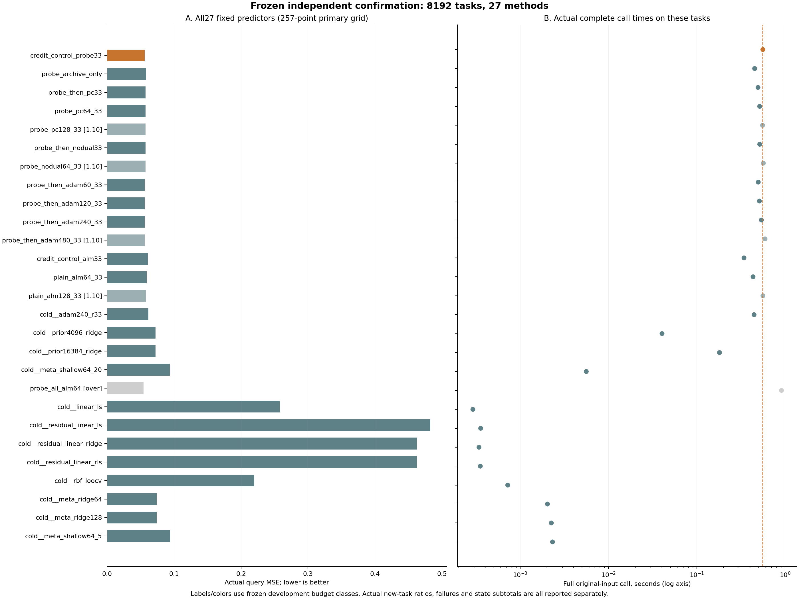

# 287｜固定新任务确认：全部预定对照与资源结果

任务数8192；27方法；221184预测；先封存后开答案；独立风险和全部100000次bootstrap重算通过。

## 1．原判据的结果

固定候选`credit_control_probe33`的主查询MSE为0.05612378827。25项预定比较中，21项校正上界低于零。
这只是冻结的近似bootstrap数值判据；无论通过几项，都不自动证明有限样本家族错误率、所有回归方法的不可替代性或整个研究目标完成。

未满足主数值阈值的预定控制：`probe_then_adam60_33`、`probe_then_adam120_33`、`probe_then_adam240_33`、`probe_then_adam480_33`

图中横线为描述性95%区间，三角为单侧Bonferroni上界；二者不是同一种区间。差值轴使用固定±.001线性区的对称对数比例，不能按视觉长度作线性比例解释。

## 2．全部方法，按冻结顺序而非表现排名

|方法|主MSE257|MSE129（次要）|点MSE257（次要）|完整均秒|p90秒|相对主时间|旧预算类|实际预算类|失败数|
|---|---:|---:|---:|---:|---:|---:|---|---|---:|
|credit_control_probe33|0.05612378827|0.05616684875|0.11478192|0.5603742|0.8260952|1|main_1.00|main_1.00|0|
|probe_archive_only|0.05831250893|0.05835969126|0.1222703012|0.4524192|0.6785621|0.80735|main_1.00|main_1.00|0|
|probe_then_pc33|0.05760795|0.0576548542|0.1190844237|0.4935825|0.7346156|0.88081|main_1.00|main_1.00|0|
|probe_pc64_33|0.05750427256|0.05755067359|0.1174163615|0.5154218|0.762221|0.91978|main_1.00|main_1.00|0|
|probe_pc128_33|0.05744833863|0.05749469793|0.1164477988|0.5557766|0.812386|0.9918|sensitivity_1.10|main_1.00|0|
|probe_then_nodual33|0.05769962891|0.05774572712|0.1179595911|0.5167347|0.7603788|0.92212|main_1.00|main_1.00|0|
|probe_nodual64_33|0.05756957897|0.05761535199|0.1159642436|0.5672521|0.8189848|1.0123|sensitivity_1.10|sensitivity_1.10|0|
|probe_then_adam60_33|0.05617935326|0.05622383063|0.1139767032|0.4969925|0.7539583|0.88689|main_1.00|main_1.00|0|
|probe_then_adam120_33|0.05615851515|0.05620237645|0.1130874731|0.5121072|0.7721357|0.91387|main_1.00|main_1.00|0|
|probe_then_adam240_33|0.05615373614|0.05619768904|0.1131429311|0.5394089|0.8028755|0.96259|main_1.00|main_1.00|0|
|probe_then_adam480_33|0.05614939856|0.05619326679|0.1132008977|0.593156|0.8751733|1.0585|sensitivity_1.10|sensitivity_1.10|0|
|credit_control_alm33|0.06091143424|0.06096211482|0.1152986108|0.342497|0.5143741|0.61119|main_1.00|main_1.00|0|
|plain_alm64_33|0.05906383401|0.05911179699|0.1136098516|0.4337648|0.6360791|0.77406|main_1.00|main_1.00|0|
|plain_alm128_33|0.05802399938|0.0580706775|0.1130946778|0.5616691|0.8005176|1.0023|sensitivity_1.10|sensitivity_1.10|0|
|cold__adam240_r33|0.06178520703|0.06183509147|0.1142383505|0.4454789|0.6469537|0.79497|main_1.00|main_1.00|0|
|cold__prior4096_ridge|0.07239804575|0.07244764631|0.07239804575|0.04038367|0.06196619|0.072066|main_1.00|main_1.00|0|
|cold__prior16384_ridge|0.07229381465|0.07234312061|0.07229381465|0.1808954|0.2748912|0.32281|main_1.00|main_1.00|0|
|cold__meta_shallow64_20|0.09370954189|0.0937264532|0.09370954189|0.005600218|0.00786539|0.0099937|main_1.00|main_1.00|0|
|probe_all_alm64|0.05437108813|0.05441374908|0.1109814534|0.9109934|1.288249|1.6257|measured_over_budget|measured_over_1.10|0|
|cold__linear_ls|0.2582860985|0.2590072524|0.2582860985|0.0002908533|0.00037919|0.00051903|main_1.00|main_1.00|0|
|cold__residual_linear_ls|0.4824852468|0.4860503766|0.4824852468|0.0003564426|0.0004733|0.00063608|main_1.00|main_1.00|0|
|cold__residual_linear_ridge|0.4623184069|0.465792156|0.4623184069|0.000341096|0.00044969|0.00060869|main_1.00|main_1.00|0|
|cold__residual_linear_rls|0.4623184069|0.465792156|0.4623184069|0.000353027|0.0004627|0.00062998|main_1.00|main_1.00|0|
|cold__rbf_loocv|0.2197383976|0.2198812623|0.2197383976|0.0007220608|0.0010033|0.0012885|main_1.00|main_1.00|0|
|cold__meta_ridge64|0.07417119161|0.07421961272|0.07417119161|0.002035888|0.00273767|0.0036331|main_1.00|main_1.00|0|
|cold__meta_ridge128|0.07411414482|0.07416406518|0.07411414482|0.002249601|0.00300065|0.0040145|main_1.00|main_1.00|0|
|cold__meta_shallow64_5|0.09394219113|0.09396016526|0.09394219113|0.002323947|0.00335176|0.0041471|main_1.00|main_1.00|0|

## 3．主比较与三组次要比较全部保留

主判据只有mse257。mse129、point_mse257和point_mse129不能替代它。全试探ALM64为预定超预算背景，仍报告但不列入主25阈值。

### mse257

|控制|主减控制|配对标准差|描述95%下限|描述95%上限|校正单侧上界|主阈值|好/同/差任务|
|---|---:|---:|---:|---:|---:|---|---|
|probe_archive_only|-0.002188720661|0.01507765769|-0.002518017629|-0.001865434101|-0.0017185003677014598|通过数值阈值|2458/3379/2355|
|probe_then_pc33|-0.001484161731|0.01409524273|-0.001794663813|-0.001179734456|-0.001042235501881499|通过数值阈值|2419/3468/2305|
|probe_pc64_33|-0.001380484283|0.01369411312|-0.001680296298|-0.00108392964|-0.0009476769079908738|通过数值阈值|2429/3478/2285|
|probe_pc128_33|-0.001324550355|0.01358678813|-0.001622928039|-0.001029282947|-0.0009008910227302771|通过数值阈值|2423/3495/2274|
|probe_then_nodual33|-0.001575840633|0.01287434213|-0.001858519237|-0.001300355152|-0.0011790664386600437|通过数值阈值|2111/3918/2163|
|probe_nodual64_33|-0.001445790692|0.01236089036|-0.001717948412|-0.001180912357|-0.0010617964357303035|通过数值阈值|2065/3996/2131|
|probe_then_adam60_33|-5.556499077e-05|0.01357326906|-0.0003502963416|0.0002374778357|0.0003764521933182045|未通过数值阈值|2280/3603/2309|
|probe_then_adam120_33|-3.472687811e-05|0.01346428017|-0.0003265957141|0.0002558852504|0.00039567554676523195|未通过数值阈值|2283/3594/2315|
|probe_then_adam240_33|-2.994786832e-05|0.01349430226|-0.0003229135175|0.0002612321331|0.00040045448603531807|未通过数值阈值|2282/3595/2315|
|probe_then_adam480_33|-2.561028636e-05|0.01347561979|-0.0003180542413|0.0002644011561|0.0004041538822637302|未通过数值阈值|2283/3595/2314|
|credit_control_alm33|-0.004787645965|0.021478505|-0.005255723735|-0.004328437132|-0.004119960241958799|通过数值阈值|4024/797/3371|
|plain_alm64_33|-0.002940045732|0.01909532208|-0.003357439482|-0.002527844555|-0.0023424473702444723|通过数值阈值|3835/1047/3310|
|plain_alm128_33|-0.001900211106|0.01813932366|-0.002294668223|-0.001511927676|-0.0013274321886818162|通过数值阈值|3705/1203/3284|
|cold__adam240_r33|-0.005661418755|0.02979396582|-0.006313713055|-0.005018429129|-0.004717191735636376|通过数值阈值|4222/458/3512|
|cold__prior4096_ridge|-0.01627425748|0.02493379999|-0.01681727486|-0.01573237307|-0.015469607505814071|通过数值阈值|6529/0/1663|
|cold__prior16384_ridge|-0.01617002638|0.02485671175|-0.01671073851|-0.01562943575|-0.015369793595282044|通过数值阈值|6515/0/1677|
|cold__meta_shallow64_20|-0.03758575361|0.02635874492|-0.03815984527|-0.03701200264|-0.03674868648174259|通过数值阈值|7717/0/475|
|probe_all_alm64|0.001752700147|0.01509599716|0.001426106318|0.002081749165|—|不适用|3024/2255/2913|
|cold__linear_ls|-0.2021623102|1.176218459|-0.2295984693|-0.178551657|-0.16959979640749928|通过数值阈值|8063/0/129|
|cold__residual_linear_ls|-0.4263614585|2.807680546|-0.4942967359|-0.3735362146|-0.3577100032409578|通过数值阈值|8144/0/48|
|cold__residual_linear_ridge|-0.4061946186|2.136503982|-0.4573727546|-0.365228638|-0.35198861635755746|通过数值阈值|8144/0/48|
|cold__residual_linear_rls|-0.4061946186|2.136503982|-0.4573727546|-0.365228638|-0.35198861635755874|通过数值阈值|8144/0/48|
|cold__rbf_loocv|-0.1636146093|0.9151749493|-0.1847963415|-0.1453179737|-0.13838254184693827|通过数值阈值|7918/0/274|
|cold__meta_ridge64|-0.01804740333|0.02579767032|-0.01861035118|-0.01748632978|-0.017216580537915256|通过数值阈值|6587/0/1605|
|cold__meta_ridge128|-0.01799035655|0.0257751807|-0.01855281941|-0.01742954298|-0.017161580246835693|通过数值阈值|6595/0/1597|
|cold__meta_shallow64_5|-0.03781840286|0.02638214806|-0.03839416571|-0.03724288715|-0.03697831517177402|通过数值阈值|7720/0/472|

### mse129

|控制|主减控制|配对标准差|描述95%下限|描述95%上限|校正单侧上界|主阈值|好/同/差任务|
|---|---:|---:|---:|---:|---:|---|---|
|probe_archive_only|-0.00219284251|0.01509921752|-0.002522451772|-0.001869120411|—|不适用|2454/3379/2359|
|probe_then_pc33|-0.001488005452|0.01411558175|-0.001798890161|-0.001182924479|—|不适用|2418/3468/2306|
|probe_pc64_33|-0.001383824835|0.01371435882|-0.001683955776|-0.001086772408|—|不适用|2427/3478/2287|
|probe_pc128_33|-0.001327849177|0.0136104324|-0.001626866358|-0.001032372886|—|不适用|2420/3495/2277|
|probe_then_nodual33|-0.001578878371|0.01289552859|-0.001861971016|-0.001302767216|—|不适用|2111/3918/2163|
|probe_nodual64_33|-0.00144850324|0.01238067525|-0.001721064335|-0.001183107157|—|不适用|2065/3996/2131|
|probe_then_adam60_33|-5.698188046e-05|0.01359026532|-0.0003520140788|0.0002361169445|—|不适用|2284/3603/2305|
|probe_then_adam120_33|-3.552769598e-05|0.01347817382|-0.0003276708996|0.0002552214594|—|不适用|2286/3594/2312|
|probe_then_adam240_33|-3.08402873e-05|0.01350888|-0.0003239976063|0.0002606334993|—|不适用|2285/3595/2312|
|probe_then_adam480_33|-2.641803681e-05|0.01348878302|-0.0003187561744|0.0002641085359|—|不适用|2286/3595/2311|
|credit_control_alm33|-0.004795266073|0.02149104175|-0.005263585676|-0.004335717862|—|不适用|4026/797/3369|
|plain_alm64_33|-0.002944948243|0.01910334567|-0.003362439968|-0.002532713226|—|不适用|3835/1047/3310|
|plain_alm128_33|-0.00190382875|0.01814519078|-0.00229831115|-0.001515546445|—|不适用|3706/1203/3283|
|cold__adam240_r33|-0.005668242716|0.02980906548|-0.006320629274|-0.005024731288|—|不适用|4218/458/3516|
|cold__prior4096_ridge|-0.01628079756|0.02493744926|-0.01682388221|-0.01573855208|—|不适用|6534/0/1658|
|cold__prior16384_ridge|-0.01617627186|0.02486014377|-0.0167169577|-0.01563641683|—|不适用|6512/0/1680|
|cold__meta_shallow64_20|-0.03755960445|0.02636149555|-0.03813331454|-0.03698564857|—|不适用|7718/0/474|
|probe_all_alm64|0.001753099669|0.01510560621|0.001426437028|0.002082162674|—|不适用|3019/2255/2918|
|cold__linear_ls|-0.2028404036|1.180643422|-0.2303728998|-0.179137827|—|不适用|8065/0/127|
|cold__residual_linear_ls|-0.4298835278|2.81859827|-0.4980887951|-0.3768504972|—|不适用|8145/0/47|
|cold__residual_linear_ridge|-0.4096253072|2.144239653|-0.4609931524|-0.3685121681|—|不适用|8145/0/47|
|cold__residual_linear_rls|-0.4096253072|2.144239653|-0.4609931524|-0.3685121681|—|不适用|8145/0/47|
|cold__rbf_loocv|-0.1637144135|0.9160436942|-0.1849210096|-0.1454016089|—|不适用|7917/0/275|
|cold__meta_ridge64|-0.01805276397|0.02579979394|-0.01861592117|-0.01749131196|—|不适用|6591/0/1601|
|cold__meta_ridge128|-0.01799721643|0.025778|-0.01855944847|-0.01743638402|—|不适用|6590/0/1602|
|cold__meta_shallow64_5|-0.03779331651|0.02638348325|-0.03836860462|-0.0372180354|—|不适用|7719/0/473|

### point_mse257

|控制|主减控制|配对标准差|描述95%下限|描述95%上限|校正单侧上界|主阈值|好/同/差任务|
|---|---:|---:|---:|---:|---:|---|---|
|probe_archive_only|-0.007488381139|0.06170630226|-0.008818068636|-0.006155178839|—|不适用|4682/37/3473|
|probe_then_pc33|-0.004302503686|0.06139061514|-0.005632687566|-0.002970733446|—|不适用|4385/26/3781|
|probe_pc64_33|-0.002634441516|0.06006891987|-0.003948917277|-0.00132788483|—|不适用|4323/24/3845|
|probe_pc128_33|-0.001665878829|0.06051473836|-0.002975821189|-0.0003470640524|—|不适用|4243/20/3929|
|probe_then_nodual33|-0.003177671054|0.05560870454|-0.004376638267|-0.00196978802|—|不适用|4430/42/3720|
|probe_nodual64_33|-0.001182323575|0.0547181163|-0.002363142849|-1.162605356e-08|—|不适用|4284/40/3868|
|probe_then_adam60_33|0.0008052168237|0.0664643366|-0.0006373951402|0.002251963341|—|不适用|3941/3/4248|
|probe_then_adam120_33|0.00169444688|0.0687825676|0.0001976263117|0.003184790465|—|不适用|3824/1/4367|
|probe_then_adam240_33|0.001638988888|0.06888362881|0.0001410302715|0.0031296048|—|不适用|3841/1/4350|
|probe_then_adam480_33|0.001581022354|0.06886054957|8.054094917e-05|0.003071096511|—|不适用|3844/1/4347|
|credit_control_alm33|-0.000516690743|0.04675293505|-0.001525587725|0.0004945821993|—|不适用|4094/22/4076|
|plain_alm64_33|0.001172068395|0.05605596857|-4.376900101e-05|0.002384953738|—|不适用|3963/9/4220|
|plain_alm128_33|0.001687242259|0.06186884309|0.0003344009959|0.003032789951|—|不适用|3917/4/4271|
|cold__adam240_r33|0.0005435694835|0.07125919215|-0.0009930714509|0.002095674255|—|不适用|3992/0/4200|
|cold__prior4096_ridge|0.04238387426|0.05978319527|0.04109133437|0.04367602405|—|不适用|2066/0/6126|
|cold__prior16384_ridge|0.04248810536|0.059734587|0.04119629435|0.04377759457|—|不适用|2063/0/6129|
|cold__meta_shallow64_20|0.02107237812|0.06256956538|0.01972367529|0.02242596993|—|不适用|2905/0/5287|
|probe_all_alm64|0.003800466568|0.06534854357|0.002388435748|0.005220756389|—|不适用|3811/161/4220|
|cold__linear_ls|-0.1435041784|1.177754033|-0.1709718065|-0.1198362797|—|不适用|5357/0/2835|
|cold__residual_linear_ls|-0.3677033268|2.808332508|-0.4357422228|-0.3148453532|—|不适用|7601/0/591|
|cold__residual_linear_ridge|-0.3475364869|2.137247311|-0.3987144336|-0.3065595793|—|不适用|7600/0/592|
|cold__residual_linear_rls|-0.3475364869|2.137247311|-0.3987144336|-0.3065595793|—|不适用|7600/0/592|
|cold__rbf_loocv|-0.1049564776|0.9181186447|-0.1261918441|-0.08665599511|—|不适用|4528/0/3664|
|cold__meta_ridge64|0.04061072841|0.06054943169|0.03929998379|0.04191939666|—|不适用|2125/0/6067|
|cold__meta_ridge128|0.04066777519|0.06054707897|0.03935815751|0.04197557398|—|不适用|2123/0/6069|
|cold__meta_shallow64_5|0.02083972888|0.06262073078|0.01948969125|0.0221933513|—|不适用|2909/0/5283|

### point_mse129

|控制|主减控制|配对标准差|描述95%下限|描述95%上限|校正单侧上界|主阈值|好/同/差任务|
|---|---:|---:|---:|---:|---:|---|---|
|probe_archive_only|-0.007478364558|0.06169177868|-0.008809114973|-0.006146489115|—|不适用|4692/37/3463|
|probe_then_pc33|-0.004295022821|0.06138056886|-0.005624381252|-0.002962531263|—|不适用|4388/26/3778|
|probe_pc64_33|-0.002631914693|0.06006652811|-0.003945931788|-0.001325240319|—|不适用|4323/24/3845|
|probe_pc128_33|-0.001662833043|0.06050573058|-0.002973171785|-0.000342698628|—|不适用|4231/20/3941|
|probe_then_nodual33|-0.003174165074|0.05560073864|-0.004372766562|-0.001966973544|—|不适用|4415/42/3735|
|probe_nodual64_33|-0.00118905689|0.05470872257|-0.002370207372|-6.221311185e-06|—|不适用|4283/40/3869|
|probe_then_adam60_33|0.0008027518422|0.06646526431|-0.0006401725776|0.002248768483|—|不适用|3940/3/4249|
|probe_then_adam120_33|0.001688029114|0.06877660279|0.0001910363157|0.003178173664|—|不适用|3822/1/4369|
|probe_then_adam240_33|0.001634115861|0.06887887301|0.0001360323564|0.003125709212|—|不适用|3841/1/4350|
|probe_then_adam480_33|0.001575634766|0.0688548957|7.612597814e-05|0.003065536587|—|不适用|3844/1/4347|
|credit_control_alm33|-0.0005213372187|0.04674970341|-0.001530050184|0.0004899133425|—|不适用|4110/22/4060|
|plain_alm64_33|0.001168285702|0.05604150946|-4.792751214e-05|0.00238068915|—|不适用|3959/9/4224|
|plain_alm128_33|0.001682367389|0.06185804252|0.0003311164073|0.003026691509|—|不适用|3921/4/4267|
|cold__adam240_r33|0.00053874376|0.07125399781|-0.0009979786946|0.002090252706|—|不适用|3992/0/4200|
|cold__prior4096_ridge|0.04243441313|0.05979055977|0.04114241557|0.04372633446|—|不适用|2065/0/6127|
|cold__prior16384_ridge|0.04253893884|0.05974188707|0.04124814645|0.04382791707|—|不适用|2060/0/6132|
|cold__meta_shallow64_20|0.02115560624|0.06256556981|0.01980693885|0.02250947989|—|不适用|2893/0/5299|
|probe_all_alm64|0.003809478581|0.06534129462|0.00239657249|0.005230471622|—|不适用|3810/161/4221|
|cold__linear_ls|-0.1441251929|1.182156598|-0.17170019|-0.1203617993|—|不适用|5358/0/2834|
|cold__residual_linear_ls|-0.3711683171|2.819237914|-0.4394398172|-0.3181081771|—|不适用|7627/0/565|
|cold__residual_linear_ridge|-0.3509100965|2.144969783|-0.4022858484|-0.3097866178|—|不适用|7627/0/565|
|cold__residual_linear_rls|-0.3509100965|2.144969783|-0.4022858484|-0.3097866178|—|不适用|7627/0/565|
|cold__rbf_loocv|-0.1049992028|0.9189820736|-0.1262520712|-0.08668659443|—|不适用|4519/0/3673|
|cold__meta_ridge64|0.04066244672|0.06055664961|0.03935183205|0.04197131569|—|不适用|2121/0/6071|
|cold__meta_ridge128|0.04071799427|0.06055376185|0.03940842514|0.04202696552|—|不适用|2116/0/6076|
|cold__meta_shallow64_5|0.02092189419|0.06261629269|0.01957190264|0.022275694|—|不适用|2894/0/5298|

## 4．资源，不把更准说成更快

本批有22个控制的完整平均调用比候选便宜。是否需要给这些强控制更多起点、不同求解器或更充分适应预算，要另行论证，不能仅凭通过质量阈值宣布整个目标完成。
完整调用总秒71542.22；完成任务的含I/O墙钟总秒77903.41；各启动模型加载共0.0100206秒。
未提交尝试的已知额外调用0次、0秒；缺少完成记录的在途调用0次，费用若未知就保持未知。

正式预测期间本机曾出现物理内存压力和换页，且有阶段快照的Git整理/打包/上传并发。全部原任务和费用保留；当前计时不声称独占环境或无干扰，不删除慢任务、不选择性复测。见[运行期资源观察](../../../outputs/ttt-pc-alm-research/287_runtime_resource_observation_20260924.md)与[发布范围](../../../release/SCOPE.md)。

以下是被记录的数值数组小计，不是峰值原生内存，不可盲目相加；临时工作区、Python对象及共享模型的范围各异。旧内存仪器测量另见285资源记录。

|方法|状态字段|记录任务数|平均bytes|最大bytes|
|---|---|---:|---:|---:|
|credit_control_probe33|atomic_trial_numeric_bytes|8192|39072|39072|
|credit_control_probe33|solver_numeric_bytes_subtotal|8192|12066|12066|
|credit_control_probe33|retained_predictor_bytes|8192|65376.08|65536|
|credit_control_probe33|representative_numeric_bytes_subtotal|8192|7033.867|10848|
|credit_control_probe33|geometry_numeric_bytes_subtotal|8192|144126|823216|
|probe_archive_only|atomic_trial_numeric_bytes|8192|39072|39072|
|probe_archive_only|solver_numeric_bytes_subtotal|8192|1056|1056|
|probe_archive_only|retained_predictor_bytes|8192|65200.16|65536|
|probe_archive_only|representative_numeric_bytes_subtotal|8192|5814.02|8768|
|probe_archive_only|geometry_numeric_bytes_subtotal|8192|127778|622208|
|probe_then_pc33|atomic_trial_numeric_bytes|8192|39072|39072|
|probe_then_pc33|solver_numeric_bytes_subtotal|8192|12066|12066|
|probe_then_pc33|retained_predictor_bytes|8192|65256.14|65536|
|probe_then_pc33|representative_numeric_bytes_subtotal|8192|6190.75|9600|
|probe_then_pc33|geometry_numeric_bytes_subtotal|8192|134456.2|731928|
|probe_pc64_33|atomic_trial_numeric_bytes|8192|39072|39072|
|probe_pc64_33|solver_numeric_bytes_subtotal|8192|12066|12066|
|probe_pc64_33|retained_predictor_bytes|8192|65272.13|65536|
|probe_pc64_33|representative_numeric_bytes_subtotal|8192|6228.531|9696|
|probe_pc64_33|geometry_numeric_bytes_subtotal|8192|135594.8|750712|
|probe_pc128_33|atomic_trial_numeric_bytes|8192|39072|39072|
|probe_pc128_33|solver_numeric_bytes_subtotal|8192|12066|12066|
|probe_pc128_33|retained_predictor_bytes|8192|65280.12|65536|
|probe_pc128_33|representative_numeric_bytes_subtotal|8192|6250.227|9792|
|probe_pc128_33|geometry_numeric_bytes_subtotal|8192|136438.2|769848|
|probe_then_nodual33|atomic_trial_numeric_bytes|8192|39072|39072|
|probe_then_nodual33|solver_numeric_bytes_subtotal|8192|12066|12066|
|probe_then_nodual33|retained_predictor_bytes|8192|65248.14|65536|
|probe_then_nodual33|representative_numeric_bytes_subtotal|8192|6043.961|9504|
|probe_then_nodual33|geometry_numeric_bytes_subtotal|8192|132143.5|682128|
|probe_nodual64_33|atomic_trial_numeric_bytes|8192|39072|39072|
|probe_nodual64_33|solver_numeric_bytes_subtotal|8192|12066|12066|
|probe_nodual64_33|retained_predictor_bytes|8192|65264.13|65536|
|probe_nodual64_33|representative_numeric_bytes_subtotal|8192|6063.898|9536|
|probe_nodual64_33|geometry_numeric_bytes_subtotal|8192|132884.3|688664|
|probe_then_adam60_33|atomic_trial_numeric_bytes|8192|39072|39072|
|probe_then_adam60_33|solver_numeric_bytes_subtotal|8192|9504|9504|
|probe_then_adam60_33|retained_predictor_bytes|8192|65336.1|65536|
|probe_then_adam60_33|representative_numeric_bytes_subtotal|8192|6041.164|9856|
|probe_then_adam60_33|geometry_numeric_bytes_subtotal|8192|144332.5|810464|
|probe_then_adam120_33|atomic_trial_numeric_bytes|8192|39072|39072|
|probe_then_adam120_33|solver_numeric_bytes_subtotal|8192|9504|9504|
|probe_then_adam120_33|retained_predictor_bytes|8192|65336.1|65536|
|probe_then_adam120_33|representative_numeric_bytes_subtotal|8192|6042.848|9856|
|probe_then_adam120_33|geometry_numeric_bytes_subtotal|8192|144556.4|811712|
|probe_then_adam240_33|atomic_trial_numeric_bytes|8192|39072|39072|
|probe_then_adam240_33|solver_numeric_bytes_subtotal|8192|9504|9504|
|probe_then_adam240_33|retained_predictor_bytes|8192|65336.1|65536|
|probe_then_adam240_33|representative_numeric_bytes_subtotal|8192|6042.914|9856|
|probe_then_adam240_33|geometry_numeric_bytes_subtotal|8192|144567.4|811712|
|probe_then_adam480_33|atomic_trial_numeric_bytes|8192|39072|39072|
|probe_then_adam480_33|solver_numeric_bytes_subtotal|8192|9504|9504|
|probe_then_adam480_33|retained_predictor_bytes|8192|65336.1|65536|
|probe_then_adam480_33|representative_numeric_bytes_subtotal|8192|6042.941|9856|
|probe_then_adam480_33|geometry_numeric_bytes_subtotal|8192|144567.4|811712|
|credit_control_alm33|atomic_trial_numeric_bytes|8192|1056|1056|
|credit_control_alm33|solver_numeric_bytes_subtotal|8192|12066|12066|
|credit_control_alm33|retained_predictor_bytes|8192|64896.31|65536|
|credit_control_alm33|representative_numeric_bytes_subtotal|8192|2816.453|5696|
|credit_control_alm33|geometry_numeric_bytes_subtotal|8192|102528.7|508568|
|plain_alm64_33|atomic_trial_numeric_bytes|8192|1056|1056|
|plain_alm64_33|solver_numeric_bytes_subtotal|8192|12066|12066|
|plain_alm64_33|retained_predictor_bytes|8192|65120.2|65536|
|plain_alm64_33|representative_numeric_bytes_subtotal|8192|3691.594|7488|
|plain_alm64_33|geometry_numeric_bytes_subtotal|8192|114510.7|623496|
|plain_alm128_33|atomic_trial_numeric_bytes|8192|1056|1056|
|plain_alm128_33|solver_numeric_bytes_subtotal|8192|12066|12066|
|plain_alm128_33|retained_predictor_bytes|8192|65280.12|65536|
|plain_alm128_33|representative_numeric_bytes_subtotal|8192|4381.453|9600|
|plain_alm128_33|geometry_numeric_bytes_subtotal|8192|121245.8|662504|
|cold__adam240_r33|solver_numeric_bytes_subtotal|8192|9504|9504|
|cold__adam240_r33|retained_predictor_bytes|8192|64648.43|65536|
|cold__adam240_r33|geometry_numeric_bytes_subtotal|8192|101888.5|753744|
|cold__prior4096_ridge|persistent_predictor_bytes|8192|163840|163840|
|cold__prior16384_ridge|persistent_predictor_bytes|8192|655360|655360|
|cold__meta_shallow64_20|trace_numeric_bytes|8192|0|0|
|cold__meta_shallow64_20|metadata.persistent_state_bytes|8192|1040|1040|
|cold__meta_shallow64_20|metadata.shared_model_bytes|8192|1072|1072|
|probe_all_alm64|solver_numeric_bytes_subtotal|8192|222069|222069|
|probe_all_alm64|retained_predictor_bytes|8192|65480.03|65536|
|probe_all_alm64|representative_numeric_bytes_subtotal|8192|12581.86|21568|
|probe_all_alm64|geometry_numeric_bytes_subtotal|8192|169199.6|1486584|
|cold__linear_ls|trace_numeric_bytes|8192|0|0|
|cold__linear_ls|metadata.persistent_state_bytes|8192|16|16|
|cold__residual_linear_ls|trace_numeric_bytes|8192|0|0|
|cold__residual_linear_ls|metadata.persistent_state_bytes|8192|16|16|
|cold__residual_linear_ridge|trace_numeric_bytes|8192|0|0|
|cold__residual_linear_ridge|metadata.persistent_state_bytes|8192|16|16|
|cold__residual_linear_rls|trace_numeric_bytes|8192|0|0|
|cold__residual_linear_rls|metadata.persistent_state_bytes|8192|56|56|
|cold__rbf_loocv|trace_numeric_bytes|8192|0|0|
|cold__rbf_loocv|metadata.persistent_state_bytes|8192|88|88|
|cold__meta_ridge64|trace_numeric_bytes|8192|0|0|
|cold__meta_ridge64|metadata.persistent_state_bytes|8192|512|512|
|cold__meta_ridge64|metadata.shared_model_bytes|8192|141344|141344|
|cold__meta_ridge128|trace_numeric_bytes|8192|0|0|
|cold__meta_ridge128|metadata.persistent_state_bytes|8192|1024|1024|
|cold__meta_ridge128|metadata.shared_model_bytes|8192|272416|272416|
|cold__meta_shallow64_5|trace_numeric_bytes|8192|0|0|
|cold__meta_shallow64_5|metadata.persistent_state_bytes|8192|1040|1040|
|cold__meta_shallow64_5|metadata.shared_model_bytes|8192|1072|1072|

## 5．数学与研究边界

两个无正则线性头在理想连续四样本带噪任务下，查询MSE均值有限而任务方差可无限。有限数组当然仍有有限经验方差；这不是已观测到异常点，也不能据此删任务。常规有限方差的bootstrap论证不能直接套用；重抽次数和Bonferroni公式并不自动保证覆盖率。详见[矩边界推导](../../../outputs/ttt-pc-alm-research/287_ols_moment_addendum.md)。
本次不修改冻结方法或判据，不以无正则LS的尾部作为PC-ALM贡献。岭/RLS、核、强先验与元学习特征、浅头及同参数BP/PC/ALM全部在本页保留。
元岭回归的独立核验保留原预测、原1e-9绝对/1e-10相对容差；双精度参考出现超差时，使用预先验证的70/110位精度参考复核，离线核验不改变在线模型或费用。完整数值诊断见[参考算术说明](../../../outputs/ttt-pc-alm-research/287_head_reference_diagnosis.md)。
路径审计v6沿用已经明确修正了接受逻辑：保留真实几何与误差证书，将原1e-12严格施加于最终混合均值；区域内同阈值仅作诊断，不能声称各区域单独通过。原失败和新查询开放前的[数学说明](../../../outputs/ttt-pc-alm-research/287_pool_budget_scope_correction.md)均保留。此项不改变预测、方法、资源或质量判据，也不把名义均值界当有限粒子的逐样本误差。
精确几何证书v2允许有证据的重复浮点顶点合并，仍要求全部真实顶点、原始及映射边界闭合、非负锥、真实支持面和独立总体积相等；位移与质量误差全部计入预算。旧一一对应失败与[独立体积复核](../../../outputs/ttt-pc-alm-research/287_collapsed_vertex_certificate.md)保留，不能把冗余点合并说成修改了模型或获得了任务收益。
路径v5第38任务的最坏顶点位移界未通过原最终预算，失败保留；v6使用相同单纯形耦合的精确重心期望1/5收紧名义均值位移界，仍要求所有真实几何结构条件和原1e-12。解析与损坏测试、全部诊断模式池重核验及[数学说明](../../../outputs/ttt-pc-alm-research/287_barycentric_position_certificate.md)均保留。这不是放宽误差门槛，也不是有限粒子逐样本误差或任务收益。
普通PC/无乘子/强BP共享试探池的对照用于隔离续接信用；普通ALM控制用于比较整个分支机制。共同几何与多解释读出是全局计算，不能把整个系统称为只有局部运算。此方法不运行全链BP或用BP信用初始化候选，但“无BP”本身不是贡献。
这仍是四层可控任务，尚无官方TTT同任务、一般MLP或LLM/VLM桥接验证。若优势可由简单回归或其它更简单方法解释，应保留该解释，不强留两篇论文组合。

## 6．核验链接

[评价记录](../evaluation_v6/summary.json)；[独立风险与重抽核验](../evaluation_audit_v6/summary.json)；[原协议](../../../outputs/ttt-pc-alm-research/287_probe_credit_confirmation_protocol.md)。
图片生成不能代替视检；图像布局应在交付前另行打开检查。以上任何passed字段都不等同核心研究目标完成。
