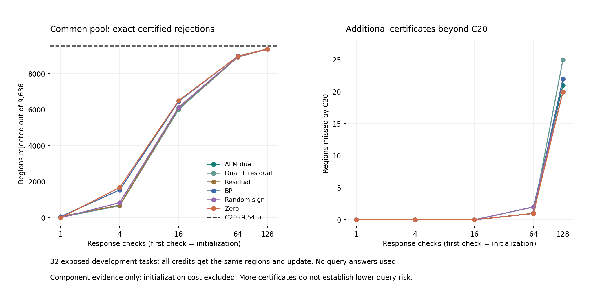

# 356｜区域条件化信用：理论保证、实际证书与初始化归因

本轮完成了可运行的自由信用更新与独立证书审计：主 ALM 乘子初始化在9,636个共同候选区域中严格排除9,372个，其中21个不被C20区间收缩排除。**这21个证实局部联合约束信用可以补充区间收缩；但零初始化也额外排除20个，主方法没有独立平均优势。**

这不是另起一个回避原目标的任务，而是在原分支搜索计算路径内检验：已有乘子是否能把不可行区域更快筛掉。固定方向扩为区域条件化方向后确实获得证书，但本次增益不能归因于ALM初始化。主比较保持dual，不按事后结果改为最优变体。

## 从网络约束到可检验的更新

```text
观测 x/v + 候选分支 R
  → 共享偏置/分支像集构成局部凸域 Y_R
  → 当前信用 a 的解析最坏响应 g=r(y)
  → D_R(a)>0? ──是──→ 整数有理数复核 → 安全排除该区域
         │否
         └→ 投影到半空间 {a: aᵀg≥1} → 下次响应（最多128次）
```

D_R(a)=min_(y∈Y_R) aᵀr(y)。非空凸紧域上 max_(||a||₂≤1)D_R(a)=min_(y∈Y_R)||r(y)||₂，因此不可行域存在可缩放分离信用。这是标准凸对偶，不是独有的新定理。

固定δ=1，a_(t+1)=a_t+[(1−a_tᵀg_t)_+/||g_t||₂²]g_t。对任何满足D_R(a*)≥1的分离信用，理想精确算术下有：

$$\|a_{t+1}-a^*\|_2^2\le\|a_t-a^*\|_2^2-\frac{(1-D_R(a_t))^2}{\|g_t\|_2^2}.$$

成功前D≤0且||g||²≤dn，给出依赖初始距离的有限步上界。这个上界也说明ALM需要证明什么：它应使到分离集合的距离或实际有限步轨迹更好。信用正确、无全局BP本身都不能推出这一点。浮点响应仅作提议；只有严格整数/Fraction正值能实际排除。

## 冻结共同池结果

六方法使用同一348触发状态、同一350提议并集、相同归一化和δ=1。均为已暴露开发任务；没有输入查询答案、几何解或后验参考。老提议文件含历史分类，但提取器只取模式及来源路径，不将分类传给候选。

| 初始化 | 第1次 | 第4次 | 第16次 | 第64次 | 第128次 | C20外新增 | 响应对数 | 32任务合计秒 |
| --- | --- | --- | --- | --- | --- | --- | --- | --- |
| dual | 31 | 671 | 6029 | 8939 | 9372 | 21 | 212021 | 2.202495 |
| dual_plus_residual | 29 | 671 | 6025 | 8930 | 9371 | 25 | 212768 | 2.129172 |
| residual | 70 | 696 | 6105 | 8939 | 9364 | 22 | 210298 | 2.136279 |
| bp | 59 | 1547 | 6475 | 8979 | 9376 | 22 | 194126 | 2.064542 |
| random_sign | 0 | 837 | 6148 | 8951 | 9370 | 20 | 208794 | 2.147583 |
| zero | 0 | 1682 | 6516 | 8973 | 9374 | 20 | 193112 | 2.055909 |




| 现有对照 | 排除区域 | 32任务合计秒 |
| --- | --- | --- |
| c5 | 9538 | 0.141430 |
| c20 | 9548 | 0.532345 |
| pdhg60 | 8969 | 0.253611 |


上述时间包含本组件解析响应和精确验证，但不含加载信用前的母轨迹、提议生成及最终预测。一次测量，不是重复统计或等墙钟预算比较。每种自由信用方法命名数组峰值小计850,896字节，不是进程峰值。旧PDHG60使用更宽活动松域，因此覆盖差不能全部归因更新方式。

## 收益究竟来自哪里

固定主dual初次检查仅排除31个，128次后9,372个，说明区域条件化更新真实改变了信用方向的作用；但零初始化从0增至9,374个，且响应对数更少。C20自身排除9,548个，主遗漏其中197个，同时补充21个，因此主与C20互补，但不能直接替代C20。

下表行A列B表示“A能排除而B不能”的区域数，不是误差改善。最后一列还要求C20与其它五信用全部不能排除，是事后描述性见证统计。

| A / B | dual | dual_plus_residual | residual | bp | random_sign | zero | C20及其它五信用之外独占 |
| --- | --- | --- | --- | --- | --- | --- | --- |
| dual | 0 | 16 | 25 | 17 | 25 | 19 | 0 |
| dual_plus_residual | 15 | 0 | 30 | 20 | 28 | 22 | 0 |
| residual | 17 | 23 | 0 | 14 | 20 | 15 | 1 |
| bp | 21 | 25 | 26 | 0 | 25 | 4 | 1 |
| random_sign | 23 | 27 | 26 | 19 | 0 | 21 | 1 |
| zero | 21 | 25 | 25 | 2 | 25 | 0 | 0 |


dual比zero独有19个，但zero比dual独有21个；dual对C20与其它五信用的并集没有独占。不能把19个局部互补例子表述为“必须使用ALM”。本轮支持将联合约束证书作为可用组件，尚不支持ALM初始化是不可替代点。

## 独立核验与保留的失败记录

原语320例解析响应/独立LP/Fraction一致，最大误差4.44e-15；40次受守卫求解、20次已知可行模式保留、100条投影距离检查通过。正式审计56,227条独立Fraction证书、8,969条PDHG证书和38,536条原几何证书通过。所有排除都落在已被独立严格证明不可行的区域；4个正体积及2个零体积/未判空区域均保留。

首次运行在第1任务保存PDHG NumPy数组时失败，development_attempt1保留原文件和异常；v2适配器仅把数组序列化为列表，未修改冻结数值源码，全部32任务重新运行。协议记录适配器和失败记录哈希。

## 与在线任务结果的衔接

本轮不产生新的查询MSE，也没有替换353已封存预测。当前最近在线主MSE为0.0521723419，仍高于同增强零信用0.0521210081和同起点Adam240的0.0512499136。尚无官方TTT-MLP/LLM/VLM验证。

后续如使用本组件，应先以C20处理明显冲突，再检验剩余区域的动态分离信用能否被复用来约束整个搜索空间，而不是继续对所有易排除区域重复求解。该方向需要核对旧跨模式信用与PDHG工作，并用同增强非乘子/强优化器检验完整收益；此处只列待检验假设，不冒充新实现或结果。

[冻结数学协议](../../../outputs/ttt-pc-alm-research/355_region_conditioned_credit_protocol_v1.md) · [完整组件审计](../audit_v1/summary.json) · [32任务逐项比较](../audit_v1/rows.json) · [最新在线图文](../../unvisited_online/report_v1/report.md)
