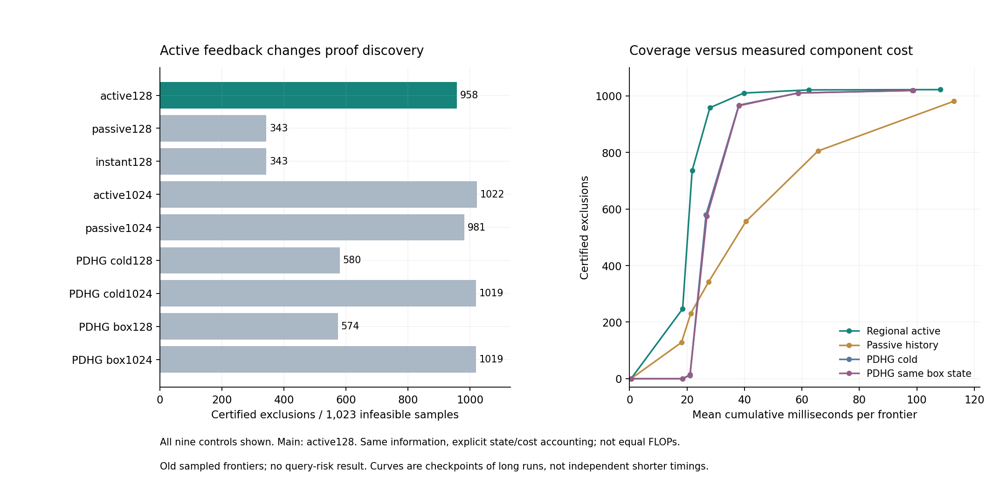

# 377｜当前区域内的主动乘子反馈：正向组件结果

主动区域乘子128步排除958/1023个已证不可行样本；相同原始更新但仅被动累积为343，瞬时残差343，PDHG冷启动580、同盒初始状态574。完整组件均时分别28.168、27.703、26.724、26.729、26.313毫秒。

**可以支持的结论：**在这批固定旧前沿、预列预算内，主动反馈比同原始块更新的被动历史更快地产生有效不可行证书，并出现相对强PDHG有竞争力的覆盖—成本区间。**尚不能支持的结论：**新的未见查询收益、完整在线加速、PC-ALM不可替代或论文已完成。

## 1. 改变的不是模型容量，而是当前区域的约束反馈

374的历史来自原非线性求解轨迹，本轮乘子从零开始，只对当前待检分支的rp=z-h_prev-b、ra=h-sz-c累积。原始变量分三块作带近端的盒内二次最小化，随后乘子以.5倍残差更新。相同步数的被动对照只把残差积累在旁路，不让它改变原始更新；瞬时对照只用当前残差。所有方法都能提出当前残差证书，PDHG没有被限制成弱信用通道。

固定乘子时，三个可分离二次块的解析盒投影使E_new+τ||delta||²/2≤E_old，τ=.01。该结论不等于多块ALM全局收敛；拒绝区域仍只能依靠实际宽域的严格分离下界。局部导数/线性斜率均在所在层计算，无全局BP、LP或母状态生成。

[完整更新公式和预列对照](../../../outputs/ttt-pc-alm-research/376_regional_alm_protocol_v1.md)

## 2. 完整九组结果

失败前沿16个，1024样本中1023不可行；完成前沿32个，1093样本中1067不可行。后两列为失败前沿上的固定主独有与控制独有证明，不能当作独立任务数。所有配置0步证明数为0。

| 配置 | 失败前沿排除 | 完整均毫秒 | 完成前沿排除 | 完整均毫秒 | 主独有 | 控制独有 |
| --- | --- | --- | --- | --- | --- | --- |
| regional_active128 | 958 | 28.168 | 587 | 25.948 | 0 | 0 |
| regional_passive128 | 343 | 27.703 | 90 | 25.364 | 615 | 0 |
| regional_instant128 | 343 | 26.724 | 90 | 25.006 | 615 | 0 |
| regional_active1024 | 1022 | 108.206 | 1056 | 96.261 | 0 | 64 |
| regional_passive1024 | 981 | 112.985 | 865 | 98.498 | 15 | 38 |
| pdhg_cold128 | 580 | 26.729 | 239 | 24.426 | 378 | 0 |
| pdhg_cold1024 | 1019 | 98.519 | 1034 | 86.836 | 0 | 61 |
| pdhg_box128 | 574 | 26.313 | 244 | 24.048 | 384 | 0 |
| pdhg_box1024 | 1019 | 98.918 | 1026 | 87.290 | 0 | 61 |

短预算主958远高于被动343，不是只给主多存一些历史：被动也累积相同类型的历史，区别在于是否反馈到下一次原始更新。被动与瞬时128的原始终态逐位相同，盒投影PDHG与主初始b,z,h逐位相同。计时是本机一次交错调用，不是重复计时置信结论；相同步数也不是相同FLOPs。

## 3. 强预算控制与工作曲线

| 长轨迹来源 | 检查点步数 | 失败前沿排除 | 累计均毫秒 |
| --- | --- | --- | --- |
| regional_active1024 | 64 | 736 | 21.784 |
| regional_active1024 | 128 | 958 | 27.957 |
| regional_active1024 | 256 | 1010 | 39.794 |
| regional_active1024 | 512 | 1021 | 62.493 |
| regional_active1024 | 1024 | 1022 | 108.134 |
| regional_passive1024 | 64 | 231 | 21.318 |
| regional_passive1024 | 128 | 343 | 27.568 |
| regional_passive1024 | 256 | 556 | 40.506 |
| regional_passive1024 | 512 | 805 | 65.601 |
| regional_passive1024 | 1024 | 981 | 112.914 |
| pdhg_cold1024 | 64 | 12 | 21.048 |
| pdhg_cold1024 | 128 | 580 | 26.620 |
| pdhg_cold1024 | 256 | 967 | 38.033 |
| pdhg_cold1024 | 512 | 1010 | 58.658 |
| pdhg_cold1024 | 1024 | 1019 | 98.447 |
| pdhg_box1024 | 64 | 14 | 21.043 |
| pdhg_box1024 | 128 | 574 | 26.914 |
| pdhg_box1024 | 256 | 965 | 38.048 |
| pdhg_box1024 | 512 | 1010 | 58.623 |
| pdhg_box1024 | 1024 | 1019 | 98.845 |

主动64检查点736个、约21.784毫秒；PDHG冷128检查点580个、约26.620毫秒。主动256与PDHG冷512都达到1010个，累计均时约39.794与58.658毫秒。它们是不同固定长轨迹中的预列检查点，不是独立短运行的最终完整计时，不把该比率直接称端到端加速。

主动1024排除1022，强PDHG1024排除1019；长主略多但完整费用也更高，不能只比较证书数量。固定主仍是128，不用长主替换。下一关口应使用完整树实际预算和重复资源测量，而非继续用单独组件的平均时间保证效果。

## 4. 下一实验为何有依据、还缺什么

这次改变了后续动作：已有同初始状态、同信息、同信用通道下的主动反馈增量，且有竞争力的有限成本区间，因此可以进入完整前缀求交与后验读出开发测试。下一主保持regional_active128，不事后改成最有利检查点；须有passive128、cold/box PDHG128/256/512和无额外证书的C20基线，统计生成候选、筛选、最终几何与读出的全部工作。

最终主指标仍为未见query误差，不是删除更多分支。只有完整预算下胜过强简单控制，才值得启用新冻结任务，并与原TTT更新、回归/核、浅层头和同参数强优化器比较。本轮全部为旧已暴露任务的采样组件，没有新查询预测，也不满足持续目标完成条件。通用ALM/二次块更新本身不宣称新颖性。

## 5. 完整审计

432正式调用、0执行异常；独立12070个宽域Fraction正证书、432最终盒约束、7536检查点、1008同初始状态数组、144被动/瞬时原始终态、192长短工作前缀和243正样本保留通过。预检2484标量计算最大差4.86e-17、81块下降不等式通过。

所有输出封存后才读取372旧几何标签做审核；标签与LP权重不参与求解。没有查询答案、后缀观察或BP信用初始化。状态统计为命名数组，不是进程峰值；组件时间不含原建树、最终几何和读出。样本跨排序/同任务相关，不做独立新任务显著性声明。

[全部调用](../development_v1/rows.json) · [独立审计](../audit_v1/summary.json) · [配对结果](../audit_v1/paired.json) · [预检与块证明检查](../preflight_v1/block_tests.json)
