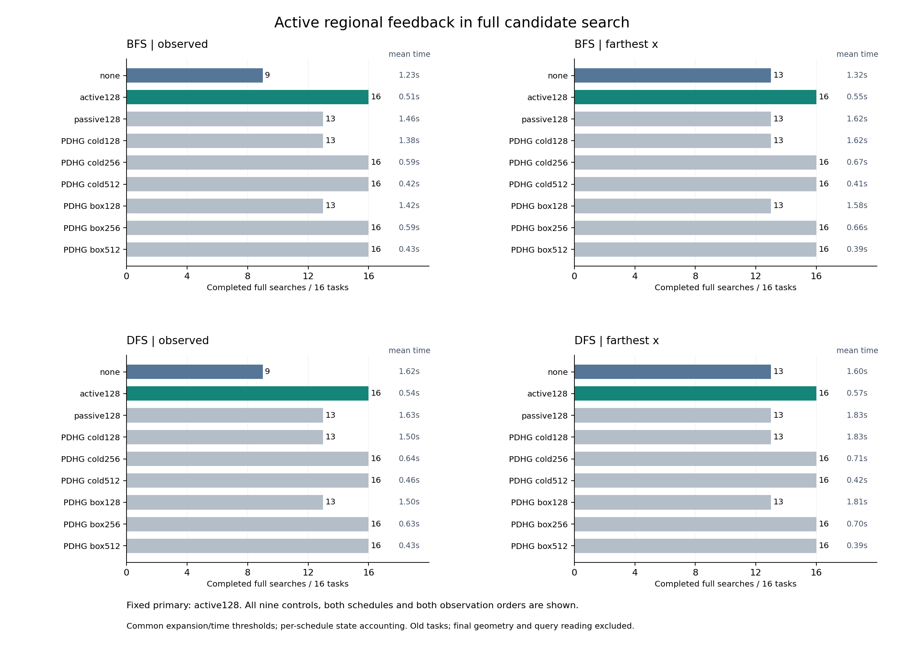

# 379｜从局部证书到完整候选搜索

本轮把376的主动区域反馈真正接入逐观察建树，比较完整搜索而非固定旧前沿。所有576次调用及独立审计完成后才生成本报告。仍不是最终查询预测实验。

## 完整结果

BFS/observed：主完成16/16、均0.505秒；无额外筛选完成9/16、均1.229秒。
BFS/farthest_x：主完成16/16、均0.549秒；无额外筛选完成13/16、均1.323秒。
DFS/observed：主完成16/16、均0.536秒；无额外筛选完成9/16、均1.619秒。
DFS/farthest_x：主完成16/16、均0.572秒；无额外筛选完成13/16、均1.600秒。

主方法固定为regional_active128。无额外筛选不是不做约束，而是保留共同C5/C20。PDHG256/512是真实显式工作步数，不是名字更改。表中候选数含不可行假阳性，不是正体积解释数，也不是预测准确率。

| 调度 | 排序 | 方法 | 完成/16 | 均搜索秒 | 展开总数 | 局部排除 | 完整候选总数 | 局部坐标步 |
| --- | --- | --- | --- | --- | --- | --- | --- | --- |
| bfs | observed | none | 9 | 1.229 | 514139 | 0 | 1861 | 0 |
| bfs | observed | regional_active128 | 16 | 0.505 | 111280 | 3058 | 1370 | 70139392 |
| bfs | observed | regional_passive128 | 13 | 1.458 | 392862 | 4577 | 2649 | 341239296 |
| bfs | observed | pdhg_cold128 | 13 | 1.381 | 344626 | 4313 | 3161 | 314078208 |
| bfs | observed | pdhg_cold256 | 16 | 0.590 | 113155 | 3151 | 1392 | 149667840 |
| bfs | observed | pdhg_cold512 | 16 | 0.419 | 77149 | 2609 | 431 | 84676608 |
| bfs | observed | pdhg_box128 | 13 | 1.419 | 350787 | 4343 | 3131 | 326923264 |
| bfs | observed | pdhg_box256 | 16 | 0.589 | 112992 | 3178 | 1330 | 149643264 |
| bfs | observed | pdhg_box512 | 16 | 0.433 | 75916 | 2805 | 389 | 94824448 |
| bfs | farthest_x | none | 13 | 1.323 | 419503 | 0 | 4631 | 0 |
| bfs | farthest_x | regional_active128 | 16 | 0.549 | 119731 | 2556 | 1186 | 76247552 |
| bfs | farthest_x | regional_passive128 | 13 | 1.622 | 363923 | 1055 | 3044 | 354650112 |
| bfs | farthest_x | pdhg_cold128 | 13 | 1.618 | 356022 | 1643 | 3445 | 393494528 |
| bfs | farthest_x | pdhg_cold256 | 16 | 0.669 | 125702 | 2570 | 1466 | 177089536 |
| bfs | farthest_x | pdhg_cold512 | 16 | 0.412 | 77983 | 2234 | 332 | 83286016 |
| bfs | farthest_x | pdhg_box128 | 13 | 1.577 | 348244 | 1714 | 3339 | 385119232 |
| bfs | farthest_x | pdhg_box256 | 16 | 0.660 | 123479 | 2581 | 1424 | 178168832 |
| bfs | farthest_x | pdhg_box512 | 16 | 0.392 | 75011 | 2008 | 350 | 70621184 |
| dfs | observed | none | 9 | 1.619 | 596456 | 0 | 3976 | 0 |
| dfs | observed | regional_active128 | 16 | 0.536 | 118028 | 3027 | 1504 | 66464768 |
| dfs | observed | regional_passive128 | 13 | 1.633 | 440898 | 3394 | 3580 | 247375360 |
| dfs | observed | pdhg_cold128 | 13 | 1.501 | 380525 | 3014 | 4650 | 240902144 |
| dfs | observed | pdhg_cold256 | 16 | 0.642 | 125135 | 3392 | 1536 | 141693952 |
| dfs | observed | pdhg_cold512 | 16 | 0.457 | 84508 | 2670 | 518 | 84209664 |
| dfs | observed | pdhg_box128 | 13 | 1.503 | 379095 | 3094 | 4575 | 243327488 |
| dfs | observed | pdhg_box256 | 16 | 0.632 | 123499 | 3372 | 1489 | 139025408 |
| dfs | observed | pdhg_box512 | 16 | 0.433 | 77272 | 2757 | 421 | 91320320 |
| dfs | farthest_x | none | 13 | 1.600 | 453346 | 0 | 8477 | 0 |
| dfs | farthest_x | regional_active128 | 16 | 0.572 | 125538 | 2534 | 1352 | 63173120 |
| dfs | farthest_x | regional_passive128 | 13 | 1.832 | 381520 | 1030 | 7533 | 351853568 |
| dfs | farthest_x | pdhg_cold128 | 13 | 1.825 | 388646 | 1319 | 8283 | 367539200 |
| dfs | farthest_x | pdhg_cold256 | 16 | 0.710 | 135822 | 2913 | 1565 | 161688576 |
| dfs | farthest_x | pdhg_cold512 | 16 | 0.422 | 80245 | 2206 | 463 | 73259008 |
| dfs | farthest_x | pdhg_box128 | 13 | 1.806 | 383267 | 1350 | 7978 | 361736704 |
| dfs | farthest_x | pdhg_box256 | 16 | 0.705 | 133432 | 2813 | 1593 | 168643584 |
| dfs | farthest_x | pdhg_box512 | 16 | 0.392 | 76362 | 2030 | 418 | 63408128 |

## 结论与机制归因

固定主active128在四组设置中均16/16完成；none在observed为9/16、farthest_x为13/16，passive128均13/16。主动反馈的组件增量因此真实进入了完整搜索，不只是固定旧候选批上的证书数量变化。

但cold/box PDHG512同样四组全完成，平均时间均低于主方法，且展开更少。较长局部求证可以通过更早剪枝减少后续工作；不能把短128步局部比较直接推广为完整算法优势。本轮因此支持继续优化真实搜索预算分配，不支持直接启动以现有active128为胜出方法的新查询确认。

## 为什么剪枝不会删除可行延伸

设当前前缀盒约束为D_k，层间残差为r_p、r_a。对任何信用p、a，严格下界L=inf_{D_k}(p·r_p+a·r_a)>0意味着当前前缀没有同时满足两组等式的状态。任何合法完整延伸限制到该前缀都应使残差为零，因此不可能延伸被严格证明不可行的前缀。实现只接受向外舍入的严格正下界，独立审计再以Fraction复核。

该论证保证剪枝安全，不保证固定步数找到所有证书、不保证ALM全局收敛，也不保证求证费低于节约的搜索费。累计局部坐标步、完整时间与最终候选必须同时看。

## 有限预算与反例防护

BFS逐层展开；批式DFS把已产生子批送往深层，允许中断前已有完整候选。未完成的搜索保存待访问父批、观察深度与偏移；空完整候选不是空真实后验。审计要求每个已知可行模式位于已输出候选或者尚未搜索的子树中。两种调度和两种排序均对九方法开放，不用一种基线较弱的调度包装主方法优势。

共同展开上限65536、时间阈值8秒协作批边界；最后一批可越过阈值。状态20000检查存在调度差异：BFS检查产生的下一层，DFS检查待访问父批加已输出行数，因此不是两调度严格相同峰值内存上限；同调度内九配置规则相同，实际父层/归档和命名状态另计。见[执行中实现核对](../../../outputs/ttt-pc-alm-research/378_state_accounting_note_v1.md)。

C20后批内至少64存活才运行额外筛选。实际费用不同，同上限并非相同FLOPs。完整搜索时间计入外层守卫、语言、排序、建树、筛选和证明归档拷贝，不含写盘压缩、独立审计、最终几何和后验读出。数组状态下界不是进程峰值；本轮是单次交错计时，没有重复计时置信区间。

| 调度 | 排序 | 方法 | 最大搜索状态 | 最大命名数组下界MiB | 均归档MiB | 最大实际秒 |
| --- | --- | --- | --- | --- | --- | --- |
| bfs | observed | none | 8936 | 4.170 | 1.895 | 2.389 |
| bfs | observed | regional_active128 | 1100 | 5.410 | 0.612 | 1.750 |
| bfs | observed | regional_passive128 | 5392 | 7.754 | 1.807 | 3.942 |
| bfs | observed | pdhg_cold128 | 3561 | 9.246 | 1.714 | 3.589 |
| bfs | observed | pdhg_cold256 | 757 | 5.003 | 0.627 | 1.937 |
| bfs | observed | pdhg_cold512 | 140 | 3.377 | 0.397 | 0.995 |
| bfs | observed | pdhg_box128 | 3514 | 9.239 | 1.754 | 3.591 |
| bfs | observed | pdhg_box256 | 750 | 4.931 | 0.627 | 1.911 |
| bfs | observed | pdhg_box512 | 142 | 4.028 | 0.407 | 0.909 |
| bfs | farthest_x | none | 3328 | 4.662 | 1.892 | 3.268 |
| bfs | farthest_x | regional_active128 | 692 | 4.571 | 0.623 | 1.630 |
| bfs | farthest_x | regional_passive128 | 4325 | 8.913 | 1.756 | 4.840 |
| bfs | farthest_x | pdhg_cold128 | 3712 | 7.500 | 1.802 | 4.246 |
| bfs | farthest_x | pdhg_cold256 | 608 | 5.006 | 0.665 | 2.003 |
| bfs | farthest_x | pdhg_cold512 | 135 | 2.599 | 0.377 | 0.977 |
| bfs | farthest_x | pdhg_box128 | 3583 | 7.347 | 1.764 | 4.155 |
| bfs | farthest_x | pdhg_box256 | 588 | 4.991 | 0.654 | 1.956 |
| bfs | farthest_x | pdhg_box512 | 141 | 2.771 | 0.346 | 1.000 |
| dfs | observed | none | 2315 | 4.765 | 2.317 | 3.210 |
| dfs | observed | regional_active128 | 641 | 4.482 | 0.601 | 1.779 |
| dfs | observed | regional_passive128 | 1781 | 7.562 | 1.934 | 3.778 |
| dfs | observed | pdhg_cold128 | 1732 | 7.209 | 1.782 | 4.344 |
| dfs | observed | pdhg_cold256 | 542 | 3.975 | 0.665 | 1.956 |
| dfs | observed | pdhg_cold512 | 196 | 2.786 | 0.414 | 1.492 |
| dfs | observed | pdhg_box128 | 1605 | 7.530 | 1.782 | 4.494 |
| dfs | observed | pdhg_box256 | 548 | 3.941 | 0.652 | 2.024 |
| dfs | observed | pdhg_box512 | 124 | 3.995 | 0.387 | 0.874 |
| dfs | farthest_x | none | 2960 | 5.190 | 2.001 | 4.299 |
| dfs | farthest_x | regional_active128 | 666 | 4.469 | 0.602 | 1.669 |
| dfs | farthest_x | regional_passive128 | 3074 | 8.060 | 1.767 | 6.204 |
| dfs | farthest_x | pdhg_cold128 | 3370 | 8.402 | 1.823 | 5.777 |
| dfs | farthest_x | pdhg_cold256 | 411 | 4.879 | 0.683 | 2.004 |
| dfs | farthest_x | pdhg_cold512 | 152 | 2.532 | 0.366 | 1.019 |
| dfs | farthest_x | pdhg_box128 | 3156 | 8.413 | 1.801 | 5.755 |
| dfs | farthest_x | pdhg_box256 | 577 | 4.893 | 0.664 | 1.916 |
| dfs | farthest_x | pdhg_box512 | 164 | 2.371 | 0.334 | 1.023 |

## 独立审计与剩余关口

审计通过：13824个精确单观察语言、8586098次组合重放、42228个收缩mask、85310个精确宽域剪枝证书、576次可行模式输出/待搜索覆盖，以及全部576次搜索资源核对。

预检还完成117原376求解器数组逐位重放、4显式步数前缀、4嵌套LP/BP守卫拦截、584搜索重复数组及8紧预算真模式检查。实验只见支持x/v；旧几何正模式只在全部搜索结果封存后进入离线审计；没有查询答案。

下一步检验更充分的局部求证与已证分支提前退役能否减少全树总费用；所有控制必须获得相同执行优化，并保留当前128主的结果，不能事后改名成成功。成本竞争力成立后接入共同几何与anytime后验读出，再测试总费用和未见查询误差。若查询效果能被更简单控制复现，就不能归因于PC-ALM。本轮不替代强回归、浅头、同参数优化器或官方TTT的任务比较，不完成研究目标。

[预列协议](../../../outputs/ttt-pc-alm-research/378_regional_join_protocol_v1.md) · [全部调用](../development_v1/rows.json) · [独立审计](../audit_v1/summary.json)
