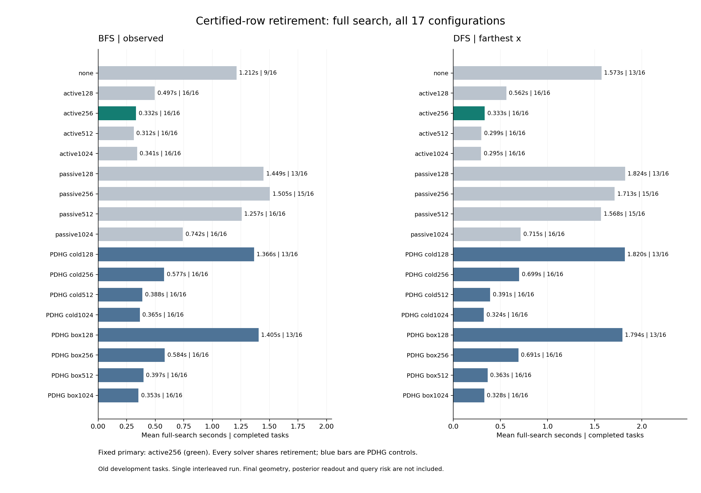

# 381｜严格证书行退役后的完整搜索成本

本轮检验正向机制：主动乘子反馈能否用更充分的局部求证，减少虚假前缀的后续展开，并在强PDHG控制面前形成完整搜索成本优势。所有方法共用严格证书后行退役；它本身不归为PC独有创新。

## 完整结果

BFS/observed：固定主active256完成16/16、均0.3315秒；PDHG全完成配置中均时最低为pdhg_box1024、0.3530秒。
DFS/farthest_x：固定主active256完成16/16、均0.3331秒；PDHG全完成配置中均时最低为pdhg_cold1024、0.3237秒。

固定主尚未在两个设置都低于最快的全完成PDHG控制；不能宣称统一强控制胜出。预列active配置中至少有一个设置出现较好的平均成本区间，需保留其次要/开发选择身份并在后续独立验证。

| 调度 | 排序 | 方法 | 完成/16 | 均搜索秒 | 展开总数 | 局部排除 | 完整候选 |
| --- | --- | --- | --- | --- | --- | --- | --- |
| bfs | observed | none | 9 | 1.2116 | 514139 | 0 | 1861 |
| bfs | observed | regional_active128 | 16 | 0.4965 | 111280 | 3058 | 1370 |
| bfs | observed | regional_active256 | 16 | 0.3315 | 71670 | 2547 | 364 |
| bfs | observed | regional_active512 | 16 | 0.3124 | 65037 | 2034 | 290 |
| bfs | observed | regional_active1024 | 16 | 0.3409 | 62761 | 2071 | 223 |
| bfs | observed | regional_passive128 | 13 | 1.4491 | 392862 | 4577 | 2649 |
| bfs | observed | regional_passive256 | 15 | 1.5046 | 330637 | 4438 | 2891 |
| bfs | observed | regional_passive512 | 16 | 1.2570 | 189768 | 3396 | 2222 |
| bfs | observed | regional_passive1024 | 16 | 0.7416 | 91527 | 3384 | 583 |
| bfs | observed | pdhg_cold128 | 13 | 1.3657 | 344626 | 4313 | 3161 |
| bfs | observed | pdhg_cold256 | 16 | 0.5775 | 113155 | 3151 | 1392 |
| bfs | observed | pdhg_cold512 | 16 | 0.3876 | 77149 | 2609 | 431 |
| bfs | observed | pdhg_cold1024 | 16 | 0.3646 | 67085 | 2251 | 241 |
| bfs | observed | pdhg_box128 | 13 | 1.4053 | 350787 | 4343 | 3131 |
| bfs | observed | pdhg_box256 | 16 | 0.5836 | 112992 | 3178 | 1330 |
| bfs | observed | pdhg_box512 | 16 | 0.3969 | 75916 | 2805 | 389 |
| bfs | observed | pdhg_box1024 | 16 | 0.3530 | 66033 | 2110 | 279 |
| dfs | farthest_x | none | 13 | 1.5728 | 453346 | 0 | 8477 |
| dfs | farthest_x | regional_active128 | 16 | 0.5621 | 125538 | 2534 | 1352 |
| dfs | farthest_x | regional_active256 | 16 | 0.3331 | 74634 | 1994 | 474 |
| dfs | farthest_x | regional_active512 | 16 | 0.2988 | 62719 | 1764 | 269 |
| dfs | farthest_x | regional_active1024 | 16 | 0.2955 | 56766 | 1574 | 244 |
| dfs | farthest_x | regional_passive128 | 13 | 1.8237 | 381520 | 1030 | 7533 |
| dfs | farthest_x | regional_passive256 | 15 | 1.7128 | 298846 | 1840 | 5048 |
| dfs | farthest_x | regional_passive512 | 15 | 1.5678 | 210784 | 2439 | 3332 |
| dfs | farthest_x | regional_passive1024 | 16 | 0.7152 | 96571 | 2416 | 798 |
| dfs | farthest_x | pdhg_cold128 | 13 | 1.8204 | 388646 | 1319 | 8283 |
| dfs | farthest_x | pdhg_cold256 | 16 | 0.6992 | 135822 | 2913 | 1565 |
| dfs | farthest_x | pdhg_cold512 | 16 | 0.3914 | 80245 | 2206 | 463 |
| dfs | farthest_x | pdhg_cold1024 | 16 | 0.3237 | 63512 | 1655 | 384 |
| dfs | farthest_x | pdhg_box128 | 13 | 1.7943 | 383267 | 1350 | 7978 |
| dfs | farthest_x | pdhg_box256 | 16 | 0.6913 | 133432 | 2813 | 1593 |
| dfs | farthest_x | pdhg_box512 | 16 | 0.3632 | 76362 | 2030 | 418 |
| dfs | farthest_x | pdhg_box1024 | 16 | 0.3283 | 62891 | 1713 | 293 |

固定新主regional_active256，原主128保留。表中最优PDHG/active是预列配置之间的描述性最小值，不是免费在线选择器；不把事后最佳次要配置改称原主。若完成率不同，平均时间不能直接解释为相同成果的加速比。候选含未排除的不可行模式，不是正确解释数。

## 数学上真正保住了什么

每个区域行的状态更新只在本行内跨层和观察耦合，整个批映射因此是各行映射的直积。移除已严格证明不可行的行，不改变任何活行的输入状态和更新算子。归纳可得活行轨迹及首次证书与原实现相同；退役行停在首次证书时刻，不再定义旧cap终态。搜索只消费首次证书，故非时钟截断下的科学输出相同。

若第i行首次证书在t_i，未证行记t_i=T，则实际坐标工作为d*n*sum_i(t_i)，旧全行上界为d*n*R*T。独立审计从存下的首次时刻和每检查点的活行数量重建实际费用。该计数不是FLOPs；各方法每步算术不同。拷贝/压缩活动批可能抵消墙钟节约，所以仍报告完整实际时间。

证书依据仍是当前前缀盒域上局部残差线性组合的严格正下界。任何合法延伸限制到前缀都会使残差为零，故不能延伸被证不可行区域。向外舍入及独立Fraction核验保证剪枝安全；不保证有限步完备，不证明PC比所有其他求解器更快。

| 调度 | 排序 | 方法 | 实际坐标步 | 全行坐标步上界 | 省去比例 | 均命名数组MiB | 均归档MiB |
| --- | --- | --- | --- | --- | --- | --- | --- |
| bfs | observed | none | 0 | 0 | N/A | 1.905 | 1.895 |
| bfs | observed | regional_active128 | 64675200 | 70139392 | 7.79% | 1.858 | 0.612 |
| bfs | observed | regional_active256 | 20005760 | 35467264 | 43.59% | 1.193 | 0.363 |
| bfs | observed | regional_active512 | 14210176 | 42881024 | 66.86% | 0.960 | 0.302 |
| bfs | observed | regional_active1024 | 16810368 | 87404544 | 80.77% | 0.985 | 0.292 |
| bfs | observed | regional_passive128 | 335109760 | 341239296 | 1.80% | 4.003 | 1.807 |
| bfs | observed | regional_passive256 | 453652480 | 468865024 | 3.24% | 3.312 | 1.617 |
| bfs | observed | regional_passive512 | 523702912 | 554244096 | 5.51% | 2.390 | 0.989 |
| bfs | observed | regional_passive1024 | 269412864 | 353378304 | 23.76% | 1.628 | 0.514 |
| bfs | observed | pdhg_cold128 | 313322496 | 314078208 | 0.24% | 3.759 | 1.714 |
| bfs | observed | pdhg_cold256 | 140660224 | 149667840 | 6.02% | 2.000 | 0.627 |
| bfs | observed | pdhg_cold512 | 54663936 | 84676608 | 35.44% | 1.260 | 0.397 |
| bfs | observed | pdhg_cold1024 | 37135104 | 105205760 | 64.70% | 1.065 | 0.324 |
| bfs | observed | pdhg_box128 | 326125184 | 326923264 | 0.24% | 3.849 | 1.754 |
| bfs | observed | pdhg_box256 | 140541952 | 149643264 | 6.08% | 1.987 | 0.627 |
| bfs | observed | pdhg_box512 | 63303296 | 94824448 | 33.24% | 1.346 | 0.407 |
| bfs | observed | pdhg_box1024 | 33960064 | 94171136 | 63.94% | 0.992 | 0.310 |
| dfs | farthest_x | none | 0 | 0 | N/A | 2.016 | 2.001 |
| dfs | farthest_x | regional_active128 | 59143808 | 63173120 | 6.38% | 1.508 | 0.602 |
| dfs | farthest_x | regional_active256 | 19749760 | 32501760 | 39.23% | 0.934 | 0.321 |
| dfs | farthest_x | regional_active512 | 13485824 | 42381312 | 68.18% | 0.775 | 0.251 |
| dfs | farthest_x | regional_active1024 | 12338432 | 67919872 | 81.83% | 0.681 | 0.213 |
| dfs | farthest_x | regional_passive128 | 350874880 | 351853568 | 0.28% | 3.025 | 1.767 |
| dfs | farthest_x | regional_passive256 | 538194560 | 544321536 | 1.13% | 2.752 | 1.412 |
| dfs | farthest_x | regional_passive512 | 684915072 | 709865472 | 3.51% | 2.260 | 1.032 |
| dfs | farthest_x | regional_passive1024 | 251622656 | 308371456 | 18.40% | 1.464 | 0.461 |
| dfs | farthest_x | pdhg_cold128 | 367219456 | 367539200 | 0.09% | 3.106 | 1.823 |
| dfs | farthest_x | pdhg_cold256 | 153825408 | 161688576 | 4.86% | 1.813 | 0.683 |
| dfs | farthest_x | pdhg_cold512 | 44663168 | 73259008 | 39.03% | 1.081 | 0.366 |
| dfs | farthest_x | pdhg_cold1024 | 23143424 | 75382784 | 69.30% | 0.750 | 0.250 |
| dfs | farthest_x | pdhg_box128 | 361397888 | 361736704 | 0.09% | 3.043 | 1.801 |
| dfs | farthest_x | pdhg_box256 | 160747136 | 168643584 | 4.68% | 1.897 | 0.664 |
| dfs | farthest_x | pdhg_box512 | 37910912 | 63408128 | 40.21% | 1.007 | 0.334 |
| dfs | farthest_x | pdhg_box1024 | 26717184 | 82583552 | 67.65% | 0.772 | 0.251 |

## 审计与信息边界

544调用全部封存后才读取旧可行模式用于审计。结束原因：{'expanded_limit_at_batch_boundary': 13, 'expanded_limit_before_stage': 17, 'complete': 513, 'seconds_at_batch_boundary': 1}。预检包括296个初始/首次证明数组、481个行排列数组、34个小任务完整搜索及18个真实n24重放。

正式独立核验：81855个精确宽域剪枝证明、6122325次组合展开、35770个活行检查点、544次实际搜索费用，以及288次与已发布378搜索的逐位重放。可行模式输出或待访问子树覆盖544次。

旧审计器只认识全行跑满上界，因此仅对独立内存副本规范化上界，复用其枚举/证书核验；真正活动行费用另行核验，原始档案没有被改写。所有方法只见支持x/v，无查询答案、无LP/BP筛选捷径，几何只在封存后用于覆盖核验。

共同65536展开、8秒协作批边界、20000状态阈值；沿用378的BFS/DFS状态计数差异，不宣称两调度严格峰值内存相同。同调度内所有方法规则相同。命名数组不是RSS，未覆盖所有临时复制峰值；全搜索时间包含守卫/语言/收缩/局部筛选/证明拷贝，不含写盘压缩、离线审计、最终几何和读出。

## 下一关：把成本信号变成任务收益

需按当前预列结果冻结候选，重复交错计时，并为候选及强控制接完全相同的几何和后验读出；未完树保留pending，不把空输出当空后验。在新冻结任务上比较独立查询风险和端到端费用，同时保留强回归、固定非线性/核、浅层头及同参数优化器和官方TTT。只有最终任务收益不能被这些控制解释，才构成目标要求的独立收益。当前goal仍ACTIVE。

[执行前协议](../../../outputs/ttt-pc-alm-research/380_certified_retirement_protocol_v1.md) · [全部调用](../development_v1/rows.json) · [独立审计](../audit_v1/summary.json)
