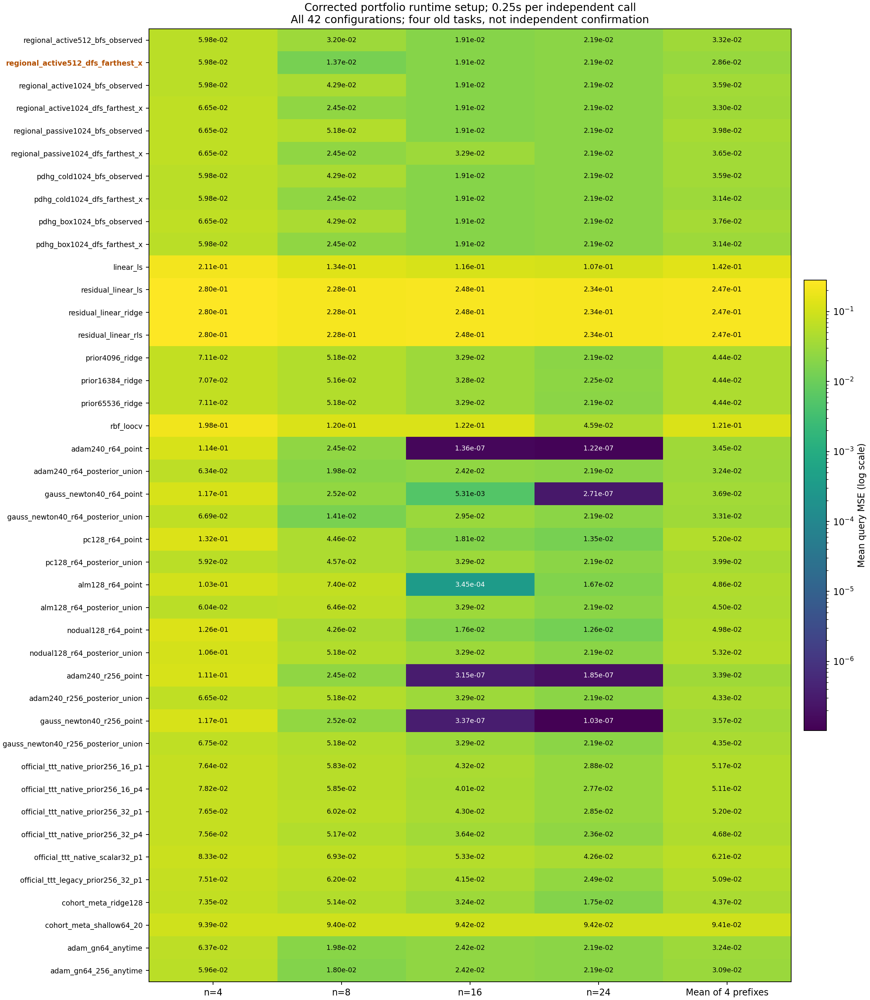
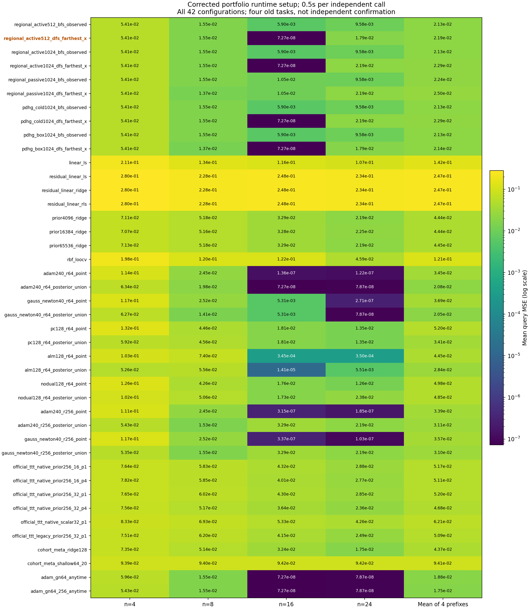

# 406｜统一预加载后的四前缀限时开发结果

四个旧任务、42配置、四前缀、.25/.5秒，共1344次预测。全部预测封存并独立审计之后才由评估器生成本轮查询答案；旧任务历史上已开发使用，仍不是独立确认。

本轮新主active512 DFS/farthest_x、主预算.5秒，四前缀等权平均；选择来自旧397开发结果，不追溯改变旧主。组合已在无支持setup阶段加载优化器／读出模块，相关setup费用单独保留；没有预跑支持更新。

没有提供四旧任务的显著性或论文胜出标签。全部方法、预算、前缀及逐任务差异均保留。原397结果不覆盖，本表也不能仅凭前后墙钟波动声称算法加速。

## 0.25秒

| Method | n4 MSE | n8 MSE | n16 MSE | n24 MSE | Prefix average | Final / 16 |
| --- | ---: | ---: | ---: | ---: | ---: | ---: |
| regional_active512_bfs_observed | 0.0598359496276 | 0.0320006833693 | 0.0191191468814 | 0.021916401484 | 0.0332180453405 | 6 |
| regional_active512_dfs_farthest_x | 0.0598359496276 | 0.0136538844263 | 0.0191191468814 | 0.021916401484 | 0.0286313456048 | 7 |
| regional_active1024_bfs_observed | 0.0598359496276 | 0.0428949130424 | 0.0191191468814 | 0.021916401484 | 0.0359416027588 | 5 |
| regional_active1024_dfs_farthest_x | 0.06651356423 | 0.0245481140994 | 0.0191191468814 | 0.021916401484 | 0.0330243066737 | 5 |
| regional_passive1024_bfs_observed | 0.06651356423 | 0.0517882508766 | 0.0191191468814 | 0.021916401484 | 0.039834340868 | 3 |
| regional_passive1024_dfs_farthest_x | 0.06651356423 | 0.0245481140994 | 0.0328757403655 | 0.021916401484 | 0.0364634550447 | 4 |
| pdhg_cold1024_bfs_observed | 0.0598359496276 | 0.0428949130424 | 0.0191191468814 | 0.021916401484 | 0.0359416027588 | 5 |
| pdhg_cold1024_dfs_farthest_x | 0.0598359496276 | 0.0245481140994 | 0.0191191468814 | 0.021916401484 | 0.0313549030231 | 6 |
| pdhg_box1024_bfs_observed | 0.06651356423 | 0.0428949130424 | 0.0191191468814 | 0.021916401484 | 0.0376110064094 | 4 |
| pdhg_box1024_dfs_farthest_x | 0.0598359496276 | 0.0245481140994 | 0.0191191468814 | 0.021916401484 | 0.0313549030231 | 6 |
| linear_ls | 0.210718603165 | 0.133851949042 | 0.11642156857 | 0.106949665226 | 0.141985446501 | 16 |
| residual_linear_ls | 0.280105132927 | 0.228248486316 | 0.247756260041 | 0.233502284868 | 0.247403041038 | 16 |
| residual_linear_ridge | 0.280054888195 | 0.228246449685 | 0.247752989748 | 0.233500870064 | 0.247388799423 | 16 |
| residual_linear_rls | 0.280054888195 | 0.228246449685 | 0.247752989748 | 0.233500870064 | 0.247388799423 | 16 |
| prior4096_ridge | 0.0710584654529 | 0.0517882508766 | 0.0328757403655 | 0.021916401484 | 0.0444097145448 | 16 |
| prior16384_ridge | 0.0706777476058 | 0.0516252225982 | 0.0327917009912 | 0.0224587082759 | 0.0443883448678 | 16 |
| prior65536_ridge | 0.0710584654529 | 0.0517882508766 | 0.0328757403655 | 0.021916401484 | 0.0444097145448 | 0 |
| rbf_loocv | 0.198260961603 | 0.11966702435 | 0.122042910869 | 0.0458918171711 | 0.121465678498 | 16 |
| adam240_r64_point | 0.113516427385 | 0.0244994732872 | 1.35635864188e-07 | 1.22291860837e-07 | 0.03450403965 | 16 |
| adam240_r64_posterior_union | 0.0634378710537 | 0.0198310128025 | 0.0242175876887 | 0.021916401484 | 0.0323507182572 | 9 |
| gauss_newton40_r64_point | 0.117011027424 | 0.0251853491843 | 0.0053057069577 | 2.71248992295e-07 | 0.0368755887038 | 16 |
| gauss_newton40_r64_posterior_union | 0.0668883999858 | 0.014142063279 | 0.029523089531 | 0.021916401484 | 0.0331174885699 | 7 |
| pc128_r64_point | 0.131789044665 | 0.0446205701377 | 0.0181454198572 | 0.0134811325323 | 0.052009041798 | 16 |
| pc128_r64_posterior_union | 0.0592281581279 | 0.0456922420416 | 0.0328757403655 | 0.021916401484 | 0.0399281355047 | 7 |
| alm128_r64_point | 0.103397382388 | 0.0739816340271 | 0.000344679275352 | 0.0166851013811 | 0.0486021992679 | 14 |
| alm128_r64_posterior_union | 0.0603761805696 | 0.0646391071513 | 0.0328757403655 | 0.021916401484 | 0.0449518573926 | 5 |
| nodual128_r64_point | 0.126337486084 | 0.0425802686393 | 0.0175688091164 | 0.0125851794752 | 0.0497679358286 | 16 |
| nodual128_r64_posterior_union | 0.106388914143 | 0.0517882508766 | 0.0328757403655 | 0.021916401484 | 0.0532423267172 | 3 |
| adam240_r256_point | 0.111295315647 | 0.0244996849236 | 3.15490847009e-07 | 1.84591991348e-07 | 0.0339488751633 | 16 |
| adam240_r256_posterior_union | 0.06651356423 | 0.0517882508766 | 0.0328757403655 | 0.021916401484 | 0.043273489239 | 2 |
| gauss_newton40_r256_point | 0.117477064289 | 0.0251853593619 | 3.36507957887e-07 | 1.0325439279e-07 | 0.0356657158534 | 16 |
| gauss_newton40_r256_posterior_union | 0.0675413164645 | 0.0517882508766 | 0.0328757403655 | 0.021916401484 | 0.0435304272977 | 1 |
| official_ttt_native_prior256_16_p1 | 0.0763745113539 | 0.0582589228999 | 0.043244070491 | 0.0287948694889 | 0.0516680935585 | 16 |
| official_ttt_native_prior256_16_p4 | 0.0781768050636 | 0.0585026875897 | 0.040101952417 | 0.0276939020238 | 0.0511188367735 | 16 |
| official_ttt_native_prior256_32_p1 | 0.0764933635062 | 0.0602087094311 | 0.0429820788056 | 0.0284621476109 | 0.0520365748385 | 16 |
| official_ttt_native_prior256_32_p4 | 0.0755572837992 | 0.0517031316636 | 0.0364170556689 | 0.0236288654538 | 0.0468265841464 | 16 |
| official_ttt_native_scalar32_p1 | 0.0833234279978 | 0.0692689560314 | 0.0532930631664 | 0.0426326034438 | 0.0621295126598 | 16 |
| official_ttt_legacy_prior256_32_p1 | 0.0751384893936 | 0.0619670292051 | 0.0414972075914 | 0.0249436676038 | 0.0508865984485 | 16 |
| cohort_meta_ridge128 | 0.0735192044804 | 0.0513915011005 | 0.0324292003309 | 0.0175432851625 | 0.0437207977686 | 16 |
| cohort_meta_shallow64_20 | 0.0938748839201 | 0.0939573387003 | 0.0942455125848 | 0.0942316707151 | 0.0940773514801 | 16 |
| adam_gn64_anytime | 0.0637016657845 | 0.0198310128025 | 0.0242175876887 | 0.021916401484 | 0.0324166669399 | 1 |
| adam_gn64_256_anytime | 0.0596329716687 | 0.0179591708581 | 0.0242175876887 | 0.021916401484 | 0.0309315329249 | 0 |
## 0.5秒

| Method | n4 MSE | n8 MSE | n16 MSE | n24 MSE | Prefix average | Final / 16 |
| --- | ---: | ---: | ---: | ---: | ---: | ---: |
| regional_active512_bfs_observed | 0.054089642381 | 0.0155257263707 | 0.0059029087971 | 0.00957856607382 | 0.0212742109057 | 12 |
| regional_active512_dfs_farthest_x | 0.054089642381 | 0.0155257263707 | 7.26560330014e-08 | 0.0178655078618 | 0.0218702373174 | 13 |
| regional_active1024_bfs_observed | 0.054089642381 | 0.0155257263707 | 0.0059029087971 | 0.00957856607382 | 0.0212742109057 | 12 |
| regional_active1024_dfs_farthest_x | 0.054089642381 | 0.0155257263707 | 7.26560330014e-08 | 0.021916401484 | 0.0228829607229 | 12 |
| regional_passive1024_bfs_observed | 0.054089642381 | 0.0155257263707 | 0.0104609942046 | 0.00957856607382 | 0.0224137322575 | 11 |
| regional_passive1024_dfs_farthest_x | 0.054089642381 | 0.0136538844263 | 0.0104609942046 | 0.021916401484 | 0.025030230624 | 9 |
| pdhg_cold1024_bfs_observed | 0.054089642381 | 0.0155257263707 | 0.0059029087971 | 0.00957856607382 | 0.0212742109057 | 12 |
| pdhg_cold1024_dfs_farthest_x | 0.054089642381 | 0.0155257263707 | 7.26560330014e-08 | 0.021916401484 | 0.0228829607229 | 12 |
| pdhg_box1024_bfs_observed | 0.054089642381 | 0.0155257263707 | 0.0059029087971 | 0.00957856607382 | 0.0212742109057 | 12 |
| pdhg_box1024_dfs_farthest_x | 0.054089642381 | 0.0136538844263 | 7.26560330014e-08 | 0.0178655078618 | 0.0214022768313 | 12 |
| linear_ls | 0.210718603165 | 0.133851949042 | 0.11642156857 | 0.106949665226 | 0.141985446501 | 16 |
| residual_linear_ls | 0.280105132927 | 0.228248486316 | 0.247756260041 | 0.233502284868 | 0.247403041038 | 16 |
| residual_linear_ridge | 0.280054888195 | 0.228246449685 | 0.247752989748 | 0.233500870064 | 0.247388799423 | 16 |
| residual_linear_rls | 0.280054888195 | 0.228246449685 | 0.247752989748 | 0.233500870064 | 0.247388799423 | 16 |
| prior4096_ridge | 0.0710584654529 | 0.0517882508766 | 0.0328757403655 | 0.021916401484 | 0.0444097145448 | 16 |
| prior16384_ridge | 0.0706777476058 | 0.0516252225982 | 0.0327917009912 | 0.0224587082759 | 0.0443883448678 | 16 |
| prior65536_ridge | 0.0712748345689 | 0.0517882508766 | 0.0328757403655 | 0.021916401484 | 0.0444638068238 | 3 |
| rbf_loocv | 0.198260961603 | 0.11966702435 | 0.122042910869 | 0.0458918171711 | 0.121465678498 | 16 |
| adam240_r64_point | 0.113516427385 | 0.0244994732872 | 1.35635864188e-07 | 1.22291860837e-07 | 0.03450403965 | 16 |
| adam240_r64_posterior_union | 0.0634378710537 | 0.0198310128025 | 7.26560330014e-08 | 7.86985606034e-08 | 0.0208172588027 | 16 |
| gauss_newton40_r64_point | 0.117011027424 | 0.0251853491843 | 0.0053057069577 | 2.71248992295e-07 | 0.0368755887038 | 16 |
| gauss_newton40_r64_posterior_union | 0.0626816912232 | 0.0140824551136 | 0.00530557449825 | 7.86985606034e-08 | 0.0205174498834 | 16 |
| pc128_r64_point | 0.131789044665 | 0.0446205701377 | 0.0181454198572 | 0.0134811325323 | 0.052009041798 | 16 |
| pc128_r64_posterior_union | 0.0592281581279 | 0.0455561782162 | 0.0181454198572 | 0.0134811325323 | 0.0341027221834 | 16 |
| alm128_r64_point | 0.103397382388 | 0.0739816340271 | 0.000344679275352 | 0.000350083631717 | 0.0445184448306 | 16 |
| alm128_r64_posterior_union | 0.0525906507229 | 0.0556167194226 | 1.40767149975e-05 | 0.00551157910785 | 0.0284332564921 | 14 |
| nodual128_r64_point | 0.126337486084 | 0.0425802686393 | 0.0175688091164 | 0.0125851794752 | 0.0497679358286 | 16 |
| nodual128_r64_posterior_union | 0.10218220538 | 0.0506429240091 | 0.0173322208319 | 0.0237528559951 | 0.048477551554 | 13 |
| adam240_r256_point | 0.111295315647 | 0.0244996849236 | 3.15490847009e-07 | 1.84591991348e-07 | 0.0339488751633 | 16 |
| adam240_r256_posterior_union | 0.0543304438556 | 0.015336987358 | 0.0328757403655 | 0.021916401484 | 0.0311148932658 | 8 |
| gauss_newton40_r256_point | 0.117477064289 | 0.0251853593619 | 3.36507957887e-07 | 1.0325439279e-07 | 0.0356657158534 | 16 |
| gauss_newton40_r256_posterior_union | 0.0535313977332 | 0.0155257263707 | 0.0328757403655 | 0.021916401484 | 0.0309623164883 | 8 |
| official_ttt_native_prior256_16_p1 | 0.0763745113539 | 0.0582589228999 | 0.043244070491 | 0.0287948694889 | 0.0516680935585 | 16 |
| official_ttt_native_prior256_16_p4 | 0.0781768050636 | 0.0585026875897 | 0.040101952417 | 0.0276939020238 | 0.0511188367735 | 16 |
| official_ttt_native_prior256_32_p1 | 0.0764933635062 | 0.0602087094311 | 0.0429820788056 | 0.0284621476109 | 0.0520365748385 | 16 |
| official_ttt_native_prior256_32_p4 | 0.0755572837992 | 0.0517031316636 | 0.0364170556689 | 0.0236288654538 | 0.0468265841464 | 16 |
| official_ttt_native_scalar32_p1 | 0.0833234279978 | 0.0692689560314 | 0.0532930631664 | 0.0426326034438 | 0.0621295126598 | 16 |
| official_ttt_legacy_prior256_32_p1 | 0.0751384893936 | 0.0619670292051 | 0.0414972075914 | 0.0249436676038 | 0.0508865984485 | 16 |
| cohort_meta_ridge128 | 0.0735192044804 | 0.0513915011005 | 0.0324292003309 | 0.0175432851625 | 0.0437207977686 | 16 |
| cohort_meta_shallow64_20 | 0.0938748839201 | 0.0939573387003 | 0.0942455125848 | 0.0942316707151 | 0.0940773514801 | 16 |
| adam_gn64_anytime | 0.0596329716687 | 0.0155257263707 | 7.26560330014e-08 | 7.86985606034e-08 | 0.0187897123485 | 13 |
| adam_gn64_256_anytime | 0.0543304438556 | 0.0155257263707 | 7.26560330014e-08 | 7.86985606034e-08 | 0.0174640803952 | 4 |

## 新主的全部配对差

差值为active512减控制的每任务四前缀平均MSE，再取四任务均值。负数不自动意味着独立或统计确认。

| Control | .25s difference | .5s difference |
| --- | ---: | ---: |
| regional_active512_bfs_observed | -0.00458669973576 | 0.000596026411724 |
| regional_active1024_bfs_observed | -0.00731025715403 | 0.000596026411724 |
| regional_active1024_dfs_farthest_x | -0.00439296106888 | -0.00101272340554 |
| regional_passive1024_bfs_observed | -0.0112029952632 | -0.000543494940152 |
| regional_passive1024_dfs_farthest_x | -0.00783210943992 | -0.00315999330658 |
| pdhg_cold1024_bfs_observed | -0.00731025715403 | 0.000596026411724 |
| pdhg_cold1024_dfs_farthest_x | -0.00272355741828 | -0.00101272340554 |
| pdhg_box1024_bfs_observed | -0.00897966080464 | 0.000596026411724 |
| pdhg_box1024_dfs_farthest_x | -0.00272355741828 | 0.000467960486105 |
| linear_ls | -0.113354100896 | -0.120115209184 |
| residual_linear_ls | -0.218771695433 | -0.22553280372 |
| residual_linear_ridge | -0.218757453818 | -0.225518562106 |
| residual_linear_rls | -0.218757453818 | -0.225518562106 |
| prior4096_ridge | -0.01577836894 | -0.0225394772274 |
| prior16384_ridge | -0.015756999263 | -0.0225181075504 |
| prior65536_ridge | -0.01577836894 | -0.0225935695064 |
| rbf_loocv | -0.0928343328936 | -0.0995954411811 |
| adam240_r64_point | -0.00587269404516 | -0.0126338023326 |
| adam240_r64_posterior_union | -0.00371937265242 | 0.00105297851469 |
| gauss_newton40_r64_point | -0.00824424309901 | -0.0150053513864 |
| gauss_newton40_r64_posterior_union | -0.00448614296514 | 0.00135278743398 |
| pc128_r64_point | -0.0233776961932 | -0.0301388044806 |
| pc128_r64_posterior_union | -0.0112967898999 | -0.012232484866 |
| alm128_r64_point | -0.0199708536631 | -0.0226482075132 |
| alm128_r64_posterior_union | -0.0163205117878 | -0.00656301917472 |
| nodual128_r64_point | -0.0211365902238 | -0.0278976985112 |
| nodual128_r64_posterior_union | -0.0246109811124 | -0.0266073142367 |
| adam240_r256_point | -0.00531752955855 | -0.012078637846 |
| adam240_r256_posterior_union | -0.0146421436342 | -0.00924465594838 |
| gauss_newton40_r256_point | -0.00703437024861 | -0.013795478536 |
| gauss_newton40_r256_posterior_union | -0.0148990816929 | -0.00909207917096 |
| official_ttt_native_prior256_16_p1 | -0.0230367479537 | -0.0297978562411 |
| official_ttt_native_prior256_16_p4 | -0.0224874911687 | -0.0292485994561 |
| official_ttt_native_prior256_32_p1 | -0.0234052292337 | -0.0301663375211 |
| official_ttt_native_prior256_32_p4 | -0.0181952385416 | -0.024956346829 |
| official_ttt_native_scalar32_p1 | -0.033498167055 | -0.0402592753424 |
| official_ttt_legacy_prior256_32_p1 | -0.0222552528437 | -0.0290163611311 |
| cohort_meta_ridge128 | -0.0150894521638 | -0.0218505604512 |
| cohort_meta_shallow64_20 | -0.0654460058753 | -0.0722071141627 |
| adam_gn64_anytime | -0.00378532133513 | 0.00308052496888 |
| adam_gn64_256_anytime | -0.00230018732007 | 0.00440615692217 |

## 费用与归因边界

逐调用保存setup、在线接收、归档传输、任务清理、强制停止、控制器超时、RSS及会话关闭。冷启动并未消失；控制器磁盘压缩含在全轮总时长而非逐调用独立归因，RSS是采样下界，没有严格峰值RAM上限匹配。

组合的阶段预测仍使用fallback包类型，final不是完整后验保证；几何只在同一次调用内复用。所有快状态在任务间清空；元模型当前前缀内的支持重放全额收费。

BP/PC/ALM参数盒相同，有限步代理目标尚未严格同式。局部候选还包含收费全局几何LP。400部分后验证书没有加入本轮。

[全部组表](../evaluation_v1/groups.json) · [全部配对](../evaluation_v1/comparisons.json) · [独立审计](../audit_v1/summary.json) · [冻结协议](../development_v1/protocol.json)

尚无独立新任务确认，也没有NLP/CV/Graph真实模型结果。完整研究目标未达。
