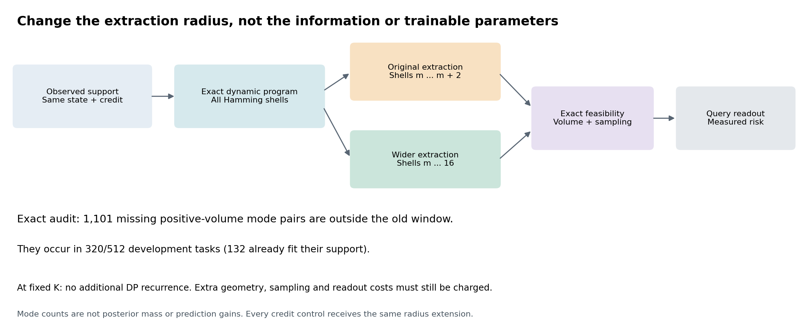
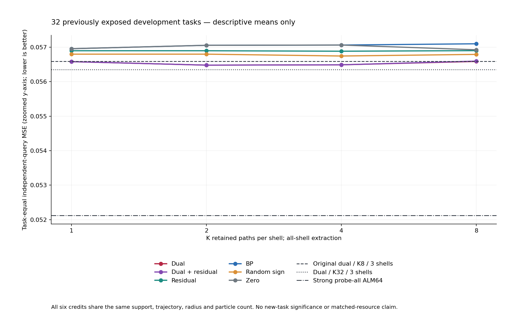

# 341｜从搜索范围瓶颈到完整在线查询检验

本报告为2026-09-25中午阶段交付。32个任务全部是已暴露开发数据，不是新盲集，也不是论文级确认。所有新预测先封存，再单独评分和独立审计；主候选在评分前已指定。

## 本轮实际完成了什么

先完成88配置的1408次计时和116次独立内存测量；再在512旧开发任务中精确确认搜索范围限制；随后验证半径原语，并运行32任务×53新配置=1696次真实fit。另引用同任务原51方法的封存预测，共比较104种方法。

预指定主候选为`radius_first_fit_dual__k8__sall`，本轮MSE257为**0.0565858748**，执行失败0次。下面给出全部关键对照和全部方法，不能仅凭相对回归改善就归因于PC-ALM。

## 数学机制：为何这次扩范围有明确对象

固定支持数据、触发状态和信用。精确DP为每个汉明距离h求按下界与字典序排列的K个候选。令m为至少一个下界非正的最小正距离。旧提议集只包含m至m+2三个壳；不论K多大，距离大于m+2的模式都不能由这条追加搜索输出。

四个强发现器的正池并集中，有1609个主候选漏掉的任务—模式对，全部重新通过严格正体积证书。其中1101个在旧窗口外，涉及320/512任务，含132个已拟合支持任务。它们不是随机无效分支，但数量也不是后验质量。

新实现只扩大从同一DP表提取候选的距离范围。固定K时，DP递推及保留状态计数不变；扩大span得到嵌套提议。额外精确几何检查、采样、读出仍然计费。all表示覆盖所有距离壳，不表示枚举了所有模式或得到完整后验，因为每壳仍只保留有限K。

## 乘子为什么可能仍有用，以及必须如何归因

当支持损失已为零时，仅按该损失做普通梯度下降不再移动参数。但在有限步、尚未同时满足层间约束与驻点条件的ALM状态中，乘子仍可能非零，保留内部约束和历史信息。可检验假设是：这些信号能否在同预算搜索中找出更有预测价值的可行解释。

这不是说非零乘子在此等于正确BP信用；那种对应需要约束与驻点条件。零信用、残差、BP信用和随机符号都获得同一全壳搜索、同一轨迹与观测，因而只有与这些控制比较，才能判断乘子是否提供独立收益。扩半径本身不是PC-ALM专属贡献。

## 为什么“模式更多”不能替代查询检验

令S为支持数据，T为当前保留的可行参数集合，μ_S为完整后验预测均值，μ_T为截断集合预测均值，V_T为该集合的预测方差，M为理想独立粒子数。以查询网格上的平均平方范数计，条件风险分解为：

$$R_M(T\mid S)=R_{\mathrm{Bayes}}(S)+\|\mu_T-\mu_S\|_q^2+V_T/M.$$

增加不相交区域R，令a为其在合并集合中的后验权重，d=μ_R−μ_T，e=μ_T−μ_S，则风险变化为：

$$\Delta R=2a\langle e,d\rangle_q+a^2\|d\|_q^2+\{a(V_R-V_T)+a(1-a)\|d\|_q^2\}/M.$$

只有右侧为负才保证在上述理想条件下改善。实际数值体积和采样器还要额外验证；本轮对固定teacher的开发MSE不是这个条件期望恒等式的无条件证明。因此直接运行独立查询，并保留全部成功与失败样本。

## 同半径、不同信用与K的查询结果

六条曲线来自同一32任务。纵轴为放大刻度；没有置信区间或显著性标记。虚线为固定对照，不因本轮查询表现挑选。

## 主候选的预列关键对照

差值=主候选MSE−对照MSE，负数表示主候选开发均值较低。改善/相同/变差以任务为单位；最差留一均差用于观察是否由单个任务主导，不是显著性检验。

| 对照 | 对照MSE257 | 主−对照 | 改善/同/变差 | 最差留一均差 |
| --- | --- | --- | --- | --- |
| radius_first_fit_dual_plus_residual__k8__sall | 0.0565941307 | -0.0000082559 | 1/31/0 | 0.0000000000 |
| radius_first_fit_residual__k8__sall | 0.0568984635 | -0.0003125887 | 4/24/4 | -0.0000985007 |
| radius_first_fit_bp__k8__sall | 0.0570970477 | -0.0005111729 | 6/25/1 | -0.0003034908 |
| radius_first_fit_random_sign__k8__sall | 0.0567896349 | -0.0002037600 | 4/26/2 | -0.0000552059 |
| radius_first_fit_zero__k8__sall | 0.0569233095 | -0.0003374347 | 5/27/0 | -0.0001931927 |
| online_first_fit_dual | 0.0565858748 | 0.0000000000 | 0/32/0 | 0.0000000000 |
| online_first_fit_dual__k32 | 0.0563525643 | 0.0002333105 | 2/25/5 | 0.0002485120 |
| online_uniform_state_dual_plus_residual__k64 | 0.0567397136 | -0.0001538388 | 4/25/3 | 0.0000653702 |
| probe_all_alm64 | 0.0521223412 | 0.0044635336 | 10/12/10 | 0.0049587642 |
| probe_then_adam15360_33 | 0.0535038771 | 0.0030819978 | 10/13/9 | 0.0037328369 |
| probe_pc1024_33 | 0.0559864467 | 0.0005994282 | 11/10/11 | 0.0016245148 |
| probe_nodual1024_33 | 0.0583663411 | -0.0017804662 | 12/14/6 | -0.0008321504 |
| plain_alm1024_33 | 0.0544280803 | 0.0021577946 | 13/3/16 | 0.0031292586 |
| probe_alm512_33 | 0.0527693314 | 0.0038165434 | 11/12/9 | 0.0041638292 |
| cold__prior16384_ridge | 0.0665166556 | -0.0099307807 | 25/0/7 | -0.0086137031 |
| cold__meta_ridge128 | 0.0681715217 | -0.0115856468 | 24/0/8 | -0.0101002816 |
| cold__meta_shallow64_20 | 0.0901028063 | -0.0335169315 | 29/0/3 | -0.0318367818 |

## 资源证据及不能混用的时间

337的同期8任务重复校准预算B=1.2057233750秒，12信用共同K=32；uniform控制自身K64也保留。Adam3840仍在预算内，故340新增7680/15360步及更长PC、无乘子和ALM。

| 337方法 | 完整均时/秒 | tracemalloc峰值/B | 绝对进程生命周期峰值/B |
| --- | --- | --- | --- |
| reference_fraction_first_fit_dual | 1.2057233750 | 18347191 | 626630656 |
| online_first_fit_dual__k32 | 1.0064894875 | 18977124 | 628776960 |
| online_uniform_state_dual_plus_residual__k64 | 1.1567170250 | 19491596 | 630087680 |
| probe_all_alm64 | 0.7966528063 | 18148161 | 625528832 |
| probe_then_adam3840_33 | 1.1776081562 | 17767006 | 623755264 |
| probe_pc256_33 | 0.5615304313 | 17776200 | 624254976 |
| probe_nodual256_33 | 0.7662517438 | 17776090 | 624148480 |
| plain_alm256_33 | 0.6614011875 | 17274665 | 623407104 |

上表来自同一337资源校准，内存为首尾两个任务独立进程的最大记录。绝对进程峰值包含导入和预加载模型；tracemalloc不一定涵盖原生库分配，不能相减当纯算法峰值。340全表中的时间仅为新配置本次单次开发运行，旧方法填空，不与旧时间拼成同预算胜出。新候选要进入新任务确认，仍需同期重复计时、峰值测量和足够强的预算前沿。

## 全部方法，不按效果删行

| 方法 | MSE257 | MSE129 | point MSE257 | point MSE129 | 本轮新fit均时/秒 | 失败 |
| --- | --- | --- | --- | --- | --- | --- |
| counterfactual_mode_change_alm | 0.0566657702 | 0.0567638420 | 0.1206408566 | 0.1206780168 | — | 0 |
| credit_control_probe33 | 0.0567964225 | 0.0568908697 | 0.1206408566 | 0.1206780168 | — | 0 |
| probe_archive_only | 0.0571660939 | 0.0572613831 | 0.1233768150 | 0.1236159789 | — | 0 |
| probe_then_pc33 | 0.0567136953 | 0.0568118311 | 0.1234206583 | 0.1234458531 | — | 0 |
| probe_pc64_33 | 0.0567042291 | 0.0568023552 | 0.1152993808 | 0.1152867436 | — | 0 |
| probe_pc128_33 | 0.0569980153 | 0.0570948290 | 0.1207050837 | 0.1207893678 | — | 0 |
| probe_then_nodual33 | 0.0584311107 | 0.0585283076 | 0.1188088462 | 0.1189328828 | — | 0 |
| probe_nodual64_33 | 0.0584389023 | 0.0585366226 | 0.1193577163 | 0.1194071807 | — | 0 |
| probe_then_adam60_33 | 0.0535376417 | 0.0536281827 | 0.1126252949 | 0.1128837311 | — | 0 |
| probe_then_adam120_33 | 0.0535376417 | 0.0536281827 | 0.1110194831 | 0.1111129006 | — | 0 |
| probe_then_adam240_33 | 0.0535376417 | 0.0536281827 | 0.1110145517 | 0.1111078087 | — | 0 |
| probe_then_adam480_33 | 0.0535376417 | 0.0536281827 | 0.1110145516 | 0.1111078087 | — | 0 |
| credit_control_alm33 | 0.0618250535 | 0.0619314470 | 0.1237745712 | 0.1238407677 | — | 0 |
| plain_alm64_33 | 0.0564851362 | 0.0565806628 | 0.1110946037 | 0.1113150477 | — | 0 |
| plain_alm128_33 | 0.0569029649 | 0.0570005183 | 0.1067804433 | 0.1068566182 | — | 0 |
| cold__adam240_r33 | 0.0609766160 | 0.0610775498 | 0.1072125164 | 0.1072709152 | — | 0 |
| cold__prior4096_ridge | 0.0665171025 | 0.0666046581 | 0.0665171025 | 0.0666046581 | — | 0 |
| cold__prior16384_ridge | 0.0665166556 | 0.0666066670 | 0.0665166556 | 0.0666066670 | — | 0 |
| cold__meta_shallow64_20 | 0.0901028063 | 0.0901580743 | 0.0901028063 | 0.0901580743 | — | 0 |
| probe_all_alm64 | 0.0521223412 | 0.0522165008 | 0.0972136191 | 0.0973644976 | — | 0 |
| cold__linear_ls | 0.1601140361 | 0.1602980531 | 0.1601140361 | 0.1602980531 | — | 0 |
| cold__residual_linear_ls | 0.1997591239 | 0.2003046128 | 0.1997591239 | 0.2003046128 | — | 0 |
| cold__residual_linear_ridge | 0.1997162664 | 0.2002623867 | 0.1997162664 | 0.2002623867 | — | 0 |
| cold__residual_linear_rls | 0.1997162664 | 0.2002623867 | 0.1997162664 | 0.2002623867 | — | 0 |
| cold__rbf_loocv | 0.1323521813 | 0.1325385824 | 0.1323521813 | 0.1325385824 | — | 0 |
| cold__meta_ridge64 | 0.0681644628 | 0.0682575808 | 0.0681644628 | 0.0682575808 | — | 0 |
| cold__meta_ridge128 | 0.0681715217 | 0.0682655843 | 0.0681715217 | 0.0682655843 | — | 0 |
| cold__meta_shallow64_5 | 0.0906851396 | 0.0907484013 | 0.0906851396 | 0.0907484013 | — | 0 |
| probe_pc256_33 | 0.0560945786 | 0.0561863273 | 0.1138330238 | 0.1138462455 | — | 0 |
| probe_nodual128_33 | 0.0584786237 | 0.0585762108 | 0.1138510235 | 0.1139998736 | — | 0 |
| probe_nodual256_33 | 0.0584379494 | 0.0585352051 | 0.1054070654 | 0.1055288327 | — | 0 |
| probe_then_adam960_33 | 0.0535376417 | 0.0536281827 | 0.1110145516 | 0.1111078087 | — | 0 |
| plain_alm256_33 | 0.0559368716 | 0.0560347496 | 0.1068384558 | 0.1069345453 | — | 0 |
| cold__prior65536_ridge | 0.0665246805 | 0.0666148401 | 0.0665246805 | 0.0666148401 | — | 0 |
| probe_alm40_33 | 0.0551619029 | 0.0552484635 | 0.1218666646 | 0.1220083558 | — | 0 |
| probe_alm48_33 | 0.0529388655 | 0.0530286967 | 0.1158131087 | 0.1159919624 | — | 0 |
| probe_alm64_33 | 0.0531866245 | 0.0532768338 | 0.1106653283 | 0.1107971038 | — | 0 |
| online_first_fit_dual | 0.0565858748 | 0.0566787059 | 0.1206408566 | 0.1206780168 | — | 0 |
| online_first_fit_dual_plus_residual | 0.0565941307 | 0.0566870495 | 0.1206408566 | 0.1206780168 | — | 0 |
| online_first_fit_residual | 0.0568984635 | 0.0569941945 | 0.1206408566 | 0.1206780168 | — | 0 |
| online_first_fit_bp | 0.0570970477 | 0.0571942949 | 0.1206408566 | 0.1206780168 | — | 0 |
| online_first_fit_random_sign | 0.0567896349 | 0.0568878025 | 0.1206408566 | 0.1206780168 | — | 0 |
| online_first_fit_zero | 0.0569233095 | 0.0570211556 | 0.1206408566 | 0.1206780168 | — | 0 |
| online_uniform_state_dual | 0.0567964225 | 0.0568908697 | 0.1206408566 | 0.1206780168 | — | 0 |
| online_uniform_state_dual_plus_residual | 0.0567964225 | 0.0568908697 | 0.1206408566 | 0.1206780168 | — | 0 |
| online_uniform_state_residual | 0.0567913230 | 0.0568857200 | 0.1206408566 | 0.1206780168 | — | 0 |
| online_uniform_state_bp | 0.0567913230 | 0.0568857200 | 0.1206408566 | 0.1206780168 | — | 0 |
| online_uniform_state_random_sign | 0.0568002554 | 0.0568946184 | 0.1206408566 | 0.1206780168 | — | 0 |
| online_uniform_state_zero | 0.0567964225 | 0.0568908697 | 0.1206408566 | 0.1206780168 | — | 0 |
| probe_then_adam1920_33 | 0.0535038771 | 0.0535945752 | 0.1110145516 | 0.1111078087 | — | 0 |
| probe_then_adam3840_33 | 0.0535038771 | 0.0535945752 | 0.1110145516 | 0.1111078087 | — | 0 |
| radius_first_fit_dual__k1__sall | 0.0565792564 | 0.0566750122 | 0.1206408566 | 0.1206780168 | 0.5851804031 | 0 |
| radius_first_fit_dual__k2__sall | 0.0564782121 | 0.0565713977 | 0.1206408566 | 0.1206780168 | 0.6090800719 | 0 |
| radius_first_fit_dual__k4__sall | 0.0564875168 | 0.0565792871 | 0.1206408566 | 0.1206780168 | 0.6907557094 | 0 |
| radius_first_fit_dual__k8__sall | 0.0565858748 | 0.0566787059 | 0.1206408566 | 0.1206780168 | 0.8432351219 | 0 |
| radius_first_fit_dual_plus_residual__k1__sall | 0.0565792564 | 0.0566750122 | 0.1206408566 | 0.1206780168 | 0.5658961063 | 0 |
| radius_first_fit_dual_plus_residual__k2__sall | 0.0564782121 | 0.0565713977 | 0.1206408566 | 0.1206780168 | 0.6071789875 | 0 |
| radius_first_fit_dual_plus_residual__k4__sall | 0.0564875168 | 0.0565792871 | 0.1206408566 | 0.1206780168 | 0.6817007281 | 0 |
| radius_first_fit_dual_plus_residual__k8__sall | 0.0565941307 | 0.0566870495 | 0.1206408566 | 0.1206780168 | 0.8348251469 | 0 |
| radius_first_fit_residual__k1__sall | 0.0568953752 | 0.0569899036 | 0.1206408566 | 0.1206780168 | 0.5708780937 | 0 |
| radius_first_fit_residual__k2__sall | 0.0568953752 | 0.0569899036 | 0.1206408566 | 0.1206780168 | 0.6041053281 | 0 |
| radius_first_fit_residual__k4__sall | 0.0568814971 | 0.0569764026 | 0.1206408566 | 0.1206780168 | 0.6831436750 | 0 |
| radius_first_fit_residual__k8__sall | 0.0568984635 | 0.0569941945 | 0.1206408566 | 0.1206780168 | 0.8333786688 | 0 |
| radius_first_fit_bp__k1__sall | 0.0569543631 | 0.0570503865 | 0.1206408566 | 0.1206780168 | 0.5727331313 | 0 |
| radius_first_fit_bp__k2__sall | 0.0570533157 | 0.0571494204 | 0.1206408566 | 0.1206780168 | 0.6164201625 | 0 |
| radius_first_fit_bp__k4__sall | 0.0570604974 | 0.0571566002 | 0.1206408566 | 0.1206780168 | 0.6832204531 | 0 |
| radius_first_fit_bp__k8__sall | 0.0570970477 | 0.0571942949 | 0.1206408566 | 0.1206780168 | 0.8311687000 | 0 |
| radius_first_fit_random_sign__k1__sall | 0.0567964225 | 0.0568908697 | 0.1206408566 | 0.1206780168 | 0.5751396781 | 0 |
| radius_first_fit_random_sign__k2__sall | 0.0567964225 | 0.0568908697 | 0.1206408566 | 0.1206780168 | 0.6049974125 | 0 |
| radius_first_fit_random_sign__k4__sall | 0.0567427261 | 0.0568379295 | 0.1206408566 | 0.1206780168 | 0.6876848969 | 0 |
| radius_first_fit_random_sign__k8__sall | 0.0567896349 | 0.0568878025 | 0.1206408566 | 0.1206780168 | 0.8418709813 | 0 |
| radius_first_fit_zero__k1__sall | 0.0569543631 | 0.0570503865 | 0.1206408566 | 0.1206780168 | 0.5650498562 | 0 |
| radius_first_fit_zero__k2__sall | 0.0570533157 | 0.0571494204 | 0.1206408566 | 0.1206780168 | 0.6028538562 | 0 |
| radius_first_fit_zero__k4__sall | 0.0570604974 | 0.0571566002 | 0.1206408566 | 0.1206780168 | 0.6808458281 | 0 |
| radius_first_fit_zero__k8__sall | 0.0569233095 | 0.0570211556 | 0.1206408566 | 0.1206780168 | 0.8226058937 | 0 |
| online_first_fit_dual__k32 | 0.0563525643 | 0.0564479828 | 0.1206408566 | 0.1206780168 | 0.7853851781 | 0 |
| online_first_fit_dual_plus_residual__k32 | 0.0563525643 | 0.0564479828 | 0.1206408566 | 0.1206780168 | 0.7786227969 | 0 |
| online_first_fit_residual__k32 | 0.0564573512 | 0.0565576838 | 0.1206408566 | 0.1206780168 | 0.7907289406 | 0 |
| online_first_fit_bp__k32 | 0.0567225983 | 0.0568217880 | 0.1206408566 | 0.1206780168 | 0.7825140875 | 0 |
| online_first_fit_random_sign__k32 | 0.0561114659 | 0.0562072955 | 0.1206408566 | 0.1206780168 | 0.7838898500 | 0 |
| online_first_fit_zero__k32 | 0.0567225983 | 0.0568217880 | 0.1206408566 | 0.1206780168 | 0.7859228125 | 0 |
| online_uniform_state_dual__k32 | 0.0567397136 | 0.0568343394 | 0.1206408566 | 0.1206780168 | 0.7722569438 | 0 |
| online_uniform_state_dual__k64 | 0.0567448716 | 0.0568392974 | 0.1206408566 | 0.1206780168 | 0.9539134781 | 0 |
| online_uniform_state_dual_plus_residual__k32 | 0.0567397136 | 0.0568343394 | 0.1206408566 | 0.1206780168 | 0.7656854219 | 0 |
| online_uniform_state_dual_plus_residual__k64 | 0.0567397136 | 0.0568343394 | 0.1206408566 | 0.1206780168 | 0.9529625187 | 0 |
| online_uniform_state_residual__k32 | 0.0562254510 | 0.0563202113 | 0.1206408566 | 0.1206780168 | 0.7637574781 | 0 |
| online_uniform_state_residual__k64 | 0.0561983638 | 0.0562916777 | 0.1206408566 | 0.1206780168 | 0.9512033313 | 0 |
| online_uniform_state_bp__k32 | 0.0567397136 | 0.0568343394 | 0.1206408566 | 0.1206780168 | 0.7724065531 | 0 |
| online_uniform_state_bp__k64 | 0.0566913089 | 0.0567850300 | 0.1206408566 | 0.1206780168 | 0.9454914156 | 0 |
| online_uniform_state_random_sign__k32 | 0.0567417452 | 0.0568363383 | 0.1206408566 | 0.1206780168 | 0.7753188531 | 0 |
| online_uniform_state_random_sign__k64 | 0.0567417452 | 0.0568363383 | 0.1206408566 | 0.1206780168 | 0.9564672438 | 0 |
| online_uniform_state_zero__k32 | 0.0567397136 | 0.0568343394 | 0.1206408566 | 0.1206780168 | 0.7629213938 | 0 |
| online_uniform_state_zero__k64 | 0.0567448716 | 0.0568392974 | 0.1206408566 | 0.1206780168 | 0.9559822406 | 0 |
| probe_then_adam7680_33 | 0.0535038771 | 0.0535945752 | 0.1110145516 | 0.1111078087 | 1.9163484281 | 0 |
| probe_then_adam15360_33 | 0.0535038771 | 0.0535945752 | 0.1110145516 | 0.1111078087 | 3.4086614875 | 0 |
| probe_pc512_33 | 0.0560308920 | 0.0561227158 | 0.1204888307 | 0.1205226612 | 0.6889769031 | 0 |
| probe_pc1024_33 | 0.0559864467 | 0.0560782264 | 0.1140518659 | 0.1140932064 | 0.9399403469 | 0 |
| probe_nodual512_33 | 0.0583663411 | 0.0584641242 | 0.1034888077 | 0.1036550031 | 1.0903394500 | 0 |
| probe_nodual1024_33 | 0.0583663411 | 0.0584641242 | 0.1142278966 | 0.1143290928 | 1.7653108125 | 0 |
| plain_alm512_33 | 0.0544233179 | 0.0545213778 | 0.1070461562 | 0.1071440592 | 1.0005300281 | 0 |
| plain_alm1024_33 | 0.0544280803 | 0.0545266351 | 0.1026398488 | 0.1027187129 | 1.6924885375 | 0 |
| probe_alm128_33 | 0.0532510848 | 0.0533419258 | 0.1094820541 | 0.1094854701 | 0.6471895094 | 0 |
| probe_alm256_33 | 0.0527920573 | 0.0528821946 | 0.0944594138 | 0.0945016111 | 0.8236210656 | 0 |
| probe_alm512_33 | 0.0527693314 | 0.0528589774 | 0.1011073134 | 0.1011651404 | 1.1651755062 | 0 |

## 验证、交付边界与下一步

独立审计检查13312个风险字段、3296条比较，最大风险差1.11e-16；预检重放、上游状态、支持粒子和候选嵌套均验证。图像仍须单独实际查看后才标记视觉验收。

当前是4层标量tent模型、4个支持观测、4个可调偏置及2048粒子的可控理论实验。不是官方TTT-MLP、LLM/VLM验证，不声称普遍胜过所有闭式解或任意新增网络层。后续只在开发效果具有竞争力且资源边界核验后进入新任务确认；研究总目标仍进行中。

[完整评分表](../development_evaluation_v1/methods.json) · [全部描述性比较](../development_evaluation_v1/comparisons.json) · [独立审计](../development_audit_v1/summary.json)
