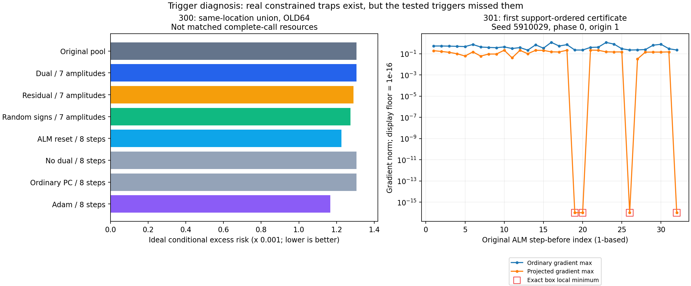

# 300–301｜同位置探索全量结果与受约束局部极小点证据

结论：300没有建立局部信用的独立收益；301则确认原轨迹确实包含此前触发遗漏的盒约束局部极小点。这个数学发现定位了更具体的优化障碍，不等于已经找到相对强BP、回归或浅层头的在线任务优势。

## 300：改换触发位置后的全部对照

64个旧开发任务；2068个模式停留位置、38个参数近停滞位置，重合1个，并集2105个。参数近停滞组在47个任务中为空，按协议保留原池。相同位置复制相同b/h/u/best；候选从未使用BP初始化，Adam仅为对照。

三种七幅度方向并集与五类1/2/4/8步续接，共23配置×3位置组=69个新池。298全部46背景配置原样保留并加background前缀；它们不是同触发成本对照。63个单幅度分组提议也已存档，但未事后挑幅度进入主要评分。所有支持提议先封存，才读旧后验区域矩。

并集位置的257网格理想超额风险：原池 .00130672362865，乘子七幅度 .00130643389918，等范数残差 .00129017476064，随机符号 .00127474594463，ALMreset8 .00122644793164，Adam8 .00116739139025。原乘子方向仅增加2个正体积区域，而Adam8增加30个；范围是这64个旧任务，不是普遍结论。

端点自检：192组α=0的b/h、64组α=1的原ALM下一步、64组keep1、64组reset1/nodual1、576组幅度集合并、1472组选择集并均通过。风险内积另用math.fsum核验，最大误差3.47e−18；46背景配置重放误差为0。

首版脚本在提议封存后错误读取q257字段而中止；实际存档名为q。完整失败记录与源保留，evaluation_v2只修复评分读取，直接复用原封存提议，未重跑适应或改变配置。

## 301：不能把普通梯度非零等同于没有局部极小点

参数盒为C=[−.12,.12]^4，令g=∇L(b)，G=b−Π_C(b−g)。可微点满足G=0当且仅当内部坐标g_j=0、下界坐标g_j≥0、上界坐标g_j≤0。故普通梯度非零仍可在盒约束下驻定。

当所有前向预激活远离折点，存在一个邻域使f_b(x)关于b仿射。平方噪声带损失是该仿射映射的凸函数，因此L(b+d)≥L(b)+gᵀd；盒KKT保证对所有合法小d有gᵀd≥0。这证明相对于盒约束的局部极小性，允许平坦方向，不证明全局最优。

独立精确核验还给出正邻域半径：每个预激活的折点距离除以其参数敏感度一范数的两倍，取全层全样本最小值。由逐层归纳，在此半径内所有激活分支不变。

| 支持侧检查 | 全部69632位置 | 本轮2105触发并集 |
|---|---:|---:|
| 浮点投影梯度为零且支持非可行 | 23 | 0 |
| 投影梯度≤1e−12且支持非可行 | 35 | 0 |
| 投影梯度≤1e−8且支持非可行 | 62 | 0 |
| 完整原始b/h变化≤1e−8且残差非零、支持非可行 | 31 | 0 |
| 精确光滑盒约束局部极小点 | 24 | 0 |

对全部62个近驻点位置做有理检查，24个精确通过，来自4个任务、16个不同参数状态。任务分别是5910029(8位置)、5910037(6)、5910039(9)、5910058(1)。不能将24位置当成24个独立任务。其余38个未获精确KKT证书；本轮未逐个有理枚举所有69632状态，不能声称找全所有驻点。

独立前向敏感度有理实现核对全部62位置、248梯度坐标，与反向计算逐个分数完全一致。24个证书均无折点，最小证明邻域半径为1.79302512418e-05。这比浮点近零的说法严格，也没有读查询或后验参照。

图右仅取按seed/phase/step/origin顺序出现的第一个证书作说明，不按风险或效果选例。为能画对数轴，零值显示在1e−16；证书本身是有理等式而非这个显示阈值。

## 这对机制意味着什么

“参数变化小”“模式停留”“盒投影驻点”和“完整原始块不动点”不是同一个条件。当前触发常在更早的位置用尽一次预算，且沿平坦方向的参数移动不意味着预测或可优化方向还在变化。因此300不能验证246定理所需的真正坏局部分支情形。

不过301的KKT诊断使用全链梯度，只能作为离线机制证据；不能把它偷换成无BP候选的线上触发。下一步先检查仅由边界活动集与支持预测变化构成的事件能否识别这些位置，再用同状态扰动/重启BP和局部对照测试逃逸。即便局部信用能逃逸，也还要计入原始轨迹、检测、几何及读出成本，重新冻结新任务与强回归/浅层头比较。

246关于乘子压力打破完整原始块不动点的条件仍不能直接由参数KKT推出。本轮没有新官方TTT、一般GELU MLP或LLM/VLM实验；294新128任务及旧8192强BP结论保持不变。

## 完整结果：115方法×2网格

两对批次是区域矩Monte Carlo的独立内积估计，不是任务采样置信区间；数值体积不是精确实数体积。额外状态步不是完整墙钟时间。所有方法均保留。

| 方法 | 网格 | 理想超额风险 | 相对原池差 | 对01差 | 对23差 | 覆盖质量 | 状态步/任务 | 新正区域/任务数 |
|---|---:|---:|---:|---:|---:|---:|---:|---|
| dwell__dual_union | 257 | 0.00130643389918 | -2.89729467327e-07 | -2.89730647732e-07 | -2.89728286921e-07 | 0.8664982417 | 226.18750 | 2 / 2 |
| dwell__dual_union | 129 | 0.00130358332394 | -2.80754516099e-07 | -2.80745961344e-07 | -2.80763070853e-07 | 0.8664982417 | 226.18750 | 2 / 2 |
| dwell__residual_union | 257 | 0.00129050477654 | -1.62188521127e-05 | -1.70223227535e-05 | -1.5415381472e-05 | 0.8737495246 | 226.18750 | 9 / 8 |
| dwell__residual_union | 129 | 0.00128786345647 | -1.6000621982e-05 | -1.6804055396e-05 | -1.51971885681e-05 | 0.8737495246 | 226.18750 | 9 / 8 |
| dwell__random_sign_union | 257 | 0.00127474594463 | -3.19776840222e-05 | -3.19625556436e-05 | -3.19928124007e-05 | 0.8692987815 | 226.18750 | 21 / 13 |
| dwell__random_sign_union | 129 | 0.00127174553098 | -3.21185474793e-05 | -3.21052242027e-05 | -3.21318707558e-05 | 0.8692987815 | 226.18750 | 21 / 13 |
| dwell__alm_reset_1 | 257 | 0.0013064332578 | -2.90370846519e-07 | -2.90370681025e-07 | -2.90371012013e-07 | 0.8664981414 | 32.31250 | 1 / 1 |
| dwell__alm_reset_1 | 129 | 0.00130358268679 | -2.81391666411e-07 | -2.81381803315e-07 | -2.81401529508e-07 | 0.8664981414 | 32.31250 | 1 / 1 |
| dwell__alm_reset_2 | 257 | 0.0013064332578 | -2.90370846519e-07 | -2.90370681025e-07 | -2.90371012013e-07 | 0.8664981414 | 64.62500 | 1 / 1 |
| dwell__alm_reset_2 | 129 | 0.00130358268679 | -2.81391666411e-07 | -2.81381803315e-07 | -2.81401529508e-07 | 0.8664981414 | 64.62500 | 1 / 1 |
| dwell__alm_reset_4 | 257 | 0.00131001331145 | 3.28968280084e-06 | 3.39592376547e-06 | 3.18344183621e-06 | 0.8691007667 | 129.25000 | 2 / 2 |
| dwell__alm_reset_4 | 129 | 0.00130741785932 | 3.55378086757e-06 | 3.66035127838e-06 | 3.44721045675e-06 | 0.8691007667 | 129.25000 | 2 / 2 |
| dwell__alm_reset_8 | 257 | 0.00122644793164 | -8.0275697006e-05 | -8.07327709099e-05 | -7.9818623102e-05 | 0.8777816789 | 258.50000 | 7 / 7 |
| dwell__alm_reset_8 | 129 | 0.00122414217284 | -7.9721905612e-05 | -8.01803782235e-05 | -7.92634330004e-05 | 0.8777816789 | 258.50000 | 7 / 7 |
| dwell__alm_keep_1 | 257 | 0.00130672362865 | 0 | 0 | 0 | 0.866279194 | 32.31250 | 0 / 0 |
| dwell__alm_keep_1 | 129 | 0.00130386407846 | 0 | 0 | 0 | 0.866279194 | 32.31250 | 0 / 0 |
| dwell__alm_keep_2 | 257 | 0.00130672362865 | 0 | 0 | 0 | 0.866279194 | 64.62500 | 0 / 0 |
| dwell__alm_keep_2 | 129 | 0.00130386407846 | 0 | 0 | 0 | 0.866279194 | 64.62500 | 0 / 0 |
| dwell__alm_keep_4 | 257 | 0.00130672362865 | 0 | 0 | 0 | 0.866279194 | 129.25000 | 0 / 0 |
| dwell__alm_keep_4 | 129 | 0.00130386407846 | 0 | 0 | 0 | 0.866279194 | 129.25000 | 0 / 0 |
| dwell__alm_keep_8 | 257 | 0.00131263045388 | 5.90682522796e-06 | 5.75289054946e-06 | 6.06075990646e-06 | 0.8700260068 | 258.50000 | 1 / 1 |
| dwell__alm_keep_8 | 129 | 0.00130982309672 | 5.95901826381e-06 | 5.80322679871e-06 | 6.11480972891e-06 | 0.8700260068 | 258.50000 | 1 / 1 |
| dwell__nodual_1 | 257 | 0.0013064332578 | -2.90370846519e-07 | -2.90370681025e-07 | -2.90371012013e-07 | 0.8664981414 | 32.31250 | 1 / 1 |
| dwell__nodual_1 | 129 | 0.00130358268679 | -2.81391666411e-07 | -2.81381803315e-07 | -2.81401529508e-07 | 0.8664981414 | 32.31250 | 1 / 1 |
| dwell__nodual_2 | 257 | 0.0013064332578 | -2.90370846519e-07 | -2.90370681025e-07 | -2.90371012013e-07 | 0.8664981414 | 64.62500 | 1 / 1 |
| dwell__nodual_2 | 129 | 0.00130358268679 | -2.81391666411e-07 | -2.81381803315e-07 | -2.81401529508e-07 | 0.8664981414 | 64.62500 | 1 / 1 |
| dwell__nodual_4 | 257 | 0.0013064332578 | -2.90370846519e-07 | -2.90370681025e-07 | -2.90371012013e-07 | 0.8664981414 | 129.25000 | 1 / 1 |
| dwell__nodual_4 | 129 | 0.00130358268679 | -2.81391666411e-07 | -2.81381803315e-07 | -2.81401529508e-07 | 0.8664981414 | 129.25000 | 1 / 1 |
| dwell__nodual_8 | 257 | 0.0013064332578 | -2.90370846519e-07 | -2.90370681025e-07 | -2.90371012013e-07 | 0.8664981414 | 258.50000 | 1 / 1 |
| dwell__nodual_8 | 129 | 0.00130358268679 | -2.81391666411e-07 | -2.81381803315e-07 | -2.81401529508e-07 | 0.8664981414 | 258.50000 | 1 / 1 |
| dwell__pc_1 | 257 | 0.0013064332578 | -2.90370846519e-07 | -2.90370681025e-07 | -2.90371012013e-07 | 0.8664981414 | 32.31250 | 1 / 1 |
| dwell__pc_1 | 129 | 0.00130358268679 | -2.81391666411e-07 | -2.81381803315e-07 | -2.81401529508e-07 | 0.8664981414 | 32.31250 | 1 / 1 |
| dwell__pc_2 | 257 | 0.0013064332578 | -2.90370846519e-07 | -2.90370681025e-07 | -2.90371012013e-07 | 0.8664981414 | 64.62500 | 1 / 1 |
| dwell__pc_2 | 129 | 0.00130358268679 | -2.81391666411e-07 | -2.81381803315e-07 | -2.81401529508e-07 | 0.8664981414 | 64.62500 | 1 / 1 |
| dwell__pc_4 | 257 | 0.0013064332578 | -2.90370846519e-07 | -2.90370681025e-07 | -2.90371012013e-07 | 0.8664981414 | 129.25000 | 1 / 1 |
| dwell__pc_4 | 129 | 0.00130358268679 | -2.81391666411e-07 | -2.81381803315e-07 | -2.81401529508e-07 | 0.8664981414 | 129.25000 | 1 / 1 |
| dwell__pc_8 | 257 | 0.0013064332578 | -2.90370846519e-07 | -2.90370681025e-07 | -2.90371012013e-07 | 0.8664981414 | 258.50000 | 1 / 1 |
| dwell__pc_8 | 129 | 0.00130358268679 | -2.81391666411e-07 | -2.81381803315e-07 | -2.81401529508e-07 | 0.8664981414 | 258.50000 | 1 / 1 |
| dwell__adam_1 | 257 | 0.00130091655952 | -5.80706912785e-06 | -5.80662537244e-06 | -5.80751288326e-06 | 0.8676251782 | 32.31250 | 6 / 6 |
| dwell__adam_1 | 129 | 0.00129807189799 | -5.792180461e-06 | -5.7917637439e-06 | -5.7925971781e-06 | 0.8676251782 | 32.31250 | 6 / 6 |
| dwell__adam_2 | 257 | 0.00129869436846 | -8.02926019244e-06 | -8.01873434976e-06 | -8.03978603513e-06 | 0.8680471572 | 64.62500 | 9 / 7 |
| dwell__adam_2 | 129 | 0.00129581677123 | -8.04730723053e-06 | -8.03662342438e-06 | -8.05799103667e-06 | 0.8680471572 | 64.62500 | 9 / 7 |
| dwell__adam_4 | 257 | 0.00127229239437 | -3.44312342784e-05 | -3.4387482293e-05 | -3.44749862637e-05 | 0.8691450644 | 129.25000 | 12 / 10 |
| dwell__adam_4 | 129 | 0.00126924085957 | -3.46232188812e-05 | -3.45806663614e-05 | -3.4665771401e-05 | 0.8691450644 | 129.25000 | 12 / 10 |
| dwell__adam_8 | 257 | 0.00116772140615 | -0.000139002222505 | -0.00013906051598 | -0.000138943929029 | 0.8751751479 | 258.50000 | 29 / 14 |
| dwell__adam_8 | 129 | 0.00116494249339 | -0.000138921585064 | -0.000138977836239 | -0.000138865333889 | 0.8751751479 | 258.50000 | 29 / 14 |
| parameter_stall__dual_union | 257 | 0.00130672362865 | 0 | 0 | 0 | 0.866279194 | 4.15625 | 0 / 0 |
| parameter_stall__dual_union | 129 | 0.00130386407846 | 0 | 0 | 0 | 0.866279194 | 4.15625 | 0 / 0 |
| parameter_stall__residual_union | 257 | 0.00130639361275 | -3.30015898356e-07 | -3.31205399196e-07 | -3.28826397515e-07 | 0.8665300378 | 4.15625 | 1 / 1 |
| parameter_stall__residual_union | 129 | 0.00130352664732 | -3.37431133725e-07 | -3.38624227539e-07 | -3.36238039911e-07 | 0.8665300378 | 4.15625 | 1 / 1 |
| parameter_stall__random_sign_union | 257 | 0.00130672362865 | 0 | 0 | 0 | 0.866279194 | 4.15625 | 0 / 0 |
| parameter_stall__random_sign_union | 129 | 0.00130386407846 | 0 | 0 | 0 | 0.866279194 | 4.15625 | 0 / 0 |
| parameter_stall__alm_reset_1 | 257 | 0.00130672362865 | 0 | 0 | 0 | 0.866279194 | 0.59375 | 0 / 0 |
| parameter_stall__alm_reset_1 | 129 | 0.00130386407846 | 0 | 0 | 0 | 0.866279194 | 0.59375 | 0 / 0 |
| parameter_stall__alm_reset_2 | 257 | 0.00130672362865 | 0 | 0 | 0 | 0.866279194 | 1.18750 | 0 / 0 |
| parameter_stall__alm_reset_2 | 129 | 0.00130386407846 | 0 | 0 | 0 | 0.866279194 | 1.18750 | 0 / 0 |
| parameter_stall__alm_reset_4 | 257 | 0.00130672362865 | 0 | 0 | 0 | 0.866279194 | 2.37500 | 0 / 0 |
| parameter_stall__alm_reset_4 | 129 | 0.00130386407846 | 0 | 0 | 0 | 0.866279194 | 2.37500 | 0 / 0 |
| parameter_stall__alm_reset_8 | 257 | 0.00130672362865 | 0 | 0 | 0 | 0.866279194 | 4.75000 | 0 / 0 |
| parameter_stall__alm_reset_8 | 129 | 0.00130386407846 | 0 | 0 | 0 | 0.866279194 | 4.75000 | 0 / 0 |
| parameter_stall__alm_keep_1 | 257 | 0.00130672362865 | 0 | 0 | 0 | 0.866279194 | 0.59375 | 0 / 0 |
| parameter_stall__alm_keep_1 | 129 | 0.00130386407846 | 0 | 0 | 0 | 0.866279194 | 0.59375 | 0 / 0 |
| parameter_stall__alm_keep_2 | 257 | 0.00130672362865 | 0 | 0 | 0 | 0.866279194 | 1.18750 | 0 / 0 |
| parameter_stall__alm_keep_2 | 129 | 0.00130386407846 | 0 | 0 | 0 | 0.866279194 | 1.18750 | 0 / 0 |
| parameter_stall__alm_keep_4 | 257 | 0.00130672362865 | 0 | 0 | 0 | 0.866279194 | 2.37500 | 0 / 0 |
| parameter_stall__alm_keep_4 | 129 | 0.00130386407846 | 0 | 0 | 0 | 0.866279194 | 2.37500 | 0 / 0 |
| parameter_stall__alm_keep_8 | 257 | 0.00130672362865 | 0 | 0 | 0 | 0.866279194 | 4.75000 | 0 / 0 |
| parameter_stall__alm_keep_8 | 129 | 0.00130386407846 | 0 | 0 | 0 | 0.866279194 | 4.75000 | 0 / 0 |
| parameter_stall__nodual_1 | 257 | 0.00130672362865 | 0 | 0 | 0 | 0.866279194 | 0.59375 | 0 / 0 |
| parameter_stall__nodual_1 | 129 | 0.00130386407846 | 0 | 0 | 0 | 0.866279194 | 0.59375 | 0 / 0 |
| parameter_stall__nodual_2 | 257 | 0.00130672362865 | 0 | 0 | 0 | 0.866279194 | 1.18750 | 0 / 0 |
| parameter_stall__nodual_2 | 129 | 0.00130386407846 | 0 | 0 | 0 | 0.866279194 | 1.18750 | 0 / 0 |
| parameter_stall__nodual_4 | 257 | 0.00130672362865 | 0 | 0 | 0 | 0.866279194 | 2.37500 | 0 / 0 |
| parameter_stall__nodual_4 | 129 | 0.00130386407846 | 0 | 0 | 0 | 0.866279194 | 2.37500 | 0 / 0 |
| parameter_stall__nodual_8 | 257 | 0.00130672362865 | 0 | 0 | 0 | 0.866279194 | 4.75000 | 0 / 0 |
| parameter_stall__nodual_8 | 129 | 0.00130386407846 | 0 | 0 | 0 | 0.866279194 | 4.75000 | 0 / 0 |
| parameter_stall__pc_1 | 257 | 0.00130672362865 | 0 | 0 | 0 | 0.866279194 | 0.59375 | 0 / 0 |
| parameter_stall__pc_1 | 129 | 0.00130386407846 | 0 | 0 | 0 | 0.866279194 | 0.59375 | 0 / 0 |
| parameter_stall__pc_2 | 257 | 0.00130672362865 | 0 | 0 | 0 | 0.866279194 | 1.18750 | 0 / 0 |
| parameter_stall__pc_2 | 129 | 0.00130386407846 | 0 | 0 | 0 | 0.866279194 | 1.18750 | 0 / 0 |
| parameter_stall__pc_4 | 257 | 0.00130672362865 | 0 | 0 | 0 | 0.866279194 | 2.37500 | 0 / 0 |
| parameter_stall__pc_4 | 129 | 0.00130386407846 | 0 | 0 | 0 | 0.866279194 | 2.37500 | 0 / 0 |
| parameter_stall__pc_8 | 257 | 0.00130672362865 | 0 | 0 | 0 | 0.866279194 | 4.75000 | 0 / 0 |
| parameter_stall__pc_8 | 129 | 0.00130386407846 | 0 | 0 | 0 | 0.866279194 | 4.75000 | 0 / 0 |
| parameter_stall__adam_1 | 257 | 0.00130672362865 | 0 | 0 | 0 | 0.866279194 | 0.59375 | 0 / 0 |
| parameter_stall__adam_1 | 129 | 0.00130386407846 | 0 | 0 | 0 | 0.866279194 | 0.59375 | 0 / 0 |
| parameter_stall__adam_2 | 257 | 0.00130672362865 | 0 | 0 | 0 | 0.866279194 | 1.18750 | 0 / 0 |
| parameter_stall__adam_2 | 129 | 0.00130386407846 | 0 | 0 | 0 | 0.866279194 | 1.18750 | 0 / 0 |
| parameter_stall__adam_4 | 257 | 0.00130672362865 | 0 | 0 | 0 | 0.866279194 | 2.37500 | 0 / 0 |
| parameter_stall__adam_4 | 129 | 0.00130386407846 | 0 | 0 | 0 | 0.866279194 | 2.37500 | 0 / 0 |
| parameter_stall__adam_8 | 257 | 0.00130639361275 | -3.30015898356e-07 | -3.31205399196e-07 | -3.28826397515e-07 | 0.8665300378 | 4.75000 | 1 / 1 |
| parameter_stall__adam_8 | 129 | 0.00130352664732 | -3.37431133725e-07 | -3.38624227539e-07 | -3.36238039911e-07 | 0.8665300378 | 4.75000 | 1 / 1 |
| union__dual_union | 257 | 0.00130643389918 | -2.89729467327e-07 | -2.89730647732e-07 | -2.89728286921e-07 | 0.8664982417 | 230.23438 | 2 / 2 |
| union__dual_union | 129 | 0.00130358332394 | -2.80754516099e-07 | -2.80745961344e-07 | -2.80763070853e-07 | 0.8664982417 | 230.23438 | 2 / 2 |
| union__residual_union | 257 | 0.00129017476064 | -1.65488680111e-05 | -1.73535281527e-05 | -1.57442078695e-05 | 0.8740003684 | 230.23438 | 10 / 9 |
| union__residual_union | 129 | 0.00128752602534 | -1.63380531158e-05 | -1.71426796235e-05 | -1.5533426608e-05 | 0.8740003684 | 230.23438 | 10 / 9 |
| union__random_sign_union | 257 | 0.00127474594463 | -3.19776840222e-05 | -3.19625556436e-05 | -3.19928124007e-05 | 0.8692987815 | 230.23438 | 21 / 13 |
| union__random_sign_union | 129 | 0.00127174553098 | -3.21185474793e-05 | -3.21052242027e-05 | -3.21318707558e-05 | 0.8692987815 | 230.23438 | 21 / 13 |
| union__alm_reset_1 | 257 | 0.0013064332578 | -2.90370846519e-07 | -2.90370681025e-07 | -2.90371012013e-07 | 0.8664981414 | 32.89062 | 1 / 1 |
| union__alm_reset_1 | 129 | 0.00130358268679 | -2.81391666411e-07 | -2.81381803315e-07 | -2.81401529508e-07 | 0.8664981414 | 32.89062 | 1 / 1 |
| union__alm_reset_2 | 257 | 0.0013064332578 | -2.90370846519e-07 | -2.90370681025e-07 | -2.90371012013e-07 | 0.8664981414 | 65.78125 | 1 / 1 |
| union__alm_reset_2 | 129 | 0.00130358268679 | -2.81391666411e-07 | -2.81381803315e-07 | -2.81401529508e-07 | 0.8664981414 | 65.78125 | 1 / 1 |
| union__alm_reset_4 | 257 | 0.00131001331145 | 3.28968280084e-06 | 3.39592376547e-06 | 3.18344183621e-06 | 0.8691007667 | 131.56250 | 2 / 2 |
| union__alm_reset_4 | 129 | 0.00130741785932 | 3.55378086757e-06 | 3.66035127838e-06 | 3.44721045675e-06 | 0.8691007667 | 131.56250 | 2 / 2 |
| union__alm_reset_8 | 257 | 0.00122644793164 | -8.0275697006e-05 | -8.07327709099e-05 | -7.9818623102e-05 | 0.8777816789 | 263.12500 | 7 / 7 |
| union__alm_reset_8 | 129 | 0.00122414217284 | -7.9721905612e-05 | -8.01803782235e-05 | -7.92634330004e-05 | 0.8777816789 | 263.12500 | 7 / 7 |
| union__alm_keep_1 | 257 | 0.00130672362865 | 0 | 0 | 0 | 0.866279194 | 32.89062 | 0 / 0 |
| union__alm_keep_1 | 129 | 0.00130386407846 | 0 | 0 | 0 | 0.866279194 | 32.89062 | 0 / 0 |
| union__alm_keep_2 | 257 | 0.00130672362865 | 0 | 0 | 0 | 0.866279194 | 65.78125 | 0 / 0 |
| union__alm_keep_2 | 129 | 0.00130386407846 | 0 | 0 | 0 | 0.866279194 | 65.78125 | 0 / 0 |
| union__alm_keep_4 | 257 | 0.00130672362865 | 0 | 0 | 0 | 0.866279194 | 131.56250 | 0 / 0 |
| union__alm_keep_4 | 129 | 0.00130386407846 | 0 | 0 | 0 | 0.866279194 | 131.56250 | 0 / 0 |
| union__alm_keep_8 | 257 | 0.00131263045388 | 5.90682522796e-06 | 5.75289054946e-06 | 6.06075990646e-06 | 0.8700260068 | 263.12500 | 1 / 1 |
| union__alm_keep_8 | 129 | 0.00130982309672 | 5.95901826381e-06 | 5.80322679871e-06 | 6.11480972891e-06 | 0.8700260068 | 263.12500 | 1 / 1 |
| union__nodual_1 | 257 | 0.0013064332578 | -2.90370846519e-07 | -2.90370681025e-07 | -2.90371012013e-07 | 0.8664981414 | 32.89062 | 1 / 1 |
| union__nodual_1 | 129 | 0.00130358268679 | -2.81391666411e-07 | -2.81381803315e-07 | -2.81401529508e-07 | 0.8664981414 | 32.89062 | 1 / 1 |
| union__nodual_2 | 257 | 0.0013064332578 | -2.90370846519e-07 | -2.90370681025e-07 | -2.90371012013e-07 | 0.8664981414 | 65.78125 | 1 / 1 |
| union__nodual_2 | 129 | 0.00130358268679 | -2.81391666411e-07 | -2.81381803315e-07 | -2.81401529508e-07 | 0.8664981414 | 65.78125 | 1 / 1 |
| union__nodual_4 | 257 | 0.0013064332578 | -2.90370846519e-07 | -2.90370681025e-07 | -2.90371012013e-07 | 0.8664981414 | 131.56250 | 1 / 1 |
| union__nodual_4 | 129 | 0.00130358268679 | -2.81391666411e-07 | -2.81381803315e-07 | -2.81401529508e-07 | 0.8664981414 | 131.56250 | 1 / 1 |
| union__nodual_8 | 257 | 0.0013064332578 | -2.90370846519e-07 | -2.90370681025e-07 | -2.90371012013e-07 | 0.8664981414 | 263.12500 | 1 / 1 |
| union__nodual_8 | 129 | 0.00130358268679 | -2.81391666411e-07 | -2.81381803315e-07 | -2.81401529508e-07 | 0.8664981414 | 263.12500 | 1 / 1 |
| union__pc_1 | 257 | 0.0013064332578 | -2.90370846519e-07 | -2.90370681025e-07 | -2.90371012013e-07 | 0.8664981414 | 32.89062 | 1 / 1 |
| union__pc_1 | 129 | 0.00130358268679 | -2.81391666411e-07 | -2.81381803315e-07 | -2.81401529508e-07 | 0.8664981414 | 32.89062 | 1 / 1 |
| union__pc_2 | 257 | 0.0013064332578 | -2.90370846519e-07 | -2.90370681025e-07 | -2.90371012013e-07 | 0.8664981414 | 65.78125 | 1 / 1 |
| union__pc_2 | 129 | 0.00130358268679 | -2.81391666411e-07 | -2.81381803315e-07 | -2.81401529508e-07 | 0.8664981414 | 65.78125 | 1 / 1 |
| union__pc_4 | 257 | 0.0013064332578 | -2.90370846519e-07 | -2.90370681025e-07 | -2.90371012013e-07 | 0.8664981414 | 131.56250 | 1 / 1 |
| union__pc_4 | 129 | 0.00130358268679 | -2.81391666411e-07 | -2.81381803315e-07 | -2.81401529508e-07 | 0.8664981414 | 131.56250 | 1 / 1 |
| union__pc_8 | 257 | 0.0013064332578 | -2.90370846519e-07 | -2.90370681025e-07 | -2.90371012013e-07 | 0.8664981414 | 263.12500 | 1 / 1 |
| union__pc_8 | 129 | 0.00130358268679 | -2.81391666411e-07 | -2.81381803315e-07 | -2.81401529508e-07 | 0.8664981414 | 263.12500 | 1 / 1 |
| union__adam_1 | 257 | 0.00130091655952 | -5.80706912785e-06 | -5.80662537244e-06 | -5.80751288326e-06 | 0.8676251782 | 32.89062 | 6 / 6 |
| union__adam_1 | 129 | 0.00129807189799 | -5.792180461e-06 | -5.7917637439e-06 | -5.7925971781e-06 | 0.8676251782 | 32.89062 | 6 / 6 |
| union__adam_2 | 257 | 0.00129869436846 | -8.02926019244e-06 | -8.01873434976e-06 | -8.03978603513e-06 | 0.8680471572 | 65.78125 | 9 / 7 |
| union__adam_2 | 129 | 0.00129581677123 | -8.04730723053e-06 | -8.03662342438e-06 | -8.05799103667e-06 | 0.8680471572 | 65.78125 | 9 / 7 |
| union__adam_4 | 257 | 0.00127229239437 | -3.44312342784e-05 | -3.4387482293e-05 | -3.44749862637e-05 | 0.8691450644 | 131.56250 | 12 / 10 |
| union__adam_4 | 129 | 0.00126924085957 | -3.46232188812e-05 | -3.45806663614e-05 | -3.4665771401e-05 | 0.8691450644 | 131.56250 | 12 / 10 |
| union__adam_8 | 257 | 0.00116739139025 | -0.000139332238403 | -0.000139391721379 | -0.000139272755427 | 0.8754259918 | 263.12500 | 30 / 15 |
| union__adam_8 | 129 | 0.00116460506226 | -0.000139259016198 | -0.000139316460467 | -0.000139201571929 | 0.8754259918 | 263.12500 | 30 / 15 |
| background__dual_a0 | 257 | 0.00125138196955 | -5.53416590996e-05 | -5.5478891439e-05 | -5.52044267601e-05 | 0.8707910789 | 37.92188 | 5 / 5 |
| background__dual_a0 | 129 | 0.00124876104982 | -5.510302864e-05 | -5.52406072197e-05 | -5.49654500602e-05 | 0.8707910789 | 37.92188 | 5 / 5 |
| background__dual_a1 | 257 | 0.00122128508713 | -8.54385415228e-05 | -8.59970005472e-05 | -8.48800824984e-05 | 0.8747871527 | 37.92188 | 7 / 7 |
| background__dual_a1 | 129 | 0.00121874260642 | -8.51214720345e-05 | -8.56818188832e-05 | -8.45611251858e-05 | 0.8747871527 | 37.92188 | 7 / 7 |
| background__dual_a2 | 257 | 0.00122690970682 | -7.98139218298e-05 | -8.03758607082e-05 | -7.92519829515e-05 | 0.8738095048 | 37.92188 | 5 / 5 |
| background__dual_a2 | 129 | 0.0012243115744 | -7.95525040531e-05 | -8.01161974157e-05 | -7.89888106904e-05 | 0.8738095048 | 37.92188 | 5 / 5 |
| background__dual_a3 | 257 | 0.00131104751007 | 4.32388141906e-06 | 4.43130420173e-06 | 4.2164586364e-06 | 0.8693705596 | 37.92188 | 7 / 4 |
| background__dual_a3 | 129 | 0.0013084102152 | 4.54613674455e-06 | 4.65372201794e-06 | 4.43855147116e-06 | 0.8693705596 | 37.92188 | 7 / 4 |
| background__dual_a4 | 257 | 0.00130672362865 | 0 | 0 | 0 | 0.866279194 | 37.92188 | 0 / 0 |
| background__dual_a4 | 129 | 0.00130386407846 | 0 | 0 | 0 | 0.866279194 | 37.92188 | 0 / 0 |
| background__dual_a5 | 257 | 0.00131176407518 | 5.04044653006e-06 | 5.03368894046e-06 | 5.04720411966e-06 | 0.8691528425 | 37.92188 | 6 / 6 |
| background__dual_a5 | 129 | 0.00130884524659 | 4.98116813406e-06 | 4.97388422697e-06 | 4.98845204115e-06 | 0.8691528425 | 37.92188 | 6 / 6 |
| background__dual_a6 | 257 | 0.00131336659281 | 6.64296415491e-06 | 6.7419330642e-06 | 6.54399524561e-06 | 0.8722224551 | 37.92188 | 9 / 9 |
| background__dual_a6 | 129 | 0.00131071994876 | 6.85587030097e-06 | 6.954525115e-06 | 6.75721548694e-06 | 0.8722224551 | 37.92188 | 9 / 9 |
| background__dual_union | 257 | 0.00123007003395 | -7.66535946965e-05 | -7.71133891637e-05 | -7.61938002293e-05 | 0.8810202856 | 265.45312 | 24 / 20 |
| background__dual_union | 129 | 0.00122768813102 | -7.61759474375e-05 | -7.66379908871e-05 | -7.5713903988e-05 | 0.8810202856 | 265.45312 | 24 / 20 |
| background__residual_a0 | 257 | 0.0013046068336 | -2.11679504796e-06 | -2.10751160224e-06 | -2.12607849369e-06 | 0.8663703675 | 37.92188 | 4 / 3 |
| background__residual_a0 | 129 | 0.00130171802504 | -2.1460534125e-06 | -2.13657362689e-06 | -2.15553319812e-06 | 0.8663703675 | 37.92188 | 4 / 3 |
| background__residual_a1 | 257 | 0.0013107399114 | 4.01628274937e-06 | 4.00970075706e-06 | 4.02286474168e-06 | 0.8667099732 | 37.92188 | 4 / 4 |
| background__residual_a1 | 129 | 0.00130796169076 | 4.09761230535e-06 | 4.09150696811e-06 | 4.10371764259e-06 | 0.8667099732 | 37.92188 | 4 / 4 |
| background__residual_a2 | 257 | 0.00122690970682 | -7.98139218298e-05 | -8.03758607082e-05 | -7.92519829515e-05 | 0.8738095048 | 37.92188 | 5 / 5 |
| background__residual_a2 | 129 | 0.0012243115744 | -7.95525040531e-05 | -8.01161974157e-05 | -7.89888106904e-05 | 0.8738095048 | 37.92188 | 5 / 5 |
| background__residual_a3 | 257 | 0.00125124270214 | -5.54809265071e-05 | -5.56311755633e-05 | -5.53306774509e-05 | 0.8711688569 | 37.92188 | 6 / 6 |
| background__residual_a3 | 129 | 0.00124860170679 | -5.52623716645e-05 | -5.54129633352e-05 | -5.51117799938e-05 | 0.8711688569 | 37.92188 | 6 / 6 |
| background__residual_a4 | 257 | 0.00130181343355 | -4.91019510042e-06 | -4.81139435483e-06 | -5.00899584602e-06 | 0.8715057467 | 37.92188 | 13 / 11 |
| background__residual_a4 | 129 | 0.00129924105869 | -4.62301976537e-06 | -4.52433360611e-06 | -4.72170592462e-06 | 0.8715057467 | 37.92188 | 13 / 11 |
| background__residual_a5 | 257 | 0.00124433255967 | -6.23910689799e-05 | -6.33529362684e-05 | -6.14292016914e-05 | 0.8805850898 | 37.92188 | 20 / 15 |
| background__residual_a5 | 129 | 0.00124183767119 | -6.2026407261e-05 | -6.29890920672e-05 | -6.10637224548e-05 | 0.8805850898 | 37.92188 | 20 / 15 |
| background__residual_a6 | 257 | 0.00122082095721 | -8.59026714392e-05 | -8.6365960243e-05 | -8.54393826353e-05 | 0.8786311137 | 37.92188 | 16 / 12 |
| background__residual_a6 | 129 | 0.00121850198911 | -8.53620893501e-05 | -8.58277723221e-05 | -8.48964063782e-05 | 0.8786311137 | 37.92188 | 16 / 12 |
| background__residual_union | 257 | 0.0012338053157 | -7.29183129513e-05 | -7.34906312375e-05 | -7.23459946651e-05 | 0.8864110291 | 265.45312 | 39 / 21 |
| background__residual_union | 129 | 0.00123147054986 | -7.23935285964e-05 | -7.29678217463e-05 | -7.18192354465e-05 | 0.8864110291 | 265.45312 | 39 / 21 |
| background__random_sign_a0 | 257 | 0.00130575643419 | -9.67194459245e-07 | -9.62924902412e-07 | -9.71464016078e-07 | 0.8678758621 | 37.92188 | 12 / 8 |
| background__random_sign_a0 | 129 | 0.00130298006447 | -8.84013983781e-07 | -8.80319401137e-07 | -8.87708566425e-07 | 0.8678758621 | 37.92188 | 12 / 8 |
| background__random_sign_a1 | 257 | 0.00129984812677 | -6.87550188493e-06 | -6.89630486076e-06 | -6.8546989091e-06 | 0.8686378885 | 37.92188 | 7 / 6 |
| background__random_sign_a1 | 129 | 0.00129697372231 | -6.8903561457e-06 | -6.91132118127e-06 | -6.86939111013e-06 | 0.8686378885 | 37.92188 | 7 / 6 |
| background__random_sign_a2 | 257 | 0.00122690970682 | -7.98139218298e-05 | -8.03758607082e-05 | -7.92519829515e-05 | 0.8738095048 | 37.92188 | 5 / 5 |
| background__random_sign_a2 | 129 | 0.0012243115744 | -7.95525040531e-05 | -8.01161974157e-05 | -7.89888106904e-05 | 0.8738095048 | 37.92188 | 5 / 5 |
| background__random_sign_a3 | 257 | 0.0012252586221 | -8.14650065504e-05 | -8.2020159673e-05 | -8.09098534278e-05 | 0.8739495131 | 37.92188 | 9 / 9 |
| background__random_sign_a3 | 129 | 0.00122268037487 | -8.11837035883e-05 | -8.1740603058e-05 | -8.06268041186e-05 | 0.8739495131 | 37.92188 | 9 / 9 |
| background__random_sign_a4 | 257 | 0.00130500075298 | -1.72287567341e-06 | -1.70512317953e-06 | -1.74062816728e-06 | 0.8685790275 | 37.92188 | 6 / 6 |
| background__random_sign_a4 | 129 | 0.00130222161733 | -1.64246112881e-06 | -1.62562397201e-06 | -1.65929828561e-06 | 0.8685790275 | 37.92188 | 6 / 6 |
| background__random_sign_a5 | 257 | 0.00130300126783 | -3.7223608245e-06 | -3.60546069153e-06 | -3.83926095747e-06 | 0.8736103544 | 37.92188 | 10 / 8 |
| background__random_sign_a5 | 129 | 0.00130042142626 | -3.44265219995e-06 | -3.32703260399e-06 | -3.5582717959e-06 | 0.8736103544 | 37.92188 | 10 / 8 |
| background__random_sign_a6 | 257 | 0.00130574311948 | -9.8050916916e-07 | -8.5284460263e-07 | -1.10817373569e-06 | 0.8716250992 | 37.92188 | 15 / 11 |
| background__random_sign_a6 | 129 | 0.00130298337836 | -8.80700100423e-07 | -7.54840862306e-07 | -1.00655933854e-06 | 0.8716250992 | 37.92188 | 15 / 11 |
| background__random_sign_union | 257 | 0.00120842001651 | -9.83036121418e-05 | -9.87677590526e-05 | -9.7839465231e-05 | 0.8848693328 | 265.45312 | 44 / 20 |
| background__random_sign_union | 129 | 0.00120586844508 | -9.79956333756e-05 | -9.84642017797e-05 | -9.75270649715e-05 | 0.8848693328 | 265.45312 | 44 / 20 |
| background__alm_reset_1 | 257 | 0.00122690970682 | -7.98139218298e-05 | -8.03758607082e-05 | -7.92519829515e-05 | 0.8738095048 | 37.92188 | 5 / 5 |
| background__alm_reset_1 | 129 | 0.0012243115744 | -7.95525040531e-05 | -8.01161974157e-05 | -7.89888106904e-05 | 0.8738095048 | 37.92188 | 5 / 5 |
| background__alm_reset_2 | 257 | 0.00122211234946 | -8.46112791872e-05 | -8.5170516554e-05 | -8.40520418205e-05 | 0.8749982804 | 75.84375 | 9 / 9 |
| background__alm_reset_2 | 129 | 0.00121953676638 | -8.43273120798e-05 | -8.48883101487e-05 | -8.37663140108e-05 | 0.8749982804 | 75.84375 | 9 / 9 |
| background__alm_reset_4 | 257 | 0.00122558240897 | -8.11412196826e-05 | -8.17465856686e-05 | -8.05358536966e-05 | 0.8798461783 | 151.68750 | 18 / 13 |
| background__alm_reset_4 | 129 | 0.00122300246161 | -8.08616168443e-05 | -8.14686689526e-05 | -8.02545647359e-05 | 0.8798461783 | 151.68750 | 18 / 13 |
| background__alm_reset_8 | 257 | 0.00124321510835 | -6.35085203047e-05 | -6.40364488444e-05 | -6.2980591765e-05 | 0.8846098707 | 303.37500 | 28 / 16 |
| background__alm_reset_8 | 129 | 0.00124093531583 | -6.29287626274e-05 | -6.34578521569e-05 | -6.2399673098e-05 | 0.8846098707 | 303.37500 | 28 / 16 |
| background__alm_keep_1 | 257 | 0.00130672362865 | 0 | 0 | 0 | 0.866279194 | 37.92188 | 0 / 0 |
| background__alm_keep_1 | 129 | 0.00130386407846 | 0 | 0 | 0 | 0.866279194 | 37.92188 | 0 / 0 |
| background__alm_keep_2 | 257 | 0.00130375532901 | -2.968299644e-06 | -2.96204970837e-06 | -2.97454957964e-06 | 0.8674358114 | 75.84375 | 2 / 2 |
| background__alm_keep_2 | 129 | 0.00130090104876 | -2.96302969765e-06 | -2.95721729319e-06 | -2.96884210211e-06 | 0.8674358114 | 75.84375 | 2 / 2 |
| background__alm_keep_4 | 257 | 0.001303681256 | -3.04237265126e-06 | -3.03579554558e-06 | -3.04894975694e-06 | 0.8674649707 | 151.68750 | 3 / 2 |
| background__alm_keep_4 | 129 | 0.00130082628818 | -3.03779027116e-06 | -3.03165182649e-06 | -3.04392871583e-06 | 0.8674649707 | 151.68750 | 3 / 2 |
| background__alm_keep_8 | 257 | 0.00131758543276 | 1.08618041122e-05 | 1.0701442074e-05 | 1.10221661503e-05 | 0.8729231903 | 303.37500 | 7 / 6 |
| background__alm_keep_8 | 129 | 0.00131471777751 | 1.08536990559e-05 | 1.06909531822e-05 | 1.10164449296e-05 | 0.8729231903 | 303.37500 | 7 / 6 |
| background__nodual_1 | 257 | 0.00122690970682 | -7.98139218298e-05 | -8.03758607082e-05 | -7.92519829515e-05 | 0.8738095048 | 37.92188 | 5 / 5 |
| background__nodual_1 | 129 | 0.0012243115744 | -7.95525040531e-05 | -8.01161974157e-05 | -7.89888106904e-05 | 0.8738095048 | 37.92188 | 5 / 5 |
| background__nodual_2 | 257 | 0.00122553766876 | -8.11859598916e-05 | -8.17469956898e-05 | -8.06249240934e-05 | 0.8741107926 | 75.84375 | 7 / 6 |
| background__nodual_2 | 129 | 0.00122294368327 | -8.09203951831e-05 | -8.14830951987e-05 | -8.03576951675e-05 | 0.8741107926 | 75.84375 | 7 / 6 |
| background__nodual_4 | 257 | 0.00122355761577 | -8.31660128808e-05 | -8.3727044501e-05 | -8.26049812606e-05 | 0.8748199057 | 151.68750 | 9 / 7 |
| background__nodual_4 | 129 | 0.00122096082626 | -8.29032521989e-05 | -8.34659455841e-05 | -8.23405588138e-05 | 0.8748199057 | 151.68750 | 9 / 7 |
| background__nodual_8 | 257 | 0.00121903565627 | -8.76879723818e-05 | -8.82480055445e-05 | -8.71279392191e-05 | 0.8757132363 | 303.37500 | 12 / 10 |
| background__nodual_8 | 129 | 0.00121646392078 | -8.740015768e-05 | -8.79618871325e-05 | -8.68384282275e-05 | 0.8757132363 | 303.37500 | 12 / 10 |
| background__pc_1 | 257 | 0.00125567454746 | -5.10490811854e-05 | -5.11872807369e-05 | -5.0910881634e-05 | 0.8700724937 | 37.92188 | 3 / 3 |
| background__pc_1 | 129 | 0.0012530087367 | -5.08553417561e-05 | -5.09936590038e-05 | -5.07170245085e-05 | 0.8700724937 | 37.92188 | 3 / 3 |
| background__pc_2 | 257 | 0.00125360563091 | -5.31179977397e-05 | -5.32544568857e-05 | -5.29815385938e-05 | 0.8708096886 | 75.84375 | 7 / 6 |
| background__pc_2 | 129 | 0.00125093047226 | -5.29336061986e-05 | -5.30701555817e-05 | -5.27970568155e-05 | 0.8708096886 | 75.84375 | 7 / 6 |
| background__pc_4 | 257 | 0.00125345666167 | -5.32669669809e-05 | -5.33993785058e-05 | -5.31345554559e-05 | 0.870869562 | 151.68750 | 9 / 6 |
| background__pc_4 | 129 | 0.00125076665042 | -5.30974280403e-05 | -5.32298618773e-05 | -5.29649942034e-05 | 0.870869562 | 151.68750 | 9 / 6 |
| background__pc_8 | 257 | 0.00124596281446 | -6.0760814186e-05 | -6.08901703232e-05 | -6.06314580487e-05 | 0.8724970356 | 303.37500 | 17 / 10 |
| background__pc_8 | 129 | 0.00124328701497 | -6.05770634813e-05 | -6.07064777084e-05 | -6.04476492543e-05 | 0.8724970356 | 303.37500 | 17 / 10 |
| background__adam_1 | 257 | 0.00125107208129 | -5.5651547363e-05 | -5.58239250177e-05 | -5.54791697084e-05 | 0.8742843805 | 37.92188 | 13 / 13 |
| background__adam_1 | 129 | 0.00124842320026 | -5.54408781976e-05 | -5.56137415051e-05 | -5.52680148901e-05 | 0.8742843805 | 37.92188 | 13 / 13 |
| background__adam_2 | 257 | 0.00124919048989 | -5.75331387651e-05 | -5.77045508496e-05 | -5.73617266805e-05 | 0.8745833735 | 75.84375 | 19 / 14 |
| background__adam_2 | 129 | 0.00124656286791 | -5.73012105443e-05 | -5.74732093794e-05 | -5.71292117093e-05 | 0.8745833735 | 75.84375 | 19 / 14 |
| background__adam_4 | 257 | 0.00107828274552 | -0.000228440883133 | -0.000229024480417 | -0.000227857285849 | 0.8836319494 | 151.68750 | 33 / 18 |
| background__adam_4 | 129 | 0.0010756582007 | -0.000228205877753 | -0.000228792486334 | -0.000227619269172 | 0.8836319494 | 151.68750 | 33 / 18 |
| background__adam_8 | 257 | 0.00104292516951 | -0.000263798459143 | -0.000264356072299 | -0.000263240845986 | 0.8917774148 | 303.37500 | 57 / 24 |
| background__adam_8 | 129 | 0.00104051268115 | -0.000263351397303 | -0.000263910735883 | -0.000262792058723 | 0.8917774148 | 303.37500 | 57 / 24 |
| background__original_alm | 257 | 0.00130672362865 | 0 | 0 | 0 | 0.866279194 | 0.00000 | 0 / 0 |
| background__original_alm | 129 | 0.00130386407846 | 0 | 0 | 0 | 0.866279194 | 0.00000 | 0 / 0 |
| background__modechange | 257 | 0.00123036975702 | -7.63538716286e-05 | -7.6817176643e-05 | -7.58905666142e-05 | 0.8786696212 | 271.28125 | 18 / 12 |
| background__modechange | 129 | 0.00122801201369 | -7.58520647683e-05 | -7.63169488773e-05 | -7.53871806593e-05 | 0.8786696212 | 271.28125 | 18 / 12 |

300评分摘要SHA256：`e3a729db9d99eb10908fbfa45f5f7fda4c7333e9c231bc5b8e22639bd34d7290`。
301普查摘要SHA256：`02229512140f517103e5428b5cdad7edbe2ff8c129be63b15c22eef3c37db422`。
301独立核验摘要SHA256：`5ed5c811dddd0c71c4f6b0ee42cf7130fc1644f34e2ad811590a78f6a65cdb43`。
研究目标继续active；本报告是开发与数学证据，不将其标作核心收益已完成。
