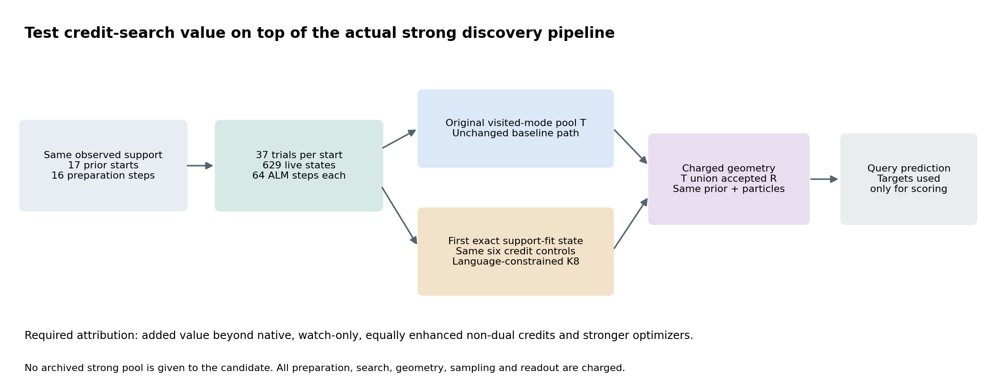
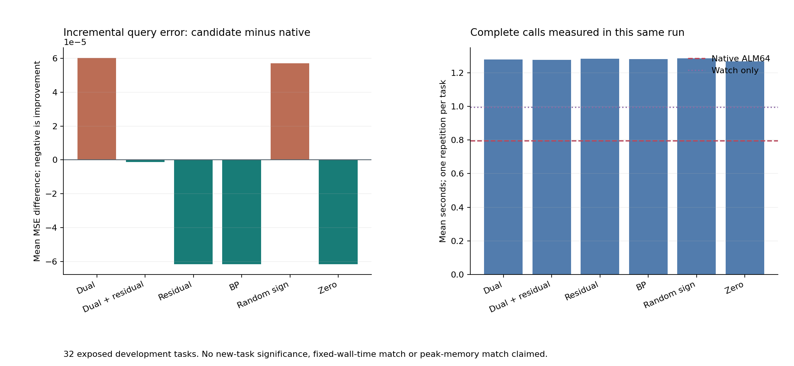

# 349｜强母池上的信用搜索：实际增益、成本和完整对照

2026-09-25中午交付补充。32个已暴露开发任务，19新方法加110封存对照，全部预测先封存、后评分与独立审计。主候选事前固定，未根据评分改名或删任务。

## 先看是否有新增价值

主 `strong_language_dual` 的MSE257为 **0.0521826104**，原强母算法本次为 **0.0521223412**。主−母均差 **+0.0000602693**，32任务改善/相同/变差为 **0/31/1**。主−同增强零信用均差 **+0.0001218716**。负数才表示主方法开发均值更低。

这些是完整实测，不预先将桥接成功等同于任务成功。即便候选相对旧弱候选更好，也必须先扣除强母算法本来就有的效果。新盲任务与严格资源匹配尚未完成，核心独立收益目标不因此标完成。

## 原因：母算法不同，不是简单多跑几步

旧候选33起点各展开分支试探但只保留一个优胜状态，再续接32步和一个锚点32步。强probe-all ALM64从17起点各保留37个试探，共629状态，每个续接64步。后者搜索路径更丰富，批量更新仍较快。新实现忠实保留强方法的全部原状态、实际参数模式和几何池，不载入历史结果作免费母池。

只在该强轨迹上选择第一个精确满足支持带的状态；若全部不满足，选观测带外误差最小者。六种信用从同一b/h/u读取，再执行同一支持条件语言全半径K8。BP只在明确控制中计算；无BP候选不先执行BP更新或利用BP初始化乘子。公共几何LP仍存在且收费。

## 数学可证明的部分

若母算法正池为T，当前信用提议经几何验收的新集合为R，则输出使用T∪R。保持母轨迹与几何确定性时，T不丢失；R为空时，相同规范顺序、相同粒子随机数和读出函数保证预测逐位不变。此结论是实现不变量，不是R非空时风险必降。

对于理想独立粒子，记e=μ_T−μ_S、d=μ_R−μ_T、a为新增区域的合并权重，则条件风险差仍为 $2a\langle e,d\rangle+a^2\|d\|^2+\{a(V_R-V_T)+a(1-a)\|d\|^2\}/M$。只有该量为负才保证改善。增加池或使用非零乘子本身不构成充分条件。

watch控制支付只读触发器费用但不追加候选，必须完整复现母算法输出；native不支付观察费用，是更低开销的真实基线。更长ALM、普通PC、无乘子、Adam都获得同样629起点，不把它们限制在旧33起点上比较。

## 六信用相对同一个强母算法

| 信用方法 | MSE257 | 该方法−native | 改善/同/变差 | 新增正模式对 | 新增任务 | 本次完整均秒 |
| --- | --- | --- | --- | --- | --- | --- |
| strong_language_dual | 0.0521826104 | 0.0000602693 | 0/31/1 | 1 | 1 | 1.2786890875 |
| strong_language_dual_plus_residual | 0.0521210081 | -0.0000013331 | 1/30/1 | 2 | 2 | 1.2765962781 |
| strong_language_residual | 0.0520607388 | -0.0000616023 | 1/31/0 | 1 | 1 | 1.2844479187 |
| strong_language_bp | 0.0520607388 | -0.0000616023 | 1/31/0 | 1 | 1 | 1.2824043375 |
| strong_language_random_sign | 0.0521793891 | 0.0000570479 | 1/30/1 | 2 | 2 | 1.2858623781 |
| strong_language_zero | 0.0520607388 | -0.0000616023 | 1/31/0 | 1 | 1 | 1.2674532781 |

时间是同一轮、随机调用顺序下的每任务一次完整fit，包含实际准备、局部更新、精确触发、语言搜索、几何、采样、读出及轨迹指纹。不是重复计时统计，也不是等墙钟或等峰值内存约束；旧110方法历史时间不混入。

## 主候选对全部新强控制及代表性旧控制

| 对照 | 对照MSE257 | 主−对照 | 改善/同/变差 | 最差留一均差 |
| --- | --- | --- | --- | --- |
| strong_native_alm64 | 0.0521223412 | 0.0000602693 | 0/31/1 | 0.0000622134 |
| strong_watch_alm64 | 0.0521223412 | 0.0000602693 | 0/31/1 | 0.0000622134 |
| strong_language_dual_plus_residual | 0.0521210081 | 0.0000616023 | 0/31/1 | 0.0000635895 |
| strong_language_residual | 0.0520607388 | 0.0001218716 | 0/30/2 | 0.0001258029 |
| strong_language_bp | 0.0520607388 | 0.0001218716 | 0/30/2 | 0.0001258029 |
| strong_language_random_sign | 0.0521793891 | 0.0000032214 | 0/31/1 | 0.0000033253 |
| strong_language_zero | 0.0520607388 | 0.0001218716 | 0/30/2 | 0.0001258029 |
| strong_native_alm128 | 0.0518687182 | 0.0003138923 | 1/29/2 | 0.0003263404 |
| strong_native_alm256 | 0.0519447058 | 0.0002379047 | 2/29/1 | 0.0002618044 |
| strong_native_pc64 | 0.0525001970 | -0.0003175866 | 8/15/9 | 0.0010044485 |
| strong_native_pc128 | 0.0527433556 | -0.0005607452 | 8/15/9 | 0.0007534461 |
| strong_native_pc256 | 0.0526769038 | -0.0004942933 | 7/15/10 | 0.0008220416 |
| strong_native_nodual64 | 0.0548240458 | -0.0026414353 | 7/12/13 | -0.0007678515 |
| strong_native_nodual128 | 0.0536071613 | -0.0014245509 | 7/12/13 | -0.0006957732 |
| strong_native_nodual256 | 0.0535287715 | -0.0013461611 | 7/12/13 | -0.0007029015 |
| strong_native_adam240 | 0.0512499136 | 0.0009326969 | 9/9/14 | 0.0010708615 |
| strong_native_adam960 | 0.0512499136 | 0.0009326969 | 9/9/14 | 0.0010708615 |
| strong_native_adam3840 | 0.0511755030 | 0.0010071075 | 8/9/15 | 0.0011476725 |
| language_first_fit_dual | 0.0564667860 | -0.0042841755 | 9/12/11 | -0.0015379890 |
| cold__prior16384_ridge | 0.0665166556 | -0.0143340451 | 26/0/6 | -0.0123448375 |
| cold__meta_ridge128 | 0.0681715217 | -0.0159889112 | 25/0/7 | -0.0141166292 |
| cold__meta_shallow64_20 | 0.0901028063 | -0.0379201959 | 31/0/1 | -0.0363820870 |

所有19新方法与其余128方法的四指标配对差均在原始JSON中保留，总9728条。表内留一是集中度诊断，不是显著性结论。不能在多个开发变体中挑获胜者后当作预指定主候选。

## 执行与核验结果

完整608次新fit，加110旧方法封存预测，32×129=4128预测器。执行失败0。独立标量风险16512字段，最大差1.11e-16；比较9728行；轨迹14560状态；新几何证书67576。

347额外检查8任务64调用，逐位核对母算法6个数组及只读原实现逐步轨迹。348第一任务19配置预检还逐数组复核全部12个native强控制的原legacy实现；正式首任务重放19配置、前8任务重放347，输入与支持粒子全部检查。

本轮仍为4层标量tent模型，不是官方TTT-MLP、LLM或VLM验证。局部信用搜索可因母池已覆盖建议而不改变输出；这必须据实际完整结果报告。闭式回归与附加网络层的普遍不可能性没有证明。

## 全部129方法

| 方法 | MSE257 | MSE129 | 单点MSE257 | 单点MSE129 | 本次均秒 | 失败 |
| --- | --- | --- | --- | --- | --- | --- |
| counterfactual_mode_change_alm | 0.0566657702 | 0.0567638420 | 0.1206408566 | 0.1206780168 | — | 0 |
| credit_control_probe33 | 0.0567964225 | 0.0568908697 | 0.1206408566 | 0.1206780168 | — | 0 |
| probe_archive_only | 0.0571660939 | 0.0572613831 | 0.1233768150 | 0.1236159789 | — | 0 |
| probe_then_pc33 | 0.0567136953 | 0.0568118311 | 0.1234206583 | 0.1234458531 | — | 0 |
| probe_pc64_33 | 0.0567042291 | 0.0568023552 | 0.1152993808 | 0.1152867436 | — | 0 |
| probe_pc128_33 | 0.0569980153 | 0.0570948290 | 0.1207050837 | 0.1207893678 | — | 0 |
| probe_then_nodual33 | 0.0584311107 | 0.0585283076 | 0.1188088462 | 0.1189328828 | — | 0 |
| probe_nodual64_33 | 0.0584389023 | 0.0585366226 | 0.1193577163 | 0.1194071807 | — | 0 |
| probe_then_adam60_33 | 0.0535376417 | 0.0536281827 | 0.1126252949 | 0.1128837311 | — | 0 |
| probe_then_adam120_33 | 0.0535376417 | 0.0536281827 | 0.1110194831 | 0.1111129006 | — | 0 |
| probe_then_adam240_33 | 0.0535376417 | 0.0536281827 | 0.1110145517 | 0.1111078087 | — | 0 |
| probe_then_adam480_33 | 0.0535376417 | 0.0536281827 | 0.1110145516 | 0.1111078087 | — | 0 |
| credit_control_alm33 | 0.0618250535 | 0.0619314470 | 0.1237745712 | 0.1238407677 | — | 0 |
| plain_alm64_33 | 0.0564851362 | 0.0565806628 | 0.1110946037 | 0.1113150477 | — | 0 |
| plain_alm128_33 | 0.0569029649 | 0.0570005183 | 0.1067804433 | 0.1068566182 | — | 0 |
| cold__adam240_r33 | 0.0609766160 | 0.0610775498 | 0.1072125164 | 0.1072709152 | — | 0 |
| cold__prior4096_ridge | 0.0665171025 | 0.0666046581 | 0.0665171025 | 0.0666046581 | — | 0 |
| cold__prior16384_ridge | 0.0665166556 | 0.0666066670 | 0.0665166556 | 0.0666066670 | — | 0 |
| cold__meta_shallow64_20 | 0.0901028063 | 0.0901580743 | 0.0901028063 | 0.0901580743 | — | 0 |
| probe_all_alm64 | 0.0521223412 | 0.0522165008 | 0.0972136191 | 0.0973644976 | — | 0 |
| cold__linear_ls | 0.1601140361 | 0.1602980531 | 0.1601140361 | 0.1602980531 | — | 0 |
| cold__residual_linear_ls | 0.1997591239 | 0.2003046128 | 0.1997591239 | 0.2003046128 | — | 0 |
| cold__residual_linear_ridge | 0.1997162664 | 0.2002623867 | 0.1997162664 | 0.2002623867 | — | 0 |
| cold__residual_linear_rls | 0.1997162664 | 0.2002623867 | 0.1997162664 | 0.2002623867 | — | 0 |
| cold__rbf_loocv | 0.1323521813 | 0.1325385824 | 0.1323521813 | 0.1325385824 | — | 0 |
| cold__meta_ridge64 | 0.0681644628 | 0.0682575808 | 0.0681644628 | 0.0682575808 | — | 0 |
| cold__meta_ridge128 | 0.0681715217 | 0.0682655843 | 0.0681715217 | 0.0682655843 | — | 0 |
| cold__meta_shallow64_5 | 0.0906851396 | 0.0907484013 | 0.0906851396 | 0.0907484013 | — | 0 |
| probe_pc256_33 | 0.0560945786 | 0.0561863273 | 0.1138330238 | 0.1138462455 | — | 0 |
| probe_nodual128_33 | 0.0584786237 | 0.0585762108 | 0.1138510235 | 0.1139998736 | — | 0 |
| probe_nodual256_33 | 0.0584379494 | 0.0585352051 | 0.1054070654 | 0.1055288327 | — | 0 |
| probe_then_adam960_33 | 0.0535376417 | 0.0536281827 | 0.1110145516 | 0.1111078087 | — | 0 |
| plain_alm256_33 | 0.0559368716 | 0.0560347496 | 0.1068384558 | 0.1069345453 | — | 0 |
| cold__prior65536_ridge | 0.0665246805 | 0.0666148401 | 0.0665246805 | 0.0666148401 | — | 0 |
| probe_alm40_33 | 0.0551619029 | 0.0552484635 | 0.1218666646 | 0.1220083558 | — | 0 |
| probe_alm48_33 | 0.0529388655 | 0.0530286967 | 0.1158131087 | 0.1159919624 | — | 0 |
| probe_alm64_33 | 0.0531866245 | 0.0532768338 | 0.1106653283 | 0.1107971038 | — | 0 |
| online_first_fit_dual | 0.0565858748 | 0.0566787059 | 0.1206408566 | 0.1206780168 | — | 0 |
| online_first_fit_dual_plus_residual | 0.0565941307 | 0.0566870495 | 0.1206408566 | 0.1206780168 | — | 0 |
| online_first_fit_residual | 0.0568984635 | 0.0569941945 | 0.1206408566 | 0.1206780168 | — | 0 |
| online_first_fit_bp | 0.0570970477 | 0.0571942949 | 0.1206408566 | 0.1206780168 | — | 0 |
| online_first_fit_random_sign | 0.0567896349 | 0.0568878025 | 0.1206408566 | 0.1206780168 | — | 0 |
| online_first_fit_zero | 0.0569233095 | 0.0570211556 | 0.1206408566 | 0.1206780168 | — | 0 |
| online_uniform_state_dual | 0.0567964225 | 0.0568908697 | 0.1206408566 | 0.1206780168 | — | 0 |
| online_uniform_state_dual_plus_residual | 0.0567964225 | 0.0568908697 | 0.1206408566 | 0.1206780168 | — | 0 |
| online_uniform_state_residual | 0.0567913230 | 0.0568857200 | 0.1206408566 | 0.1206780168 | — | 0 |
| online_uniform_state_bp | 0.0567913230 | 0.0568857200 | 0.1206408566 | 0.1206780168 | — | 0 |
| online_uniform_state_random_sign | 0.0568002554 | 0.0568946184 | 0.1206408566 | 0.1206780168 | — | 0 |
| online_uniform_state_zero | 0.0567964225 | 0.0568908697 | 0.1206408566 | 0.1206780168 | — | 0 |
| probe_then_adam1920_33 | 0.0535038771 | 0.0535945752 | 0.1110145516 | 0.1111078087 | — | 0 |
| probe_then_adam3840_33 | 0.0535038771 | 0.0535945752 | 0.1110145516 | 0.1111078087 | — | 0 |
| radius_first_fit_dual__k1__sall | 0.0565792564 | 0.0566750122 | 0.1206408566 | 0.1206780168 | — | 0 |
| radius_first_fit_dual__k2__sall | 0.0564782121 | 0.0565713977 | 0.1206408566 | 0.1206780168 | — | 0 |
| radius_first_fit_dual__k4__sall | 0.0564875168 | 0.0565792871 | 0.1206408566 | 0.1206780168 | — | 0 |
| radius_first_fit_dual__k8__sall | 0.0565858748 | 0.0566787059 | 0.1206408566 | 0.1206780168 | — | 0 |
| radius_first_fit_dual_plus_residual__k1__sall | 0.0565792564 | 0.0566750122 | 0.1206408566 | 0.1206780168 | — | 0 |
| radius_first_fit_dual_plus_residual__k2__sall | 0.0564782121 | 0.0565713977 | 0.1206408566 | 0.1206780168 | — | 0 |
| radius_first_fit_dual_plus_residual__k4__sall | 0.0564875168 | 0.0565792871 | 0.1206408566 | 0.1206780168 | — | 0 |
| radius_first_fit_dual_plus_residual__k8__sall | 0.0565941307 | 0.0566870495 | 0.1206408566 | 0.1206780168 | — | 0 |
| radius_first_fit_residual__k1__sall | 0.0568953752 | 0.0569899036 | 0.1206408566 | 0.1206780168 | — | 0 |
| radius_first_fit_residual__k2__sall | 0.0568953752 | 0.0569899036 | 0.1206408566 | 0.1206780168 | — | 0 |
| radius_first_fit_residual__k4__sall | 0.0568814971 | 0.0569764026 | 0.1206408566 | 0.1206780168 | — | 0 |
| radius_first_fit_residual__k8__sall | 0.0568984635 | 0.0569941945 | 0.1206408566 | 0.1206780168 | — | 0 |
| radius_first_fit_bp__k1__sall | 0.0569543631 | 0.0570503865 | 0.1206408566 | 0.1206780168 | — | 0 |
| radius_first_fit_bp__k2__sall | 0.0570533157 | 0.0571494204 | 0.1206408566 | 0.1206780168 | — | 0 |
| radius_first_fit_bp__k4__sall | 0.0570604974 | 0.0571566002 | 0.1206408566 | 0.1206780168 | — | 0 |
| radius_first_fit_bp__k8__sall | 0.0570970477 | 0.0571942949 | 0.1206408566 | 0.1206780168 | — | 0 |
| radius_first_fit_random_sign__k1__sall | 0.0567964225 | 0.0568908697 | 0.1206408566 | 0.1206780168 | — | 0 |
| radius_first_fit_random_sign__k2__sall | 0.0567964225 | 0.0568908697 | 0.1206408566 | 0.1206780168 | — | 0 |
| radius_first_fit_random_sign__k4__sall | 0.0567427261 | 0.0568379295 | 0.1206408566 | 0.1206780168 | — | 0 |
| radius_first_fit_random_sign__k8__sall | 0.0567896349 | 0.0568878025 | 0.1206408566 | 0.1206780168 | — | 0 |
| radius_first_fit_zero__k1__sall | 0.0569543631 | 0.0570503865 | 0.1206408566 | 0.1206780168 | — | 0 |
| radius_first_fit_zero__k2__sall | 0.0570533157 | 0.0571494204 | 0.1206408566 | 0.1206780168 | — | 0 |
| radius_first_fit_zero__k4__sall | 0.0570604974 | 0.0571566002 | 0.1206408566 | 0.1206780168 | — | 0 |
| radius_first_fit_zero__k8__sall | 0.0569233095 | 0.0570211556 | 0.1206408566 | 0.1206780168 | — | 0 |
| online_first_fit_dual__k32 | 0.0563525643 | 0.0564479828 | 0.1206408566 | 0.1206780168 | — | 0 |
| online_first_fit_dual_plus_residual__k32 | 0.0563525643 | 0.0564479828 | 0.1206408566 | 0.1206780168 | — | 0 |
| online_first_fit_residual__k32 | 0.0564573512 | 0.0565576838 | 0.1206408566 | 0.1206780168 | — | 0 |
| online_first_fit_bp__k32 | 0.0567225983 | 0.0568217880 | 0.1206408566 | 0.1206780168 | — | 0 |
| online_first_fit_random_sign__k32 | 0.0561114659 | 0.0562072955 | 0.1206408566 | 0.1206780168 | — | 0 |
| online_first_fit_zero__k32 | 0.0567225983 | 0.0568217880 | 0.1206408566 | 0.1206780168 | — | 0 |
| online_uniform_state_dual__k32 | 0.0567397136 | 0.0568343394 | 0.1206408566 | 0.1206780168 | — | 0 |
| online_uniform_state_dual__k64 | 0.0567448716 | 0.0568392974 | 0.1206408566 | 0.1206780168 | — | 0 |
| online_uniform_state_dual_plus_residual__k32 | 0.0567397136 | 0.0568343394 | 0.1206408566 | 0.1206780168 | — | 0 |
| online_uniform_state_dual_plus_residual__k64 | 0.0567397136 | 0.0568343394 | 0.1206408566 | 0.1206780168 | — | 0 |
| online_uniform_state_residual__k32 | 0.0562254510 | 0.0563202113 | 0.1206408566 | 0.1206780168 | — | 0 |
| online_uniform_state_residual__k64 | 0.0561983638 | 0.0562916777 | 0.1206408566 | 0.1206780168 | — | 0 |
| online_uniform_state_bp__k32 | 0.0567397136 | 0.0568343394 | 0.1206408566 | 0.1206780168 | — | 0 |
| online_uniform_state_bp__k64 | 0.0566913089 | 0.0567850300 | 0.1206408566 | 0.1206780168 | — | 0 |
| online_uniform_state_random_sign__k32 | 0.0567417452 | 0.0568363383 | 0.1206408566 | 0.1206780168 | — | 0 |
| online_uniform_state_random_sign__k64 | 0.0567417452 | 0.0568363383 | 0.1206408566 | 0.1206780168 | — | 0 |
| online_uniform_state_zero__k32 | 0.0567397136 | 0.0568343394 | 0.1206408566 | 0.1206780168 | — | 0 |
| online_uniform_state_zero__k64 | 0.0567448716 | 0.0568392974 | 0.1206408566 | 0.1206780168 | — | 0 |
| probe_then_adam7680_33 | 0.0535038771 | 0.0535945752 | 0.1110145516 | 0.1111078087 | — | 0 |
| probe_then_adam15360_33 | 0.0535038771 | 0.0535945752 | 0.1110145516 | 0.1111078087 | — | 0 |
| probe_pc512_33 | 0.0560308920 | 0.0561227158 | 0.1204888307 | 0.1205226612 | — | 0 |
| probe_pc1024_33 | 0.0559864467 | 0.0560782264 | 0.1140518659 | 0.1140932064 | — | 0 |
| probe_nodual512_33 | 0.0583663411 | 0.0584641242 | 0.1034888077 | 0.1036550031 | — | 0 |
| probe_nodual1024_33 | 0.0583663411 | 0.0584641242 | 0.1142278966 | 0.1143290928 | — | 0 |
| plain_alm512_33 | 0.0544233179 | 0.0545213778 | 0.1070461562 | 0.1071440592 | — | 0 |
| plain_alm1024_33 | 0.0544280803 | 0.0545266351 | 0.1026398488 | 0.1027187129 | — | 0 |
| probe_alm128_33 | 0.0532510848 | 0.0533419258 | 0.1094820541 | 0.1094854701 | — | 0 |
| probe_alm256_33 | 0.0527920573 | 0.0528821946 | 0.0944594138 | 0.0945016111 | — | 0 |
| probe_alm512_33 | 0.0527693314 | 0.0528589774 | 0.1011073134 | 0.1011651404 | — | 0 |
| language_first_fit_dual | 0.0564667860 | 0.0565595784 | 0.1206408566 | 0.1206780168 | — | 0 |
| language_first_fit_dual_plus_residual | 0.0564664024 | 0.0565596696 | 0.1206408566 | 0.1206780168 | — | 0 |
| language_first_fit_residual | 0.0568384235 | 0.0569348015 | 0.1206408566 | 0.1206780168 | — | 0 |
| language_first_fit_bp | 0.0567378007 | 0.0568359452 | 0.1206408566 | 0.1206780168 | — | 0 |
| language_first_fit_random_sign | 0.0567002166 | 0.0567984571 | 0.1206408566 | 0.1206780168 | — | 0 |
| language_first_fit_zero | 0.0565094967 | 0.0566100139 | 0.1206408566 | 0.1206780168 | — | 0 |
| strong_native_alm64 | 0.0521223412 | 0.0522165008 | 0.0972136191 | 0.0973644976 | 0.7952993812 | 0 |
| strong_watch_alm64 | 0.0521223412 | 0.0522165008 | 0.0972136191 | 0.0973644976 | 0.9963215563 | 0 |
| strong_language_dual | 0.0521826104 | 0.0522766938 | 0.0972136191 | 0.0973644976 | 1.2786890875 | 0 |
| strong_language_dual_plus_residual | 0.0521210081 | 0.0522149923 | 0.0972136191 | 0.0973644976 | 1.2765962781 | 0 |
| strong_language_residual | 0.0520607388 | 0.0521547993 | 0.0972136191 | 0.0973644976 | 1.2844479187 | 0 |
| strong_language_bp | 0.0520607388 | 0.0521547993 | 0.0972136191 | 0.0973644976 | 1.2824043375 | 0 |
| strong_language_random_sign | 0.0521793891 | 0.0522733095 | 0.0972136191 | 0.0973644976 | 1.2858623781 | 0 |
| strong_language_zero | 0.0520607388 | 0.0521547993 | 0.0972136191 | 0.0973644976 | 1.2674532781 | 0 |
| strong_native_alm128 | 0.0518687182 | 0.0519629867 | 0.1016516447 | 0.1017641512 | 1.0351413312 | 0 |
| strong_native_alm256 | 0.0519447058 | 0.0520388818 | 0.1131273820 | 0.1133506933 | 1.4943522500 | 0 |
| strong_native_pc64 | 0.0525001970 | 0.0525953156 | 0.1160714308 | 0.1161767307 | 0.5630605250 | 0 |
| strong_native_pc128 | 0.0527433556 | 0.0528379555 | 0.1203439726 | 0.1205308496 | 0.6585424031 | 0 |
| strong_native_pc256 | 0.0526769038 | 0.0527718609 | 0.1146547448 | 0.1148294734 | 0.8194237656 | 0 |
| strong_native_nodual64 | 0.0548240458 | 0.0549199039 | 0.1096541062 | 0.1096863386 | 0.6431925750 | 0 |
| strong_native_nodual128 | 0.0536071613 | 0.0537044033 | 0.1045910173 | 0.1047276283 | 0.8724070406 | 0 |
| strong_native_nodual256 | 0.0535287715 | 0.0536266219 | 0.1010791255 | 0.1012160671 | 1.3321709031 | 0 |
| strong_native_adam240 | 0.0512499136 | 0.0513410494 | 0.1097922702 | 0.1098245206 | 0.7126002563 | 0 |
| strong_native_adam960 | 0.0512499136 | 0.0513410494 | 0.1095839581 | 0.1096198509 | 1.4431572500 | 0 |
| strong_native_adam3840 | 0.0511755030 | 0.0512667252 | 0.1095839581 | 0.1096198509 | 4.4272590313 | 0 |

依据：[评分](../development_evaluation_v1/methods.json)、[全部比较](../development_evaluation_v1/comparisons.json)、[独立审计](../development_audit_v1/summary.json)、[实际新增模式](../development_audit_v1/mechanisms.json)。图文数字和视觉QA另有收据。阶段发布省略全部粒子数组及完整几何日志，不是全量远程数据备份。
