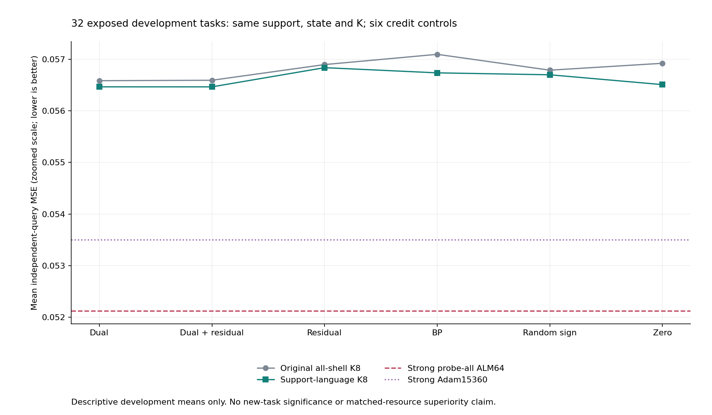
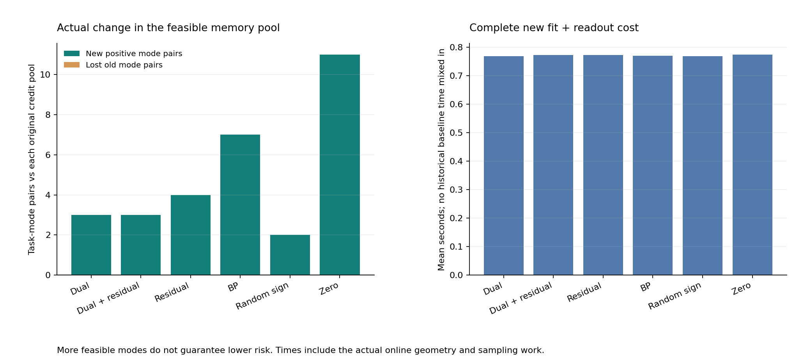

# 346｜支持条件路径语言：完整在线结果与数学边界

2026-09-25中午阶段交付补充。全部32个任务为已暴露开发集；先封存预测，后评分，独立审计通过。不是未见任务确认。

## 结果先行

预指定主候选 `language_first_fit_dual` 的查询MSE257为 **0.0564667860**。相对原主候选均差 -0.0001190888，相对强probe-all ALM64 +0.0043444448，相对Adam15360 +0.0029629089。差值为新方法减对照，负数才是开发均值改善。

不能只选其中有利比较宣布成功。是否有独立PC-ALM收益，还要看同样增强的非乘子信用、强优化器以及后续同期资源和未见任务实验。当前核心研究目标保持未完成。

## 从实际瓶颈到这次改变

343对32任务发现：旧主候选扩大距离后新增2696个提议，2694个严格不可行，2个已在旧正池；所有返回数组逐字节不变。四个强对照正池中，主候选漏掉93个真正可行模式，全部在其距离壳的前8名以外（92个非平局）。此前323已经指出过排序瓶颈；这里补的是新32任务的完整证据，不把重复诊断写成新贡献。

原排序把更负的信用下界排在前面。但“下界≤0”只意味着尚未证明不可行，不意味着真的可行。许多单个支持样本就无法满足的路径，仍可能占满有限名额。

新原语为每个已观察支持对预计算允许的层间分支序列，编译成有限无环自动机，再把自动机状态纳入精确K-best动态规划。先约束候选空间，再截断前K条；不是先挑K条再过滤。未访问查询答案、teacher参数或参考正池。

## 可检验的数学结论

对单个支持样本，固定分支路径，令 $I_0=\{x_i\}$，$J_l=(I_{l-1}+[-B,B])\cap Z_{p_{li}}$，$I_l=s_{p_{li}}J_l+c_{p_{li}}$。每层新增偏置的连续区间像及固定分支仿射像都是精确区间；末层与观测带相交当且仅当该单样本路径存在偏置见证。整数公共尺度保持binary64输入的精确有理解释。

任何全网络可行模式的每个样本列必然通过。因此删去不通过的模式是安全必要条件；不同样本各自通过却未必共享同一组偏置，所以仍需后续全网络几何检查。这个必要条件本身不属于PC-ALM专有能力。

DP状态为“距离、上一层image mask、各样本的自动机状态”。相同状态具有相同未来选项和成本，故每状态保留K个最小前缀仍是精确K-best，而不是束搜索近似。约束后壳最小下界不会变小，也不会错误排除真实可行模式；但有限K选出的旧池与新池未必嵌套，更不能推出风险单调改善。

一个可直接手算的严格筛选例子：两层、单样本x=0.01、v=0.1、B=0.12、eps=0.001，原模式(0,0)，信用(-1,-1)，每壳K=1。旧松弛在距离2选(1,2)，新语言选择(1,1)。前者在第一层至多得到h1=0.26，第二层预激活至多0.38，不能进入从0.5开始的分支2；后者可取b1=0、b2=0.03满足观测。实际精确程序得到旧下界约−1.101、新下界约−0.221：更负的旧值反而对应不可能路径。这个事后构造的数学示例说明严格筛选能力，不作为预注册任务收益证据，也不证明只有乘子能做到。

边界：单列路径枚举含4^d的深度指数项，产品自动机也可能增长；本实验深度仅4。完整枚举器过去已有单样本筛查，本轮的新工程机制是把该约束放进信用DP的截断之前，不宣称首次提出区间可达性。

## 六信用共同增强后的实际记忆和成本

| 新方法 | 新MSE257 | 旧全壳MSE257 | 新增正模式对 | 丢失旧正模式对 | 本次完整均秒 |
| --- | --- | --- | --- | --- | --- |
| language_first_fit_dual | 0.0564667860 | 0.0565858748 | 3 | 0 | 0.7681077594 |
| language_first_fit_dual_plus_residual | 0.0564664024 | 0.0565941307 | 3 | 0 | 0.7729570344 |
| language_first_fit_residual | 0.0568384235 | 0.0568984635 | 4 | 0 | 0.7723795594 |
| language_first_fit_bp | 0.0567378007 | 0.0570970477 | 7 | 0 | 0.7695250469 |
| language_first_fit_random_sign | 0.0567002166 | 0.0567896349 | 2 | 0 | 0.7684530406 |
| language_first_fit_zero | 0.0565094967 | 0.0569233095 | 11 | 0 | 0.7742666375 |

新增/丢失以各自原信用正池为参照；同一模式在不同任务分开计数。正模式数量不是后验质量或风险收益。时间仅比较本次六个真实完整调用，旧104方法的时间留空；不能用本表宣称相对历史强对照同预算更优。

## 预指定主候选的完整关键比较

| 对照 | 对照MSE257 | 主−对照 | 改善/同/变差 | 最差留一均差 |
| --- | --- | --- | --- | --- |
| online_first_fit_dual | 0.0565858748 | -0.0001190888 | 3/29/0 | -0.0000682878 |
| online_first_fit_dual__k32 | 0.0563525643 | 0.0001142216 | 2/26/4 | 0.0001255816 |
| language_first_fit_dual_plus_residual | 0.0564664024 | 0.0000003836 | 1/30/1 | 0.0000089182 |
| language_first_fit_residual | 0.0568384235 | -0.0003716375 | 7/22/3 | -0.0001594544 |
| language_first_fit_bp | 0.0567378007 | -0.0002710147 | 7/24/1 | -0.0001246301 |
| language_first_fit_random_sign | 0.0567002166 | -0.0002334306 | 5/25/2 | -0.0000858336 |
| language_first_fit_zero | 0.0565094967 | -0.0000427108 | 8/22/2 | 0.0001110385 |
| probe_all_alm64 | 0.0521223412 | 0.0043444448 | 11/12/9 | 0.0048592927 |
| probe_alm256_33 | 0.0527920573 | 0.0036747287 | 12/12/8 | 0.0040174398 |
| probe_alm512_33 | 0.0527693314 | 0.0036974546 | 11/13/8 | 0.0040408988 |
| probe_then_adam15360_33 | 0.0535038771 | 0.0029629089 | 11/13/8 | 0.0036099065 |
| plain_alm1024_33 | 0.0544280803 | 0.0020387057 | 14/4/14 | 0.0030063281 |
| probe_pc1024_33 | 0.0559864467 | 0.0004803393 | 12/10/10 | 0.0015015844 |
| cold__prior16384_ridge | 0.0665166556 | -0.0100498696 | 25/0/7 | -0.0087366335 |
| cold__meta_ridge128 | 0.0681715217 | -0.0117047357 | 24/0/8 | -0.0102232120 |
| cold__meta_shallow64_20 | 0.0901028063 | -0.0336360203 | 29/0/3 | -0.0319597123 |

留一只是集中度诊断，不是显著性证明。所有32任务均保留，不删除困难任务。支持拟合/回退分组及所有比较在原始JSON中公开。

## 执行与核验

六配置预检后完成192次新fit，加同任务104旧对照，共110方法、3520预测器。原轨迹/触发/输入、首任务重放及支持粒子核验通过，失败0。独立标量风险14080项，最大差1.11e-16；比较行2616，新几何有理证书69078。

本轮仍是4层标量tent少样本记忆原型，不是官方TTT-MLP或LLM/VLM结果。几何读出明确使用公共全局LP；局部提议器禁止全局BP/LP，不能因此把整个系统写成纯局部PC。外部闭式头的普遍不可能性并未证明。

下一步需区分两个可改进环节：一是单样本语言仍未约束跨样本共享偏置，二是当前追加搜索的基础发现池弱于强ALM。后续必须明确检验更紧约束或对强母池的新增价值，并为所有信用/有无追加搜索提供相同条件，不能只增强候选而保留弱对照。

## 全部110方法

| 方法 | MSE257 | MSE129 | 单点MSE257 | 单点MSE129 | 本次均秒 | 失败 |
| --- | --- | --- | --- | --- | --- | --- |
| counterfactual_mode_change_alm | 0.0566657702 | 0.0567638420 | 0.1206408566 | 0.1206780168 | — | 0 |
| credit_control_probe33 | 0.0567964225 | 0.0568908697 | 0.1206408566 | 0.1206780168 | — | 0 |
| probe_archive_only | 0.0571660939 | 0.0572613831 | 0.1233768150 | 0.1236159789 | — | 0 |
| probe_then_pc33 | 0.0567136953 | 0.0568118311 | 0.1234206583 | 0.1234458531 | — | 0 |
| probe_pc64_33 | 0.0567042291 | 0.0568023552 | 0.1152993808 | 0.1152867436 | — | 0 |
| probe_pc128_33 | 0.0569980153 | 0.0570948290 | 0.1207050837 | 0.1207893678 | — | 0 |
| probe_then_nodual33 | 0.0584311107 | 0.0585283076 | 0.1188088462 | 0.1189328828 | — | 0 |
| probe_nodual64_33 | 0.0584389023 | 0.0585366226 | 0.1193577163 | 0.1194071807 | — | 0 |
| probe_then_adam60_33 | 0.0535376417 | 0.0536281827 | 0.1126252949 | 0.1128837311 | — | 0 |
| probe_then_adam120_33 | 0.0535376417 | 0.0536281827 | 0.1110194831 | 0.1111129006 | — | 0 |
| probe_then_adam240_33 | 0.0535376417 | 0.0536281827 | 0.1110145517 | 0.1111078087 | — | 0 |
| probe_then_adam480_33 | 0.0535376417 | 0.0536281827 | 0.1110145516 | 0.1111078087 | — | 0 |
| credit_control_alm33 | 0.0618250535 | 0.0619314470 | 0.1237745712 | 0.1238407677 | — | 0 |
| plain_alm64_33 | 0.0564851362 | 0.0565806628 | 0.1110946037 | 0.1113150477 | — | 0 |
| plain_alm128_33 | 0.0569029649 | 0.0570005183 | 0.1067804433 | 0.1068566182 | — | 0 |
| cold__adam240_r33 | 0.0609766160 | 0.0610775498 | 0.1072125164 | 0.1072709152 | — | 0 |
| cold__prior4096_ridge | 0.0665171025 | 0.0666046581 | 0.0665171025 | 0.0666046581 | — | 0 |
| cold__prior16384_ridge | 0.0665166556 | 0.0666066670 | 0.0665166556 | 0.0666066670 | — | 0 |
| cold__meta_shallow64_20 | 0.0901028063 | 0.0901580743 | 0.0901028063 | 0.0901580743 | — | 0 |
| probe_all_alm64 | 0.0521223412 | 0.0522165008 | 0.0972136191 | 0.0973644976 | — | 0 |
| cold__linear_ls | 0.1601140361 | 0.1602980531 | 0.1601140361 | 0.1602980531 | — | 0 |
| cold__residual_linear_ls | 0.1997591239 | 0.2003046128 | 0.1997591239 | 0.2003046128 | — | 0 |
| cold__residual_linear_ridge | 0.1997162664 | 0.2002623867 | 0.1997162664 | 0.2002623867 | — | 0 |
| cold__residual_linear_rls | 0.1997162664 | 0.2002623867 | 0.1997162664 | 0.2002623867 | — | 0 |
| cold__rbf_loocv | 0.1323521813 | 0.1325385824 | 0.1323521813 | 0.1325385824 | — | 0 |
| cold__meta_ridge64 | 0.0681644628 | 0.0682575808 | 0.0681644628 | 0.0682575808 | — | 0 |
| cold__meta_ridge128 | 0.0681715217 | 0.0682655843 | 0.0681715217 | 0.0682655843 | — | 0 |
| cold__meta_shallow64_5 | 0.0906851396 | 0.0907484013 | 0.0906851396 | 0.0907484013 | — | 0 |
| probe_pc256_33 | 0.0560945786 | 0.0561863273 | 0.1138330238 | 0.1138462455 | — | 0 |
| probe_nodual128_33 | 0.0584786237 | 0.0585762108 | 0.1138510235 | 0.1139998736 | — | 0 |
| probe_nodual256_33 | 0.0584379494 | 0.0585352051 | 0.1054070654 | 0.1055288327 | — | 0 |
| probe_then_adam960_33 | 0.0535376417 | 0.0536281827 | 0.1110145516 | 0.1111078087 | — | 0 |
| plain_alm256_33 | 0.0559368716 | 0.0560347496 | 0.1068384558 | 0.1069345453 | — | 0 |
| cold__prior65536_ridge | 0.0665246805 | 0.0666148401 | 0.0665246805 | 0.0666148401 | — | 0 |
| probe_alm40_33 | 0.0551619029 | 0.0552484635 | 0.1218666646 | 0.1220083558 | — | 0 |
| probe_alm48_33 | 0.0529388655 | 0.0530286967 | 0.1158131087 | 0.1159919624 | — | 0 |
| probe_alm64_33 | 0.0531866245 | 0.0532768338 | 0.1106653283 | 0.1107971038 | — | 0 |
| online_first_fit_dual | 0.0565858748 | 0.0566787059 | 0.1206408566 | 0.1206780168 | — | 0 |
| online_first_fit_dual_plus_residual | 0.0565941307 | 0.0566870495 | 0.1206408566 | 0.1206780168 | — | 0 |
| online_first_fit_residual | 0.0568984635 | 0.0569941945 | 0.1206408566 | 0.1206780168 | — | 0 |
| online_first_fit_bp | 0.0570970477 | 0.0571942949 | 0.1206408566 | 0.1206780168 | — | 0 |
| online_first_fit_random_sign | 0.0567896349 | 0.0568878025 | 0.1206408566 | 0.1206780168 | — | 0 |
| online_first_fit_zero | 0.0569233095 | 0.0570211556 | 0.1206408566 | 0.1206780168 | — | 0 |
| online_uniform_state_dual | 0.0567964225 | 0.0568908697 | 0.1206408566 | 0.1206780168 | — | 0 |
| online_uniform_state_dual_plus_residual | 0.0567964225 | 0.0568908697 | 0.1206408566 | 0.1206780168 | — | 0 |
| online_uniform_state_residual | 0.0567913230 | 0.0568857200 | 0.1206408566 | 0.1206780168 | — | 0 |
| online_uniform_state_bp | 0.0567913230 | 0.0568857200 | 0.1206408566 | 0.1206780168 | — | 0 |
| online_uniform_state_random_sign | 0.0568002554 | 0.0568946184 | 0.1206408566 | 0.1206780168 | — | 0 |
| online_uniform_state_zero | 0.0567964225 | 0.0568908697 | 0.1206408566 | 0.1206780168 | — | 0 |
| probe_then_adam1920_33 | 0.0535038771 | 0.0535945752 | 0.1110145516 | 0.1111078087 | — | 0 |
| probe_then_adam3840_33 | 0.0535038771 | 0.0535945752 | 0.1110145516 | 0.1111078087 | — | 0 |
| radius_first_fit_dual__k1__sall | 0.0565792564 | 0.0566750122 | 0.1206408566 | 0.1206780168 | — | 0 |
| radius_first_fit_dual__k2__sall | 0.0564782121 | 0.0565713977 | 0.1206408566 | 0.1206780168 | — | 0 |
| radius_first_fit_dual__k4__sall | 0.0564875168 | 0.0565792871 | 0.1206408566 | 0.1206780168 | — | 0 |
| radius_first_fit_dual__k8__sall | 0.0565858748 | 0.0566787059 | 0.1206408566 | 0.1206780168 | — | 0 |
| radius_first_fit_dual_plus_residual__k1__sall | 0.0565792564 | 0.0566750122 | 0.1206408566 | 0.1206780168 | — | 0 |
| radius_first_fit_dual_plus_residual__k2__sall | 0.0564782121 | 0.0565713977 | 0.1206408566 | 0.1206780168 | — | 0 |
| radius_first_fit_dual_plus_residual__k4__sall | 0.0564875168 | 0.0565792871 | 0.1206408566 | 0.1206780168 | — | 0 |
| radius_first_fit_dual_plus_residual__k8__sall | 0.0565941307 | 0.0566870495 | 0.1206408566 | 0.1206780168 | — | 0 |
| radius_first_fit_residual__k1__sall | 0.0568953752 | 0.0569899036 | 0.1206408566 | 0.1206780168 | — | 0 |
| radius_first_fit_residual__k2__sall | 0.0568953752 | 0.0569899036 | 0.1206408566 | 0.1206780168 | — | 0 |
| radius_first_fit_residual__k4__sall | 0.0568814971 | 0.0569764026 | 0.1206408566 | 0.1206780168 | — | 0 |
| radius_first_fit_residual__k8__sall | 0.0568984635 | 0.0569941945 | 0.1206408566 | 0.1206780168 | — | 0 |
| radius_first_fit_bp__k1__sall | 0.0569543631 | 0.0570503865 | 0.1206408566 | 0.1206780168 | — | 0 |
| radius_first_fit_bp__k2__sall | 0.0570533157 | 0.0571494204 | 0.1206408566 | 0.1206780168 | — | 0 |
| radius_first_fit_bp__k4__sall | 0.0570604974 | 0.0571566002 | 0.1206408566 | 0.1206780168 | — | 0 |
| radius_first_fit_bp__k8__sall | 0.0570970477 | 0.0571942949 | 0.1206408566 | 0.1206780168 | — | 0 |
| radius_first_fit_random_sign__k1__sall | 0.0567964225 | 0.0568908697 | 0.1206408566 | 0.1206780168 | — | 0 |
| radius_first_fit_random_sign__k2__sall | 0.0567964225 | 0.0568908697 | 0.1206408566 | 0.1206780168 | — | 0 |
| radius_first_fit_random_sign__k4__sall | 0.0567427261 | 0.0568379295 | 0.1206408566 | 0.1206780168 | — | 0 |
| radius_first_fit_random_sign__k8__sall | 0.0567896349 | 0.0568878025 | 0.1206408566 | 0.1206780168 | — | 0 |
| radius_first_fit_zero__k1__sall | 0.0569543631 | 0.0570503865 | 0.1206408566 | 0.1206780168 | — | 0 |
| radius_first_fit_zero__k2__sall | 0.0570533157 | 0.0571494204 | 0.1206408566 | 0.1206780168 | — | 0 |
| radius_first_fit_zero__k4__sall | 0.0570604974 | 0.0571566002 | 0.1206408566 | 0.1206780168 | — | 0 |
| radius_first_fit_zero__k8__sall | 0.0569233095 | 0.0570211556 | 0.1206408566 | 0.1206780168 | — | 0 |
| online_first_fit_dual__k32 | 0.0563525643 | 0.0564479828 | 0.1206408566 | 0.1206780168 | — | 0 |
| online_first_fit_dual_plus_residual__k32 | 0.0563525643 | 0.0564479828 | 0.1206408566 | 0.1206780168 | — | 0 |
| online_first_fit_residual__k32 | 0.0564573512 | 0.0565576838 | 0.1206408566 | 0.1206780168 | — | 0 |
| online_first_fit_bp__k32 | 0.0567225983 | 0.0568217880 | 0.1206408566 | 0.1206780168 | — | 0 |
| online_first_fit_random_sign__k32 | 0.0561114659 | 0.0562072955 | 0.1206408566 | 0.1206780168 | — | 0 |
| online_first_fit_zero__k32 | 0.0567225983 | 0.0568217880 | 0.1206408566 | 0.1206780168 | — | 0 |
| online_uniform_state_dual__k32 | 0.0567397136 | 0.0568343394 | 0.1206408566 | 0.1206780168 | — | 0 |
| online_uniform_state_dual__k64 | 0.0567448716 | 0.0568392974 | 0.1206408566 | 0.1206780168 | — | 0 |
| online_uniform_state_dual_plus_residual__k32 | 0.0567397136 | 0.0568343394 | 0.1206408566 | 0.1206780168 | — | 0 |
| online_uniform_state_dual_plus_residual__k64 | 0.0567397136 | 0.0568343394 | 0.1206408566 | 0.1206780168 | — | 0 |
| online_uniform_state_residual__k32 | 0.0562254510 | 0.0563202113 | 0.1206408566 | 0.1206780168 | — | 0 |
| online_uniform_state_residual__k64 | 0.0561983638 | 0.0562916777 | 0.1206408566 | 0.1206780168 | — | 0 |
| online_uniform_state_bp__k32 | 0.0567397136 | 0.0568343394 | 0.1206408566 | 0.1206780168 | — | 0 |
| online_uniform_state_bp__k64 | 0.0566913089 | 0.0567850300 | 0.1206408566 | 0.1206780168 | — | 0 |
| online_uniform_state_random_sign__k32 | 0.0567417452 | 0.0568363383 | 0.1206408566 | 0.1206780168 | — | 0 |
| online_uniform_state_random_sign__k64 | 0.0567417452 | 0.0568363383 | 0.1206408566 | 0.1206780168 | — | 0 |
| online_uniform_state_zero__k32 | 0.0567397136 | 0.0568343394 | 0.1206408566 | 0.1206780168 | — | 0 |
| online_uniform_state_zero__k64 | 0.0567448716 | 0.0568392974 | 0.1206408566 | 0.1206780168 | — | 0 |
| probe_then_adam7680_33 | 0.0535038771 | 0.0535945752 | 0.1110145516 | 0.1111078087 | — | 0 |
| probe_then_adam15360_33 | 0.0535038771 | 0.0535945752 | 0.1110145516 | 0.1111078087 | — | 0 |
| probe_pc512_33 | 0.0560308920 | 0.0561227158 | 0.1204888307 | 0.1205226612 | — | 0 |
| probe_pc1024_33 | 0.0559864467 | 0.0560782264 | 0.1140518659 | 0.1140932064 | — | 0 |
| probe_nodual512_33 | 0.0583663411 | 0.0584641242 | 0.1034888077 | 0.1036550031 | — | 0 |
| probe_nodual1024_33 | 0.0583663411 | 0.0584641242 | 0.1142278966 | 0.1143290928 | — | 0 |
| plain_alm512_33 | 0.0544233179 | 0.0545213778 | 0.1070461562 | 0.1071440592 | — | 0 |
| plain_alm1024_33 | 0.0544280803 | 0.0545266351 | 0.1026398488 | 0.1027187129 | — | 0 |
| probe_alm128_33 | 0.0532510848 | 0.0533419258 | 0.1094820541 | 0.1094854701 | — | 0 |
| probe_alm256_33 | 0.0527920573 | 0.0528821946 | 0.0944594138 | 0.0945016111 | — | 0 |
| probe_alm512_33 | 0.0527693314 | 0.0528589774 | 0.1011073134 | 0.1011651404 | — | 0 |
| language_first_fit_dual | 0.0564667860 | 0.0565595784 | 0.1206408566 | 0.1206780168 | 0.7681077594 | 0 |
| language_first_fit_dual_plus_residual | 0.0564664024 | 0.0565596696 | 0.1206408566 | 0.1206780168 | 0.7729570344 | 0 |
| language_first_fit_residual | 0.0568384235 | 0.0569348015 | 0.1206408566 | 0.1206780168 | 0.7723795594 | 0 |
| language_first_fit_bp | 0.0567378007 | 0.0568359452 | 0.1206408566 | 0.1206780168 | 0.7695250469 | 0 |
| language_first_fit_random_sign | 0.0567002166 | 0.0567984571 | 0.1206408566 | 0.1206780168 | 0.7684530406 | 0 |
| language_first_fit_zero | 0.0565094967 | 0.0566100139 | 0.1206408566 | 0.1206780168 | 0.7742666375 | 0 |

原始依据：[评分](../development_evaluation_v1/methods.json)、[全部配对差](../development_evaluation_v1/comparisons.json)、[独立审计](../development_audit_v1/summary.json)、[记忆变化](../development_audit_v1/mechanisms.json)。

图文的数字检查与实际视觉检查另有收据。Git阶段包为紧凑归档，省略完整粒子预测数组和每次几何日志，不等于全量远程备份。
