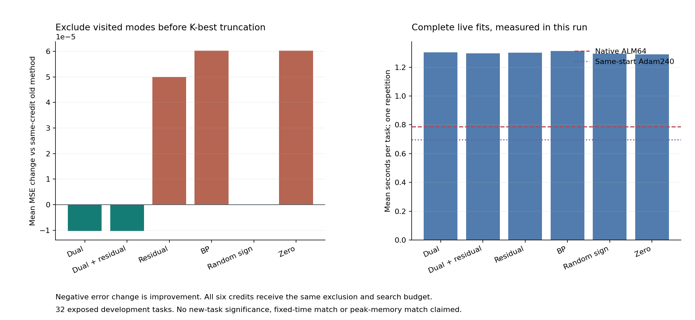

# 354｜截断前排除已访问模式：在线查询与完整控制

主候选MSE257 **0.0521723419**；相对旧同信用均差 **-0.0000102685**，改善/相同/变差 **1/31/0**。相对同增强零信用均差 **+0.0000513338**，相对同期Adam240均差 **+0.0009224284**。负值表示主方法更低。

32个已暴露开发任务，256次新完整fit，137方法4384预测器。主unvisited_dual在评分前固定；所有预测封存后才评分。不是新任务确认，也不是论文完成。

## 机制与可证明范围

旧过程在每个Hamming壳先取K=8，再去掉母算法已知区域。新过程令F只等于本次自己的真实轨迹已访问模式，用F的前缀树补集状态加入支持语言DP，在截断前搜索未访问集合。六信用全部同增强；F不是不可行集合，F的原几何仍由母算法完整处理。

同一DP状态的合法后缀与增量成本相同，因此按精确整数成本和字节序截断前K不丢失全局前K。原前K中的未访问路径在补集中排名只会提前；已访问有效区域由母流程保留。该证明保证搜索排名和池保留，不保证风险降低，也不证明PC独有能力。

350小例360排名检查，351进一步独立枚举全部真实单观察语言笛卡尔积，共1665624模式/192份排名，逐壳最小值和全部提议精确一致。离线共38536几何证书通过。未把这些存档状态或共用几何免费提供给在线候选。

## 相对旧同信用的实际变化

| 方法 | 旧MSE257 | 新MSE257 | 新−旧 | 改善/同/变差 | 额外正模式对 | 本次完整均秒 |
| --- | --- | --- | --- | --- | --- | --- |
| unvisited_dual | 0.0521826104 | 0.0521723419 | -0.0000102685 | 1/31/0 | 1 | 1.3026520812 |
| unvisited_dual_plus_residual | 0.0521210081 | 0.0521107396 | -0.0000102685 | 1/31/0 | 1 | 1.2965607187 |
| unvisited_residual | 0.0520607388 | 0.0521107396 | 0.0000500007 | 1/30/1 | 2 | 1.3005385313 |
| unvisited_bp | 0.0520607388 | 0.0521210081 | 0.0000602693 | 0/31/1 | 1 | 1.3121473625 |
| unvisited_random_sign | 0.0521793891 | 0.0521793891 | 0.0000000000 | 0/32/0 | 0 | 1.2939441188 |
| unvisited_zero | 0.0520607388 | 0.0521210081 | 0.0000602693 | 0/31/1 | 1 | 1.2887247938 |

真实费用包括重新准备、629条状态更新、支持触发、当前F捕获、前缀树、搜索、几何、2048粒子、读出与轨迹指纹。native和Adam240在本轮重跑；旧129方法时间置空。每任务仅一次交错运行，不当成重复统计、等时间或等峰值内存证据。

## 主候选与强控制

| 对照 | 对照MSE257 | 主−对照 | 改善/同/变差 | 最差留一均差 |
| --- | --- | --- | --- | --- |
| unvisited_dual_plus_residual | 0.0521107396 | 0.0000616023 | 0/31/1 | 0.0000635895 |
| unvisited_residual | 0.0521107396 | 0.0000616023 | 0/31/1 | 0.0000635895 |
| unvisited_bp | 0.0521210081 | 0.0000513338 | 1/30/1 | 0.0000635895 |
| unvisited_random_sign | 0.0521793891 | -0.0000070471 | 1/30/1 | 0.0000033253 |
| unvisited_zero | 0.0521210081 | 0.0000513338 | 1/30/1 | 0.0000635895 |
| unvisited_native_alm64 | 0.0521223412 | 0.0000500007 | 1/30/1 | 0.0000622134 |
| unvisited_native_adam240 | 0.0512499136 | 0.0009224284 | 9/9/14 | 0.0010602618 |
| strong_language_dual | 0.0521826104 | -0.0000102685 | 1/31/0 | 0.0000000000 |
| strong_native_alm128 | 0.0518687182 | 0.0003036238 | 2/28/2 | 0.0003240178 |
| strong_native_alm256 | 0.0519447058 | 0.0002276362 | 2/29/1 | 0.0002618044 |
| strong_native_adam3840 | 0.0511755030 | 0.0009968390 | 8/9/15 | 0.0011370727 |
| cold__prior16384_ridge | 0.0665166556 | -0.0143443136 | 26/0/6 | -0.0123554372 |
| cold__meta_ridge128 | 0.0681715217 | -0.0159991797 | 25/0/7 | -0.0141272290 |
| cold__meta_shallow64_20 | 0.0901028063 | -0.0379304644 | 31/0/1 | -0.0363926868 |

全部8新方法对其余136方法、四指标的4352配对比较原样保留。留一检查是开发集中度诊断，不是显著性结论；不能根据表中较优变体事后换主。

## 核验与交付边界

执行失败0。独立审计17536风险字段、4352比较、67836几何证书；最大标量风险差1.11e-16。实际在线提议和支持侧普查逐项一致，原轨迹、触发和母池保持。

原语、覆盖和任务效果分开报告。即使相对旧版改善，仍需同增强非乘子、强BP、资源匹配和新任务支持独立机制；固定回归与浅层头的实验比较不等于数学排除任意闭式方法或任意网络。尚无官方TTT-MLP/LLM/VLM实验。核心目标不因本轮流程完成而标完成。

## 全部137方法

| 方法 | MSE257 | MSE129 | 单点MSE257 | 单点MSE129 | 本次均秒 | 失败 |
| --- | --- | --- | --- | --- | --- | --- |
| counterfactual_mode_change_alm | 0.0566657702 | 0.0567638420 | 0.1206408566 | 0.1206780168 | — | 0 |
| credit_control_probe33 | 0.0567964225 | 0.0568908697 | 0.1206408566 | 0.1206780168 | — | 0 |
| probe_archive_only | 0.0571660939 | 0.0572613831 | 0.1233768150 | 0.1236159789 | — | 0 |
| probe_then_pc33 | 0.0567136953 | 0.0568118311 | 0.1234206583 | 0.1234458531 | — | 0 |
| probe_pc64_33 | 0.0567042291 | 0.0568023552 | 0.1152993808 | 0.1152867436 | — | 0 |
| probe_pc128_33 | 0.0569980153 | 0.0570948290 | 0.1207050837 | 0.1207893678 | — | 0 |
| probe_then_nodual33 | 0.0584311107 | 0.0585283076 | 0.1188088462 | 0.1189328828 | — | 0 |
| probe_nodual64_33 | 0.0584389023 | 0.0585366226 | 0.1193577163 | 0.1194071807 | — | 0 |
| probe_then_adam60_33 | 0.0535376417 | 0.0536281827 | 0.1126252949 | 0.1128837311 | — | 0 |
| probe_then_adam120_33 | 0.0535376417 | 0.0536281827 | 0.1110194831 | 0.1111129006 | — | 0 |
| probe_then_adam240_33 | 0.0535376417 | 0.0536281827 | 0.1110145517 | 0.1111078087 | — | 0 |
| probe_then_adam480_33 | 0.0535376417 | 0.0536281827 | 0.1110145516 | 0.1111078087 | — | 0 |
| credit_control_alm33 | 0.0618250535 | 0.0619314470 | 0.1237745712 | 0.1238407677 | — | 0 |
| plain_alm64_33 | 0.0564851362 | 0.0565806628 | 0.1110946037 | 0.1113150477 | — | 0 |
| plain_alm128_33 | 0.0569029649 | 0.0570005183 | 0.1067804433 | 0.1068566182 | — | 0 |
| cold__adam240_r33 | 0.0609766160 | 0.0610775498 | 0.1072125164 | 0.1072709152 | — | 0 |
| cold__prior4096_ridge | 0.0665171025 | 0.0666046581 | 0.0665171025 | 0.0666046581 | — | 0 |
| cold__prior16384_ridge | 0.0665166556 | 0.0666066670 | 0.0665166556 | 0.0666066670 | — | 0 |
| cold__meta_shallow64_20 | 0.0901028063 | 0.0901580743 | 0.0901028063 | 0.0901580743 | — | 0 |
| probe_all_alm64 | 0.0521223412 | 0.0522165008 | 0.0972136191 | 0.0973644976 | — | 0 |
| cold__linear_ls | 0.1601140361 | 0.1602980531 | 0.1601140361 | 0.1602980531 | — | 0 |
| cold__residual_linear_ls | 0.1997591239 | 0.2003046128 | 0.1997591239 | 0.2003046128 | — | 0 |
| cold__residual_linear_ridge | 0.1997162664 | 0.2002623867 | 0.1997162664 | 0.2002623867 | — | 0 |
| cold__residual_linear_rls | 0.1997162664 | 0.2002623867 | 0.1997162664 | 0.2002623867 | — | 0 |
| cold__rbf_loocv | 0.1323521813 | 0.1325385824 | 0.1323521813 | 0.1325385824 | — | 0 |
| cold__meta_ridge64 | 0.0681644628 | 0.0682575808 | 0.0681644628 | 0.0682575808 | — | 0 |
| cold__meta_ridge128 | 0.0681715217 | 0.0682655843 | 0.0681715217 | 0.0682655843 | — | 0 |
| cold__meta_shallow64_5 | 0.0906851396 | 0.0907484013 | 0.0906851396 | 0.0907484013 | — | 0 |
| probe_pc256_33 | 0.0560945786 | 0.0561863273 | 0.1138330238 | 0.1138462455 | — | 0 |
| probe_nodual128_33 | 0.0584786237 | 0.0585762108 | 0.1138510235 | 0.1139998736 | — | 0 |
| probe_nodual256_33 | 0.0584379494 | 0.0585352051 | 0.1054070654 | 0.1055288327 | — | 0 |
| probe_then_adam960_33 | 0.0535376417 | 0.0536281827 | 0.1110145516 | 0.1111078087 | — | 0 |
| plain_alm256_33 | 0.0559368716 | 0.0560347496 | 0.1068384558 | 0.1069345453 | — | 0 |
| cold__prior65536_ridge | 0.0665246805 | 0.0666148401 | 0.0665246805 | 0.0666148401 | — | 0 |
| probe_alm40_33 | 0.0551619029 | 0.0552484635 | 0.1218666646 | 0.1220083558 | — | 0 |
| probe_alm48_33 | 0.0529388655 | 0.0530286967 | 0.1158131087 | 0.1159919624 | — | 0 |
| probe_alm64_33 | 0.0531866245 | 0.0532768338 | 0.1106653283 | 0.1107971038 | — | 0 |
| online_first_fit_dual | 0.0565858748 | 0.0566787059 | 0.1206408566 | 0.1206780168 | — | 0 |
| online_first_fit_dual_plus_residual | 0.0565941307 | 0.0566870495 | 0.1206408566 | 0.1206780168 | — | 0 |
| online_first_fit_residual | 0.0568984635 | 0.0569941945 | 0.1206408566 | 0.1206780168 | — | 0 |
| online_first_fit_bp | 0.0570970477 | 0.0571942949 | 0.1206408566 | 0.1206780168 | — | 0 |
| online_first_fit_random_sign | 0.0567896349 | 0.0568878025 | 0.1206408566 | 0.1206780168 | — | 0 |
| online_first_fit_zero | 0.0569233095 | 0.0570211556 | 0.1206408566 | 0.1206780168 | — | 0 |
| online_uniform_state_dual | 0.0567964225 | 0.0568908697 | 0.1206408566 | 0.1206780168 | — | 0 |
| online_uniform_state_dual_plus_residual | 0.0567964225 | 0.0568908697 | 0.1206408566 | 0.1206780168 | — | 0 |
| online_uniform_state_residual | 0.0567913230 | 0.0568857200 | 0.1206408566 | 0.1206780168 | — | 0 |
| online_uniform_state_bp | 0.0567913230 | 0.0568857200 | 0.1206408566 | 0.1206780168 | — | 0 |
| online_uniform_state_random_sign | 0.0568002554 | 0.0568946184 | 0.1206408566 | 0.1206780168 | — | 0 |
| online_uniform_state_zero | 0.0567964225 | 0.0568908697 | 0.1206408566 | 0.1206780168 | — | 0 |
| probe_then_adam1920_33 | 0.0535038771 | 0.0535945752 | 0.1110145516 | 0.1111078087 | — | 0 |
| probe_then_adam3840_33 | 0.0535038771 | 0.0535945752 | 0.1110145516 | 0.1111078087 | — | 0 |
| radius_first_fit_dual__k1__sall | 0.0565792564 | 0.0566750122 | 0.1206408566 | 0.1206780168 | — | 0 |
| radius_first_fit_dual__k2__sall | 0.0564782121 | 0.0565713977 | 0.1206408566 | 0.1206780168 | — | 0 |
| radius_first_fit_dual__k4__sall | 0.0564875168 | 0.0565792871 | 0.1206408566 | 0.1206780168 | — | 0 |
| radius_first_fit_dual__k8__sall | 0.0565858748 | 0.0566787059 | 0.1206408566 | 0.1206780168 | — | 0 |
| radius_first_fit_dual_plus_residual__k1__sall | 0.0565792564 | 0.0566750122 | 0.1206408566 | 0.1206780168 | — | 0 |
| radius_first_fit_dual_plus_residual__k2__sall | 0.0564782121 | 0.0565713977 | 0.1206408566 | 0.1206780168 | — | 0 |
| radius_first_fit_dual_plus_residual__k4__sall | 0.0564875168 | 0.0565792871 | 0.1206408566 | 0.1206780168 | — | 0 |
| radius_first_fit_dual_plus_residual__k8__sall | 0.0565941307 | 0.0566870495 | 0.1206408566 | 0.1206780168 | — | 0 |
| radius_first_fit_residual__k1__sall | 0.0568953752 | 0.0569899036 | 0.1206408566 | 0.1206780168 | — | 0 |
| radius_first_fit_residual__k2__sall | 0.0568953752 | 0.0569899036 | 0.1206408566 | 0.1206780168 | — | 0 |
| radius_first_fit_residual__k4__sall | 0.0568814971 | 0.0569764026 | 0.1206408566 | 0.1206780168 | — | 0 |
| radius_first_fit_residual__k8__sall | 0.0568984635 | 0.0569941945 | 0.1206408566 | 0.1206780168 | — | 0 |
| radius_first_fit_bp__k1__sall | 0.0569543631 | 0.0570503865 | 0.1206408566 | 0.1206780168 | — | 0 |
| radius_first_fit_bp__k2__sall | 0.0570533157 | 0.0571494204 | 0.1206408566 | 0.1206780168 | — | 0 |
| radius_first_fit_bp__k4__sall | 0.0570604974 | 0.0571566002 | 0.1206408566 | 0.1206780168 | — | 0 |
| radius_first_fit_bp__k8__sall | 0.0570970477 | 0.0571942949 | 0.1206408566 | 0.1206780168 | — | 0 |
| radius_first_fit_random_sign__k1__sall | 0.0567964225 | 0.0568908697 | 0.1206408566 | 0.1206780168 | — | 0 |
| radius_first_fit_random_sign__k2__sall | 0.0567964225 | 0.0568908697 | 0.1206408566 | 0.1206780168 | — | 0 |
| radius_first_fit_random_sign__k4__sall | 0.0567427261 | 0.0568379295 | 0.1206408566 | 0.1206780168 | — | 0 |
| radius_first_fit_random_sign__k8__sall | 0.0567896349 | 0.0568878025 | 0.1206408566 | 0.1206780168 | — | 0 |
| radius_first_fit_zero__k1__sall | 0.0569543631 | 0.0570503865 | 0.1206408566 | 0.1206780168 | — | 0 |
| radius_first_fit_zero__k2__sall | 0.0570533157 | 0.0571494204 | 0.1206408566 | 0.1206780168 | — | 0 |
| radius_first_fit_zero__k4__sall | 0.0570604974 | 0.0571566002 | 0.1206408566 | 0.1206780168 | — | 0 |
| radius_first_fit_zero__k8__sall | 0.0569233095 | 0.0570211556 | 0.1206408566 | 0.1206780168 | — | 0 |
| online_first_fit_dual__k32 | 0.0563525643 | 0.0564479828 | 0.1206408566 | 0.1206780168 | — | 0 |
| online_first_fit_dual_plus_residual__k32 | 0.0563525643 | 0.0564479828 | 0.1206408566 | 0.1206780168 | — | 0 |
| online_first_fit_residual__k32 | 0.0564573512 | 0.0565576838 | 0.1206408566 | 0.1206780168 | — | 0 |
| online_first_fit_bp__k32 | 0.0567225983 | 0.0568217880 | 0.1206408566 | 0.1206780168 | — | 0 |
| online_first_fit_random_sign__k32 | 0.0561114659 | 0.0562072955 | 0.1206408566 | 0.1206780168 | — | 0 |
| online_first_fit_zero__k32 | 0.0567225983 | 0.0568217880 | 0.1206408566 | 0.1206780168 | — | 0 |
| online_uniform_state_dual__k32 | 0.0567397136 | 0.0568343394 | 0.1206408566 | 0.1206780168 | — | 0 |
| online_uniform_state_dual__k64 | 0.0567448716 | 0.0568392974 | 0.1206408566 | 0.1206780168 | — | 0 |
| online_uniform_state_dual_plus_residual__k32 | 0.0567397136 | 0.0568343394 | 0.1206408566 | 0.1206780168 | — | 0 |
| online_uniform_state_dual_plus_residual__k64 | 0.0567397136 | 0.0568343394 | 0.1206408566 | 0.1206780168 | — | 0 |
| online_uniform_state_residual__k32 | 0.0562254510 | 0.0563202113 | 0.1206408566 | 0.1206780168 | — | 0 |
| online_uniform_state_residual__k64 | 0.0561983638 | 0.0562916777 | 0.1206408566 | 0.1206780168 | — | 0 |
| online_uniform_state_bp__k32 | 0.0567397136 | 0.0568343394 | 0.1206408566 | 0.1206780168 | — | 0 |
| online_uniform_state_bp__k64 | 0.0566913089 | 0.0567850300 | 0.1206408566 | 0.1206780168 | — | 0 |
| online_uniform_state_random_sign__k32 | 0.0567417452 | 0.0568363383 | 0.1206408566 | 0.1206780168 | — | 0 |
| online_uniform_state_random_sign__k64 | 0.0567417452 | 0.0568363383 | 0.1206408566 | 0.1206780168 | — | 0 |
| online_uniform_state_zero__k32 | 0.0567397136 | 0.0568343394 | 0.1206408566 | 0.1206780168 | — | 0 |
| online_uniform_state_zero__k64 | 0.0567448716 | 0.0568392974 | 0.1206408566 | 0.1206780168 | — | 0 |
| probe_then_adam7680_33 | 0.0535038771 | 0.0535945752 | 0.1110145516 | 0.1111078087 | — | 0 |
| probe_then_adam15360_33 | 0.0535038771 | 0.0535945752 | 0.1110145516 | 0.1111078087 | — | 0 |
| probe_pc512_33 | 0.0560308920 | 0.0561227158 | 0.1204888307 | 0.1205226612 | — | 0 |
| probe_pc1024_33 | 0.0559864467 | 0.0560782264 | 0.1140518659 | 0.1140932064 | — | 0 |
| probe_nodual512_33 | 0.0583663411 | 0.0584641242 | 0.1034888077 | 0.1036550031 | — | 0 |
| probe_nodual1024_33 | 0.0583663411 | 0.0584641242 | 0.1142278966 | 0.1143290928 | — | 0 |
| plain_alm512_33 | 0.0544233179 | 0.0545213778 | 0.1070461562 | 0.1071440592 | — | 0 |
| plain_alm1024_33 | 0.0544280803 | 0.0545266351 | 0.1026398488 | 0.1027187129 | — | 0 |
| probe_alm128_33 | 0.0532510848 | 0.0533419258 | 0.1094820541 | 0.1094854701 | — | 0 |
| probe_alm256_33 | 0.0527920573 | 0.0528821946 | 0.0944594138 | 0.0945016111 | — | 0 |
| probe_alm512_33 | 0.0527693314 | 0.0528589774 | 0.1011073134 | 0.1011651404 | — | 0 |
| language_first_fit_dual | 0.0564667860 | 0.0565595784 | 0.1206408566 | 0.1206780168 | — | 0 |
| language_first_fit_dual_plus_residual | 0.0564664024 | 0.0565596696 | 0.1206408566 | 0.1206780168 | — | 0 |
| language_first_fit_residual | 0.0568384235 | 0.0569348015 | 0.1206408566 | 0.1206780168 | — | 0 |
| language_first_fit_bp | 0.0567378007 | 0.0568359452 | 0.1206408566 | 0.1206780168 | — | 0 |
| language_first_fit_random_sign | 0.0567002166 | 0.0567984571 | 0.1206408566 | 0.1206780168 | — | 0 |
| language_first_fit_zero | 0.0565094967 | 0.0566100139 | 0.1206408566 | 0.1206780168 | — | 0 |
| strong_native_alm64 | 0.0521223412 | 0.0522165008 | 0.0972136191 | 0.0973644976 | — | 0 |
| strong_watch_alm64 | 0.0521223412 | 0.0522165008 | 0.0972136191 | 0.0973644976 | — | 0 |
| strong_language_dual | 0.0521826104 | 0.0522766938 | 0.0972136191 | 0.0973644976 | — | 0 |
| strong_language_dual_plus_residual | 0.0521210081 | 0.0522149923 | 0.0972136191 | 0.0973644976 | — | 0 |
| strong_language_residual | 0.0520607388 | 0.0521547993 | 0.0972136191 | 0.0973644976 | — | 0 |
| strong_language_bp | 0.0520607388 | 0.0521547993 | 0.0972136191 | 0.0973644976 | — | 0 |
| strong_language_random_sign | 0.0521793891 | 0.0522733095 | 0.0972136191 | 0.0973644976 | — | 0 |
| strong_language_zero | 0.0520607388 | 0.0521547993 | 0.0972136191 | 0.0973644976 | — | 0 |
| strong_native_alm128 | 0.0518687182 | 0.0519629867 | 0.1016516447 | 0.1017641512 | — | 0 |
| strong_native_alm256 | 0.0519447058 | 0.0520388818 | 0.1131273820 | 0.1133506933 | — | 0 |
| strong_native_pc64 | 0.0525001970 | 0.0525953156 | 0.1160714308 | 0.1161767307 | — | 0 |
| strong_native_pc128 | 0.0527433556 | 0.0528379555 | 0.1203439726 | 0.1205308496 | — | 0 |
| strong_native_pc256 | 0.0526769038 | 0.0527718609 | 0.1146547448 | 0.1148294734 | — | 0 |
| strong_native_nodual64 | 0.0548240458 | 0.0549199039 | 0.1096541062 | 0.1096863386 | — | 0 |
| strong_native_nodual128 | 0.0536071613 | 0.0537044033 | 0.1045910173 | 0.1047276283 | — | 0 |
| strong_native_nodual256 | 0.0535287715 | 0.0536266219 | 0.1010791255 | 0.1012160671 | — | 0 |
| strong_native_adam240 | 0.0512499136 | 0.0513410494 | 0.1097922702 | 0.1098245206 | — | 0 |
| strong_native_adam960 | 0.0512499136 | 0.0513410494 | 0.1095839581 | 0.1096198509 | — | 0 |
| strong_native_adam3840 | 0.0511755030 | 0.0512667252 | 0.1095839581 | 0.1096198509 | — | 0 |
| unvisited_dual | 0.0521723419 | 0.0522664718 | 0.0972136191 | 0.0973644976 | 1.3026520812 | 0 |
| unvisited_dual_plus_residual | 0.0521107396 | 0.0522047703 | 0.0972136191 | 0.0973644976 | 1.2965607187 | 0 |
| unvisited_residual | 0.0521107396 | 0.0522047703 | 0.0972136191 | 0.0973644976 | 1.3005385313 | 0 |
| unvisited_bp | 0.0521210081 | 0.0522149923 | 0.0972136191 | 0.0973644976 | 1.3121473625 | 0 |
| unvisited_random_sign | 0.0521793891 | 0.0522733095 | 0.0972136191 | 0.0973644976 | 1.2939441188 | 0 |
| unvisited_zero | 0.0521210081 | 0.0522149923 | 0.0972136191 | 0.0973644976 | 1.2887247938 | 0 |
| unvisited_native_alm64 | 0.0521223412 | 0.0522165008 | 0.0972136191 | 0.0973644976 | 0.7871216531 | 0 |
| unvisited_native_adam240 | 0.0512499136 | 0.0513410494 | 0.1097922702 | 0.1098245206 | 0.6977599187 | 0 |

依据：[评分](../development_evaluation_v1/methods.json)、[全比较](../development_evaluation_v1/comparisons.json)、[独立审计](../development_audit_v1/summary.json)、[在线新增区域](../development_audit_v1/mechanisms.json)。紧凑发布不含完整粒子和逐调用几何日志，不是clean-clone完整科学复现。
